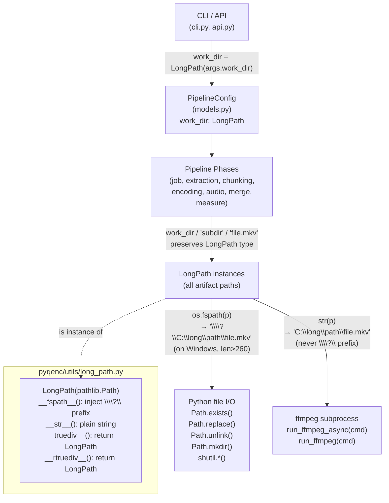

# Design Document — Windows Long Path Support

<!-- markdownlint-disable MD024 -->

- Created: 2026-06-09
- Completed: 2026-06-13

## Cross-Spec Summary

| Spec | Created | Relationship |
|------|---------|--------------|
| `ffmpeg-unified-runner` | 2026-03-17 (Completed) | **Relevant constraint.** The runner receives `list[str \| os.PathLike]` commands. `LongPath` satisfies `os.PathLike` via `__fspath__()`, so it can be passed directly as a path argument. However, ffmpeg does **not** accept `\\?\`-prefixed paths — callers must use `str(path)` (not `os.fspath(path)`) when building the command list for ffmpeg. This distinction (`str()` vs `__fspath__()`) is the central design invariant of this spec. |
| `windows-long-path` (this spec) | 2026-06-09 | **Supersedes** the partial whack-a-mole fix in `pyqenc/utils/win_path.py`. The `lp_exists` / `lp_rename` / `lp_unlink` helpers and their usage in `measure.py` are removed; `LongPath` replaces them universally. |
| `config-refactor` | 2026-06-23 | **Updates the `work_dir` path.** The flowchart in this spec shows `work_dir = LongPath(args.work_dir)` being placed into `PipelineConfig.work_dir: Path`. `PipelineConfig` is deleted by `config-refactor`. `work_dir` now travels as a plain volatile kwarg to `_build_registry`, then is stored as a typed `Path` field on `JobPhaseResult`. The `LongPath(args.work_dir)` wrapping in the CLI is unchanged — callers still wrap before passing as the `work_dir` kwarg. |

---

## Bug Details

On Windows, `pathlib.Path` file operations (`exists()`, `replace()`, `unlink()`, `mkdir()`, `open()`, `shutil.*`) silently fail when a path exceeds 260 characters (the Win32 `MAX_PATH` limit). The failure is silent or raises `FileNotFoundError` / `OSError`, even when the Windows system has long path support enabled in the registry. The most visible symptom is screenshot capture: ffmpeg successfully writes a `.tmp` screenshot file, but `Path.exists()` returns `False`, causing the screenshot to be silently lost.

A partial whack-a-mole fix exists in `pyqenc/utils/win_path.py` (`lp_exists`, `lp_rename`, `lp_unlink`) and is applied only in `measure.py`. This masks the symptom for one phase but leaves the bug present in every other file I/O call across the pipeline.

## Hypothesized Root Cause

`pathlib.Path.__fspath__()` returns the plain path string. Win32 APIs only bypass the 260-character limit when the path string is prefixed with `\\?\` (the extended-length path prefix). Python does not add this prefix automatically, even when the Windows system has long path support enabled. Since all Python file I/O functions call `os.fspath()` (which calls `__fspath__()`), any `Path`-based operation is subject to the limit.

## Expected Behavior

A `LongPath` subclass overrides `__fspath__()` to inject the `\\?\` prefix on Windows for paths longer than 260 characters. Because `os.fspath()` calls `__fspath__()`, this single override transparently fixes all `Path` method calls (`exists()`, `replace()`, `unlink()`, `mkdir()`, `open()`) and all `shutil.*` calls without any per-callsite changes.

`str(long_path)` must remain plain (no prefix) for ffmpeg subprocess arguments, since ffmpeg does not accept `\\?\`-prefixed paths.

## Fix Implementation

Introduce `pyqenc/utils/long_path.py` with a `LongPath(Path)` subclass. Apply `LongPath` at `work_dir` construction in `cli.py` and `api.py`. The `/` operator override propagates the type through all downstream path composition. Remove `win_path.py` and its usages in `measure.py`.

---

## Overview

On Windows, `pathlib.Path` operations silently fail for paths exceeding 260 characters because the underlying Win32 APIs receive the plain path string rather than the `\\?\`-prefixed extended-length form. Python does not inject this prefix automatically.

The fix is a `LongPath` subclass of `pathlib.Path` in `pyqenc/utils/long_path.py` that overrides `__fspath__()` to inject the `\\?\` prefix on Windows for paths longer than 260 characters. Because every Python file I/O function and `shutil.*` call routes through `os.fspath()`, which calls `__fspath__()`, this single override fixes all affected operations with no per-callsite changes.

Two behaviours must be kept strictly separate:

- **`os.fspath(long_path)` / `long_path.__fspath__()`** — used by Python's own file I/O and `shutil.*`. Returns the `\\?\`-prefixed absolute string on Windows when the path is long. This is what enables transparent long-path support.
- **`str(long_path)`** — used when building ffmpeg subprocess commands. Returns the plain path string *without* the prefix on all platforms. ffmpeg does not accept `\\?\`-prefixed paths.

The existing partial fix in `win_path.py` (`lp_exists`, `lp_rename`, `lp_unlink`) is removed and all its call sites in `measure.py` are replaced with plain `LongPath` method calls.

---

## Architecture



The key invariant is that `LongPath` is introduced exactly once — at `work_dir` construction in `cli.py` and `api.py`. From that point, all path composition via `/` propagates `LongPath` automatically through `__truediv__` / `__rtruediv__` overrides. No per-phase or per-callsite changes are required beyond the initial construction point and the `measure.py` cleanup.

---

## Components and Interfaces

### `pyqenc/utils/long_path.py` — new file

```python
from __future__ import annotations

import sys
from pathlib import Path, PurePosixPath, PureWindowsPath

_WINDOWS:    bool = sys.platform == "win32"
_EXT_PREFIX: str  = chr(92) * 2 + "?" + chr(92)   # \\?\  (4 chars, no f-string to avoid escape ambiguity)
_MAX_PATH:   int  = 260                             # Windows MAX_PATH limit


class LongPath(type(Path())):
    """A pathlib.Path subclass that transparently enables Windows extended-length paths.

    On Windows, ``os.fspath(long_path)`` (and therefore all Python file I/O,
    ``shutil.*``, etc.) returns the ``\\?\\``-prefixed absolute path string when
    the path length exceeds ``_MAX_PATH`` characters, bypassing the Win32 MAX_PATH
    limit.  On non-Windows platforms the behaviour is identical to plain ``Path``.

    Two string representations are intentionally different:

    - ``os.fspath(long_path)`` / ``long_path.__fspath__()``:
      returns the ``\\?\\``-prefixed absolute string on Windows for long paths.
      Used by Python's file I/O and ``shutil.*``.
    - ``str(long_path)``:
      returns the plain path string *without* any ``\\?\\`` prefix on all platforms.
      Use this when building ffmpeg subprocess command lists.

    Path composition (``/`` operator) is preserved: ``LongPath(base) / child``
    always returns a ``LongPath`` instance, not a plain ``Path``.

    Usage::

        work_dir = LongPath(args.work_dir)
        artifact = work_dir / "chunks" / "chunk_01.mkv"   # still LongPath
        artifact.mkdir(parents=True, exist_ok=True)        # uses __fspath__() — long-path safe
        cmd = ["ffmpeg", "-i", str(artifact), ...]         # uses __str__()   — no \\?\\ prefix
    """

    def __fspath__(self) -> str:
        """Return the filesystem path string, injecting the ``\\?\\`` prefix on Windows for long paths.

        On Windows: resolves to absolute path, prepends ``\\?\\`` when
        ``len(str(self)) > _MAX_PATH`` and the prefix is not already present.
        On non-Windows: returns ``str(self)`` unchanged (plain path, no prefix).

        Returns:
            Extended-length path string on Windows for long paths; plain string otherwise.
        """
        if not _WINDOWS:
            return str(self)
        s = str(self.resolve())
        if s.startswith(_EXT_PREFIX):
            return s
        if len(s) > _MAX_PATH:
            return _EXT_PREFIX + s
        return s

    def __str__(self) -> str:
        """Return the plain path string without any ``\\?\\`` prefix.

        Always returns the plain path regardless of length or platform.
        Use this when passing paths to ffmpeg or any other subprocess that
        does not understand the Windows extended-length prefix.

        Returns:
            Plain path string, never prefixed with ``\\?\\``.
        """
        return super().__str__()

    def __truediv__(self, key: str | Path) -> "LongPath":
        """Extend path with ``/`` operator, preserving ``LongPath`` type.

        Args:
            key: Path component to append.

        Returns:
            New ``LongPath`` instance with the component appended.
        """
        return LongPath(super().__truediv__(key))

    def __rtruediv__(self, key: str | Path) -> "LongPath":
        """Support ``str / LongPath`` composition, preserving ``LongPath`` type.

        Args:
            key: Left-hand path component.

        Returns:
            New ``LongPath`` instance.
        """
        return LongPath(super().__rtruediv__(key))
```

### Constants in `long_path.py`

| Constant | Value | Purpose |
|---|---|---|
| `_WINDOWS` | `sys.platform == "win32"` | Platform gate for prefix injection |
| `_EXT_PREFIX` | `\\?\` (4 chars) | Windows extended-length path prefix |
| `_MAX_PATH` | `260` | Win32 MAX_PATH threshold |

### Deleted: `pyqenc/utils/win_path.py`

The module and its three helpers (`_ext`, `lp_exists`, `lp_rename`, `lp_unlink`) are removed. All behaviour is subsumed by `LongPath.__fspath__()`.

---

## Data Models

No new data models. `LongPath` is a subtype of `Path` and is structurally invisible — all existing models that hold `Path` fields accept `LongPath` values without modification (Liskov substitution).

`PipelineConfig.work_dir: Path` accepts a `LongPath` value directly. No type annotation changes are required in models.

---

## Migration Plan

### Entry points — `work_dir` construction

| File | Change |
|---|---|
| `pyqenc/cli.py` | Add `from pyqenc.utils.long_path import LongPath`. Change `--work-dir` parser type: `type=LongPath` instead of `type=Path`. One line change in `_add_base_arguments`. |
| `pyqenc/api.py` | Add `from pyqenc.utils.long_path import LongPath`. Wrap `work_dir` at each public function entry: `work_dir = LongPath(work_dir)` before `work_dir.mkdir(...)`. Affects: `run_pipeline`, `extract_streams`, `chunk_video`, `encode_chunks`, `process_audio`, `merge_final`, `measure_quality`. |

Once `work_dir` is a `LongPath`, all paths derived via `work_dir / ...` composition automatically propagate the `LongPath` type through `__truediv__`. No further changes are needed in phase files for artifact paths built from `work_dir`.

### `pyqenc/phases/measure.py` — remove win_path usage

| Location | Change |
|---|---|
| Import | Remove `from pyqenc.utils.win_path import lp_exists, lp_rename, lp_unlink` |
| `_capture_single_frame` | Replace `lp_exists(output_path)` → `output_path.exists()` |
| `make_screenshots` (Strategy C loop) | Replace `lp_rename(tmp_path, final_path)` → `tmp_path.replace(final_path)` and `lp_unlink(tmp_path, missing_ok=True)` → `tmp_path.unlink(missing_ok=True)` |
| `_rename_raw_screenshots` | Replace `lp_rename(tmp_path, final_path)` → `tmp_path.replace(final_path)` and `lp_unlink(tmp_path, missing_ok=True)` → `tmp_path.unlink(missing_ok=True)` |

No functional logic changes — only the helper function calls are replaced with equivalent `Path` method calls. Since `output_path` / `tmp_path` / `final_path` are derived from `work_dir` (a `LongPath`), they are all `LongPath` instances and their `.exists()` / `.replace()` / `.unlink()` calls transparently use the `\\?\`-prefixed form on Windows.

### `pyqenc/state.py` — `MergeStrategySummary`

| Location | Change |
|---|---|
| `MergeStrategySummary.from_yaml_dict` | `output_path = Path(data["output_path"])` → `output_path = LongPath(data["output_path"])` |

This ensures that merge output paths loaded from YAML resume with long-path support. Add `from pyqenc.utils.long_path import LongPath` import.

### `pyqenc/utils/win_path.py` — deleted

The file is deleted entirely. No other files import from it except `measure.py` (cleaned up above).

### Files that require NO changes

The following phase files construct all artifact paths via `work_dir / ...` composition. Since `work_dir` becomes a `LongPath` at the entry point, `__truediv__` propagates the type automatically:

- `pyqenc/phases/job.py`
- `pyqenc/phases/extraction.py`
- `pyqenc/phases/chunking.py`
- `pyqenc/phases/encoding.py`
- `pyqenc/phases/optimization.py`
- `pyqenc/phases/merge.py`
- `pyqenc/phases/audio.py`
- `pyqenc/phases/recovery.py`

No imports, no type annotations, no logic changes needed in these files.

---

## Correctness Properties

*A property is a characteristic or behavior that should hold true across all valid executions of a system — essentially, a formal statement about what the system should do. Properties serve as the bridge between human-readable specifications and machine-verifiable correctness guarantees.*

### Property 1: `__fspath__` injects prefix iff Windows and path is long

*For any* path string `p`, `LongPath(p).__fspath__()` contains the `\\?\` prefix if and only if `sys.platform == "win32"` AND `len(str(Path(p).resolve())) > 260`. On all other platforms, and for all paths ≤ 260 characters on Windows, no prefix is injected.

**Validates: Requirements 2.1, 2.8, 2.9, 3.1, 3.2**

### Property 2: `str()` never contains the `\\?\` prefix

*For any* path string `p` (on any platform, of any length), `str(LongPath(p))` shall never contain the `\\?\` prefix.

**Validates: Requirements 2.10, 3.3**

### Property 3: Path composition preserves `LongPath` type

*For any* path string `base` and path component `child`, `LongPath(base) / child` shall return an instance of `LongPath`, not a plain `Path`.

**Validates: Requirements 2.7, 1.8, 3.4**

### Property 4: Idempotence — double-prefixing never occurs

*For any* path `p` where `LongPath(p).__fspath__()` already starts with `\\?\`, calling `__fspath__()` again (e.g. via `LongPath(LongPath(p).__fspath__())`) shall not prepend a second `\\?\`.

**Validates: Requirements 2.8**

### Property 5: Non-Windows identity — `LongPath` is a no-op off Windows

*For any* path string `p` on a non-Windows platform, `LongPath(p).__fspath__()` shall equal `str(Path(p))` — the plain path string with no modifications.

**Validates: Requirements 2.9, 3.2**

**Property reflection notes:**
- Property 5 is logically subsumed by Property 1 (which covers the non-Windows branch). It is retained as a standalone property because it has distinct test value: it verifies there is zero overhead on Linux/macOS CI even when the full PBT suite runs.
- Properties 1 and 4 are complementary, not redundant: Property 1 tests the threshold condition; Property 4 tests the idempotence guard within the implementation.
- Properties 2 and 3 address orthogonal concerns (string representation vs. type propagation) and cannot be merged.

---

## Error Handling

| Scenario | Behaviour |
|---|---|
| `LongPath.__fspath__()` on a relative path (Windows, long) | Calls `.resolve()` internally — the resulting absolute path is prefixed. Callers do not need to pre-resolve. |
| `LongPath` constructed from a `\\?\`-prefixed string | `.startswith(_EXT_PREFIX)` guard in `__fspath__()` prevents double-prefixing. |
| Path length exactly 260 chars on Windows | No prefix injected — `len(s) > _MAX_PATH` is strictly greater-than; equality is the safe zone. |
| Non-Windows platform | `__fspath__()` returns `str(self)` immediately; no resolve, no prefix check. |
| `LongPath` passed to `shutil.rmtree` / `shutil.copy2` | `shutil` calls `os.fspath()` on each path argument, which calls `__fspath__()`; prefix injection is automatic. |
| `str(long_path)` passed to ffmpeg via runner | Plain string without prefix; ffmpeg receives a valid path. `run_ffmpeg_async` accepts `list[str \| os.PathLike]` — passing `str(path)` explicitly is the correct pattern for ffmpeg arguments (as per ffmpeg-unified-runner spec and coding standards). |

---

## Testing Strategy

### Property-Based Tests (`tests/test_long_path_properties.py`)

Using **Hypothesis** (already present via `.hypothesis/` directory in the project). Each property test runs a minimum of 100 iterations.

```python
# Feature: windows-long-path, Property 1: fspath injects prefix iff Windows and long
# Feature: windows-long-path, Property 2: str() never contains \\?\
# Feature: windows-long-path, Property 3: composition preserves LongPath type
# Feature: windows-long-path, Property 4: idempotence — no double-prefix
# Feature: windows-long-path, Property 5: non-Windows identity
```

**Test structure for Property 1** — platform is mocked via `monkeypatch` on `pyqenc.utils.long_path._WINDOWS`:

```python
@given(
    path_str=st.text(min_size=1).filter(lambda s: "\x00" not in s),
    make_long=st.booleans(),
)
@settings(max_examples=200)
def test_fspath_injects_prefix_iff_windows_and_long(path_str, make_long, monkeypatch):
    # Feature: windows-long-path, Property 1: fspath injects prefix iff Windows and long
    ...
```

**Test structure for Property 3** — type preservation does not require filesystem access:

```python
@given(
    base=st.text(min_size=1).filter(lambda s: "\x00" not in s),
    child=st.from_regex(r"[a-zA-Z0-9_\-\.]+"),
)
@settings(max_examples=200)
def test_composition_preserves_longpath_type(base, child):
    # Feature: windows-long-path, Property 3: composition preserves LongPath type
    result = LongPath(base) / child
    assert isinstance(result, LongPath)
```

### Unit Tests (`tests/test_long_path.py`)

Example-based tests for concrete scenarios:

- `LongPath` is a subtype of `Path` (`isinstance` check)
- Short path on Windows: `__fspath__()` returns plain string (no prefix)
- Long path on Windows: `__fspath__()` returns `\\?\`-prefixed absolute string
- `str(long_path)` equals `str(Path(path))` for any path
- `LongPath(base) / child / grandchild` chains: final result is `LongPath`
- `.name`, `.stem`, `.suffix`, `.parent` properties return expected values
- `LongPath` accepted wherever `Path` is (Liskov substitution: assign to `Path`-typed variable)

### Integration Tests (`tests/integration/test_long_path_integration.py`)

Require Windows execution environment. Skipped on non-Windows via `pytest.mark.skipif(sys.platform != "win32", ...)`:

- Create a real directory with a >260-char absolute path using `\\?\` manually, then verify `LongPath.exists()` returns `True`
- Create a file at >260-char path, verify `LongPath.unlink()` deletes it
- Create a `.tmp` file at >260-char path, verify `LongPath.replace()` renames it (`.tmp`-then-rename protocol)
- Create a `LongPath` at >260-char depth, verify `LongPath.mkdir(parents=True)` succeeds

### Regression Test (`tests/test_measure_long_path.py`)

Mocked test covering the `measure.py` migration (Req 3.6):

- Mock `run_ffmpeg_async` to create a `.tmp` PNG at a >260-char path (simulating ffmpeg output)
- Verify that `output_path.exists()` (plain `LongPath.exists()`) detects the file
- Verify that `tmp_path.replace(final_path)` completes without error
- Confirm `win_path` helpers are no longer imported anywhere

### Cleanup Verification

```bash
# Verify win_path is no longer imported anywhere in the codebase
grep -r "win_path" pyqenc/
# Expected: no results (file deleted, imports removed)
```
