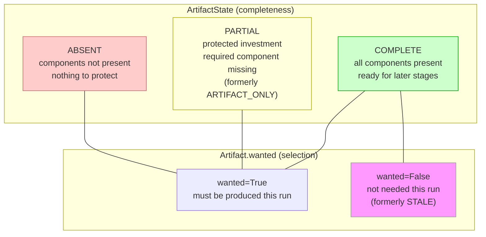
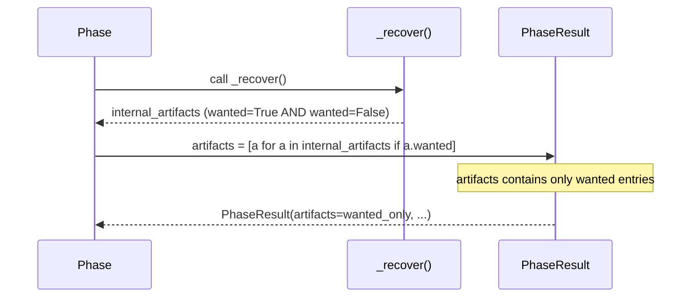

# Design Document — Artifact State Refactor

<!-- markdownlint-disable MD024 -->

- Created: 2026-09-09
- Completed: 2026-09-10

## Cross-Spec Notes

This design partially supersedes every earlier spec that described the four-value `ArtifactState`
(`ABSENT`/`ARTIFACT_ONLY`/`STALE`/`COMPLETE`) or per-phase recovery-message logic.

| Spec | Created | Relationship |
|------|---------|--------------|
| `phase-recovery-refactor` | 2026-03-17 | **Superseded in part.** Established `ArtifactState` (`ABSENT`/`ARTIFACT_ONLY`/`COMPLETE`). `ARTIFACT_ONLY` is renamed `PARTIAL` and the enum is re-scoped to completeness only. |
| `phase-object-model` | 2026-03-20 | **Superseded in part.** Defined the four-value enum with `STALE`; `pending` included `STALE`. `STALE` is removed — selection moves to `Artifact.wanted`. |
| `pts-preservation` | 2026-04-29 | **Superseded in part.** Four-value enum references and `TimestampArtifact` states are updated; `TimestampArtifact` stays `COMPLETE`/`ABSENT` and now also carries `wanted`. |
| `project-cleanup` | 2026-06-11 | **Completed here.** The duplicated `_recovery_message()` pattern it flagged is removed across all five phases in favour of the unified `log_recovery_line()`. |

Concrete changes versus those specs: `STALE` removed, `ARTIFACT_ONLY` → `PARTIAL`, new `Artifact.wanted`
field carrying selection, and a single `log_recovery_line()` replacing the per-phase `_recovery_message()`
helpers. `merge-phase-revamp`, `probe-phase-refactor`, and `config-refactor` are unaffected (no `ArtifactState`
or recovery-message references).

---

## Overview

`ArtifactState` currently carries four values: `ABSENT`, `ARTIFACT_ONLY`, `STALE`, and `COMPLETE`. The first three encode two orthogonal concepts into a single field:

- **completeness** — are all of the artifact's expected components present, so the artifact is ready to be worked on by later stages?
- **Selection** — is this artifact wanted by the current run's filters and pipeline mode?

The two concepts are orthogonal and computed independently: completeness is derived the same way for every artifact regardless of whether it is wanted, and `wanted` is a value derived from external input, never chosen or mutated by a phase on its own.

`STALE` is the sharpest symptom: it simultaneously means "the file is on disk" *and* "the run no longer needs it". Callers must remember this double meaning when reading `_recover()` output, when building the stream table, and when filtering artifacts for downstream use.

`ARTIFACT_ONLY` is a naming issue: the name describes the physical situation (only the artifact file is present) rather than the abstract state (the artifact is partially complete). `PARTIAL` is the right word.

This refactor splits the concept cleanly:

1. `ArtifactState` becomes a three-value enum covering **completeness only**: `ABSENT`, `PARTIAL`, `COMPLETE`.
2. `Artifact` gains a `wanted: bool = True` field covering **selection**.
3. `_recover()` produces a full internal artifact list (wanted *and* unwanted). `PhaseResult.artifacts` filters to `wanted=True` before exposing artifacts downstream.
4. The stream table in `ExtractionPhase` is derived entirely from the internal artifact list — the separate `all_tracks` parameter is removed.
5. Recovery reporting is unified into a single `log_recovery_line()` helper that takes the phase's **internal** artifact list and derives all counts itself. The five per-phase `_recovery_message()` helpers are removed, and its `stale` parameter is dropped in favour of a derived `unwanted` count.

---

## Architecture

The refactor rests on separating two concepts that `ArtifactState` previously conflated: **completeness** (whether all of an artifact's expected components are present, so it is ready for later stages) and **selection** (whether the current run wants that artifact). Completeness stays in `ArtifactState`; selection moves to a new `Artifact.wanted` boolean. The two are orthogonal and computed independently.

`wanted` is a **derived** value. It comes from external input — the user's stream filter plus the pipeline mode (e.g. `video_required`) for extraction, and scene detection for chunking — and is never chosen or mutated by a phase on its own during recovery. A phase only reads the derived `wanted` value; it does not decide it.

### completeness × selection matrix



The `wanted=False` + `COMPLETE` combination is the direct replacement for every current `STALE` assignment. These entries are retained in place unchanged by default; they are only ever removed if the user explicitly sets a cleanup level, which is applied uniformly and is not special to the `wanted` flag. (See the full combination table under **Data Models**.)

Reading the matrix: `COMPLETE` means all expected components are present, so the artifact is fully ready to be worked on by later stages. `PARTIAL` is a **protected investment** — expensive or valuable work is partly done but the artifact is not yet ready for later stages because a required component is missing, so it is kept to avoid discarding that work and to allow resuming. `ABSENT` means the components are not present: either nothing was produced yet, or whatever exists is trivially reproducible with no investment to protect (there is no separate state for cheaply reproducible leftovers — they are simply `ABSENT`).

### Cheap, uniform completeness check

The completeness check is cheap by design. It uses **at most a single directory listing per artifact group** — for encoding, at most the winning and current attempt directories — and then checks whether each artifact's expected components are present in that listing. It never performs per-artifact individual scanning or `stat` calls. Because the check costs almost nothing, completeness is computed **uniformly for every artifact regardless of `wanted`**; the check is never refined or skipped based on `wanted`.

### Scan versus post-scan action

`wanted` affects only the **action taken after** the cheap scan, not the scan itself:

- Every artifact — wanted and unwanted alike — receives a completeness value from the same single listing. For unwanted artifacts this value is still useful (it feeds the extraction stream table and aids debugging), but the artifact is never acted upon.
- A phase **never** attempts recovery or any work on an unwanted (`wanted=False`) artifact — there is no reason to.
- The potentially time-consuming recovery action — attempt full recovery, then salvage partial work, then plan the remaining work — applies **only** to artifacts that are both `wanted=True` and not `COMPLETE`.

### Single-source-of-truth flow via `_recover()`

Every phase's `_recover()` produces an **internal artifact list** — all artifacts the phase has on disk or expects to need, both wanted and unwanted. The phase then filters this list before constructing `PhaseResult`.



The internal list is **never exposed outside the phase**. Callers (downstream phases, the orchestrator) see only `PhaseResult.artifacts`, which contains only `wanted=True` entries. This means:

- `PhaseResult.pending` — `[a for a in artifacts if a.state in (ABSENT, PARTIAL)]` — already operates on wanted-only artifacts; no additional `wanted` filter is needed.
- `PhaseResult.complete` — `[a for a in artifacts if a.state == COMPLETE]` — same.
- Recovery reporting does **not** derive counts from `PhaseResult.artifacts`. Instead each phase passes its **internal** artifact list (pre-filter, including `wanted=False` entries) to the unified `log_recovery_line()` helper, which derives every count itself — including the `unwanted` count, which is only visible in the internal list. No `stale` count is needed or emitted.

`_recover()` assigns a completeness value to every entry in the internal list from the single cheap listing, but only performs the recovery action (full recovery → salvage partial → plan remaining) on entries that are `wanted=True` and not `COMPLETE`. Unwanted entries carry their completeness for the stream table and debugging but are never acted upon.

Cleanup logic that needs to act on unwanted artifacts is **phase-internal** — each phase holds a reference to its internal list until cleanup runs. Cleanup only runs when the user has explicitly set a cleanup level; otherwise unwanted artifacts are retained in place unchanged. This makes the internal artifact list the single source of truth for both downstream selection and the `ExtractionPhase` stream table.

---

## Data Models

### ArtifactState enum

#### Before

```python
class ArtifactState(Enum):
    ABSENT        = "absent"
    ARTIFACT_ONLY = "artifact_only"   # file present, sidecar missing
    STALE         = "stale"           # present but parameters changed
    COMPLETE      = "complete"
```

#### After

```python
class ArtifactState(Enum):
    """completeness (readiness) of a single pipeline artifact.

    Completeness answers one question: are all expected components present, so
    the artifact is ready to be worked on by later stages?

    Attributes:
        ABSENT:   The artifact's components are not present. Either nothing has
                  been produced yet, or whatever exists is trivially
                  reproducible with no investment worth protecting. There is no
                  separate state for cheaply reproducible leftovers — they are
                  simply ABSENT. '.tmp' files are NOT PARTIAL — they are
                  transient crash remnants cleaned up at phase startup before
                  recovery runs, leaving the artifact ABSENT.
        PARTIAL:  A protected investment. Expensive or valuable work is partly
                  done, but the artifact is NOT yet ready to be worked on by
                  later stages because a required component is missing; it is
                  kept to avoid discarding that investment and to allow
                  resuming. Examples of this principle: the primary file is
                  present but its sidecar is missing, or CRF attempts exist but
                  no winning attempt has been finalised.
        COMPLETE: All of the artifact's expected components are present, so the
                  artifact is fully ready to be worked on by later stages
                  (sidecar present where applicable).
    """
    ABSENT   = "absent"
    PARTIAL  = "partial"    # renamed from ARTIFACT_ONLY
    COMPLETE = "complete"
```

`STALE` is removed. Selection is moved to `Artifact.wanted`.

### Artifact dataclass

#### Before

```python
@dataclass
class Artifact:
    path:  Path
    state: ArtifactState
```

#### After

```python
@dataclass
class Artifact:
    """Base class for all phase output artifacts.

    Attributes:
        path:   Path to the primary artifact file on disk.
        state:  completeness of this artifact.
        wanted: Whether this artifact is selected by the current run. This is a
                DERIVED value: it comes from external input — the user's stream
                filter plus the pipeline mode (e.g. video_required) for
                extraction, and scene detection for chunking — and is never
                chosen or mutated by a phase on its own during recovery.
                Orthogonal to completeness. True = must be produced if not
                already COMPLETE. False = present or expected on disk but not
                needed this run; it is retained in place unchanged and is not a
                deletion candidate — deletion only ever happens when the user
                explicitly sets a cleanup level, applied uniformly.
                Default True ensures all existing callsites are unaffected.
    """
    path:   Path
    state:  ArtifactState
    wanted: bool = True
```

The `wanted=True` default is deliberately chosen so that every existing `VideoArtifact(path=..., state=...)`, `AudioArtifact(...)`, `ChunkArtifact(...)`, etc. construction site continues to produce a wanted artifact without any change. Only the sites that need to produce unwanted artifacts pass `wanted=False` explicitly.

### PhaseResult dataclass

`PhaseResult.artifacts` is redefined to contain only `wanted=True` artifacts. The docstring is updated to state this explicitly:

```python
@dataclass
class PhaseResult:
    """...
    Attributes:
        artifacts: Wanted artifacts only (wanted=True). Phases build a full
                   internal artifact list in _recover() covering both wanted
                   and unwanted entries, then filter to wanted=True before
                   constructing PhaseResult. Callers never need to filter by
                   wanted themselves.
        ...
    """
    outcome:   PhaseOutcome
    artifacts: list[Artifact]   # wanted=True only
    message:   str
    error:     str | None = None
```

### Enum × wanted matrix

Valid combinations and their meanings:

| `state`    | `wanted` | Meaning |
|------------|----------|---------|
| `ABSENT`   | `True`   | Must be produced this run — components not present, nothing to protect |
| `PARTIAL`  | `True`   | Protected investment — resume/finish/repair the missing component |
| `COMPLETE` | `True`   | No work needed — ready for later stages, fully reusable |
| `COMPLETE` | `False`  | On disk but not needed this run (was `STALE`) |
| `ABSENT`   | `False`  | Not on disk, not needed — encountered only when a wanted=False artifact was also never produced |
| `PARTIAL`  | `False`  | Theoretically possible but not produced by any phase today |

The `wanted=False` + `COMPLETE` combination is the direct replacement for every current `STALE` assignment. These entries are retained in place unchanged by default; they are only ever removed if the user explicitly sets a cleanup level, which is applied uniformly and is not special to the `wanted` flag.

---

## Components and Interfaces

### ArtifactState Changes

`STALE` is removed and `ARTIFACT_ONLY` is renamed to `PARTIAL`. See the **Data Models** section for the before/after enum definitions. Selection is moved to `Artifact.wanted`.

### Artifact Base Class Changes

The `Artifact` dataclass gains a `wanted: bool = True` field. See the **Data Models** section for the before/after dataclass definitions. The `wanted=True` default keeps every existing construction site unaffected; only sites that need to produce unwanted artifacts pass `wanted=False` explicitly.

### ExtractionPhase Changes

`ExtractionPhase._recover()` is the most complex case because it must:

1. Produce one artifact per track in the source file (all tracks, not just selected ones).
2. Mark tracks excluded by the current filter as `wanted=False`.
3. Mark video/timestamp artifacts as `wanted=False` when `video_required=False`.
4. Produce the stream table from the internal artifact list alone.

#### _recover() — full-track enumeration

Current code calls `streams_filter_plain_regex()` first and then only produces artifacts for the resulting selected tracks. Under the new contract, `_recover()` iterates **all tracks from ffprobe** in index order and assigns `wanted` per track:

```python
for track in extractor.tracks:          # ALL tracks, not just selected
    name    = track.display_name(...)
    wanted  = track in selected_tracks  # selected_tracks = streams_filter_plain_regex(...)
    if not self._video_required and track.codec_type == "video":
        wanted = False

    if not extracted_dir.exists() or name not in on_disk_names:
        state = ArtifactState.ABSENT
    else:
        state = ArtifactState.COMPLETE   # filter_changed no longer sets STALE

    # Assign correct artifact subclass
    if track.codec_type == "video":
        artifact = VideoArtifact(path=extracted_dir / name, state=state, wanted=wanted)
    elif track.codec_type == "audio":
        artifact = AudioArtifact(path=extracted_dir / name, state=state, wanted=wanted)
    else:
        artifact = OtherArtifact(path=extracted_dir / name, state=state, wanted=wanted)

    artifacts.append(artifact)

# TimestampArtifact
ts_wanted = self._video_required
ts_state  = COMPLETE if timestamps_file.exists() else ABSENT
artifacts.append(TimestampArtifact(path=timestamps_file, state=ts_state, wanted=ts_wanted))
```

The filter-change detection block that previously assigned `ArtifactState.STALE` now assigns `wanted=False` instead:

```python
# Before (removed):
state = ArtifactState.COMPLETE if f.name in expected_names else ArtifactState.STALE

# After:
state  = ArtifactState.COMPLETE
wanted = f.name in expected_names   # False = was wanted before, no longer wanted
```

#### _log_stream_table() — new signature

The old signature took `all_tracks: list[StreamBase]` as the primary enumeration source and used the artifact list only for state lookup. Under the new design the artifact list is the single source of truth.

**Old signature:**
```python
def _log_stream_table(
    all_tracks: list[StreamBase],
    artifacts:  list[ExtractionArtifact],
) -> None:
```

**New signature:**
```python
def _log_stream_table(
    artifacts: list[ExtractionArtifact],
) -> None:
```

Column derivation rules:

| Artifact field | Column | Value |
|----------------|--------|-------|
| `wanted=True`  | Want    | `✔` |
| `wanted=False` | Want    | `✘` |
| `state=COMPLETE` | Present | `✔` |
| `state=ABSENT` or `state=PARTIAL` | Present | `✘` |

The two columns are orthogonal: Want reflects selection (`wanted` only), Present reflects completeness (`state` only), and neither influences the other. There is no `-`/"not applicable" value — an unwanted stream that is present on disk shows Want=`✘`, Present=`✔`.

The function iterates `artifacts` in order (which preserves the original track enumeration order from ffprobe, since `_recover()` iterates `extractor.tracks` in order). `TimestampArtifact` entries are included naturally — no special-case handling for the timestamps row.

The stream table is an **end-user overview**: it shows every stream variant with its `wanted` and completeness status, including unwanted rows. Including those unwanted rows adds no extra scanning cost, because every row's completeness is read from the same single directory listing that `_recover()` already performs.

Implementation:

```python
def _log_stream_table(artifacts: list[ExtractionArtifact]) -> None:
    if not artifacts:
        return
    logger.info("Streams:")
    logger.info("Want  Present      Name")
    for artifact in artifacts:
        w_sym = SUCCESS_SYMBOL_MINOR if artifact.wanted else FAILURE_SYMBOL_MINOR
        p_sym = SUCCESS_SYMBOL_MINOR if artifact.state == ArtifactState.COMPLETE else FAILURE_SYMBOL_MINOR
        logger.info("   %s  %s  \"%s\"", w_sym, p_sym, artifact.path.name)
```

#### _execute_extraction() — absent_names uses wanted=True only

`_execute_extraction()` currently computes:
```python
absent_names = {a.path.name for a in artifacts if a.state == ArtifactState.ABSENT}
```

With the new model `wanted=False` artifacts must never be extracted. The filter becomes:
```python
absent_names = {
    a.path.name
    for a in artifacts
    if a.wanted and a.state == ArtifactState.ABSENT
}
```

Unwanted artifacts are preserved in the final artifact list unchanged (they remain on disk with `wanted=False, state=COMPLETE`), so they are represented accurately in recovery and the stream table; they remain in place unchanged and are subject only to the user-configured cleanup level, if any.

### AudioPhase Changes

`AudioPhase._recover()` currently assigns `ArtifactState.STALE` in two cases:

1. **Codec/bitrate changed** — files produced under the previous codec are no longer valid for the current run.
2. **Surplus intermediate files** — files on disk that are not terminal outputs of the current plan.

Both cases become `wanted=False, state=COMPLETE`:

```python
# Before — codec changed:
artifacts.append(AudioArtifact(path=path, state=ArtifactState.STALE))

# After:
artifacts.append(AudioArtifact(path=path, state=ArtifactState.COMPLETE, wanted=False))

# Before — not a terminal output:
artifacts.append(AudioArtifact(path=path, state=ArtifactState.STALE))

# After:
artifacts.append(AudioArtifact(path=path, state=ArtifactState.COMPLETE, wanted=False))
```

The log message in `_recover()` that says "marking all artifacts STALE" changes to "marking all artifacts unwanted (wanted=False)".

### Other Phases — ARTIFACT_ONLY → PARTIAL Rename

`ChunkingPhase`, `MergePhase`, and `EncodingPhase` use `ArtifactState.ARTIFACT_ONLY` in recovery and in `pending` property checks. This is a pure rename with no logic change:

| Phase | Current usage | After rename |
|-------|--------------|--------------|
| `ChunkingPhase._recover()` | `state=ArtifactState.ARTIFACT_ONLY` (sidecar missing) | `state=ArtifactState.PARTIAL` |
| `MergePhase._recover()` | `state=ArtifactState.ARTIFACT_ONLY` (output present, sidecar missing) | `state=ArtifactState.PARTIAL` |
| `EncodingPhase._recover()` | `state=ArtifactState.ARTIFACT_ONLY` was not directly assigned but referenced in recovery helpers | verified and renamed |
| `PhaseResult.pending` | `a.state in (ABSENT, ARTIFACT_ONLY)` | `a.state in (ABSENT, PARTIAL)` |
| `log_recovery_line` callsites | pass locally computed `complete`/`pending`/`stale` counts | pass the internal artifact list; the unified helper derives all counts (see **Unified recovery reporting**) |

The per-phase `_recovery_message()` helpers that referenced `ARTIFACT_ONLY` in their pending count are **removed entirely** (not renamed) — the unified `log_recovery_line()` helper now produces the recovery message from the internal artifact list. See **Unified recovery reporting**.

### PhaseResult Changes

#### artifacts property contract

`PhaseResult.artifacts` is redefined to contain only `wanted=True` artifacts. See the **Data Models** section for the updated dataclass and docstring.

#### pending and complete — unchanged

These already operate on `self.artifacts`. Since `artifacts` is now pre-filtered to `wanted=True`, no changes are needed:

```python
@property
def pending(self) -> list[Artifact]:
    """Artifacts requiring active work (ABSENT or PARTIAL)."""
    return [
        a for a in self.artifacts
        if a.state in (ArtifactState.ABSENT, ArtifactState.PARTIAL)
    ]

@property
def complete(self) -> list[Artifact]:
    """Artifacts whose state is COMPLETE."""
    return [a for a in self.artifacts if a.state == ArtifactState.COMPLETE]
```

#### Recovery counts in run()

Each phase's `run()` currently computes `complete_count`/`pending_count`/`stale_count` locally and calls both `log_recovery_line()` and a per-phase `_recovery_message()`. After the refactor no phase computes recovery counts at all: it hands its **internal** artifact list to the unified `log_recovery_line()` helper (see **Unified recovery reporting**), which derives every count itself and returns the message string used for `PhaseResult.message`:

```python
# ExtractionPhase.run() — before:
complete_count = sum(1 for a in artifacts if a.state == ArtifactState.COMPLETE)
pending_count  = sum(1 for a in artifacts if a.state in (ABSENT, ARTIFACT_ONLY))
stale_count    = sum(1 for a in artifacts if a.state == STALE)
log_recovery_line(logger, complete_count, pending_count, stale=stale_count)
message = _recovery_message(artifacts)

# After — pass the internal list; the helper derives counts and returns the text:
message = log_recovery_line(logger, internal_artifacts)
result  = ExtractionPhaseResult(
    artifacts = [a for a in internal_artifacts if a.wanted],
    message   = message,
    ...
)
```

`PhaseResult.pending` and `PhaseResult.complete` are unchanged and remain available for downstream callers; they are simply no longer used to compute the recovery line. The `ExtractionPhase.scan()` and `run()` paths that pass `artifacts` to `ExtractionPhaseResult` must still filter to wanted-only: `artifacts=[a for a in internal_artifacts if a.wanted]`, while passing the **unfiltered** `internal_artifacts` to `log_recovery_line()`.

### Unified recovery reporting

Recovery reporting is currently duplicated across all five phases. Each phase has:

- a module-level `_recovery_message(artifacts)` helper that computes complete/pending counts and builds a message string for `PhaseResult.message`, and
- a block in `run()` that recomputes `complete_count`/`pending_count` and calls `log_recovery_line(...)`.

That is the same mechanic implemented six times (once per phase plus the shared log helper) — a DRY / rule-of-three violation. This refactor collapses it into **one shared mechanism** in `pyqenc/utils/log_format.py`: a single `log_recovery_line()` that takes the phase's **internal** artifact list, derives every count itself, emits the recovery line at `info` level, **and returns the message string** so `PhaseResult.message` reuses the exact same text. There is a single source of truth for the recovery message — no separate `_recovery_message()` anywhere.

#### Signature — before / after

**Before:**

```python
def log_recovery_line(
    log:      logging.Logger,
    complete: int,
    pending:  int,
    stale:    int = 0,
    unit:     str = "artifact",
) -> None:
```

**After:**

```python
def log_recovery_line(
    log:       logging.Logger,
    artifacts: list[Artifact],   # internal list — includes wanted=False entries
    unit:      str = "artifact",
) -> str:
    """Log the recovery summary and return the same human-readable message.

    Takes the phase's INTERNAL artifact list (pre-filter, including
    wanted=False entries) — NOT PhaseResult.artifacts — because it needs the
    unwanted count, which is only visible before wanted-filtering. Derives all
    five counts itself; callers never compute recovery counts locally.

    The returned string is the single source of truth for the recovery
    message: callers assign it directly to PhaseResult.message rather than
    building a separate message via a per-phase helper.
    """
```

The caller passes the internal list and the unit label; the helper does the rest. It both logs the line and returns it, so `PhaseResult.message` is set from the return value — one string, one place.

> Note: the mechanism is kept as a single function that logs and returns the string. An equivalent split into a pure message-builder plus a thin logging wrapper would be acceptable, but this design uses the single logging-and-returning function in `log_format.py` for simplicity. Either way there is exactly one shared implementation.

#### Counts derived inside the helper

All counts are computed from the internal artifact list. `unwanted` is counted over the full list; `complete`/`partial`/`absent` are counted over wanted artifacts only:

```python
total    = len(artifacts)
unwanted = sum(1 for a in artifacts if not a.wanted)
complete = sum(1 for a in artifacts if a.wanted and a.state == ArtifactState.COMPLETE)
partial  = sum(1 for a in artifacts if a.wanted and a.state == ArtifactState.PARTIAL)
absent   = sum(1 for a in artifacts if a.wanted and a.state == ArtifactState.ABSENT)
```

All five counts are **always shown**, even when a count is zero.

#### Output format

The emitted line (and returned string) has the form:

```text
Recovery: 15 total, 2 unwanted — 10 complete, 1 partial, 2 absent — resuming
```

The trailing suffix is `resuming` when any complete artifact exists, or `full run needed` when nothing is complete. The old `stale` parameter and its `", N stale"` formatting are removed entirely — `unwanted` replaces the former `stale` concept.

Representative implementation:

```python
def log_recovery_line(
    log:       logging.Logger,
    artifacts: list[Artifact],
    unit:      str = "artifact",
) -> str:
    total    = len(artifacts)
    unwanted = sum(1 for a in artifacts if not a.wanted)
    complete = sum(1 for a in artifacts if a.wanted and a.state == ArtifactState.COMPLETE)
    partial  = sum(1 for a in artifacts if a.wanted and a.state == ArtifactState.PARTIAL)
    absent   = sum(1 for a in artifacts if a.wanted and a.state == ArtifactState.ABSENT)

    suffix  = "resuming" if complete else "full run needed"
    message = (
        f"Recovery: {total} total, {unwanted} unwanted"
        f" — {complete} complete, {partial} partial, {absent} absent"
        f" — {suffix}"
    )
    log.info(message)
    return message
```

(The `unit` label is used where a phase wants a noun other than the default `artifact` in the message; it does not affect the counts.)

#### Removal of the five `_recovery_message()` helpers

`extraction.py`, `audio.py`, `chunking.py`, `merge.py`, and `encoding.py` each **drop their `_recovery_message()` function**. No phase computes `complete`/`pending`/`stale` counts locally anymore. Each `run()` / scan path simply calls the unified helper with its **internal** artifact list and assigns the returned string to `PhaseResult.message`:

```python
# In every phase run()/scan path — before:
complete_count = sum(...)     # local recomputation
pending_count  = sum(...)
log_recovery_line(logger, complete_count, pending_count, stale=stale_count)
message = _recovery_message(artifacts)   # separate per-phase string builder
result  = SomePhaseResult(artifacts=[a for a in internal_artifacts if a.wanted],
                          message=message, ...)

# After — one call, one string:
message = log_recovery_line(logger, internal_artifacts)   # logs AND returns the text
result  = SomePhaseResult(artifacts=[a for a in internal_artifacts if a.wanted],
                          message=message, ...)
```

`PhaseResult.pending` and `PhaseResult.complete` are unchanged and still exist for downstream callers — they simply are no longer the source of the recovery counts. The recovery helper works off the internal list precisely because it needs the `unwanted` count, which `PhaseResult.artifacts` (wanted-only) cannot provide.

### Files Affected

| File | Changes |
|------|---------|
| `pyqenc/state.py` | Remove `STALE`, rename `ARTIFACT_ONLY` → `PARTIAL`; update enum and module docstrings |
| `pyqenc/phase.py` | Add `wanted: bool = True` to `Artifact`; update `PhaseResult.artifacts` docstring; update `pending` to use `PARTIAL`; update `Artifact` and `PhaseResult` docstrings |
| `pyqenc/utils/log_format.py` | Change `log_recovery_line()` to take the internal artifact list (`list[Artifact]`, including `wanted=False` entries) + `unit`; derive and report `total`/`unwanted`/`complete`/`partial`/`absent` itself; return the message string; remove the `stale` parameter and stale formatting |
| `pyqenc/phases/extraction.py` | Replace all `STALE` assignments with `wanted=False, state=COMPLETE`; rename `ARTIFACT_ONLY` → `PARTIAL`; change `_log_stream_table()` signature to accept `list[ExtractionArtifact]` only; derive wanted/present columns from artifact fields; update `_execute_extraction()` `absent_names` filter; **remove `_recovery_message()`** and drop local complete/pending count computation; call the unified `log_recovery_line()` with the internal artifact list and set `PhaseResult.message` from its returned string |
| `pyqenc/phases/audio.py` | Replace all `STALE` assignments with `wanted=False, state=COMPLETE`; rename `ARTIFACT_ONLY` → `PARTIAL` in `_recover()`; remove stale log message; **remove `_recovery_message()`** and drop local complete/pending count computation; call the unified `log_recovery_line()` with the internal artifact list and set `PhaseResult.message` from its returned string |
| `pyqenc/phases/chunking.py` | Rename `ARTIFACT_ONLY` → `PARTIAL` in `_recover()`; **remove `_recovery_message()`** and drop local complete/pending count computation; call the unified `log_recovery_line()` with the internal artifact list and set `PhaseResult.message` from its returned string |
| `pyqenc/phases/merge.py` | Rename `ARTIFACT_ONLY` → `PARTIAL` in `_recover()`; **remove `_recovery_message()`** and drop local complete/pending count computation; call the unified `log_recovery_line()` with the internal artifact list and set `PhaseResult.message` from its returned string |
| `pyqenc/phases/encoding.py` | Rename `ARTIFACT_ONLY` → `PARTIAL` in recovery helper references; **remove `_recovery_message()`** and drop local complete/pending count computation; call the unified `log_recovery_line()` with the internal artifact list and set `PhaseResult.message` from its returned string |

---

## Error Handling

Error and reuse conditions map onto the completeness/selection model as follows. There is no separate error state — the existing three-value completeness plus the `wanted` flag are sufficient to describe every recovery outcome.

| Condition | Resulting state | Rationale |
|-----------|-----------------|-----------|
| Wanted work failed, no file on disk | `state=ABSENT`, `wanted=True` | Nothing was produced; the file must still be produced this run |
| Wanted work failed, file incomplete (primary present, sidecar missing / no winning CRF attempt) | `state=PARTIAL`, `wanted=True` | A protected investment: valuable partial work is retained so it can be resumed, finished, or repaired rather than discarded |
| Suboptimal but usable result already on disk | `state=COMPLETE`, `wanted` per selection | A usable file exists; `COMPLETE` means ready to be worked on later, just not optimal — completeness is `COMPLETE` regardless of quality |
| `.tmp` remnant from a crash | not `PARTIAL` | Transient crash remnants are cleaned up at phase startup before recovery runs and never enter the artifact list |

**Postponed:** an explicit `ArtifactOutcome` enum (e.g. `OK` / `SUBOPTIMAL` / `FAILED`) that would capture success-vs-suboptimal-vs-failed as a first-class value is **explicitly postponed per user decision**. This refactor keeps completeness (`ArtifactState`) and selection (`wanted`) as the only two axes; capturing outcome quality is deferred to a future spec.

---

## Testing Strategy

### Property-Based Testing

Correctness is validated primarily via property-based tests using **Hypothesis**. The invariants listed in the **Correctness Properties** section below are each realised as a Hypothesis property test — covering the wanted-only exposure contract, the `pending`/`complete` subset relationship, stream-table row count, filter-excluded track handling, the absence of `STALE`, codec-changed audio marking, and the removal of the `stale` argument from `log_recovery_line()`.

### Unit Testing

Targeted unit tests cover the two migration-specific behaviours that are not naturally expressed as universal properties:

- The `STALE → wanted=False, state=COMPLETE` migration: verifying that every path that previously assigned `STALE` now produces a `wanted=False, state=COMPLETE` artifact.
- The `ARTIFACT_ONLY → PARTIAL` rename: verifying that recovery paths and `pending` checks that referenced `ARTIFACT_ONLY` now reference `PARTIAL` with identical behaviour.

---

## Correctness Properties

*A property is a characteristic or behavior that should hold true across all valid executions of a system — essentially, a formal statement about what the system should do.*

### Property 1: wanted=False artifacts do not appear in PhaseResult.artifacts

For any phase and any internal artifact list produced by `_recover()`, every artifact with `wanted=False` SHALL be absent from `PhaseResult.artifacts`.

**Validates: Requirements 4.1**

### Property 2: pending and complete are subsets of wanted artifacts

For any `PhaseResult`, the union of `pending` and `complete` is a subset of `artifacts`, and every entry in `artifacts` has `wanted=True`.

**Validates: Requirements 4.2**

### Property 3: ExtractionPhase stream table row count equals total track count

For any source file, the number of rows logged by `_log_stream_table()` equals the number of streams (including timestamps row when video_required=True) returned by ffprobe — regardless of how many tracks are selected by the current filter.

**Validates: Requirements 5.1, 5.5**

### Property 4: Filter-excluded tracks produce wanted=False artifacts

For any source file and any include/exclude filter, every track that does not match the current filter SHALL appear in the internal artifact list with `wanted=False`, and SHALL NOT appear in `PhaseResult.artifacts`.

**Validates: Requirements 3.1, 3.2, 4.1**

### Property 5: STALE is never assigned after the refactor

For any run of any phase, no artifact in any artifact list (internal or exposed) SHALL have `state=ArtifactState.STALE` (which no longer exists in the enum).

**Validates: Requirements 1.2, 3.3, 3.4**

### Property 6: Codec-changed audio files are wanted=False, state=COMPLETE

For any `AudioPhase._recover()` run where `audio.yaml` records a different codec/bitrate than the current config, every existing delivery file SHALL appear in the internal artifact list with `wanted=False` and `state=COMPLETE`.

**Validates: Requirements 3.3**

### Property 7: log_recovery_line never receives a stale argument

For any callsite in the codebase that calls `log_recovery_line()`, the call SHALL NOT pass a `stale` keyword argument.

**Validates: Requirements 6.2, 6.3**
