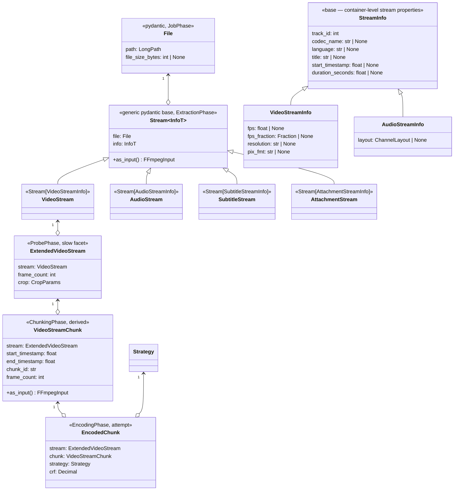
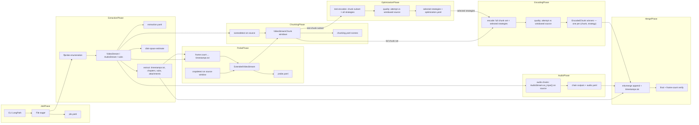

# Design Document

<!-- markdownlint-disable MD024 -->

- Spec: File → Stream Object Model & Direct-From-Source Processing
- Created: 2026-09-25
- Completed:

## Context

Current data flow materializes every intermediate:

```
source.mkv
 ├─ extracted/<video>.mkv, <audio>.mka     (-c copy ≈ 1.1× source)
 ├─ chunks/<ts-range>.mkv (+ .yaml)        (FFV1 all-intra ≈ 4–6× source)
 ├─ encoding/<strategy>/*.mkv              (attempts, necessary)
 └─ final/<strategy>.mkv
```

The full-stream copies exist so later phases have small local inputs; the FFV1 tree exists so splits are frame-perfect. Both properties are achievable without materialization: input-side `-ss` is a cue-point seek followed by decode-and-discard to the exact frame (accurate seek is the ffmpeg default), and `-t` bounds the window — the exact mechanism `split_chunks` uses today to *produce* chunks (chunking.py:256-263). Peak intermediate footprint drops from ≈6–9× to ≈1.5–2.5× source (attempts + finals only).

The object layer is rebuilt around the same windows: composition (`File` → stream → window) with unique-property dumps, eager fields, and one instantiation per entity per run.

## Object model



`VideoStream`, `AudioStream`, `SubtitleStream` and `AttachmentStream` are named subclasses that bind the type parameter — `class VideoStream(Stream[VideoStreamInfo])` (the diagram stereotypes denote the bindings); the subtitle/attachment infos carry their extracted-file paths. **Chapters and timestamps are not stream classes** — container-level artifacts persisted as extracted paths in `extraction.yaml`; they have no `track_id` and no `-map` selector.

**The encoded attempt is a stream too.** An attempt file contains exactly one video stream, so `EncodedChunk` composes `stream: ExtendedVideoStream` for it instead of a bare `path`: crop empty by construction (applied during encode), `frame_count` from the run's `progress=end`, info from one fast post-encode probe (resolution drives the attempt filename; recovery rebuilds it from the filename without probing). Path, size and frame count are read through `stream.file` / `stream.frame_count` — never duplicated as fields. This makes quality measurement symmetric: both sides are extended video streams, and crop becomes a per-input consumption property — the graph applies each side's `stream.crop` (empty for the attempt, the detected crop for the source window).

### Naming ownership

There are exactly two kinds of names. **Display names** (logs, tables, targeting strings like audio's `selector_string()`) carry any symbols and never touch the filesystem. **Filesystem names** are constrained; free-text identity components pass through one shared sanitize primitive — replacement, never validation, so a stream with an arbitrary title is always consumable. Within filesystem names, each family has one owning class that owns both directions — generation and parsing — as a strict inverse pair. This is what makes presence-based recovery sound: a filename is trusted only because `parse(format(x)) == x` is property-tested.

| Name family | Format | Owner | Parsed for |
|---|---|---|---|
| chunk id | `HH꞉MM꞉SS․mmm-HH꞉MM꞉SS․mmm` (unchanged) | `VideoStreamChunk.chunk_id` / parse classmethod | join + validation |
| attempt file | `<chunk_id>.<res>.q<crf>.mkv` | `EncodedChunk.file_name` / `parse_file_name` → typed record | encoding recovery (presence + name) |
| strategy dir | strategy name verbatim — safe by construction | config-load validation of profile/preset names + bundled-defaults test | — |
| extracted artifact | `#N (type-codec) lang=…` (N = track_id) | stream `extracted_file_name()` from info fields (titles via the shared sanitize) | — (`extraction.yaml` carries paths) |
| merge output | `<file stem> <strategy>.mkv` | single site in merge: `File.path.stem` + strategy name | — |
| artifact sidecars | `<artifact name>.yaml` | derived from the artifact's name | — |

The sanitize primitive exists for **media-sourced free text only** — stream titles above all — replacing Windows-forbidden characters and control chars, never rejecting. Config-sourced names take the opposite path: profiles and presets are rejected at config load if unsafe, so a strategy name (`profile[preset]`) is filesystem-safe by construction and embedded verbatim — validation at the definition point, not sanitization at every use point. The `#NN ID=N ` extraction prefix likewise collapses to `#N ` (track_id): the padded sort key was a safeguard for directory-scan ordering, a consumer sidecar-driven recovery removed. Two deliberate carve-outs on parsing: it returns a *typed record* where the name carries only part of a composed identity (the attempt filename encodes `chunk_id`/`resolution`/`crf` — recovery joins the record against phase results rather than pretending the name reconstructs the object); and no parser exists at all where recovery is sidecar-driven (subs/attachments) — nothing to scatter. Constants (`CHUNK_NAME_PATTERN`, `ENCODED_ATTEMPT_NAME_PATTERN`, separators) stay import-free in `constants.py`, consumed only by their owning class.

### Fully typed parametrizations

The parametrizations bind the TypeVar at class definition — not unbound generic uses, not aliases with runtime dispatch. Pydantic v2 resolves the TypeVar through generic subclassing, so runtime validation and static typing agree. The consequence is that the whole composition chain is statically concrete: `ExtendedVideoStream.stream` is declared `VideoStream` (never `Stream[...]`), and `VideoStreamChunk.stream` is `ExtendedVideoStream` — a phase receiving an `ExtendedVideoStream` reads `ext.stream.info.fps` fully typed, with zero casts, zero `isinstance` probing of the info, and no second place of knowledge mapping class → info type.

### Why a shared `Stream` base — and where it stops

The base earns its keep three ways: `as_input()` (the `0:{track_id}` selector) is implemented exactly once; the extraction inventory (enumerate → filter by include/exclude → persist → recover) is written generically over `Stream[InfoT]` — the filter matches against `codec_name`/`language`/`title`, which sit on `StreamInfo` precisely so the generic code never reaches into type specifics; and there is a single type bound for "anything `-map`-selectable in this container".

`StreamInfo` carries the container-level properties common to every stream — `track_id`, `codec_name`, `language`, `title`, and the placement pair `start_timestamp`/`duration_seconds` (per-stream offsets on the container timeline: MKV per-track block timestamps/`CodecDelay`, MP4 edit lists, TS per-stream PTS; A/V alignment is the difference of start times). Type-specific properties (`fps`/`resolution`/`pix_fmt` for video, `layout` for audio) stay on the infos. Neither base adds dumpable payload beyond the shared stream fields — dumps are the per-stream info slice, never the composed `File`.

Two deliberate stops:

- **The runner's input currency stays `FFmpegInput`.** Not every input is a stream: whole-container operations (mkvextract timestamps/chapters, attachment dumps) and measure's arbitrary user-supplied target files take a `File`/path, and windows are not streams — so accepting stream objects in `request.inputs` would add a second accepted type for a cosmetic win. The one-line adapters already express "a stream knows how to become an input" (attempts included, Req 14).
- **Nothing beyond `file` + `info` + `as_input` goes on the base.** Display naming and extraction mechanisms differ per type and stay on the infos / call sites.

### Composition and dump rules

- Composition, not inheritance: every reference is a field holding the parent object. Dumps serialize **only the info slice** the class owns; parents are re-linked at load from the in-run object graph, with the sidecar's source identity (`path` + `file_size_bytes`) validated against the live `File`.
- The `*Info` models are plain pydantic models: `model_dump(exclude_none=True)` is the sidecar fragment — no hand-written `to_yaml_dict`/`from_yaml_dict` anywhere. Key renames are solved by renaming the field so code and YAML share one short concise name (docstrings/type constraints elaborate); no YAML key is externally fixed (every sidecar is ours, pre-alpha), so aliases are a non-mechanism. Type-level conversions — `Fraction` ↔ `[num, den]`, `Decimal`, `Path` — live once on the annotated type, never per model. The 13 hand-written pairs in `state.py` are eliminated as their phases migrate.
- `Fraction` serializes as `[numerator, denominator]` (existing convention).
- Fields are eager Optionals. There are no lazy properties anywhere; a violated producer guarantee is guarded by a plain assert — `assert stream.info.fps is not None, "fps guaranteed by ExtractionPhase"` — because it is a programming bug, not a user-facing validation error. Probes happen exactly once at the owning phase and are persisted.
- `crop` on `ExtendedVideoStream` is non-optional: `None` means "auto" and exists only at config/CLI level; after ProbePhase the value is always concrete (detected, configured, or empty = no crop; auto-detect failure falls back to empty with a warning).

### Instantiation map

| Entity | Constructed once at | Persisted in | Consumed via |
|---|---|---|---|
| `File` | JobPhase | `job.yaml` | `JobPhaseResult.file` |
| `VideoStream`, `AudioStream`, `SubtitleStream`, `AttachmentStream` (+ chapters/timestamps as plain artifact paths) | ExtractionPhase | `extraction.yaml` | `ExtractionPhaseResult` |
| `ExtendedVideoStream` | ProbePhase | `probe.yaml` | `ProbePhaseResult` |
| `VideoStreamChunk` × N | ChunkingPhase | `chunking.yaml` (boundaries) | `ChunkingPhaseResult.chunks` |
| `EncodedChunk` | EncodingPhase | attempt/result sidecars (unchanged) | `EncodingPhaseResult.encoded` |

Recovery runs load the sidecars instead of re-probing: `extraction.yaml` replaces the every-run `MKVTrackExtractor` ffprobe; chunk sidecar re-reads disappear with the files they described.

## Sidecar schemas

**`job.yaml`** (JobPhase) — shrinks to the File dump:

```yaml
source:
  path: "D:\\media\\source.mkv"
  file_size_bytes: 8123498745
```

**`extraction.yaml`** (ExtractionPhase, new) — stream inventory + extracted paths + identity:

```yaml
source:
  path: "D:\\media\\source.mkv"
  file_size_bytes: 8123498745
streams:
  video:
    track_id: 0
    codec_name: hevc
    start_timestamp: 0.0
    duration_seconds: 5964.48
    fps: 23.976024
    fps_fraction: [24000, 1001]
    resolution: "1920x1080"
    pix_fmt: yuv420p10le
  audio:
    - track_id: 1
      codec_name: flac
      layout: {original: "5.1(side)", normalized: "5.1", channels: 6}
      language: eng
      title: Surround 5.1
      duration_seconds: 5964.50
      start_timestamp: 0.0
  subtitles:
    - track_id: 3
      codec_name: subrip
      language: eng
      title: Full
      is_forced: false
      extracted_path: "extracted/#3 (subrip) lang=eng.srt"
  attachments:
    - track_id: 4
      filename: font.ttf
      extracted_path: "extracted/#4 (attachment) font.ttf"
  chapters:
    extracted_path: "extracted/chapters.xml"
timestamps_path: "extracted/timestamps.txt"
```

Extracted paths are relative to the work dir. Absent optional entries (no chapters, filtered-out subs) are omitted.

**`probe.yaml`** (ProbePhase) — unchanged shape, now the slow facet:

```yaml
frame_count: 142932
crop: {top: 0, bottom: 0, left: 0, right: 0}
```

The `crop` key is omitted when the crop is empty (serialization compactness only); loading always materializes a `CropParams` — an absent key loads as empty. `crop = None` never appears past config.

**`chunking.yaml`** (ChunkingPhase) — `chunking_mode` key deleted; `frame` preserved as the detector's own return value (`FrameTimecode.get_frames()`, chunking.py:169 — PySceneDetect hands us the frame index directly; the timestamp is its derived timecode), informational only:

```yaml
scenes:
  - {timestamp_seconds: 0.0, frame: 0}
  - {timestamp_seconds: 584.917, frame: 14012}
```

audio/optimization/encoding/merge/measure sidecars keep their current roles and schemas — their hand-written serializer pairs are replaced by field renames during migration.

## FFmpeg runner

### Request model

```python
@dataclass(frozen=True)
class FFmpegInput:
    path:             LongPath
    selector:         str | None        # "0:<track_id>" → emitted as -map
    start_seconds:    float | None      # input -ss (before -i)
    duration_seconds: float | None      # input -t (before -i)
    pre_input_args:   tuple[str, ...]   # -hwaccel, -init_hw_device, …

@dataclass(frozen=True)
class FFmpegRequest:
    inputs:         list[FFmpegInput]     # 1 for encode/extract/probe; 2 for quality
    output_args:    tuple[str, ...]       # codec / -vf / muxer-agnostic output stage
    filter_complex: str | None = None
    output:         LongPath | None = None   # None → "-f null -"
    output_format:  str | None = None       # .tmp muxer override ("flac", "ipod", …)

def run_ffmpeg(request: FFmpegRequest,
               progress_callback: ProgressCallback | None = None,
               cwd: LongPath | None = None) -> FFmpegRunResult: ...
async def run_ffmpeg_async(request: FFmpegRequest, ...) -> FFmpegRunResult: ...
```

Composed argv, in order:

```
ffmpeg -hide_banner -nostats -progress pipe:1 -y
  for each input:
      <pre_input_args>  [-ss <start>]  [-t <duration>]  -i <path>
  for each input with a selector:
      -map <selector>
  [-filter_complex <graph>]
  <output_args>
  -map_chapters -1
  (<-f <muxer> <path.tmp>> later renamed  |  <-f null ->)
```

Retained unchanged from the current runner: stdout progress-block parsing (`FFmpegRunResult.frame_count` from `progress=end`), `.tmp`-then-rename with explicit muxer, stderr collection with three-line-ending handling, live-process registry + `kill_all_ffmpeg`, sync wrapper's running-loop guard. New: `-y` is always injected by the runner (a stale `.tmp` from a crashed run would otherwise make ffmpeg hang on a prompt), and so is `-map_chapters -1` (Req 8.9 — chapters are container-level and copy regardless of `-map`; without the guard, attempts carry windowed slices of source chapters and audio `.mka`/mp4 outputs the full set, which mkvmerge append fragments into thousands of records). Removed: the `video_meta=` in-place population parameter — call sites read `result.frame_count` explicitly.

### File trust (atomic outputs)

The `output` field is substituted with a `<stem>.tmp` sibling plus an explicit `-f <muxer>` before launch, renamed on success and deleted on failure — so **a file at its final name is always the product of a complete, successful write**. Presence-based recovery (encoded winner `.mkv` + sidecar = COMPLETE, audio chain outputs, extracted artifacts) depends on this equivalence, so the rule extends beyond the runner rather than stopping at it:

- `mkvextract` chapters and `-dump_attachment` attachment dumps (not muxer outputs, unreachable by the substitution mechanism) are wrapped at phase level: produce into a `.tmp` sibling, rename on verified success. Today both run with `output_file=None` and write directly to final names — a hole in the trust rule this spec closes.
- Single-frame screenshot outputs join the protocol via `output_format: "image2"`.
- The only writes outside the rule are transient measure-internal pattern sequences (`%04d.png`) in caller-managed temp directories — never presence-recovered artifacts.

Rationale for input-side `-t`: `run_metrics` already uses the per-input `-t` pattern (quality.py:441-446); windows are fully bound to their input, and the output timeline starts at ~0 automatically because input-side `-ss` shifts timestamps by the seek target.

### Adapters

```python
Stream.as_input()            → FFmpegInput(path=self.file.path, selector=f"0:{self.info.track_id}")
VideoStreamChunk.as_input()  → self.stream.as_input() with start/duration from the window
```

`as_input()` is implemented once on the generic `Stream[InfoT]` base; the chunk override adds its window. The adapters are the single place stream location is expressed — no call site builds a selector by hand, and the runner accepts only `FFmpegInput` (see "Why a shared Stream base").

### Codec config split

```yaml
# default_config.yaml (per codec) — before
encoder_args: ["-i", "{input}", "-c:v", "libx264", "-preset", "{preset}", …]

# after
pre_input_args: []                    # hwaccel / -init_hw_device / vulkan tokens
encoder_args:   ["-c:v", "libx264", "-preset", "{preset}", …]
```

`Strategy` exposes `pre_input_args()` and the post-input stage; the encoder merges codec `pre_input_args` into the request input. `{vf}`, `{quality}`, `{preset}`, `{profile_args}` substitution is untouched. nvenc templates move `-hwaccel …` tokens into `pre_input_args`.

### Call-site conversion map

| Call site | Request shape |
|---|---|
| Chunk encode (encoding.py:698) | 1 input: `chunk.as_input()` + strategy stages; output attempt `.mkv` |
| Quality pass (quality.py:440) | 2 inputs: `attempt.stream.as_input()` (read whole) + `chunk.as_input()` (windowed); per-side crop from `stream.crop`; `filter_complex`; null output |
| Cropdetect (crop.py:50) | 1 input: `stream.as_input()` with probe window; null output |
| Frame count (runner `get_frame_count`) | 1 input: `stream.as_input()`; null output (fallback + merge verify only) |
| Timestamps/subs/chapters/attachments extraction | 1 input: source + selector (attachments keep `-dump_attachment` as `output_args`) |
| Audio chain measure/apply (audio/chain.py) | 1 input: `AudioStream.as_input()`. Measurement: partial `-af` chain in `output_args`, null output, values parsed from `result.stderr_lines` (loudnorm JSON / volumedetect peak — `FFmpegRunResult` serves stderr readers beyond `frame_count`). Apply: full chain + `-c:a`/`-b:a`, real output with muxer override (`flac`/`ipod`). `-vn/-sn/-dn` dropped — the explicit single-stream `-map` subsumes them |
| Screenshots (measure.py ×2) | 1 input: stream or target file; image2 output |
| Chunk split (chunking.py:256) | **deleted** with the chunk files |

## Pipeline flow



## Frame preservation invariant

`source.frame_count == Σ chunk.frame_count == Σ winning-attempt.frame_count == final.frame_count`

| Count | Source | Cost |
|---|---|---|
| source | `timestamps.txt` total line count (ProbePhase) | text read; fallback: null-count pass |
| chunk | detector boundary-frame differences (ChunkingPhase) | free — from persisted boundaries + source total |
| attempt | `FFmpegRunResult.frame_count` of the encode run itself | free |
| final | merge's existing null-count verification | one copy pass (as today) |

Chunks carry a **detector-derived** frame count: `next_boundary.frame − boundary.frame`, the last chunk closing against the source total. These are the same first-class detector values preserved in `chunking.yaml` (the derivation telescopes, so Σ chunks equals the source count by construction) — no positional math anywhere.

The per-chunk cross-check (attempt count vs detector count) is a **vocal warning with diagnostics** — chunk id, expected vs actual, boundary timestamps: a ±1 boundary disagreement is an expected artifact of seek-target rounding (ffmpeg seeks on microsecond timestamps; scene timecodes are rational frame/fps values), not a lost frame. Genuinely lost or duplicated frames still surface as hard errors in the sums (Σ attempts vs source, final vs source), and attempts of the same chunk disagreeing remains a hard error. To keep rounding from ever *dropping* a boundary frame, seek targets are formatted by flooring to microseconds. Per-window counting of `timestamps.txt` stays rejected (millisecond-rounded `timecodes_v2` — attribution noise without verification value).

A shared `utils/timestamps.py` helper (parse + total count) serves ProbePhase; the source total has no windowing, so the rounding concern does not apply to it.

Visualization x-axes convert frame indices via `fps_fraction` where a metric log is frame-indexed; no positional frame math returns anywhere.

## Phase contracts (deltas only)

| Phase | Consumes | Produces | Deleted |
|---|---|---|---|
| Job | CLI `LongPath` | `File`, `job.yaml` (path+size) | fast-video slice, resolution mismatch probe, estimation call |
| Extraction | `File` | streams, `extraction.yaml`, timestamps/chapters/subs/attachments, disk estimate | video/audio track copies, per-run re-probe |
| Probe | `VideoStream`, `timestamps.txt` | `ExtendedVideoStream`, `probe.yaml` | probe of the extracted video |
| Audio | `AudioStream` | chain outputs, `audio.yaml` | `.mka` inputs |
| Chunking | `ExtendedVideoStream` | chunk windows (+ detector frame counts), `chunking.yaml` | FFV1/REMUX split, chunk files+sidecars, `ChunkArtifact`, `chunks/` |
| Optimization | chunk windows, probe facet | unchanged sidecar | chunk-file references |
| Encoding | chunk windows, `Strategy` | attempts, `EncodedChunk`, result sidecars | FFV1 reference dir, `AttemptMetadata`-vs-`EncodedArtifact` duality |
| Merge | `EncodedChunk` + timestamps | unchanged outputs | string strategy joins (in-memory objects) |
| measure | `File`/stream loaders | unchanged | ad-hoc `VideoMetadata` instances |

## Cleanup and disk-estimation changes

Pre-alpha policy: **no migration or compatibility paths**. A work dir is a one-time project — an upgrade mid-work is not supported; finish the work or start fresh. Old-pipeline leftovers are nobody's concern here, and the deleted directories take their cleanup code with them.

- Constants: `BYTES_PER_PIXEL_FFV1`, `OVERHEAD_CHUNKING_*`, `OVERHEAD_EXTRACTION_AND_AUDIO` and the FFV1/remux estimate terms are removed; attempt/final terms remain (defaults live in `constants.py`/`default_config.yaml` per the single-source-of-truth rule).
- `CleanupLevel.INTERMEDIATE` = encoding workspace; `ALL` = + `encoded/` (winners are hard links; finals are independent). `extracted/` keeps its surviving small content.

## Risks and accepted costs

- **Per-attempt re-seek**: each CRF attempt cue-point-seeks the source and decodes from the previous keyframe to the window start. Bounded by GOP length; encode time dominates. Accepted without caching.
- **Multi-video-stream sources**: PySceneDetect/PyAV opens the first video stream; ExtractionPhase warns loudly (Req 13) since all pipeline-internal reads use explicit selectors.
- **VFR sources**: windows are timestamp-based exactly like today's splits; `timestamps.txt` restores global PTS at merge. The invariant uses counts, not positions, so VFR never enters the math.
- **timestamps.txt availability**: the source frame count depends on it; it is extracted unconditionally with the existing ffprobe fallback. If both extraction paths fail, the source count falls back to a null-count pass.
- **Reference timeline in quality**: input-side `-ss` resets timestamps approximately (sub-frame rounding, container start quirks); `setpts=PTS-STARTPTS` in the quality graph remains the explicit co-basing. One-time e2e comparison task decides whether it can be dropped later.

## Open items (tracked, not blocking)

- `setpts` redundancy check on real media (Req 12.3).
- Whether `passthrough` audio chains can avoid producing a file at all (audio-chains forward reference; merge still needs external files — separate spec).
- TODO §33's log-only vs blocking estimation question (estimation itself moves and improves here; the policy stays open).
