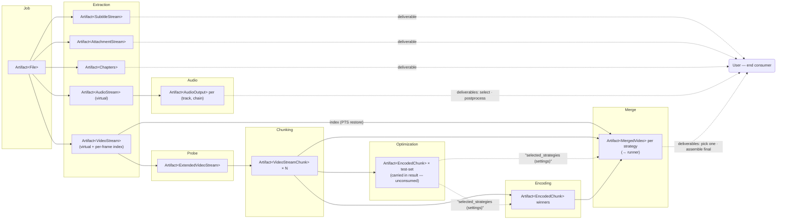

# Design Document

<!-- markdownlint-disable MD024 -->

- Spec: Artifact Model — the generic recovery & contract layer over the file → stream object model
- Created: 2026-09-28
- Completed:

## Context

The `2026-09-25 file-stream-model` spec rebuilt the entity layer (composition family: `File` → streams → `ExtendedVideoStream` → `VideoStreamChunk` → `EncodedChunk`) but did not re-contract the artifact layer that the phase-run uniformity paradigm runs on. The gap produced a split brain, visible in code today:

- **Duplicated identity.** `EncodedArtifact(chunk_id, strategy, crf)` duplicates what `EncodedChunk` composes; `EncodingPhaseResult` carries both (`encoded` + `encoded_chunks`); Merge consumes both sides — including a hand-rolled chunk-id timestamp re-parser that violates naming ownership.
- **Path as a fake identity.** Virtual artifacts fake it (`VideoStreamArtifact.path` = the source file path, "never extracted, never pending"); optimization builds literal `Artifact(path=Path(strategy_name))` rows "for readability". The base-class contract — "path to the primary artifact file on disk" — is knowingly violated in both directions.
- **Manual reconciliation.** Extraction's `_make_result` zips artifacts back onto stream payloads (`model_copy(update=…)`) to re-derive `extracted_path` from artifact states — two representations of the same fact, synchronized by hand.
- **Abandoned artifactness.** Job, probe and chunking return `Recovery(artifacts=[], pending=…)`; chunk windows — enumerable, identity-carrying entities — are recovered as one boolean. The `Recovery` docstring's "(job, probe)" list drifted without a spec decision.
- **Wrong reporting.** Optimization's recovery line counts strategy records, not artifacts: 3 test chunks × 3 strategies = 9 winning attempts to produce, reported as `3 total … 3 absent` (observed in the 2026-09-28 e2e run).
- **Convention-sniffing consumers.** The runner finds deliverables via `"final" in artifact.path.parts`; `strategy_results` sits on `OptimizationPhaseResult` with zero consumers.

The uniform mechanics survived — template steps, wanted filter, `log_recovery_line`, dependency guards — because they read only `state`/`wanted`. This spec makes the data model match them.

### What an artifact is

An artifact is **the thing we act on and invest in** — the unit of recovery (presence-based, resumable), of selection (`wanted`), and of inter-phase transfer. Concretely: winning encode attempts, audio outputs, extracted files, chunk windows, streams. Streams are zero-investment in the new paradigm but are the basis for every downstream investment, so they are artifacts. The per-frame PTS index is the video stream's material component — the one part of "video" that extraction actually invests in.

## Object model

```mermaid
classDiagram
    class Artifact~PayloadT~ {
        <<dataclass, pyqenc/phase.py>>
        payload: PayloadT
        state: ArtifactState
        wanted: bool = True
    }
    class File {
        <<JobPhase>>
    }
    class VideoStream {
        <<ExtractionPhase; index = material component>>
    }
    class AudioStream {
        <<ExtractionPhase; virtual>>
    }
    class SubtitleStream {
        <<ExtractionPhase; file-backed>>
    }
    class AttachmentStream {
        <<ExtractionPhase; file-backed>>
    }
    class Chapters {
        <<new; file: File>>
    }
    class ExtendedVideoStream {
        <<ProbePhase; slow facet>>
    }
    class VideoStreamChunk {
        <<ChunkingPhase; virtual window>>
    }
    class EncodedChunk {
        <<Encoding/Optimization; winning attempt>>
    }
    class AudioOutput {
        <<new; AudioStream + chain>>
    }
    class MergedVideo {
        <<new; Strategy + measured facts>>
    }
    Artifact~PayloadT~ ..> File : payload
    Artifact~PayloadT~ ..> VideoStream : payload
    Artifact~PayloadT~ ..> AudioStream : payload
    Artifact~PayloadT~ ..> SubtitleStream : payload
    Artifact~PayloadT~ ..> AttachmentStream : payload
    Artifact~PayloadT~ ..> Chapters : payload
    Artifact~PayloadT~ ..> ExtendedVideoStream : payload
    Artifact~PayloadT~ ..> VideoStreamChunk : payload
    Artifact~PayloadT~ ..> EncodedChunk : payload
    Artifact~PayloadT~ ..> AudioOutput : payload
    Artifact~PayloadT~ ..> MergedVideo : payload
```



The wrapper mirrors the `Stream[InfoT]` pattern parametrized the other way: the artifact adds no identity of its own, only the two recovery axes (`state`, `wanted`) plus the typed reference. PEP 695 generics on a dataclass; payload types are pydantic composition models, instantiated exactly once per run by their owning phase (file-stream-model Req 6) and wrapped wherever they enter a ledger.

**No `path` field.** File-backed locations derive from the payload (`SubtitleStream.info.extracted_path`, `EncodedChunk.stream.file.path`, `MergedVideo`'s derived output name, `AudioOutput`'s chain-output name); virtual payloads have none. Completeness stays presence-based: the owning phase's `_recover()` performs the (≤1 per group) directory listing and assigns `state`; the wrapper records the outcome.

**Mutability.** The wrapper is a plain mutable dataclass: the owning phase flips `state` to `COMPLETE` as `_execute()` verifies each production. Payloads stay frozen. Artifacts are never serialized — sidecars persist payload info slices only (file-stream-model Req 5, unchanged).

### New payload entities

Three small models in `pyqenc/stream_model.py`, following the composition idiom (eager, frozen, unique-property dumps):

```python
class Chapters(BaseModel):
    """Container-level chapter edition (no track_id — not a stream)."""
    file: File                      # owns the chapters.xml name convention

class AudioOutput(BaseModel):
    """One processed (track, chain) output; disk name = stream safe_name + ' chain=<name>.<ext>'."""
    stream: AudioStream
    chain_name: str                 # resolved output facts reachable via the chain

class MergedVideo(BaseModel):
    """One merged output per strategy; '<file stem> <strategy.safe_name()>.mkv' (single site)."""
    source_stem: str                # or File reference — tasks decide
    strategy: Strategy
    frame_count: int | None = None
    metrics: dict[str, float] = ... # measured facts (today's MergeArtifact payload)
    targets_met: bool = False
    plot_path: LongPath | None = None
```

`Chapters` replaces `stream_model.ContainerArtifact` (rename — it was never a phase artifact); `quality.QualityArtifacts` renames to `QualityLogs` (transient `.tmp` metric logs — the name "artifact" was a collision). `MergedVideo` absorbs the sidecar-payload role `MergeArtifact` played; `merge.yaml` summary rows remain the persisted replay form (unchanged role). The merge output directory renames `final/` → `merged/` (`FINAL_OUTPUT_DIR` → `MERGED_OUTPUT_DIR`), completing the past-participle output-dir family (`extracted/`, `encoded/`, `merged/`): `final` promised a fully finalized container (video + audio + subs + chapters) the pipeline intentionally does not produce — the merged output is the merge phase's product, and the user's final assembly (chapters translation, audio selection, manual mux) happens outside. The rename is free here: this spec already deletes the only `final`-sniffing consumer (the runner's path check, Req 9.3), leaving the constant, merge internals, docs and tests — all mechanical.

### The video artifact: stream + per-frame index

`timestamps.txt` is a per-video-track projection (`mkvextract timecodes_v2 <video track id>`, with the ffprobe `packet=pts` fallback for non-MKV containers or an unavailable mkvextract — the PTS of the video track's blocks on the container timeline; chapters contrast: container-level, no track id). Its identity is fully derived from (source, video track); both consumers act on the video (probe: line count → frame count; merge: global PTS restoration); its wanted-set equals the video's in every mode (`video_required` only — the current code already gates timestamps by mode, not filter).

So it is not a separate artifact and not an orphaned sidecar — it is the video artifact's **single expected material component**:

- `Artifact[VideoStream]`; `COMPLETE` ⇔ index present; `ABSENT` otherwise; no `PARTIAL` — both producer paths write through `.tmp`-then-rename, so presence implies a complete write.
- `wanted = video_required` (mode), never the include/exclude filter.
- The stream's existence in the source is a precondition of the row, not a state — but "ready to be worked on by later stages" (the `ArtifactState` definition) genuinely requires the index, so the row's completeness is honest.
- `ExtractionPhaseResult.timestamps_path` becomes a derived property of the video artifact. The `timestamps.txt` name/location convention gets one owning site.
- Stream-table asymmetry is accepted and honest: the video row's "Present" means "index extracted" (real work); audio rows are pure virtual (present in source).

## Taxonomy — what is and is not an artifact

| Thing | Classification | Rationale |
|---|---|---|
| `File` | external artifact (Job) | identity anchor consumed by everything |
| Streams (video/audio/subs/attachments) | external artifacts (Extraction) | basis of downstream investment; subs/attachments file-backed |
| Per-frame PTS index | material component of the video artifact | per-stream projection; identity fully derived |
| Chapters | external artifact (Extraction) | end-user deliverable — source chapters are often single-language while MKV/players support many; the extracted XML is easy to translate into additional languages. Optional per source; no pipeline consumer today (decision 2026-09-28, TODO §10 rejected) |
| `ExtendedVideoStream` | external artifact (Probe) | slow facet — real investment (frame count + crop) |
| Chunk windows | external artifacts (Chunking) | what optimization/encoding/merge act on |
| Winning attempts (test set) | external artifacts (Optimization) — sanctioned exception | carried in the result for handling uniformity; no downstream consumer acts on them (resumption + honest reporting remain the real uses) |
| Reduced strategy set | settings subset | config-derived selection, passed as `selected_strategies` |
| Winning attempts (full set) | external artifacts (Encoding) | consumed by Merge |
| Non-winning attempts | internal intermediates — not artifacts | drive the winner's `PARTIAL` state |
| Audio outputs | external artifacts (Audio) | deliverables (future merge consumption) |
| Merged videos | external artifacts (Merge) | deliverables consumed by the runner |
| Sidecar YAMLs (`job/extraction/probe/chunking/audio/optimization/encoding/merge.yaml`) | state/settings — not artifacts | invalidation + resumption records; one-phase-one-sidecar unchanged |
| Scene boundaries, per-strategy aggregated results | internal records — not artifacts | derive ledger rows / decisions |
| Quality metric logs | transient files — not artifacts | deleted after parsing |
| Run parameters (work dir, force, cleanup, config) | inputs — not artifacts | plain result fields |

## External vs internal — the consumption-graph rule

Whether an artifact is external is fixed by the pipeline's consumption graph — a phase has no free will in the matter. The rule: **external ⇔ some downstream consumer (phase, runner, CLI, user-as-deliverable) acts on it**. The term "exposed" is rejected precisely because it implies choice; the spec vocabulary is *external* / *internal* artifacts.

Optimization is the boundary case that earns the rule one documented exception: nothing downstream consumes its test attempts, yet its result carries them (`winners: list[Artifact[EncodedChunk]]`) anyway — the **single sanctioned exception**, chosen for uniformity of artifact/result handling. Carrying the winners keeps OptimizationPhase structurally identical to EncodingPhase (same `_make_result` sort-into-fields step, same result shape), so the base run mechanics — dry-run preview, pending, immediate reuse on nothing pending — apply with zero phase-specific special cases and zero hooks. The exception is declared here and in the result class's docstring, not emergent; `strategy_results` (the aggregated per-strategy records) still does not return — it remains internal to `optimization.yaml`.

## Pipeline artifact flow



Solid edges carry artifacts between phases; dashed edges carry settings subsets and deliverables to the end user. Extraction splits `File` into its artifact kinds, and the kinds have different fates: the **virtual** streams feed the processing phases — probe extends the video stream (reading its index for the frame count), chunking windows it, merge restores global PTS from the index, audio chains consume the audio streams — while the **materialized** side artifacts (subtitles, attachments, chapters) have no phase consumer at all and exist as user deliverables. Optimization reduces strategies over a test-set ledger (winners carried in the result, unconsumed); encoding produces winners per (chunk × selected strategy); merge assembles the per-strategy merged outputs — video-only: no audio is muxed, and that remains a forward reference. The User is the terminal consumer: extraction's materialized files (chapters to translate, subtitles, attachments/covers), the audio outputs (listen, select, postprocess), and the merged videos (pick the preferred strategy, assemble the final container from chosen parts) — the same "user as deliverable" clause the consumption-graph rule uses to make these artifacts external.

## Data-model changes

### The wrapper (`pyqenc/phase.py`)

```python
@dataclass
class Artifact[PayloadT]:
    """One investable entity (payload) plus its recovery/selection facts.

    The only artifact class: no subclasses exist. ``state`` transitions are
    confined to the owning phase during ``_execute()``.
    """
    payload: PayloadT
    state:   ArtifactState
    wanted:  bool = True
```

`ArtifactState`, `Recovery`, `Recovery.from_artifacts`, `RecoveryError` — unchanged.

### Phase results — typed fields as storage

The base class keeps its role but `artifacts` stops being storage:

```python
@dataclass
class PhaseResult:
    outcome: PhaseOutcome
    message:  str          # on FAILED, this IS the error description

    @property
    def artifacts(self) -> list[Artifact[object]]:
        """Derived concatenation of the declared artifact fields, in
        declaration order (dataclass-fields introspection, Artifact-typed
        only). Read-only; the declared fields are the contract."""
```

Each subclass declares its external contract; `_make_result(outcome, wanted_rows, message)` sorts rows into the declared fields by payload type. Consequences:

- **No leak is structurally possible**: there is no list field to dump a ledger into — results receive only what their declared fields name. (Optimization declares `winners`, the sanctioned uniformity exception of Req 5.2, so its `_make_result` performs the same sort-into-fields step as every other phase's.)
- **No reconciliation**: extraction's zip dance is deleted — the payload's `extracted_path` is the expected location (pure function of identity); completeness is read from the artifact's `state`.
- Mirror fields die: `AudioPhaseResult.outputs` and `audio_files` become one storage + one derived property; `MergePhaseResult.merged` is the single storage; `EncodingPhaseResult.encoded` + `encoded_chunks` collapse to one `winners`-style field (derived dict lookup if callers want it).
- `complete` / `pending` / `is_complete` / `did_work` operate on the derived list — semantics unchanged from `artifact-state-refactor`.

### Representative result sketches

```python
@dataclass
class ExtractionPhaseResult(PhaseResult):
    video_stream:       Artifact[VideoStream] | None      = None
    audio_streams:      list[Artifact[AudioStream]]       = field(default_factory=list)
    subtitle_streams:   list[Artifact[SubtitleStream]]    = field(default_factory=list)
    attachment_streams: list[Artifact[AttachmentStream]]  = field(default_factory=list)
    chapters:           Artifact[Chapters] | None         = None
    # derived: artifacts, timestamps_path, chapters_path

@dataclass
class OptimizationPhaseResult(PhaseResult):
    winners:             list[Artifact[EncodedChunk]] = field(default_factory=list)  # sanctioned exception — unconsumed
    selected_strategies: list[Strategy]              = field(default_factory=list)  # settings subset

@dataclass
class EncodingPhaseResult(PhaseResult):
    winners:       list[Artifact[EncodedChunk]] = field(default_factory=list)
    quality_labels: dict[str, str]              = field(default_factory=dict)  # settings
```

## Template mechanics — unchanged, no hooks

`Phase.run()` keeps every step as-is. The wanted filter, `log_recovery_line(self._logger, recovery.artifacts, …)`, the dry-run branch, `_reused_result(wanted, message)` default (which calls `_make_result(REUSED, wanted, …)`), and `_execute(wanted)` all operate identically — `_execute` still receives the full wanted work list (the ledger's executable subset), and every result-construction path flows through the phase's `_make_result`, which now sorts rows into declared fields instead of storing a list. No `_expose`-style hook exists: the exposure boundary is the result class definition itself, which is why the template needs no change and optimization needs no special case.

Uniformity is preserved at the principle level — every phase: complete internal ledger + typed contract fields. The fields differ per phase because the consumption graph differs; that difference is declared, static and documented, not behavioral.

## Special semantics

### Chunking set-flip

Chunk windows derive wholly from persisted scene boundaries plus the stream: there is no per-chunk on-disk presence. The ledger therefore emits one row per chunk with all rows sharing one state — `ABSENT` while boundaries are absent (detection pending), `COMPLETE` once `chunking.yaml` is current. `Recovery.from_artifacts` derives `pending` naturally (any wanted `ABSENT`). Per-chunk `wanted` is `True`; optimization's test-chunk selection is internal machinery, not artifact selection.

### Optimization honesty (the e2e case)

Today: `_strategy_artifacts(cached_results.keys(), …)` → `Recovery: 3 total, 0 unwanted — 0 complete, 0 partial, 3 absent`.

After: the ledger enumerates `Artifact[EncodedChunk]` per (test chunk × strategy), states from the shared per-pair attempt-recovery machinery (or aggregated from `optimization.yaml` provided a row is `COMPLETE` only when its winner exists on disk):

```text
Recovery: 9 total, 9 wanted (0 complete, 0 partial, 9 absent) — full run needed
```

`optimization.yaml` is unchanged in role. Orphaned strategy products surface as `wanted=False` rows, matching EncodingPhase's existing pattern.

### Job and Probe rows

Job emits `Artifact[File]`, `COMPLETE` by construction (a missing source fails the phase before recovery). Probe emits `Artifact[ExtendedVideoStream]`, `COMPLETE` iff `probe.yaml` is current for the live inputs. Both phases consequently gain the standard recovery line (previously silent), and `probe.yaml` / `job.yaml` remain state sidecars — the artifact is the entity, not the sidecar.

## Files affected

| File | Changes |
|---|---|
| `pyqenc/phase.py` | `Artifact` → generic wrapper (payload/state/wanted, no path); `PhaseResult.artifacts` → derived property; `PhaseResult.error` deleted (message is the single string — the error on `FAILED`); docstring updates (ledger vocabulary, remove "(job, probe)" stale note) |
| `pyqenc/stream_model.py` | add `Chapters` (rename of `ContainerArtifact`), `AudioOutput`, `MergedVideo`; `display_name()` on new payloads |
| `pyqenc/phases/job.py` | `file` field typed `Artifact[File]`; ledger row in `_recover()` |
| `pyqenc/phases/extraction.py` | delete 6 artifact classes + alias; fold timestamps into the video row; `_make_result` sorts rows into fields; generic `_log_stream_table`; single index-name owning site |
| `pyqenc/phases/probe.py` | ledger row; `stream: Artifact[ExtendedVideoStream]` |
| `pyqenc/phases/chunking.py` | per-chunk ledger rows (set-flip); `chunks` typed as artifacts |
| `pyqenc/phases/optimization.py` | per-pair ledger; delete `_strategy_artifacts`; result drops `strategy_results`, carries `winners` (sanctioned exception) + `selected_strategies` |
| `pyqenc/phases/encoding.py` | delete `EncodedArtifact`; winners as `Artifact[EncodedChunk]`; `_recover` unchanged in mechanism |
| `pyqenc/phases/audio.py` | delete `AudioArtifact`; `AudioOutput` payloads; single `outputs` storage |
| `pyqenc/phases/merge.py` | delete `MergeArtifact`; `MergedVideo` payloads; delete `_parse_ts`; typed post-dependency guard; output dir `final/` → `merged/` |
| `pyqenc/constants.py` | `FINAL_OUTPUT_DIR` → `MERGED_OUTPUT_DIR` (`"merged"`) |
| `pyqenc/runner.py` | `_collect_output_files` reads `Artifact[MergedVideo]` payloads; delete path sniffing; `RunResult.error` derived from target outcome + `message` (the `error or message` fallback chain dies) |
| `pyqenc/quality.py` | `QualityArtifacts` → `QualityLogs` (rename only) |
| `pyqenc/utils/log_format.py` | recovery line reworded (TODO §49, incorporated): `wanted` count replaces `unwanted`, state counts grouped — `Recovery: 9 total, 8 wanted (3 complete, 0 partial, 5 absent) — resuming`; mechanism (internal list in, derived counts, returned message) unchanged |
| `docs/architecture.md` | artifact-states section rewritten for the generic model; uniform recovery reporting noted |
| tests | property tests (below); unit migrations across phase tests |

## Testing strategy

Property-based (Hypothesis) for the invariants; unit tests for migration-specific behaviors:

- Round-trip naming for `Chapters` / `AudioOutput` / `MergedVideo` name families (file-stream-model Req 15.9 pattern).
- Ledger completeness: for each phase, `_recover()` output contains one row per owned artifact (including `wanted=False` and internal rows).
- Result/field correspondence: derived `artifacts` == concatenation of declared fields; payload types match annotations.
- Optimization count property: ledger size == |test chunks| × |strategies|; the 3×3 e2e case pinned as a regression test.
- Video artifact: state ⇔ index presence; wanted ⇔ `video_required` (filter-independence pinned).
- Chunk set-flip: all chunk rows share state.
- Consumer migrations: merge CRF plot reads payloads; runner collects merged outputs from `MergedVideo`.

## Correctness Properties

*A property is a formal statement of behavior that must hold across all valid executions.*

1. **Single wrapper** — no subclass of `Artifact` exists; every ledger row and result field is a direct `Artifact[...]` with a concrete payload type. *(Req 1)*
2. **Declared-contract correspondence** — every artifact in a result's derived `artifacts` originates from exactly one declared field; payload types match field annotations; internal ledger rows never appear. *(Req 5, 6)*
3. **Video component semantics** — video artifact state ⇔ index presence; wanted ⇔ `video_required`. *(Req 3)*
4. **Chunk set homogeneity** — all chunk rows in one chunking ledger share the same state. *(Req 4)*
5. **Optimization honesty** — ledger size == |test chunks| × |strategies|; row states are per-pair and presence-based. *(Req 8)*
6. **Uniform reporting** — every phase emits a recovery line; counts derive from the internal ledger via `log_recovery_line`, and the line's `wanted` count equals `complete + partial + absent`. *(Req 10)*
7. **Presence-based completeness** (inherited) — no artifact is classified by anything but on-disk component presence; `.tmp` remnants never produce `PARTIAL`. *(artifact-state-refactor, retained)*

## Open items (tracked, not blocking)

- Include/exclude filter scope after this spec (video artifact is mode-gated, not filter-gated) — TODO §48 decides the filter's remaining domain.
- Chunking currency: `chunking.yaml` does not persist scene-detection parameters, so a `scene_threshold` change without `--force` silently reuses old boundaries (TODO §46/47 adjacency). The chunk-set ledger makes staleness expressible; whether to persist and compare params is a separate decision.
- Ledger-driven deep cleanup: `finalize()` currently deletes whole directories; whether cleanup should consume `wanted=False` ledger rows instead is deferred.
- Audio-output consumption by merge (passthrough/mux) remains a forward reference from `2026-09-11 audio-chains`; the `Artifact[AudioOutput]` contract is ready for it.
