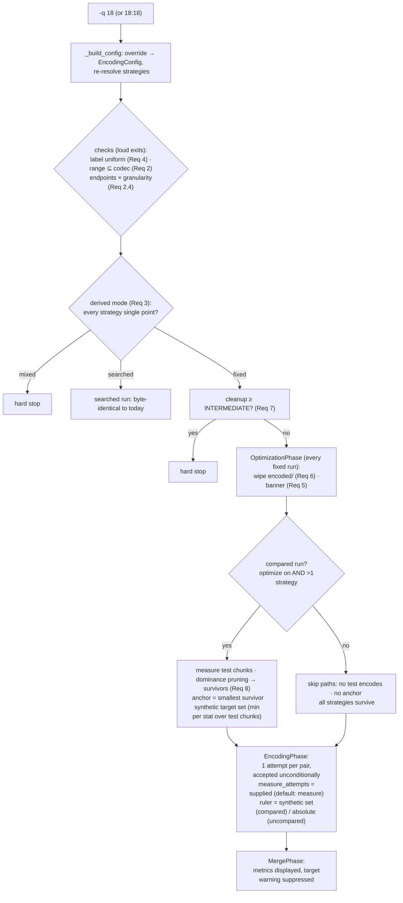

# Design Document

<!-- markdownlint-disable MD024 -->

- Spec: Fixed-Quality Mode — first-class pinned-knob encoding via a CLI quality override
- Created: 2026-10-02

## Context

The quality search owns one decision: which knob value each chunk encodes at.
Everywhere else the value is already an input — `Strategy.to_output_args(quality)`
renders it, attempt filenames embed it, sidecars record it, promotion and merge
consume it. A pinned-knob run therefore does not need a new pipeline; it needs a
new *source* for that one value, plus honest behavior where the search's absence
removes an assumption.

Today's workaround (a duplicated profile with `quality_range: [v, v]`) already
exercises the degenerate path: the search takes the only legal candidate on its
first pass and exhausts immediately — one encode per chunk, no extra attempts.
What it cannot fix by construction:

- **Ergonomics** — a config mutation per value. Config is the tune-once layer;
  per-run variation belongs to the CLI (later: web UI).
- **Cost** — each attempt still gets a full metric evaluation it cannot use for
  any decision.
- **Optimization soundness** — mixing one collapsed profile with searched
  strategies voids the "targets met ⇒ sizes comparable" assumption silently.

Design principles settled in discussion (2026-10-02):

1. **Fixed-ness is derived, never declared.** The run's mode is a fact about the
   resolved strategies' effective ranges. `-q` and a collapsed config profile are
   the same thing through one door.
2. **Measure where a decision consumes the measurement.** Optimization measures
   its test chunks (the anchor needs data). The encoding phase's measurement has
   no decision consumer in fixed mode — but stays ON by default this spec;
   the off path is deferred with its plumbing sweep (TODO §83).
3. **No composite quality score.** Cross-strategy judging uses the user's own
   measurement vocabulary rendered relatively against an anchor, plus
   opinion-free dominance pruning. Rationale is researched and parked in
   TODO §82 (VMAF is itself the industry's trained fusion; it is spatial-only
   and rewards grain smoothing — the exact trap dominance pruning must not
   paper over).
4. **Winners are derived; attempts are the substrate.** Fixed-mode starts wipe
   the winner layer wholesale and re-derive from attempts. No q-persistence.

## Flow



## Override plumbing

`-q/--quality` joins `_add_quality_arguments` (cli.py). `_build_config` parses it
(single value → `[v, v]`; pair → unordered, normalized per codec direction;
separators `:`/`-`/`..`), then applies it as an `EncodingConfig`-level override
before the re-resolve at cli.py:334 — the same hook `--strategies` uses, with the
same resolved-cache invalidation.

The override threads into strategy resolution where profile narrowing already
lives: `_effective_codec` gains one precedence step (CLI > profile > codec
bounds), so every `Strategy` carries its final `quality_range` in
`strategy.codec` exactly as today. `encode_chunk` reads
`strategy.codec.quality_better/quality_worse` — no signature changes ripple.

Validation extends the range-validation path (`_validate_profile_quality_range`
sibling for overrides), adding one alignment rule: every effective-range
endpoint — single-point or pair, whichever layer supplied it — must be an exact
multiple of every matched codec's granularity; across codecs that is the
intersection of their step sets (coarsest wins when steps divide evenly: h265
0.5 + AV1 1.0 ⇒ integers only; `-q 18` passes, `-q 18.5` exits naming the AV1
side). Violations exit loudly with the nearest aligned values — no silent
adjustment. The strictness is a search-correctness requirement, not formatting:
`_finalize_q` snaps candidates to granularity *before* clamping, and
`_clamp_to_range` includes sentinel-side endpoints verbatim, so a misaligned
endpoint is reachable as an attempt value — violating `to_output_args`'
documented "already quantized to the codec's granularity" precondition and
feeding fractional values to integer-step encoders (AV1/SVT, NVENC QP). The
check applies retroactively to codec- and profile-declared ranges, closing the
existing gap.

`default_quality` — the search's first stop — is fed as the initial value at the
encode call site granularity-quantized only (`phases/encoding.py:1527`), and
nothing clamps it into the effective range: the first attempt encodes *before*
the search object is involved, and `record()` accepts any value (phase 0 only
steps *from* the recorded point). A narrowed profile could therefore send the
first attempt outside its intended band today — a pre-existing gap the CLI
override would inherit. Fixed at the effective-codec layer: `_effective_codec`
clamps `default_quality` to the nearest range bound whenever an override or
profile narrowing excludes it, logging the adjustment. Auto-adjust beats a loud
exit because the starting point is a hint the search refines; in fixed runs the
adjustment makes it equal the pinned value, keeping the effective settings
object self-consistent (the single-point domain forces the value regardless).

## Mode derivation and the mixed stop

After re-resolve: fixed iff every strategy has `quality_better ==
quality_worse`; searched iff none does. Anything else stops loudly with the
offending strategies listed — this replaces the historical fixed/searched
optimization conflict with a structural rule. No mode field exists anywhere; any
consumer derives the predicate locally (one comparison on the strategy's codec).

The uniform-label check (Req 4) runs in the same place: `-q` shares one number
across strategies, so all matched `quality_label`s must be equal strings.
Without `-q`, searched runs keep mixed labels — nothing needs to cross codec
boundaries: the search runs per strategy over its own range (codec args with a
templated `{quality}` are all it consumes), and each winner independently meets
the same metric bar, which is what makes sizes comparable in search mode.

## Fixed-mode optimization

**Anchor.** Chosen from the survivors of pruning as the strategy with the
smallest total test-encode size (ties: first in resolved order). Three
properties justify it. First, it is on the Pareto front by construction —
nothing can dominate the size minimum — and choosing after pruning guarantees
the ruler is never a dominated (or about-to-be-pruned) size-tied duplicate.
Second, it is the only front member selectable without a quality opinion: any
"best variant" election by measured metrics must first decide which metric
defines best — the composite trap this spec refuses. Third, as a display pole
it makes the table read as "what the extra bytes buy" measured from the
cheapest point; a size premium paired with a negative metric delta is the
visible dominance signal. What the anchor is *not*: not a winner, not a filter,
and not elected by the voided size-selection rule — pruning is the election;
the anchor is only its ruler.

**Synthetic target set.** The anchor's measured metrics, aggregated per
`(metric, statistic)` as min-across-test-chunks (matches search-mode per-chunk
strictness; p10 noise accepted). Covers all measured metrics — the ruler's
breadth is the measurement's breadth, independent of any configured target set
(this is also what composes with future target profiles). The set is persisted in
`optimization.yaml` with the anchor identity and survivors, and flows to the
encoding phase through the optimization result — presentation data, never
selection data.

**Presentation.** Existing relative-scoring machinery (`find_worst_target`,
deficits, limiter-style rendering) judges each non-anchor strategy against the
synthetic set; all metrics are normalized 0–100, so cross-metric deltas read
uniformly:

```
FIXED QUALITY MODE — CRF=18 · ruler: av1 (smallest test size)
  av1    1.00×   baseline         vmaf-med 91.2   vif-med 84.1
  h265   1.34×   +2.1 vmaf-med    +6.3 vif-med
  h264   1.41×   −1.4 vmaf-med    +1.1 vif-med    ← dominated by h265 → pruned
Survivors (Pareto front): av1, h265 — all will be encoded
```

**Selection = dominance pruning.** A dominates B iff `size(A) ≤ size(B)` and
A ≥ B on *every measured* metric-statistic; dominated strategies are excluded;
survivors are all selected and encoded. The h264 row above shows the bite
(smaller neighbor with better metrics); av1-vs-h265 shows the restraint (neither
dominates — av1 smaller, h265 better — both survive for the human to pick).
Dominance is evaluated over the full measured set, not the headline columns —
more metrics, fewer prunes, conservative by construction. Edge: exact duplicates
(equal size, equal metrics both directions) do not dominate each other; both
survive. Size-tolerance does not apply in fixed mode: it presumes the quality
parity this mode explicitly refuses to assume.

**Why no score.** A composite needs weights nobody can defend (VIF-vs-VMAF
disagreement on grain is signal, not noise); anchor-relative deltas plus pruning
make the tradeoff visible without an opinion. §82 owns any future refinement.

**Uncompared runs.** Single strategy, or `optimize: false` — the existing skip
paths run unchanged: no test-chunk comparison, no anchor, no synthetic set; the
banner still emits and the wipe still happens. The ruler distinction is
"compared vs uncompared", not strategy count.

## Fixed-mode encoding

The single-point domain already produces the right mechanics today — one attempt,
immediate exhaustion, unconditional acceptance (the workaround proved it). This
spec changes only:

- **The control.** `measure_attempts` on the shared chunk-encoding machinery
  (ChunkEncoder construction parameter, alongside `metric_prefix`/`crop_params`),
  supplied by the calling phase. Default: measure. Optimization always passes
  measure-on for its test chunks; the encoding phase passes its configured value.
  Flipping defaults and tolerating metrics-absence everywhere is TODO §83.
- **The ruler.** In compared runs (optimization enabled, multiple strategies),
  winner-sidecar metrics and limiter-style presentation judge against the
  anchor synthetic set (relative deltas) instead of config targets — config
  targets are search-tuned vocabulary and would read as all-miss noise.
  Uncompared runs (single strategy or `optimize: false`) have no ruler:
  absolute values, no verdicts.

Promotion, hard-linking, attempt-sidecar mechanics, the winner scan (empty
metrics already self-extinguish the limiter tallies via `find_worst_target` →
None; frame accounting is target-independent) and listing-only recovery are
untouched.

**Merged phase.** Measured metrics displayed; the config-target missed-targets
warning is suppressed in fixed mode; anchor-relative deltas may join the summary
when a synthetic set exists.

## Invalidation, guard, and the iteration loop

**Wipe.** OptimizationPhase — already the single invalidation point for
`encoded/` and a mandatory encoding dependency on every path — deletes the
winner layer unconditionally at fixed-mode start (`_wipe_encoded_dir`). The
rejected alternative (persisting the fixed value and comparing) added
bookkeeping to save a cheap re-derivation; the honest cost lives in the cleanup
guard instead.

**Guard.** Fixed + cleanup ≥ INTERMEDIATE hard-stops before encoding: cleanup
deletes attempts per completed artifact, and winners alone cannot re-derive
after a value change — an interrupted fixed run resumed under cleanup would
re-encode completed chunks. Hard stop over warning because the loss is
investment-scale and the trigger is opt-in.

**Iteration.** The dominant workflow — one strategy, one value, look, adjust,
re-run on the same workdir:

| Event | Attempts (`encoding/`) | Winners (`encoded/`) | Work |
|---|---|---|---|
| `-q 18` run, interrupted | crf-18 attempts accumulate | partial promotions | resumes from attempts |
| resume `-q 18` | kept | wiped, re-promoted | near-zero (re-promotion) |
| re-run `-q 20` | crf-18 kept (unwanted), crf-20 added | wiped, promoted from crf-20 | only new encodes |

All listing-only; attempts are never deleted by mode machinery.

## VBR-labeled codecs

The override is label-agnostic: for `quality_label: "Mbit/s"` codecs, `-q 20`
pins 20 Mbit/s VBR — a pinned knob, not 2-pass CBR (explicitly out of scope,
Req 10.6). Direction normalization and validation use each codec's own reversed
convention; no special cases.

## Correctness properties

1. **Searched invariance** — without `-q`, or with every strategy ranged, every
   phase behaves byte-identically to today (banner, wipe and guard all keyed on
   the derived fixed predicate).
2. **No silent mixed runs** — a mixed strategy set never reaches a phase.
3. **Fixed never searches** — exactly one attempt per (chunk, strategy); no
   second candidate can exist in a single-point domain.
4. **No invented ranking** — selection removes only dominated strategies;
   every non-dominated strategy survives to a merged output.
5. **Substrate preservation** — mode machinery never deletes attempts; the only
   unconditional deletion is the winner layer, always re-derivable from
   attempts while cleanup ≥ INTERMEDIATE is blocked.
6. **Ruler is presentation-only** — no decision path consumes the synthetic
   target set; `targets_met`-style verdicts never gate fixed-mode work.
7. **Starting-point validity** — every effective codec's `default_quality` lies
   within its effective range (auto-adjusted at construction when an override or
   narrowing excludes it); the first attempt of any search starts in-domain.
