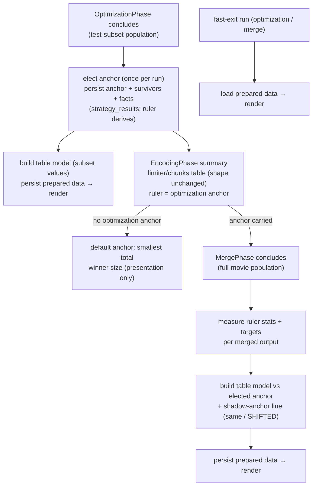

# Design Document

<!-- markdownlint-disable MD024 -->

- Spec: Unified Quality Summaries — one anchor-relative comparison table across optimization, encoding, and merge
- Created: 2026-10-03

## Context

The fixed-quality spec shipped the anchor-relative comparison table at
optimization and, through two smoke-test review rounds, settled a compact
format: one size cell (MB + ×ratio vs anchor, anchor bare), one column per
metric carrying both compared statistics (anchor: `p10..median` range, others:
`Δp10/Δmedian`). That format is the seed. Merge still prints a different
table (config-target verdicts), search runs print a third (size/status), and
the encoding limiter table has no delta mode without an optimization anchor.

Two foundations need work before the table can live in three phases:

- **Key plumbing.** A metric-statistic identity is spelled `vmaf_median` in
  sidecars and `vmaf-median` on the CLI, joined and split ad hoc at every
  boundary, with no closed set of statistics (`std` is measured but is not a
  legal target; `med` parses to `median`). Table data is assembled from
  stringly keys throughout.
- **Data path.** Some tables persist prepared data and replay it on fast
  exits (limiter summary in `encoding.yaml`, strategy summaries in
  `merge.yaml`); others rebuild from facts each run. The unified rule is
  facts → prepared data → rendering on processing runs, load → render on
  fast exits.

## Flow



## The table model and its owner

A dedicated module (e.g. `pyqenc/summary_tables.py`) owns two things and
nothing else:

```python
@dataclass(frozen=True)
class ComparisonRow:
    name:        str
    kind:        RowKind            # SOURCE | REFERENCE | STRATEGY
    size_bytes:  int | None         # None for the targets reference row
    values:      dict[MetricStatKey, float]     # absolute, keyed by the pair type

@dataclass(frozen=True)
class ComparisonTable:
    ruler_kind:  RulerKind          # ANCHOR | TARGETS
    reference:   ComparisonRow      # anchor (fixed) or targets (search)
    rows:        list[ComparisonRow]
    marks:       dict[str, RowMark] # survivor / pruned(dominator) / merged / recommended?
    deltas:      computed at render # never persisted — facts stay absolute
```

Phases assemble rows from their own artifacts (winner payloads, merged
outputs, sidecars), persist the model in their params sidecar, and hand it to
the renderer. The renderer is the ONLY place cell text exists — separators,
delta formatting, marks, source cues (Req 5 variants parameterize it; a
variant is a named configuration of the renderer, not a fork).

Deltas are computed at render time from absolute values — prepared data stays
facts-only, so a renderer change (e.g. the variant review's outcome) re-renders
old runs' persisted tables without re-measuring anything.

## Reference row and anchor lifecycle

- **Fixed runs:** the anchor is elected once at optimization (survivor with
  the smallest test size — the existing election) and persisted in
  `optimization.yaml`. Merge receives it via the optimization result and
  judges its population against it. The sidecar stores facts + decisions
  only — `strategy_results` (full aggregated stats), `selected`, `anchor` —
  never the ruler itself: the synthetic target set is a pure projection of
  the anchor's facts onto the comparison stat set and derives on demand
  (persisting it was dropped in the 2026-10-03 review as write-only data
  with a drift risk). The anchor ROW at merge shows the
  anchor's own full-movie measurements — its deltas vs the elected ruler's
  values are exactly the "did the test subset represent the movie" signal,
  visible in-table.
- **Shadow anchor at merge:** re-running the election over the full-movie
  rows is a pure function of the table model — a re-election in fact, but
  reported, never installed. The result surfaces as an anchor line that
  always logs: stable at INFO (`anchor holds at full scale: h265-aq`), a
  shift at WARNING with both names (`anchor shifted at full scale:
  h265-aq (test subset) → h264 (full movie) — test chunk selection may not
  generalize`). Rendering variants cover how pronounced the shift is.
- **Search runs:** the reference row is the target set — the absolute values
  wanted, in the metric cells; a source placeholder in the size column;
  verdict glyphs (✔/✘ per target-set satisfaction) allowed because these
  are true targets. Fixed-mode rows carry no symbolic verdicts — different
  run goals, different knobs, adjusted presentation.
- **Encoding is not a comparison-table renderer.** Its summary keeps the
  winning-limiter/chunks shape in both modes; in fixed mode the ruler feeding
  it is the optimization anchor, and uncompared fixed runs elect the default
  anchor (smallest total winner size) locally — presentation-only, never
  persisted as a ruler; single strategy degenerates to absolutes.

## Metric-statistic pair type

```python
class StatisticType(Enum):      # closed set, validated against the evaluator
    MIN, P05, P10, P25, MEDIAN, P75, P90, P95, MAX, STD

@dataclass(frozen=True)
class MetricStatKey:            # or a named tuple on (MetricType, StatisticType)
    metric:    MetricType
    statistic: StatisticType

    def sidecar_key(self) -> str:   ...   # "vmaf_median" — THE canonical form
    def display(self) -> str:       ...   # "vmaf-median" — THE display form
    @classmethod
    def parse(cls, text: str) -> Self: ...  # accepts a set of separators for
                                           # user input; unknown → loud ValueError
```

The type is the single naming authority: user-facing parsing accepts a set
of separators (the tolerant-input principle, aligned with TODO §81's intent);
sidecar serialization and deserialization use exactly one canonical form; the
`med`→`median` CLI alias and the `-`/`_` duality live only inside `parse`/
`display`.

**Presentation vs retention.** Presentation surfaces (tables, log lines,
winner result sidecars, merged-output sidecars) show the inspectable set —
the comparison statistics (p10 + median per metric). Retention surfaces
(attempt sidecars — internal intermediates) keep the full measured set, and
the optimization aggregation reads them (the attempt under a winner is
guaranteed present in fixed mode by the cleanup guard; equivalently in
search mode the attempt sidecar is the attempt's own record). Consequence:
winner result sidecars narrow back from all-metrics to the presentation set —
their all-metrics widening in the fixed-quality spec served the aggregation,
which now returns to its retention source. Re-selecting the comparison set
therefore never re-measures: full data stays on the retention surface.

Migration is staged so no phase's data path is ever half-migrated: the type +
parse/serialize tests land first; then targets (`QualityTarget` fields),
ruler keys (`_FIXED_COMPARISON_STATS` becomes
`tuple[MetricStatKey, ...]`), sidecar readers, table keys, prepared data.
Each stage is independently green.

## Facts → prepared data → rendering

- Processing runs: phase concludes → assemble `ComparisonTable` (and the
  limiter summary) from artifacts → persist into the phase's params sidecar
  (`optimization.yaml`, `encoding.yaml`, `merge.yaml` alongside the existing
  aggregate fields they replace) → render.
- Fast-exit runs: load the model, render. The existing
  limiter-summary/merge-summary replay pattern generalizes; per-winner
  sidecar scans disappear from the merge fast path exactly as they already
  did for encoding.
- Staleness of prepared data follows the existing pending-gate rule: any
  invalidated artifact routes the phase through the processing path, which
  rebuilds and re-persists.

## Merge measurement set

Fixed runs: merge measures `config targets ∪ ruler statistics (p10, median ×
metrics)` per output — the ruler values themselves are neither re-measured
nor stored: they re-derive from `optimization.yaml`'s persisted
`strategy_results`; only each output's own values are measured. Search
runs: config targets only, as today. Measured values persist in the prepared
table data keyed by `MetricStatKey`.

## Merge sidecar content (mode-honest)

The 2026-10-03 e2e inspection found both merge sidecars mode-dishonest in
fixed runs (config `targets` blocks that drove nothing, a 40-stat
`strategy_summaries[].metrics` dump replayed into an 8-key table) and
replay-leakage (`source_stem`/`source_size_bytes` persisted beside the
invalidation keys). Content per surface and mode:

| Surface | Search run | Fixed run |
|---|---|---|
| per-video sidecar | `targets`, target-keyed verdicts + metrics (as today) | pinned knob (label + value), anchor identity, `metrics` = full measured set (retention — the re-measure-avoidance record next to the product) |
| `merge.yaml` prepared data | rendered table values only (config-target stats) | rendered table values only (ruler stats) |
| `merge.yaml` invalidation keys | quality targets, sampling, probe | ruler basis (anchor + comparison set), sampling, probe |

- Replay reads live where a resolved dependency already holds the fact: the
  summary's source row (stem, size, %) renders from the JobPhase result, so
  neither field persists on `merge.yaml`.
- Invalidation compares the declared keys only — never whole-model equality
  (which replay fields would perpetually break; today's `persisted !=
  self.params` gate is already dead weight for exactly this reason).
- Fixed runs carry no configured-`quality_targets` key: those targets drive
  nothing there, so a fixed merge is neither invalidated nor re-measured by
  their change.

## Variants program (Req 5)

One task produces rendered variants from a real work dir (the existing
`pyqenc_tmp` data is ideal: 4 strategies, anchor, near-ties, a dominated
case). Variants vary ONLY the renderer configuration:

- separator: `88.1·91.2` (middle dot) vs `88.1~91.2` (wavy) — both must not
  collide with the decimal point;
- delta emphasis: plain `+2.5`, emoji-flagged `+2.5🔺/−0.6🔻`-style (exact
  glyphs from the existing symbol vocabulary), plain-with-mark-column;
- source cue: placeholder glyph in the ratio cell + name prefix;
- anchor-shift line: INFO-only vs WARNING + in-table marker.

The user picks; the chosen configuration is frozen as the default and the
task list closes the loop with a verification run.

## Correctness properties

1. **Facts stay absolute** — persisted table data carries only measured
   facts; deltas exist solely at render time, so renderer changes never
   invalidate prepared data.
2. **No presentation leaks into decisions** — the anchor, shadow anchor,
   marks, and verdict glyphs never gate encoding, pruning, or merging.
3. **One election per run** — the ruler is elected at optimization only;
   later phases present and audit, never re-elect.
4. **Fast-exit fidelity** — a fast-exit run renders byte-identical tables to
   the processing run that persisted them.
5. **Mechanics untouched, presentation follows the run's goal** — decisions,
   artifacts, and non-summary logs are invariant for both modes (the minimal
   possible change); summary presentation adjusts to what each run pursues
   (targets in search mode, pinned-knob anchor deltas in fixed mode).
   Deliberate, narrow supersession of the fixed-quality spec's
   presentation-level searched invariance.
6. **Closed statistic vocabulary** — any statistic outside the closed set
   fails loudly at the parse boundary, never silently round-trips.
