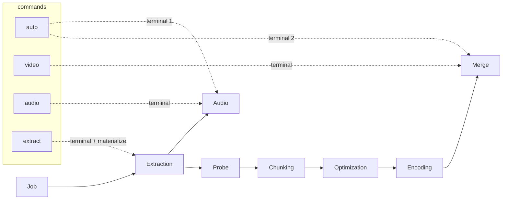

# Design Document

<!-- markdownlint-disable MD024 -->

- Spec: CLI Intent Commands — intent-based command surface, dependency-derived registry, and explicit stream materialization
- Created: 2026-10-05
- Completed:

## Current state (verified 2026-10-05)

- Eight subcommands: `auto`, `extract`, `chunk`, `encode`, `audio`, `merge`
  (six near-identical pipeline bodies) plus `config` and `measure` (genuinely
  different shapes). Argument surface is composed from six reusable group
  helpers (`_add_base/pipeline/filter/crop/chunking/quality_arguments`,
  `cli.py:166-341`); the per-command differences reduce to three axes:
  needs-crop, needs-plan, output flavor.
- `MergePhase` module docstring (`merge.py:8-9`): "Audio muxing is intentionally
  omitted — the final output is video-only. Audio delivery files are kept
  alongside the output for the user to mux." Zero `_dep_result(AudioPhase)`
  reads in the file; `AudioPhase` appears only in the import and the
  `DEPENDS_ON` tuple, whose declaration order carries a comment explaining it
  schedules audio before the slow encode chain.
- `Phase.run()` memoizes per instance; dependency execution is a depth-first
  walk over `DEPENDS_ON` with run-time registry fetch (`phase.py:335-390,
  505-534`). Registry order is construction order, not execution order.
- `_drive` (`api.py:55-118`) already accepts `plan: EncodingPlan | None` and
  `video_required: bool`; wrappers hand-set them (`process_audio` passes both
  off, `api.py:335`). `extract_streams` still requires a plan (`api.py:190-201`)
  although nothing downstream of its terminal consumes one.
- `_build_registry` (`phase.py:691+`) is a static hand-ordered construction
  list with a `video_required`-driven Probe omission.
- `ExtractionPhase` takes `video_required` as a constructor parameter
  (`extraction.py:417-422`): it gates the timestamps artifact (`:402`) and the
  video artifact row's wanted flag (`:530`) — the video stream's material
  components. Filters never drive the video row's want (`:493-494`).
- `RunResult` (`runner.py:48-63`) is built from the common `PhaseResult`
  surface of every phase in the registry that has a cached result — it already
  aggregates, not just the terminal.

## Target command set

| Command | Terminals | Registry (closure) | Derived video-need | Arg groups beyond base | Handler |
|---|---|---|---|---|---|
| `auto` | `(Audio, Merge)` | full graph | `True` | pipeline, filter, crop, chunking, quality | template (flavor: table) |
| `video` | `(Merge,)` | video chain + shared | `True` | pipeline, filter, crop, chunking, quality | template (plain) |
| `audio` | `(Audio,)` | Job, Extraction, Audio | `False` | pipeline, filter | template (plain) |
| `extract` | `(Extraction,)` | Job, Extraction | `False` | pipeline (no cleanup), filter | dedicated |
| `measure` | — standalone | — | — | own surface | dedicated (unchanged) |
| `config` | — standalone | — | — | own surface | dedicated (unchanged) |



The `audio` walk never constructs Probe/Chunking/Optimization/Encoding/Merge:
the registry is the closure of its terminal, so "audio does not touch the
video stream" holds by construction — no video-phase code exists in the run,
and the derived video-need keeps the timestamps artifact and video row out.

## Execution model

### Closure: one computation, three consumers

```python
def _dependency_closure(terminals: tuple[type[Phase], ...]) -> tuple[type[Phase], ...]:
    """Depth-first walk over static DEPENDS_ON; stable order, cycle-loud."""
```

- **Registry membership** — the registry contains exactly the closure; the
  static list and the Probe-omission branch are deleted.
- **Construction order** — a deterministic topological order (declaration
  order as the tie-break) so run logs and `RunResult.outcomes` ordering are
  stable.
- **Video-need** — `video_required = any(p in VIDEO_CHAIN for p in closure)`,
  threaded to `ExtractionPhase` through the same constructor channel as today.
  `VIDEO_CHAIN` is the fixed set {Probe, Chunking, Optimization, Encoding,
  Merge} — a declaration-level constant living next to the closure helper.

`DEPENDS_ON` becomes the single source of truth for membership, order,
scheduling, and the video-need derivation. The cost: an undeclared dependency
is now a silent absence — which is why the §54 audit (below) is part of this
window rather than a follow-up.

### DEPENDS_ON honesty audit (Req 13)

- Per phase: enumerate actual dependency reads (every `_dep_result(X)` /
  registry fetch in the file) and compare against the declared `DEPENDS_ON`
  tuple. Undeclared reads and over-declarations are fixed in the tuples; the
  registry switch lands only on audited declarations.
- Deliverable: a per-phase dependency table (declared deps; consumed results
  and settings) recorded in `architecture.md` — the graph §54 asked for, and
  the human-checkable counterpart of the closure computation.
- Blast radius is known and small: the hotspots are the phase files untouched
  by this spec's other edits, so the audit doubles as the regression read of
  the graph before the registry change.

### Multi-terminal `_drive`

```python
def _drive(
    config: AppConfig, plan: EncodingPlan | None, source: Path, work_dir: Path,
    targets: tuple[type[Phase], ...],          # was: target: type[Phase]
    *, force, cleanup, no_metrics, dry_run, crop_params = None,
) -> RunResult
```

- One registry (the closure of all terminals), one collector, one lifecycle,
  one finalize broadcast.
- The Runner walks terminals in order. Shared dependencies (Job, Extraction)
  run on the first walk that reaches them; later walks hit the memoization
  guard and read the cached result. Audio-first scheduling for `auto` comes
  from terminal position, replacing the deleted dependency hack.
- `RunResult.success` = every terminal's result `is_complete`; the aggregate
  surface is unchanged. The `auto` display table reads the last terminal's
  (Merge's) result, same as today.
- Dry-run walks all terminals, so `auto` without `-y` reports pending audio and
  video work.

### Merge dependency drop

`MergePhase.DEPENDS_ON` becomes `(JobPhase, ExtractionPhase, ProbePhase,
OptimizationPhase, EncodingPhase)`; the scheduling comment moves to the `auto`
terminal ordering (and this spec's history). Behavior change is exactly: an
`api.merge_final`-style run no longer executes audio — which is the point, and
`video` inherits the same honest shape.

## `extract` — explicit materialization

### Run shape

- Terminals `(Extraction,)`; registry {Job, Extraction}; no plan (the
  `extract_streams` api function drops its plan parameter, joining
  `process_audio`'s shape).
- A run-scoped materialize mode is threaded to `ExtractionPhase` alongside
  `video_required` (same channel; working name `materialize_av` — naming
  settles at implementation). It is run intent, not user config, so it lives
  with the other run-context flags, never in `AppConfig`.

### Want/Present mechanics

- In materialize mode the selected video and audio streams enter the artifact
  ledger as **material rows** with real destination paths under `extracted/`,
  instead of virtual complete-by-construction rows. Completeness is
  presence-based like every other material artifact.
- Tool policy per §53: mkvextract track extraction first (it handles all
  tracks and kinds in one batch invocation), ffmpeg fallback on failure —
  same try-first semantics as the attachment matrix (fonts/attached-pictures
  dispatch, `bee491a`).
- Chapters and timestamps are materialized as today (not gated by materialize
  mode; timestamps remain gated by video-need).
- File naming: extraction owns composition, `safe_name()` on disk, display
  names in the table — the two-name doctrine, no new accessor.
- In materialize mode the video and audio rows' `wanted` follows the shared
  filter like every other row (Req 9.3); in processing runs the video row
  stays mode-driven (today's rule, `extraction.py:493-494`).

### Sidecar honesty and preservation

- `extraction.yaml` records materialized video/audio entries with the run mode
  they belong to (mode-honest, mirroring the fixed/search sidecar principle).
- A later processing run in the same workdir: materialized AV entries are not
  wanted under processing mode and are **preserved, not stale-deleted** —
  stale cleanup must scope to entries the current mode wants. They are also
  never consumed as pipeline inputs (source-anchored processing).

### CLI shape

- Source + base + pipeline args (but no `--cleanup`) + filter args. Dry-run
  prints the stream table with per-stream destination, expected size, and the
  planned total (stream sizes come from the enumeration the phase already
  performs — track and attachment sizes are in the mkvextract/ffprobe JSON;
  no extra probing); `-y` materializes, then prints the same table with
  results. Presentation-only — this is not the §33/§50 estimation rework.

## CLI condensation (§95)

One spec table drives the three pipeline commands; `extract`, `measure`,
`config` keep dedicated handlers:

```python
@dataclass(frozen=True, kw_only=True)
class _SubcommandSpec:
    name:      str
    help:      str
    runner:    Callable[..., RunResult]        # api wrapper
    arg_groups: tuple[str, ...]                # "pipeline" | "filter" | "crop" | "chunking" | "quality"
    flavor:    Literal["plain", "auto_table"]

_PIPELINE_COMMANDS: tuple[_SubcommandSpec, ...] = (_AUTO, _VIDEO, _AUDIO)

def _cmd_pipeline(args: argparse.Namespace, spec: _SubcommandSpec) -> int: ...
# parser creation loops over the table; _add_*_arguments helpers stay as the group vocabulary
```

The needs-crop / needs-plan axes collapse into `arg_groups` (crop group present
= crop resolved; quality group present = plan resolved). The `extract`
subcommand's parser omits `--cleanup`; with pipeline args split as
`--execute/--force/--no-metrics` + `--cleanup`, the table expresses that too.

## Test and docs impact

- Registry/runner: new closure tests (membership, order, cycle failure);
  multi-terminal memoization test (Job/Extraction run once across two walks);
  derived video-need matrix (audio → False; video/auto/extract → False or
  True per closure).
- Merge: dep-graph test asserting audio does not execute under a merge
  terminal; existing merge tests updated for the smaller `DEPENDS_ON`.
- Extraction: materialize-mode want-table tests (AV rows material, filter-
  driven); preservation-on-processing-rerun test; naming doctrine tests.
- CLI: parser table smoke tests; removed commands absent.
- e2e: `auto` (product unchanged), `video` (no audio work), `audio`, two-pass
  composition, `extract` byte-verification of materialized streams (mkvextract
  path + a forced ffmpeg-fallback case).
- Docs: `docs/cli-reference.md` rewritten for six commands;
  `docs/architecture.md` updated (registry/execution-model description,
  extraction want-table row, api surface listing, CLI diagram; Req 13
  dependency table lands there); README command mentions + workdir-tree
  `extracted/` note; `docs/audio-processing.md` "extracted audio tracks"
  wording disambiguated; `docs/Pipeline flow overview.mmd` extraction
  outputs extended; `docs/quality-targeting.md` + `CONTRIBUTING.md`
  verified, updated only where stale.

## Open items to settle at tasks stage

- `materialize_av` final name and its exact threading channel (constructor
  parameter vs the Job run-context bag).
- Whether `RunResult.outcomes` ordering (construction order) needs an explicit
  contract note once order becomes topological.
- Stale-cleanup scoping implementation in extraction (currently
  presence-vs-want over the whole dir).
- api surface: superseded as an open question by TODO §96 (raised during
  review): the phase-mirroring wrappers (six `_drive` mirrors + measure, all
  re-exported from `__init__`, zero external consumers) may collapse to an
  intent-named surface — decide via §96 whether that lands in this window or
  as a follow-up; until then the wrappers simply get re-pointed onto
  `targets=` tuples.
