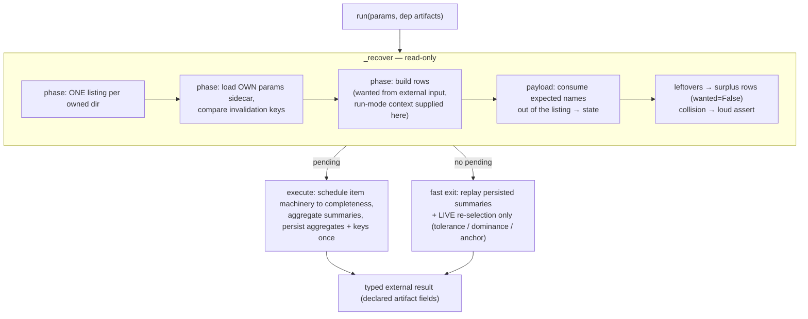

# Recovery rework — investigation grounding

<!-- markdownlint-disable MD024 -->

- Created: 2026-10-06 (investigation session; no production code touched)
- Purpose: grounding for the recovery-rework spec — §101 static winner names, §100 artifact-owned recovery, §11 invalidation audit, fixed↔searched mode switch, winner provenance, sidecar type models.

## Documents

| File | Content |
| --- | --- |
| [process-flows.md](process-flows.md) | **The connected view (post-settlement)** — per-phase mermaid flows: inputs → invalidation knobs → recovery → processing/fast-exit → outputs, plus the knob census (few knobs per phase; complexity lives in the typed sidecars, not the flow). Read alongside requirements.md/design.md. |
| [requirements.md](requirements.md) | The gated spec requirements (EARS) — 58+ requirements in 8 groups. |
| [design.md](design.md) | The gated spec design — model principles, retention layers, sidecar layouts, ownership, per-phase key table, implementation order. |
| [logical-vs-code.md](logical-vs-code.md) | **The validation view** — one table per phase: Input change \| Logical \| Code today \| ✓/GAP, references below each table. Start here for behavior-vs-implementation review. |
| [per-phase-audit.md](per-phase-audit.md) | Per-phase deep dive — full logical view (inputs→outputs, classification, invalidation, dispatch), code view with file:line, cross-check gaps. Phases: Job, Extraction, Probe, Chunking, Optimization, Encoding, Audio, Merge, Measure (brief). |
| [sidecar-models.md](sidecar-models.md) | Complete sidecar inventory (content class, read/write sites), the fixed/search split analysis, facts-only status per artifact sidecar, winner-provenance options, target recovery I/O budget. |
| [naming-and-consumption.md](naming-and-consumption.md) | Every name family (composer/parser/owner today vs target), §101 change surface, the consumption protocol mechanics, producer/consumer hypothesis assessment. |
| [invalidation-matrix.md](invalidation-matrix.md) | The full input-change × effect matrix (logical vs code), mode-switch walk-through, forced-wipe semantics + §39 options, the keys-not-effects principle. |
| [spec-plan.md](spec-plan.md) | The plan for the gated spec authoring: scope, workstreams, EARS requirement candidates, the nine open design decisions to settle with the user first, TODO dispositions. |

## The target logical flow (the user sketch, formalized)

Invariants the spec will carry: recovery is listing-only + one params sidecar; artifact-sidecar contents are read only on processing paths; names (compose and parse) are entity-owned; phases own mass operations; investment wiping (`encoding/`) only under explicit user action; every invalidation compares persisted KEYS that are existing typed objects.

## Gap census (from the audits — every entry traces to a finding ID)

J-1 (§39 wipe propagation dies on mid-run crash) · J-2 (broken `--force` promise — permission inert without source mismatch) · J-3 (moved source = false-positive catastrophic: fatal + force-wipe for a zero-content change) · P-1 (probe has no source key) · P-2 (equal `--crop` override needlessly invalidates + rewrites) · C-1 (chunking params not keys) · C-2 (chunking has no content-identity key — old-source boundaries reuse silently) · O-1 (fixed→search mode switch leaks winners as COMPLETE) · O-2 (fixed same-q rerun wipes + replays) · O-5 (§68 strategy-args invisible — ruled catastrophic, per-strategy) · O-6 (partial test-chunk survival silently shrinks the test basis) · E-1/§101 (promotion keeps q-bearing name; 6 parse sites) · E-2 (result-sidecar name hand-parsed) · E-4 (re-chunk stale winners invisible — fix sharpened to consume + auto-delete) · E-8 (encoding duplicates the probe fatal — retires with shared-namespace ownership) · E-9 (orphan winner dirs retained vs winner-layer auto-curation) · X-1 (extraction optimistic on missing own sidecar) · X-2 (extraction's own source-key comparison optimistic and unreachable — Job gates first) · A-1/§9 (audio sidecar-missing accepts stale outputs) · A-2/§103 (per-row stats before the listing) · M-1 (merge recovery reads N sidecar contents) · M-2/§86 (winner-set change reuses stale merge; non-uniform fixed unsuffixed) · M-3 (merge naming phase-owned) · M-4 (merged sidecar untyped) · M-6 (fixed-no-targets skips merged measurement vs banner promise) · M-7 (merge silently skips key checks on missing own sidecar) · M-8 (targets/anchor change re-measures merged outputs instead of re-deriving verdicts from persisted full metrics) · M-9 (probe change wholesale-rmtrees `merged/` — deliverable-layer auto-deletion without permission; per-file provenance replaces it).
