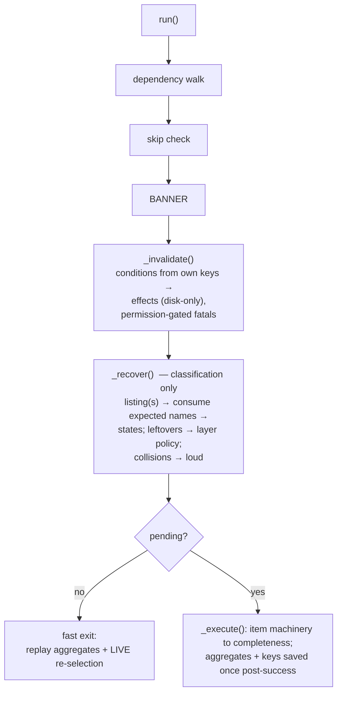

# Artifact Recovery Ownership — Design

<!-- markdownlint-disable MD024 -->

- Created: 2026-10-07
- Completed:

## 1. The model

Four principles carry the whole design. Every requirement traces to one of them.

1. **Filesystem-first, no mirrors.** The disk is the state. A sidecar records only (a) the keys its artifacts' identity depends on, (b) replay aggregates, (c) facts of its own artifact. Nothing persists a copy of what another file already says — mirrors drift (manual interference, bit rot) and bloat.
2. **Two state axes, never blurred.** *Parameter currency* (invalidation: were these artifacts produced under the current inputs?) and *presence completeness* (ABSENT/PARTIAL/COMPLETE: are the expected files here?). The axes meet only at the pending gate. Req 57's verification step guards this distinction explicitly.

2a. **Effects vs triggers.** Effects form ONE vocabulary owned by the invalidation domain (fatal / wipe-winners / wipe-investment / re-derive / rewrite-own-sidecar) — deleting existing artifacts is an invalidation effect no matter what selected it. Triggers are exactly two: **key comparison** (at `_invalidate` — including the chunk-set fingerprint: a re-chunk wipes winners at optimization, ahead of recovery) and **consumption / wanted-set derivation** (at classification — residual curation only: orphan strategy dirs, foreign names). The permission band is orthogonal to the vocabulary: winner-layer wipes are automatic whichever trigger selected them. Attempts participate in neither axis: never classified, never individually invalidated — completeness-verified at pick-up (execution time) and wholesale-affected only as phase-level conditions' effects.
3. **Condition, permission, effect.** A phase detects a condition by comparing its own persisted keys against current inputs. `--force` is a permission that gates destructive effects; it never causes anything by itself. Effects come from a fixed vocabulary and are always disk effects.
4. **Single ownership per fact.** Entities own their name families and classification footprints; sidecar variants own their keys + `matches()`; the phase owns condition→effect policy and mass operations; the template owns sequencing. Item machinery produces; payloads stay frozen data.



## 2. Layered retention

| Layer | Dir | Policy |
| --- | --- | --- |
| Investment | `encoding/` (attempts) | never auto-deleted; permission or explicit cleanup only |
| Winner | `encoded/<strategy>/` | auto-curated: consumption leftovers deleted (re-derivable from the substrate) |
| Deliverable | `merged/`, materialized `extracted/` | retained in place; deletion only via cleanup |

Sidecar-IS-the-artifact phases (Job, Probe, Chunking) own no directory: the consumption protocol does not apply; a boundary/facet change overwrites the sidecar in place, and its leftovers live downstream.

## 3. Identity and fingerprints

One concept, per Req 10: **`Fingerprint {size: int|None = None, token: str}`** — `token` REQUIRED (derivations are total; unreadable source = fatal at Job, never a carried None), opaque blake2b-128 of the owner-declared canonical form, **authoritative for identity**; `size` an optional belt — cheap pre-check magnitude (bytes / count): participates when present on both sides (differ ⇒ mismatch: collision enforcement), contributes nothing when absent (owners with no meaningful check). `Fingerprint(None, None)` unconstructible; unknown-not-mismatch lives at the missing-sidecar-field layer (Req 32), not in the type. **Data separated from means**: owners declare derivations; consumers compare with no knowledge of either.

| Owner | Means (derivation) | size |
| --- | --- | --- |
| source file (Job) | sampled windows: head + tail + two interior ~1 MiB | file size |
| `Strategy` | canonical dump minus declared exclusions (`codec.default_quality`) | — |
| `ResolvedChain` | canonical dump (today's chain signature, now hashed) | — |
| id-set (chunk-set / winner-set) | hash over the sorted chunk ids — ONE derivation, two vantages: the **chunk-set fingerprint** is optimization's common-base key (mismatch ⇒ wipe winners at `_invalidate`, uniform with merge); the **winner-set fingerprint** rides each merged output's provenance | count |

- The source fingerprint is computed once per run at Job, carried by the live `File`; phases persist the pair only; `job.yaml` alone adds the path (human-facing + standalone-measure discovery). Path = runtime locator: a path-only change rewrites `job.yaml`, no invalidation.
- Source-fingerprint mismatch = catastrophic everywhere: fatal without permission; wipe + re-derive with it. `force_wipe` deleted; crash-idempotency by construction.
- Threat model: accident only. No bit-rot or adversarial claims. Tokens are idempotency markers, not user-facing (Req 10d) — errors name the owner and field, never a payload diff.
- Structured keys stay where fields are meaningful/diffable: probe facet (frame count + crop), targets, pinned-q map, sampling (Req 10c boundary).

## 4. Naming families

| Family | Form | Owner | Notes |
| --- | --- | --- | --- |
| chunk id | `HH꞉MM꞉SS․mmm-HH꞉MM꞉SS․mmm` | `VideoStreamChunk` | inverse pair pinned (unchanged) |
| attempt | `<chunk>.q<q>.mkv` + `<chunk>.q<q>.yaml` | `EncodedChunk` | q = the search's cache key; no res; exact-name lookup, no glob/parse; the post-encode resolution rename dies. Attempts have NO recovery presence — no classification, no invalidation pass; consulted lazily per pending pair at execution, verified complete-by-sidecar (a completeness check, not invalidation — the two-axis rule applied to the last layer) |
| **winner** | **`<chunk>.mkv` + `<chunk>.yaml`** | `EncodedChunk` | pure input-derived; no q/res |
| audio output | `<stream safe> chain=<name>.<ext>` | one owner (entity or chain module) | compose+parse inverse pair |
| merged output | `<stem> <strategy>[ <LABEL>=<q>].mkv` | `MergedVideo` | suffix per-strategy whenever collapsed; search: no distinguisher |
| strategy identity | `display_name()` / `safe_name()` / **`fingerprint`** | `Strategy` | token = blake2b-128 **hash** of the canonical dump minus `codec.default_quality` — the dump itself is never persisted; never re-validated |
| chain identity | **`fingerprint`** | `ResolvedChain` | token = **hash** of the canonical form — CHANGE vs today: `audio.yaml` currently stores the full chain JSON verbatim; it stores the token instead (debug = diff the config, not the sidecar) |
| winner-set identity | **winner-set fingerprint** (count + hash over sorted ids) | merged-output sidecar | compared as a whole; unverifiable ⇒ re-merge |

**Fingerprint** is the standard identity-comparison mechanism (Req 10): one value type `{size, token}`, class-owned, **hash tokens only — canonical dumps are never persisted anywhere** (debug reads the config / source of truth, not the sidecar); consumers compare equality only. Deliberately NOT fingerprints: the probe facet and the per-mode keys — structured, field-wise comparisons where fields are individually meaningful and diffable (Req 10c boundary; the former content-identity entity retired INTO the fingerprint family).

Winner sidecar: `{crf, resolution, metrics, frame_count, targets_met}` — `winning_attempt` dropped; the `EncodedChunk` payload carries no quality field at all (crf/res are disk facts, consumed on processing paths only; recovery never reads winner sidecar contents — high-N, listing-only).

## 5. Sidecar layouts

All fingerprints serialize as the type's YAML form `{size, token}`, `size` omitted when absent (the codebase's `exclude_none` convention); tokens are hashes — canonical dumps are never persisted (Req 10d).

```yaml
# job.yaml — the one human-facing header
source: {path: D:/movie.mkv, fingerprint: {size: 12345, token: "b2:9f…"}}

# optimization.yaml — per-mode union (tag: mode); ALL keys on the common base, all-strategies path included
mode: search
source:     {size: …, token: "…"}          # what: the source  (a fingerprint)
chunks:     {size: 107, token: "…"}        # what: the chunk set (re-chunk → wipe winners)
strategies: {"h265+slow": {token: "…"}}    # what: each strategy (args fingerprints; size-less)
probe:  {frame_count: 172000, crop: {top: 140, …}}   # structured key (explicit field compare)
sampling: 3
targets: ["vmaf-min:93.0"]                 # search key
summary: [ … ]                             # per-strategy rows (sizes [+ comparison metrics])
# fixed variant instead: pinned: {"h265+slow": "18.0"}   # fixed key

# encoding.yaml — aggregates only (no keys); ONE summary block, typed by the sidecar class
summary: {limiter: [ … ], frames: {"h265+slow": 172000}}

# probe.yaml  → {frame_count, crop, crop_source: manual|detected}   # crop_source human-only
# chunking.yaml → {scenes: […], scene_threshold: 0.27, min_scene_length: 15}  # params = keys
# audio.yaml → {chains: {normal: {token: "…"}}}   # CHANGE vs today: hash tokens, not full chain JSON

# attempt sidecar <chunk>.q<q>.yaml → {crf, resolution, metrics: FULL, sampling, frame_count}  # re-judging substrate
# winner sidecar <chunk>.yaml       → {crf, resolution, metrics: TARGETED, frame_count, targets_met}
# merged output sidecar  <stem> <strategy>.yaml →
#   {frame_count, metrics: {…FULL…},                        # facts (no verdict; full — re-judgeable)
#    provenance: {source: {size, token},                    # identity — escalates (Req 27)
#                 strategy: {token: "…"},                   # args fingerprint
#                 mode, q|targets/anchor, probe, sampling,  # structured keys
#                 winners: {size: 107, token: "…"}}}        # winner-set fingerprint

# merge.yaml → summary rows + basis marker only
```

Comparison mechanics: facet checks compare frame count + crop values explicitly (never whole-model equality — human fields like `crop_source` must not leak into keys, the lesson `merge.yaml` already learned). Per-mode variants own `matches(current)`; unknown key fields never mismatch (Req 32).

## 6. Ownership of invalidation

**Optimization owns the shared namespace** (`encoding/` + `encoded/` + both sidecars' keys): facet, mode, targets, pinned q, sampling, strategy args (fingerprint, per-strategy, catastrophic), content identity. The two phases are one pipeline in two steps; encoding's `_invalidate` is empty and its `_recover` is classification-only. All-strategies carries the keys too.

**Merge owns `merged/` by per-file acceptance**: each output's sidecar IS its flag (provenance vs current inputs, single-digit files ⇒ direct reads). Transitivity completes the flag: every intentional winner mutation routes through a recorded param or the winner-set hash. `merge.yaml` demotes to summary replay + basis marker. Residual, accepted: a rot-triggered re-encode drifting crfs under matching params (content identity not worth it).

**Measurement is unconditional** (M-6 root fix): the evaluator measures (file + reference + sampling — no bar in the signature); verdicts are pure functions applied by callers (search steering, summary verdict columns). The anchor is presentation-only (deltas), never persisted, never a measurement gate. **Anchor fallback (Req 59):** all-strategies runs (no test work → no ruler — e.g. the common fixed single-strategy `-q` run) get a presentation anchor elected at the encoding winner-limiter scan (smallest-total-size strategy with measured metrics); presentation-only — not a key, not a selection input, not merge's anchor basis (merge's fixed key stays optimization's anchor; in these runs it is legitimately absent and the winner-set fingerprint + mode + q cover acceptance). Due-but-missing anchors (compared runs without measurements) surface as optimization errors — no silent downstream election.

## 7. Per-phase key/effect summary

| Phase | Keys | Notable effects |
| --- | --- | --- |
| Job | content identity (+path on file) | catastrophic / locator rewrite; permission rides the result |
| Extraction | content identity | catastrophic (wipe `extracted/` + sidecar); missing sidecar + files ⇒ conservative wipe + re-extract |
| Probe | content identity | facet re-probe; crop equal ⇒ no-op, differs ⇒ cheap re-resolve |
| Chunking | content identity + detection params | identity ⇒ catastrophic; params ⇒ auto re-detect |
| Optimization | union keys (mode/targets|q, sampling, facet, content, fingerprints, test-chunk set) | wipes winners (auto); catastrophic per-strategy (fingerprint) and whole-namespace (facet); table rewrite = disk effect; §99 conservative wipe on missing sidecar |
| Encoding | none (empty invalidate) | classification + winner-layer curation |
| Audio | chain signatures | differing ⇒ reproduce; removed ⇒ cleanup; missing sidecar ⇒ conservative reproduce |
| Merge | per-output provenance (incl. probe facet — the flag) | mismatch ⇒ re-merge that output in place — NO wholesale deliverable wipe (the only `merged/` wipe is the permission-gated identity condition, Req 60); sampling ⇒ re-measure; missing `merge.yaml` ⇒ per-output records still decide (M-7 structural) |

## 8. Implementation order (tasks.md will expand)

1. `PhaseDependencies` typed view (§93) — rewrites every call site; do first so the rest builds on final access shape.
2. Sidecar models: per-mode unions, content-identity entity, typed merged/probe/chunking models, re-home to phases; sidecar facts fixes (winner sidecar fields, `crop_source`).
3. Strategy fingerprint; `EncodedChunk` static winner names + promotion; naming re-homes (merged, audio parse).
4. Source identity at Job (digest) + permission flag replacing `force_wipe`; per-phase keys wired.
5. Consumption protocol per phase (extraction/audio/encoding/merge recovery rework; §103 hoist; leftovers + collision).
6. Optimization shared-namespace invalidation + encoding invalidate-empty; mode-tag switching; O-6 set-presence; derive-only via disk rewrite.
7. Merge acceptance flag + unconditional measurement + measurement/verdict split in the evaluator; merged-sidecar typing.
8. Template split (`_invalidate` → `_recover`) + plan-boundary fixed/cleanup guard.
9. **Mandatory separation assessment (Req 57)** — after everything else finalizes: verify disk-effects-only, the two-axis distinction, and the empty-encoding case study; then arch-doc update (current-state only).

## 9. Residuals and cross-spec notes

- Accepted residuals: rot-drifted re-encode under matching params (no content identity at winners); crash-after-promotion ⇒ at most one conservative re-merge cycle; `default_quality`-class exclusions over-invalidate until excluded (fail-safe direction).
- Pre-alpha: q-bearing winners from current workdirs stop matching the static footprint — pairs re-derive as ABSENT or the workdir is force-wiped; noted in the landing commit.
- **unified-summaries (2026-10-03)** builds on this spec's substrate and re-forks from its merge; §90 splits — per-mode typing lands HERE, summary-content narrowing stays THERE. Cross-spec notes required in both at authoring time.
- TODO.md consumption marks (§9/§11/§39/§62/§68/§86/§100/§101/§103/§105 consumed; §90/§92/§106 partial) land with the tasks stage.
