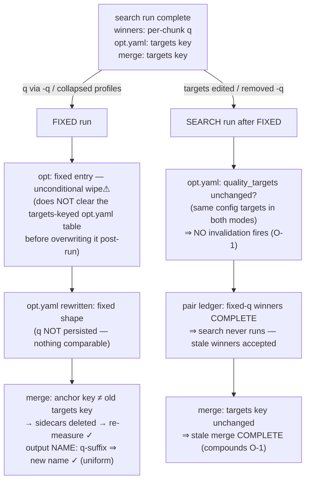

# Recovery rework — invalidation matrix (logical vs code)

<!-- markdownlint-disable MD024 -->

- Created: 2026-10-06
- The §11 matrix rebuilt from first principles, then checked against code (main @ 461274c). Effect vocabulary defined in `per-phase-audit.md`. "Code" column cites the mechanism; **GAP** marks a logical-vs-code divergence.

Legend: `—` = no invalidation (live-only input) · `derive` = re-derive instantly · `reselect` = live re-selection · `remeasure` = measurement passes re-run · `reproduce` = producing tool re-runs · `wipe⚠` = delete `encoded/` winners (re-derivable) · `wipe🔒` = delete `encoding/` investment (needs explicit user action) · `fatal` = refuse without `--force`.

## 1. The matrix

| Phase | Input change | Logical | Code | Match |
| --- | --- | --- | --- | --- |
| Job | content identity changed (size/digest), no `--force` | fatal | `RecoveryError` (job.py:206) — compares path+size today (digest pending) | ✓ |
| Job | path changed, content identity same | locator update: rewrite `job.yaml`, no invalidation | fatal mismatch demanding `--force`; with force, full workdir wipe | **GAP J-3** |
| Job | content identity changed + `--force` | wipe everything (all phases) | `force_wipe` flag honored per phase — **probe does not honor it; propagation dies with a mid-run crash (§39)** | **GAP J-1** |
| Optimization/Encoding | probe facet changed, source unchanged | fatal; `--force` permits the destructive invalidation | fatal — **but `--force` is inert: `force_wipe` is set only on a source mismatch, so the promised "Re-run with --force" recovery never runs** (optimization.py:385, encoding.py:2188) | **GAP J-2** |
| Extraction | own persisted content identity ≠ live content identity | catastrophic (fatal / wipe + re-derive, per permission) | own comparison compares PATH (not content identity) → optimistic re-enumerate; nearly unreachable (Job gates first, force path deletes the sidecar first) | **GAP X-2** |
| Extraction | include/exclude filter | reselect only | wanted re-derived; states untouched (:536-611) | ✓ |
| Extraction | intent mode (`video_required`/`materialize`) | wanted + component-set only | row construction branches (:551-588) | ✓ |
| Probe | `--crop` equals committed crop | no-op | unconditional invalidate + rewrite (cheap, frame count kept; probe.py:194-206) | **GAP P-2** |
| Probe | `--crop` differs from committed crop | probe re-resolves cheaply; investment loss is downstream via the facet key (fatal/permission) | pending row, manual crop + cached frame count, rewrite (:194-206, :247-252) | ✓ (J-2 gates the permission half) |
| Probe | own persisted content identity ≠ live content identity | wipe `probe.yaml`, re-probe (permission-gated) | **no key — cannot detect; the stale facet of the old source loads as current** | **GAP P-1** |
| Chunking | `scene_threshold` / `min_scene_length` | re-detect, automatic (user-initiated config edit — targets precedent; the sidecar is overwritten in place — chunking owns no artifacts, surplus impossible here; leftovers surface downstream at encoding) | **not tracked; boundaries always reused** | **GAP C-1** |
| Chunking | own persisted content identity ≠ live | catastrophic (fatal / wipe sidecar + re-detect, per permission) | **no key — old-source boundaries reuse silently (only the command-wipe path removes them)** | **GAP C-2** |
| Chunking | stream facets (duration/frames) | derivation input, not a key — windows re-derive live (the source frame count stays PERSISTED: replay-expensive, feeds the facet key + preservation invariant) | live derivation `build_chunks` (chunking.py:120-165) | ✓ |
| Optimization | tolerance | reselect | live at read (§99) | ✓ |
| Optimization | probe facet changed | catastrophic — owned HERE for the whole shared namespace (attempts + winners + both yamls; encoding's own fatal retires; all-strategies path carries the key too) | `RecoveryError` (:381-386); force wipes `encoding/`+yaml (:375-378) — winners left to Encoding's duplicated branch (:2184-2189) | ✓ at optimization (J-2 gates permission); duplication retires with the ownership ruling |
| Optimization | **search**: targets changed | wipe⚠ + replay | `_wipe_encoded_dir` + table cleared (:388-417) | ✓ |
| Optimization | sampling changed | remeasure (impl: wipe⚠ + replay w/ re-measure) | same branch as targets (:396-417); attempt sidecar `sampling` staleness re-measures at pick-up | ✓ (fixed+cleanup IS loud-stopped by the guard `:253-263`; search+cleanup replay degradation is the accepted cleanup trade-off, not a missing guard) |
| Optimization | **fixed**: q changed | wipe⚠ + reproduce | unconditional wipe every fixed run (:265-268) | ✓ (over-broad: see O-2) |
| Optimization | **fixed**: q unchanged rerun | no invalidation — the pending gate decides (fast exit only if every wanted pair is COMPLETE) | **wipes + replays anyway** | **GAP O-2** |
| Optimization | mode fixed→search | wipe⚠ | **nothing — winners persist as COMPLETE, search never runs** | **GAP O-1** |
| Optimization | mode search→fixed | wipe⚠ | unconditional fixed-entry wipe | ✓ |
| Optimization | own persisted content identity ≠ live | catastrophic (fatal / wipe attempts+winners per permission) | no key today (only the command-wipe path) | GAP (per-phase keys ruling) |
| Optimization | strategy args changed (§68) | **catastrophic, per-strategy**: fatal without permission; with it, wipe that strategy's attempts + winners (key = per-strategy resolved-args fingerprint from the frozen plan) | **not tracked** (plan comparable, nothing compares) | **GAP O-5** |
| Optimization | test-chunk set vs chunking output | reuse the persisted selection IFF the FULL set survives in the current chunking output (set-presence check); partial survival → fresh full pick (logged) — never silently shrink the basis | intersection semantics (:497-514): partial survival silently tests the surviving subset; only an empty intersection re-picks + warns | **GAP O-6** |
| Encoding | targets/sampling changed | (owned upstream) sees ABSENT pairs | upstream wipe ⇒ ABSENT (:395-483) | ✓ |
| Encoding | probe facet change | owned upstream at optimization — no encoding key, no encoding fatal | encoding runs its OWN duplicated probe fatal + force wipe (:2184-2189, :2167-2174) | GAP E-8 (retires with the ownership ruling) |
| Encoding | attempt sidecar sampling stale | remeasure that attempt | pick-up re-measure (:985-1064) | ✓ |
| Encoding | chunk set changed (re-chunk) | attempts kept (substrate); stale winners = consumption leftovers → AUTO-DELETED (winner-layer curation, owned by encoding classification) | **invisible — no per-name orphan detection; stale winners stay silently** | **GAP E-4** |
| Encoding | selected strategies changed | added: pending; removed / unselected: winner dirs auto-deleted (attempts survive; merged retains history) | pair ledger + orphan DIR rows retained in place | **GAP E-9 (policy change: winner-layer auto-curation replaces retention)** |
| Audio | chain def changed | reproduce that chain | signature compare → exact-name delete (:254-266) | ✓ |
| Audio | chain removed | cleanup delete | same | ✓ |
| Audio | sidecar missing, outputs present | conservative reproduce | **nothing — stale outputs COMPLETE (§9)** | **GAP A-1** |
| Audio | `select` changed | reselect only | live resolution (:217-224) | ✓ |
| Merge | targets (search) / anchor (fixed) changed | **re-derive** — verdicts live from persisted full metrics; derive-only summary rebuild, nothing re-measured | per-output sidecar delete → PARTIAL → re-measure (merge.py:279-311) — forced by target-filtered metrics retention | **GAP M-8** |
| Merge | sampling changed | remeasure (the only true measurement key) | same branch | ✓ |
| Merge | probe facet changed | **per-file** provenance mismatch ⇒ re-merge in place — NO wholesale wipe (deliverables retained; the only `merged/` wipe is the permission-gated identity condition — Req 60) | rmtree (:312-321) — deliverable auto-deletion without permission; crash-after-wipe = outputs gone | **GAP M-9** |
| Merge | winner set changed, keys unchanged (re-search: new crfs under identical static names) | output stale — per-output PROVENANCE vs live winners ⇒ PARTIAL ⇒ re-merge | **nothing (§86)** | **GAP M-2 (fix = per-output typed provenance compare — no digest)** |
| Merge | pinned q changed (uniform fixed) | new output name | q-suffixed naming (:858-895) | ✓ |
| Merge | pinned q, NON-uniform fixed (still a fixed run via the plan; suffix is per-strategy by construction) | new output name — per-strategy suffix | **no suffix — uniformity gate; same name, stale reuse** | **GAP M-2b** |
| Merge | strategies changed | expected set changes; surplus | winners-derived expected set + surplus glob | ✓ |

Gap census: **J-1 (§39 propagation), J-2 (broken `--force` promise on probe mismatch — condition/permission conflation), P-1 (no source key at probe), C-1 (chunking params), O-1 (mode switch), O-2 (fixed same-q), O-5 (§68 strategy args), E-4 (re-chunk stale winners), X-1 (extraction optimistic on missing own sidecar), X-2 (extraction's own source-key comparison optimistic and unreachable — Job gates first), A-1 (§9 audio), M-2/M-2b (§86 winner identity), M-7 (merge skips key checks on missing own sidecar)**. Consumption (§100/§101) structurally closes E-4 and half of M-2; the rest need explicit keys. Per-phase behavior tables with the code-today column: `logical-vs-code.md`.

## 2. Missing own params sidecar — the unknown-currency condition

The sidecar itself is a recovery input; its **absence while the phase's artifacts exist** is a distinct condition in every phase's logical view (rows added to per-phase-audit.md, 2026-10-06): the artifacts' parameter currency is UNKNOWN — the only record of what produced them was the missing file. Treatment is cost-driven, never optimistic:

| Branch | Rule | Phases |
| --- | --- | --- |
| **Cheap-replay substrate → conservative, automatic** | artifacts re-derive from a deeper substrate ⇒ invalidate + replay/reproduce; no permission (nothing in the investment band is touched) | Optimization (wipe winners, replay from attempts — §99, landed), Audio (reproduce chains — fixes A-1/§9), Extraction (wipe + re-extract from source; materialized containers cost one remux each) |
| **Expensive, non-replayable → reconstruct, never re-produce** | re-producing is expensive ⇒ the durable per-artifact records MUST carry enough identity to rebuild the keys; a missing phase sidecar triggers reconstruction, never a blind re-measure | Merge (per-output sidecars carry their identity — the §86 winners-digest home; `merge.yaml` holds the O(1) map + summary replay) |

Special cases: Job / Probe / Chunking — the sidecar IS the phase artifact (re-probe / re-detect; deterministic, nothing else to doubt). Encoding — winner currency is certified **cross-phase** by `optimization.yaml`'s keys (mode/targets/sampling/probe); `encoding.yaml` carries no unique key, so its absence costs replay aggregates only (reconstruct from winner records on the exceptional path, or degrade display until the next processing pass) — no invalidation.

Field-level analog inside a PRESENT sidecar: an absent key = unknown, never mismatch (same semantics as Req 26 for the digest). All missing-sidecar effects stay in the automatic band — no `--force` involvement.

## 3. Mode-switch walk-through (fixed ↔ searched)

State carried across the switch: `encoded/<s>/` winners (+ sidecars), `encoding/` attempts, `optimization.yaml`, `encoding.yaml`, `merge.yaml`, `merged/`.

Both directions become structural once the sidecar is a **tagged per-mode union with the mode's own key** (sidecar-models.md §2): a mode switch always re-keys ⇒ wipe⚠ ⇒ re-derive. No mode-sniffing logic anywhere — the union tag IS the invalidation basis.

Non-uniform fixed runs (collapsed profiles of different q, no `-q`): per-strategy q suffix in the merge output name closes M-2b (`_q_suffix` is already per-strategy; only `_uniform_pinned_quality`'s uniformity gate prevents emission — and the pinned value is derivable per strategy from its collapsed range).

## 4. Forced wipe (`--force`) semantics — current state and the §39 decision

What `--force` does today, per phase (all keyed off `JobPhaseResult.force_wipe`, set ONLY on source mismatch):

| Phase | Wipes |
| --- | --- |
| Extraction | `extracted/` + `extraction.yaml` |
| Probe | **nothing (GAP P-1)** |
| Chunking | `chunking.yaml` |
| Optimization | `encoding/` (attempts, ALL strategies) + `optimization.yaml` |
| Encoding | `encoding/` + `encoded/` + `encoding.yaml` |
| Audio | chain outputs + `audio.yaml` |
| Merge | `merged/` + `merge.yaml` |

§39 (idempotency): the flag lives on the in-memory result; `job.yaml` is rewritten immediately on execute. Crash between the job write and a downstream wipe ⇒ next run: identity matches, flag False, old-source artifacts read COMPLETE.

**RULING (user, 2026-10-06 — logical validation session):** the flag is misnamed and misused. `force_wipe` is NOT a command to wipe — it is (should be) a **permission**: "destructive actions are allowed this run". The **condition** is separate and phase-local: each phase detects, from its own persisted keys vs current inputs, that its investment is invalid beyond re-derivation. Effects follow the fixed vocabulary, gated by permission:

- re-derive / re-select / re-measure / **wipe winners (`encoded/`, `merged/` sidecars)** — automatic, no permission (re-derivable from the investment substrate);
- **wipe investment (`encoding/`, whole-workdir source change)** — requires the permission flag; without it the phase fails fatally and its message truthfully names `--force` as the enabler (fixes J-2, where the promise is currently unreachable).

Consequences adopted for the spec:

1. `JobPhaseResult.force_wipe` (the derived, propagated wipe order) is **deleted**; the raw `--force` permission boolean rides the job result like every other run parameter. Phases never receive a wipe command again.
2. **Every params sidecar persists the source-identity key** (the existing `_SourceSidecarBase.validate_source` pattern — Job and Extraction already carry it; Probe/Chunking/Audio/Merge gain it; Optimization/Encoding keep `ProbeState` and gain the identity key). Each phase then detects "this workdir's source changed" on its own — no propagation, no ordering dependence.
3. **J-1 (§39) dissolves structurally**: the condition is re-derivable on every run from persisted keys. Crash anywhere after `job.yaml` was rewritten ⇒ the next run finds each untouched phase's key still naming the old source ⇒ fatal-or-wipe decision repeats — idempotent by construction.
4. **P-1 fixes itself**: probe detects the mismatch via its own key and re-probes (cheap — no permission needed for probe's own artifact); the expensive downstream invalidations are caught by optimization/encoding/merge keys as today, now with a working `--force`.
5. J-2 is the evidence for the conflation: today's fatal messages promise `--force` recovery that cannot run because the flag was conflated with the source-mismatch condition.

Single-source doctrine (user, same session): the workdir is meant for ONE source. A source identity change (path/size) is **catastrophic** for every phase, not an incremental invalidation — extracted/encoded/merged bytes are functions of the source and their names carry no source identity, so there is nothing to revalidate later. Consumption/leftover detection can never substitute for the key: a new source with a same-named stream produces a name collision that reads as COMPLETE with wrong bytes (see per-phase-audit.md, Extraction cross-check). Identity basis = **content** — `file_size_bytes` + **sampled content digest (APPROVED 2026-10-06, spec-plan Open decision 10)**: head + tail + 2 interior windows, a few MB, stdlib blake2b-128, computed once per run at Job and compared as part of the key everywhere; missing digest on either side = unknown, not mismatch. **Path = runtime locator (decision 11, approved with refinement):** `job.yaml` keeps the path (the one human-facing sidecar + standalone-measure source discovery); phase sidecars persist a content-identity entity only (size + digest, no path) — minimal sidecars, human-value exceptions reserved for end-user-facing files; a path-only change rewrites `job.yaml` with no fatal and no invalidation (today it fatals + force-wipes: GAP J-3). Accident guard only (wholesale same-size replacement, in-window corruption) — not bit rot, not adversarial tampering. The downstream `ProbeState` backstop does NOT fire for a content swap (the comparison reads the same stale `probe.yaml` on both sides) — the digest is the only guard.

Related ruling this spec should make explicit (user's framing): **investment wiping (`encoding/`) is never an automatic invalidation effect** — it happens only via `--force` (source change) or an explicit strategy-args-change-with-force path (§68/O-5). Winner wiping (`encoded/`) IS automatic (re-derivable). Current code conforms; the spec codifies it.

## 5. Keys-not-effects principle (for the spec's invalidation section)
Every GAP above shares one shape: an invalidation decided by comparing an input that was never PERSISTED as a key (mode: O-1; fixed q: O-2; strategy args: O-5; chunking params: C-1; chain sigs vs missing sidecar: A-1; winner-set identity: M-2). The spec's invalidation design should therefore state: *each phase sidecar persists exactly the inputs its artifacts' identity depends on (its key set), recovery compares key sets, effects are drawn from the fixed vocabulary above, and anything not in the key set is by construction live/re-derivable.* That is §11's "reuse existing objects" constraint applied to sidecars: keys are existing typed objects (EncodingPlan snapshot, pinned-q map, ProbeState, chain signatures), never bespoke string blobs.

## 6. Config-change coverage inventory (added 2026-10-07 — "did we miss deep config changes?")

Every config domain that affects products, and where its invalidation lives. Profile/codec edits need no separate sniffing: they resolve INTO the frozen `EncodingPlan`, so the per-strategy resolved-args fingerprint changes by construction.

| Config domain | Product effect | Key home | Status |
| --- | --- | --- | --- |
| extraction include/exclude | selection only | none — live `wanted` | ✓ live by design |
| chunking `scene_threshold` / `min_scene_length` | chunk identity | `chunking.yaml` keys | C-1 (to land) |
| encoding.strategies set membership | pairs / selection | pair ledger + consumption | ✓ presence/consumption |
| codec/profile DEEP args (encoder_args, preset, profile_args, pre_input_args, quality range/granularity) | every attempt's bytes | per-strategy resolved-args fingerprint — at optimization (shared-namespace owner, catastrophic per-strategy) AND riding each merged output's provenance | O-5 ruled; provenance ride added 2026-10-07 |
| quality targets (search) | winner selection | optimization sidecar (search variant key) | ✓ (mode union) |
| pinned q (fixed) | every encode | optimization sidecar (fixed variant key) + merge name suffix + provenance | ✓ |
| measurement.sampling | measurements | optimization key + attempt-sidecar staleness (re-measure) + merge per-output sampling basis | ✓ |
| crop (override/detection) | encode + measurement | probe facet key | ✓ |
| audio chains / filters / encode params | audio outputs | chain signature | ✓ |
| audio select | selection only | live resolution | ✓ |
| encoding.optimize / optimize_tolerance | selection only | live (§99) | ✓ |
| encoding.concurrency / visual_hash | none (run-time UX) | — | n/a |
| cleanup | retention policy | — | n/a |
| ffmpeg / encoder VERSION | every product | **not tracked** | conscious non-goal (environment, not config; pre-alpha) |

Fingerprint scope note: lean = fingerprint the WHOLE resolved `Strategy` (simple, safe). Accepted tradeoff: `default_quality` (search starting point only) is included and can over-invalidate on a harmless tweak — rare, user-initiated, preferred over a hand-curated "product-affecting subset" that risks missing an arg.
