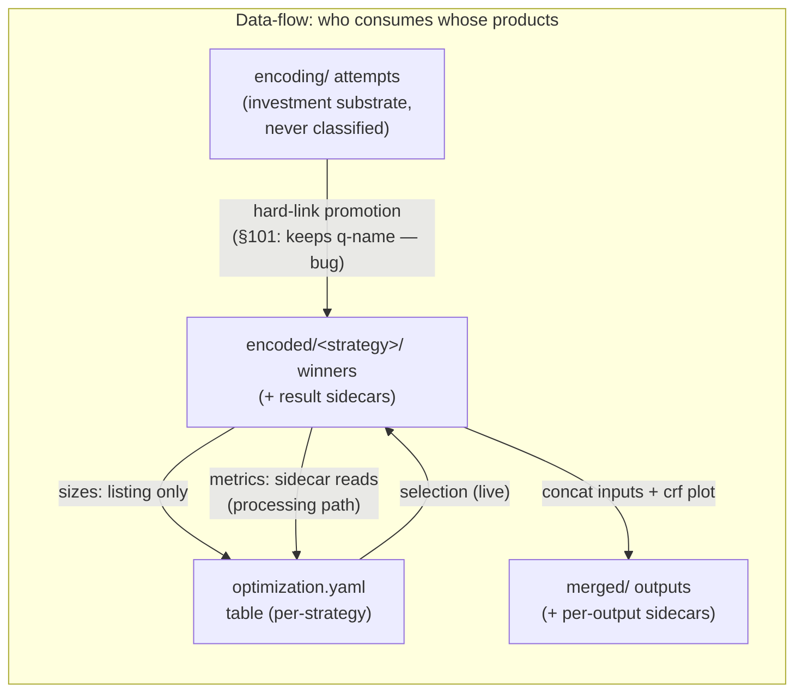

# Recovery rework — per-phase audit (logical view vs code view)

<!-- markdownlint-disable MD024 -->

- Created: 2026-10-06
- Scope: grounding investigation for the recovery-rework spec (TODO §100 + §101 + §11 + fixed↔searched mode-switch + winner provenance).
- Method (per §11): the **logical view** is derived first, from pipeline semantics only — inputs → what each input change MUST do. The **code view** records what IS (file:line references against main @ 461274c). The **cross-check** lists gaps in both directions. No code was changed.

Reading guide for every phase section:

| Logical-view slot | Question it answers |
| --- | --- |
| Inputs → outputs | What the phase consumes (params vs dependency artifacts) and what it owns (internal ledger artifacts, external result contract) |
| Wanted derivation | Where `wanted` comes from (always external input, never the phase) |
| Classification | How a single row's completeness derives from disk — and who owns the rule (mass = phase, single item = payload/entity) |
| Invalidation | Input change → effect, from first principles |
| Dispatch | Fast-exit vs processing semantics |

Effect vocabulary used in invalidation tables (ordered by cost):

| Effect | Meaning |
| --- | --- |
| — (none) | input is not a recovery input at all (live-only) |
| re-derive | instant recomputation from durable facts already on disk (no I/O-heavy work) |
| re-select | live re-derivation of a selection; never persisted, never invalidates |
| re-measure | re-run measurement passes over existing encoded files |
| re-produce | re-run the producing tool (encode / merge / extract) |
| wipe winners | delete `encoded/` (re-derivable from the attempt workspace) |
| wipe investment | delete `encoding/` (the protected attempt workspace) — per the §68/§39 doctrine this is the one that needs an explicit user action (forced wipe / config-change-with-force) |
| fatal | refuse to run (RecoveryError) unless `--force` |

---

## 1. Job

### Logical view

- **Inputs (params):** source path, work_dir, `--force`, cleanup, no-metrics — all user/CLI.
- **Inputs (artifacts):** none (no deps).
- **Outputs:** one virtual `Artifact[File]` (source identity: path + size). No other artifact. `job.yaml` is phase state (the sidecar), not an artifact.
- **Wanted:** always (the row exists iff the phase ran).
- **Classification:** no footprint on disk — completeness == "sidecar present ∧ identity current". The File payload is probed eagerly from the filesystem.
- **Invalidation (logical):**

| Input change | Logical effect |
| --- | --- |
| source path or size changed | identity of EVERYTHING downstream changed → either fatal, or forced wipe of the whole work dir (all phases' artifacts + sidecars) |
| own sidecar (`job.yaml`) missing | rebuild — fresh identity probe + rewrite; nothing else to invalidate (the File is re-derived, no artifacts depend on the sidecar's record) |
| `--force` without mismatch | no invalidation by itself; only upgrades a mismatch from fatal to wipe |
| cleanup / no-metrics | run parameters, no invalidation |

- **Dispatch:** absent/stale sidecar → execute (write sidecar, ~free); current → fast exit (REUSED). Dry-run is read-only-execute (`_DRY_RUN_READONLY`).

### Code view

- `job.py:148-214` `_recover`: `.tmp` pre-clean → load `JobSidecar` → absent ⇒ ABSENT row / present ⇒ identity compare (`_find_source_mismatches`, path resolve + size). Mismatch: `force` → `force_wipe=True` + ABSENT row (rebuild); no force → `RecoveryError`.
- `job.py:216-247` `_execute`: writes `job.yaml` (File dump). `job.py:249-263` `_reused_result`.
- `force_wipe` propagation: stored on `JobPhaseResult` (in-memory only) — every downstream phase checks it in its own `_recover`.
- Naming: none (fixed constant `job.yaml`).

### Cross-check

- **§39 confirmed live:** `force_wipe` lives only on the in-run result; `_execute` immediately writes the NEW `job.yaml`. A crash after the write but before downstream phases run their wipes leaves downstream artifacts of the OLD source in place, and the next run sees a matching `job.yaml` with `force_wipe=False` — stale artifacts read as COMPLETE. (Extraction wipes first in line, so its dir usually goes; probe/chunking/… may not have run.)
- Probe (below) does not handle `force_wipe` at all — see cross-check there.

---

## 2. Extraction

### Logical view

- **Inputs (params):** include/exclude filter (config), `video_required` (derived from the intent's dependency closure), `materialize` (the `extract` intent).
- **Inputs (artifacts):** `File` (Job).
- **Outputs (internal ledger):** one row per enumerated stream (video, audio×N, subs×N, attachments×N) + chapters row. File-backed material components: subtitles, attachments, chapters (`chapters.xml`), timestamps (`timestamps.txt`); mode-dependent: video row = {timestamps} in processing runs, + materialized `.mkv` container in extract runs; audio rows virtual in processing runs, `.mka` container in extract runs.
- **External contract:** `video_stream`, `audio_streams`, `subtitle_streams`, `attachment_streams`, `chapters`, derived `timestamps_path`.
- **Wanted:** filter over display names for subs/attachments (+ audio/video in extract mode); video row = pipeline mode (`video_required`) in processing runs, filter in extract runs. Never state-coupled.
- **Classification (logical):** enumerate the source once (ffprobe) or load the persisted inventory; each row's expected file-name set is a pure function of the payload identity (+ kind extension); ONE listing of `extracted/` decides every row (all / some / none of the expected names present → COMPLETE / PARTIAL / ABSENT).
- **Invalidation (logical):**

| Input change | Logical effect |
| --- | --- |
| own persisted content identity ≠ live content identity | **catastrophic** — single-source workdir: extracted bytes are functions of the source and their names carry no content identity, so nothing can be revalidated; wipe everything the phase owns (needs permission) |
| include/exclude filter | re-derive `wanted` ONLY — selection is orthogonal to completeness, no state change |
| `video_required` / `materialize` (intent switch) | `wanted` + expected-component-set change only |
| `--force` (source mismatch) | wipe `extracted/` + `extraction.yaml` |
| own sidecar (`extraction.yaml`) missing, `extracted/` populated | source currency of the files UNKNOWN (the source-identity key lived on the missing sidecar) → conservative: wipe + re-extract — everything here re-derives from the source itself (automatic; materialized containers cost one remux each). Today: optimistic — re-enumerate and trust name-matching files |

- **Dispatch:** pending = any wanted row not COMPLETE → execute (extract absent components); else fast exit (stream table re-printed from the in-memory ledger built during recovery).

### Code view

- `extraction.py:490-617` `_recover`: force wipe (`:520-524`) → `.tmp` sweep → `_load_or_enumerate` (`:691-726`, sidecar-first with `validate_source`, else ffprobe + dirty flag) → `_normalize_extracted_paths` (`:649-689`, expected locations composed from `safe_name()` + kind extension) → filter → ONE listing `_on_disk_file_names` (`:354-361`) → `_row_state` (`:364-377`) per row.
- Sidecar: read `extraction.py:731`; write only on the processing path when dirty or materializing (`:817-818`, `_persist_sidecar` `:733-751`). Content: per-type info slices + chapters flag + source identity (`ExtractionSidecar`, stream_model).
- Naming: expected extracted names composed at the phase's single site from entity `safe_name()` + entity-owned extension (`SubtitleStream.file_extension`, stream_model `:496-507`); chapters = fixed constant. No filename parsing anywhere (membership against the composed expected set).
- Execute (`:789-882`): batches attachments (one mkvextract call), materializes tracks, per-row extractors; re-derives video-row state from disk truth after producing (`:1005-1008`).

### Cross-check

- This is the canonical listing-recovery shape (`_on_disk_file_names` + `_row_state`) — §100's protocol already exists here in miniature, phase-owned.
- **Gap (consumption, re-scoped 2026-10-06):** membership is tested, not consumed — files in `extracted/` that match no expected name (e.g. a container materialized by an earlier `extract` run, now running processing mode) are never surfaced; the ledger has no surplus rows. Consumption closes THIS. It can never substitute for the source-identity key: a different source with a same-named stream produces a name collision that reads as COMPLETE with wrong bytes (user ruling — single-source workdir; source change is catastrophic, detected via the sidecar's `_SourceSidecarBase` key, not via leftovers).
- **Observation (sidecar honesty):** `extracted_path` on video/audio info slices is a mode-dependent fact persisted by extract runs; a later processing run loads it unchanged (harmless — ignored — but the sidecar's shape depends on which intent last wrote it).
- §9-adjacent: sidecar deleted with `extracted/` intact → re-enumerate + dirty rewrite; classification is name-based, so outputs whose names still match the new inventory survive as COMPLETE. Correct here (names are identity-pure), unlike audio (chain signature is not in the name).

---

## 3. Probe

### Logical view

- **Inputs (params):** manual `--crop` override (CLI→registry), config.
- **Inputs (artifacts):** `VideoStream` (Extraction).
- **Outputs:** one virtual `Artifact[ExtendedVideoStream]` — the slow facet (frame count + crop). `probe.yaml` is phase state.
- **Wanted:** always (video chain only; audio closures never construct Probe).
- **Classification:** presence+currency of `probe.yaml`; no other footprint.
- **Invalidation (logical):**

| Input change | Logical effect |
| --- | --- |
| `--crop` equals the committed crop | no-op (the workdir is already committed to this crop) |
| `--crop` differs from the committed crop | probe re-resolves its own artifact cheaply (crop = override, frame count kept) — no permission at probe; the investment loss is DOWNSTREAM via the probe-facet key (crop rides `ProbeState`) → fatal without permission, wipe with it |
| own persisted content identity ≠ live content identity | the facet describes the OLD source → wipe `probe.yaml` (permission-gated) |

Crop semantics (ruling, 2026-10-06):

- **The override is preserved as the resolved facet value** — once written, the workdir is committed to that crop; later runs without `--crop` keep it (per-run omission must not be a landmine that silently re-detects and cascades an investment wipe).
- **Provenance** (manual vs detected): **APPROVED 2026-10-06 (user)** — a human-facing field on `probe.yaml` (e.g. `crop_source`), with the constraint that downstream facet comparisons compare ACTUAL VALUES ONLY (frame count + crop); nothing behavioral keys on it. Mechanical consequence: today's whole-model equality checks (`persisted.probe != current_probe` at optimization.py:381, encoding.py:2188, merge.py:295-298) would silently pick the field up — they must become explicit facet-key comparisons (the keys-not-effects doctrine; same lesson merge.yaml already learned with its declared keys). The override's only durable home IS `probe.yaml` — a lost sidecar loses the user decision: re-detection runs, and any resulting facet change is caught by downstream keys (fatal, no surprise wipe). Honest and acceptable.
- **Chunking is crop-blind by construction** — the detector always reads the raw source (`chunking.py:92-95`), so chunk identity is not a function of crop and NO crop→chunking invalidation link exists. Nuance worth recording: black bars dilute `ContentDetector`'s average delta (they add zero-delta pixels), so detection *on cropped frames* could differ marginally near the threshold — but since the detection input never changes with crop, boundaries are stable across crop changes; "should detection see cropped frames" is a quality idea, out of recovery scope (parked with §47's domain).
| extraction re-enumerates a different video stream | facet belongs to a stream identity → logically should re-probe |
| own sidecar (`probe.yaml`) missing | re-probe (the sidecar IS the phase artifact; no separate artifacts whose currency could be unknown) |

- **Dispatch:** absent/invalidated → execute (crop detect / frame count, both slow); else fast exit (values from sidecar).

### Code view

- `probe.py:154-215` `_recover`: no-video-stream → `RecoveryError` (fatal for the whole video chain); `.tmp` pre-clean; `ProbeState.load` — absent OR crop-override-present ⇒ ABSENT row; else COMPLETE with the resolved facet.
- `probe.py:217-290` `_execute`: crop = manual → cached → detect (timed); frame count = cached → timestamps.txt count → null-count pass; saves `probe.yaml`; logs the disk-space estimate (plan-aware, log-only — §33).
- Sidecar: `ProbeState` (state.py `:74-136`) — `frame_count` + `crop` only, `0`/empty sentinels.
- **No `force_wipe` handling anywhere in the file** (verified by grep).

### Cross-check

- **Bug (force-wipe path):** on a source mismatch with `--force`, Extraction wipes and re-enumerates, but `probe.yaml` survives — its frame count and crop belong to the OLD source and are loaded as current. Downstream `ProbeState` snapshot comparisons cannot catch it (they compare against the same stale facet). Fix direction (2026-10-06 ruling): probe gains the source-identity key on its sidecar and detects the change itself — no wipe-command consumption, no propagation dependence (see invalidation-matrix.md §4).
- The facet carries no source-identity anchor of its own; correctness currently rests on "Extraction re-enumerated ⇒ Job sidecar caught the change". True today only because Job compares identity first — the force-wipe hole above is the exception.

---

## 4. Chunking

### Logical view

- **Inputs (params):** `scene_threshold`, `min_scene_length` (config).
- **Inputs (artifacts):** `ExtendedVideoStream` (Probe).
- **Outputs:** N virtual `Artifact[VideoStreamChunk]` windows (set-flip: the set is unknowable before detection; all rows flip together once boundaries exist). `chunking.yaml` (scene boundaries) is phase state.
- **Wanted:** all chunks (scene detection output).
- **Classification:** boundaries present ⇒ derive windows at load time (boundary list + CURRENT stream duration/frames); absent ⇒ pending with an empty ledger.
- **Invalidation (logical):**

| Input change | Logical effect |
| --- | --- |
| `scene_threshold` / `min_scene_length` change | boundaries were detected under other params → re-detect. User-initiated config edit ⇒ automatic (the targets/sampling-change precedent). Chunking owns no artifacts — the sidecar is overwritten in place (nothing to delete, no surplus possible HERE); downstream, old-chunk-id winners/attempts stay on disk and surface as surplus at encoding (consumption protocol), deleted only via cleanup |
| own persisted content identity ≠ live content identity | catastrophic (fatal without permission; wipe sidecar + re-detect with it) — boundaries belong to the OLD source's timeline |
| stream facets (duration/frames) change | **derivation input, not a key** — windows re-derive live against the current stream; same content ⇒ same facets (the identity key subsumes any stream comparison; no belt-checks per minimal-keys; identity-unknown degrades per the unknown rule). Detector-frame bookkeeping may telescope differently — informational counts only |
| own sidecar (`chunking.yaml`) missing | re-detect (the sidecar IS the phase artifact; detection is deterministic for the same params, so downstream chunk identity is stable) |

Chunking rulings (2026-10-07):

- **Keys = content identity + detection params. Nothing else.** A stream check adds no discriminating power at chunking: duration and frame count are functions of the same bytes the identity key already covers.
- **Not-a-key ≠ droppable (user, 2026-10-07).** The source frame count is the expensive half of the slow facet (full replay, or the timestamps pass) — its persistence on `probe.yaml` keeps the fast exit replay-free, and two consumers depend on it: the downstream facet key (frame count + crop) and the frame-preservation invariant. Chunk counts re-derive for FREE only because both inputs are persisted facts — boundary frames on `chunking.yaml`, source total on `probe.yaml`. The full persistence chain: source count (`probe.yaml`) → chunk counts (telescoped) → winner counts (result sidecars + the `encoding.yaml` aggregate) → merged count (per-output sidecar, verified against the source) — every link persisted; nothing replays on a fast exit.
- **`--force` alone does nothing here.** The old "wipe `chunking.yaml` on force_wipe" is a command-wipe leftover; under the permission ruling the sidecar wipe happens only as the *effect* of the content-identity condition (permission-gated), and the detection-params condition is automatic (user-initiated, non-destructive — cf. targets change).
- **Sidecar-IS-the-artifact phase (user, 2026-10-07).** Like Job and Probe, chunking owns no artifact directory — the consumption protocol has no listing to consume here, and surplus is structurally impossible. A boundary change's leftovers live downstream: old-chunk-id winners and attempts at encoding, surfaced by consumption there. The overwritten boundary set itself is not retained anywhere (re-derivable by re-running detection with the old params; minimality — no multi-boundary-set storage).

- **Dispatch:** absent boundaries → execute (slow scene detection, write sidecar); else fast exit (windows derived in `_reused_result` too).

### Code view

- `chunking.py:231-273` `_recover`: force wipe of the yaml only (`:253-255`); load boundaries; present ⇒ `build_chunks` (module fn `:120-165`) against the CURRENT probe stream → COMPLETE rows; absent ⇒ `Recovery(pending=True)`.
- Sidecar: `ChunkingSidecar` = scene records only (stream_model `:979-989`). **No detection parameters persisted.**
- Naming: `VideoStreamChunk.format_chunk_id` / `parse_chunk_id` — entity-owned strict inverse pair (stream_model `:617-707`).

### Cross-check

- **Gap (invalidation):** threshold/min-scene-length changes do NOT invalidate `chunking.yaml` — nothing records them (§47's domain). A config tweak silently reuses old boundaries. Logically these two values are the phase's ONLY params and belong on the sidecar as invalidation keys.
- Windows derive live from the sidecar + current stream — stream changes handled by construction. ✓
- Downstream identity: chunks are the identity basis of every encoding attempt; a re-chunk must surface as stale-by-consumption at encoding (leftover winner names not consumed by the new chunk set) — today it does NOT (winner files on disk still pair by chunk_id against the NEW set; old-id files are invisible — see encoding cross-check).

---

## 5. Optimization

Two sub-modes on top of the plan mode: **all-strategies** (skip path, no ledger work) and **optimize** (test encodes on a chunk subset). The plan mode (fixed vs searched) cuts across both.

### Logical view

- **Inputs (params):** plan (strategies + targets + `fixed_quality`), `optimize` flag, `optimize_tolerance`, measurement `sampling`, cleanup level (fixed-mode guard).
- **Inputs (artifacts):** chunks (Chunking), probe facet (Probe), work context (Job).
- **Outputs (internal ledger):** per (test chunk × strategy) winner rows = `Artifact[EncodedChunk]` in `encoded/<strategy>/` (SHARED namespace with Encoding — optimization writes test-pair winners exactly like encoding writes full-set winners), plus orphaned-strategy rows.
- **External contract:** `selected_strategies` (settings), `anchor` + `synthetic_targets` (fixed-mode ruler, derived live), `winners` (sanctioned unconsumed exception, structural parity with Encoding).
- **Wanted:** every (test chunk × plan strategy) pair.
- **Classification (logical):** same per-pair rule as encoding — winner file + result sidecar present ⇒ COMPLETE (see §6; inherits all of its naming questions).
- **Invalidation (logical):**

| Input change | Logical effect |
| --- | --- |
| tolerance change | re-select only (§99 ruling: results on sidecar, instant re-evaluation) |
| probe facet (crop/frames) change | every attempt's pixels changed → **catastrophic, owned HERE for the whole shared namespace**: fatal without permission; with it wipe attempts + winners + both yamls' keys, re-test. Encoding adds nothing (its `_invalidate` is empty); the all-strategies skip path carries the facet key too |
| **search:** targets change | winner verdicts/selection basis changed → wipe winners (`encoded/`), re-derive from attempts (near-free replay via cache hits, re-encode only where the search demands) |
| **search:** sampling change | measurements stale, files fine → re-measure (current implementation: wipe winners + replay with re-measure) |
| **fixed:** pinned q change | every chunk needs the NEW q → wipe winners; attempts at the new q don't exist → re-encode |
| **fixed:** same q re-run | nothing changed → no invalidation; the pending gate decides (fast exit only if every wanted pair is COMPLETE, else resume processing) |
| mode switch search→fixed | winners are search products (per-chunk q ≠ pinned q in general) → wipe winners |
| mode switch fixed→search | winners are fixed-q products, not search results for the targets → wipe winners |
| own persisted content identity ≠ live content identity | catastrophic (fatal without permission; wipe attempts + winners with it) |
| strategies added/removed | new pairs absent (pending); removed → orphan rows |
| strategy args change (codec config) | **catastrophic, per-strategy**: attempts are stale products → fatal without permission; with permission wipe that strategy's winners AND attempts (§68; key = per-strategy resolved-args fingerprint from the frozen plan — the display name alone does not cover codec edits) |
| test-chunk set vs chunking output | reuse the persisted selection IFF the FULL set survives in the current chunking output (set-presence check); partial survival → fresh full pick (logged) — never silently shrink the test basis |
| `--force` alone | nothing — permission only gates fired conditions (the old command-wipe of `encoding/` + yaml is the effect of the identity/strategy-args conditions) |
| own sidecar missing, winners present | currency unknown (no record of mode/targets/q/sampling that produced them) → conservative: wipe winners + near-free replay from the attempt substrate (§99 ruling; automatic — winners re-derive, no permission) |

- **Dispatch:** optimize mode: pending pairs → execute (test encodes → derive table → select → single post-success sidecar save); no pending + table covers plan → fast exit with LIVE selection. All-strategies: skip path, bookkeeping only.

### Code view

- `_skip_check` (`optimization.py:194-228`) runs BEFORE recovery: fixed-mode entry (`:230-271`: cleanup guard, **unconditional `_wipe_encoded_dir` every fixed run**, banner) then all-strategies branch.
- `_recover` (`:330-495`): force wipe (attempts + yaml, `:375-378`); probe mismatch → `RecoveryError` (`:381-386`); targets/sampling change → `_wipe_encoded_dir` + table cleared (`:388-417`); **missing sidecar with winners present → conservative wipe** (`:419-431`, §99); pair ledger via encoding's `_pair_rows` + `_orphan_strategy_rows` (`:516-522`); to-test projection presence-based (`:441-447`); fast-exit stash: persisted rows + live tolerance/dominance/anchor re-derivation (`:449-478`); derive-only run when table doesn't cover plan → explicit pending (`:487-494`).
- `_execute` (`:524-729`): shared `ChunkEncoder` + `_encode_chunks_parallel` (metric prefix `optimization`; fixed passes `quality_targets=[]` — no ruler exists yet); searched table = sizes from the LIVE ledger; fixed table = sizes + min-aggregated metrics from winner sidecars (`_aggregate_strategy_metrics` `:1017-1066` — per-winner sidecar reads, processing path only); single sidecar save post-success (`:672-678`, `:712-718`).
- `_all_strategies` (`:795-855`): params-stale check (targets/sampling) → wipe `encoded/`; **always rewrites** `optimization.yaml` (empty table, current targets/sampling).
- Selection machinery: `_apply_tolerance` (`:877-900`), `_dominance_survivors`/`_dominates` (`:902-949`), `_select_anchor` (`:951-984`), `_synthetic_targets_from` (`:986-1015`).
- Sidecar `OptimizationParams` (state.py `:156-203`): `probe`, `test_chunks`, `strategy_results[]` (strategy, total_size, metrics-dict), `quality_targets` (both modes), `sampling`. Anchor/synthetic targets NOT persisted (§99: live).

### Cross-check

| # | Finding |
| --- | --- |
| O-1 | **Mode is not an invalidation key — fixed→search leaks winners.** `quality_targets` is written in both modes, so a fixed run followed by a search run with unchanged config targets passes the targets-unchanged check; the fixed-q winners in `encoded/` classify COMPLETE and the search NEVER runs for them. Search→fixed is covered only by the unconditional fixed-entry wipe. A mode field (or per-mode sidecar type, §105/§90) is the missing key. |
| O-2 | **Fixed same-q re-run wipes and replays every pair.** `_fixed_mode_entry` wipes unconditionally ("no q-value is persisted for comparison", `:265-268`). Replay via attempt cache-hits is near-free but still re-runs the whole search machinery per chunk. Persisting the pinned q (per strategy) as the fixed-mode key would make same-q reruns a true fast exit. |
| O-3 | Probe-mismatch fatal fires only when `strategy_results` non-empty (`:381`) — all-strategies bookkeeping writes `probe=None`, so the guard is correctly inert there. ✓ |
| O-4 | Sampling change wipes winners, relying on attempts for replay — coherent with cleanup guard for fixed runs only; a SEARCHED run with `--cleanup` (attempts deleted) + sampling change degrades to full re-encode. Logical effect is "re-measure"; the wipe is an implementation shortcut. Acceptable; note in spec. |
| O-5 | §68 wiring open: strategy-args changes (codec config) are invisible — `EncodingPlan` is comparable but nothing persists/compares a strategy snapshot here. |
| O-6 | Winner provenance: `strategy_results.metrics` is the fixed-mode ruler substrate; §90 wants it narrowed to the comparison set with retention on winner/attempt sidecars (re-derivation then re-reads sidecars — the reuse path gets costlier; decide explicitly). |

---

## 6. Encoding

### Logical view

- **Inputs (params):** plan targets / synthetic ruler (presentation basis — fixed compared runs judge against the anchor ruler, searched runs against config targets), measurement `sampling`, concurrency, visual hash, cleanup, force.
- **Inputs (artifacts):** chunks (Chunking), `selected_strategies` (Optimization), probe facet (Probe — crop).
- **Outputs (internal ledger):** per (chunk × selected strategy) winner rows `Artifact[EncodedChunk]` in `encoded/<strategy>/`, + orphaned-strategy rows. The attempt workspace `encoding/<strategy>/` is NOT ledger artifacts — it is the protected investment substrate (resumption medium), never classified, never surfaced.
- **External contract:** `winners` (consumed by Merge), `quality_labels` (settings).
- **Wanted:** every (chunk × selected strategy) pair.
- **Classification (logical):** a pair is COMPLETE iff its winner exists with both material components (winner file + result sidecar); the winner maps 1:1 to a chunk and must be **statically named from chunk identity** (§101 doctrine) so the wanted set directly consumes its names out of a single listing per strategy dir. Attempts never participate in classification (their resumption value is consumed at pick-up time via cache-hit).
- **Invalidation (logical):**

| Input change | Logical effect |
| --- | --- |
| targets change (search) | owned UPSTREAM by Optimization (wipe winners there); encoding just sees ABSENT/PARTIAL pairs |
| sampling change | re-measure attempts (attempt-sidecar `sampling` staleness, `encode_chunk` re-measures without re-encoding) |
| sampling change | owned UPSTREAM at Optimization (one mechanic: the sampling key lives on optimization's sidecar — both variants — effect = wipe winners; attempts re-measure at pick-up via the attempt-sidecar `sampling` staleness). Encoding inherits automatically |
| probe facet (crop/frames) change | owned UPSTREAM at Optimization (see below — the full catastrophic branch incl. attempts lives there); encoding has NO facet key and NO fatal of its own |
| chunk set change (re-chunk) | attempts KEPT (investment substrate — deletion only via cleanup/permission); stale winners (old chunk ids) = consumption leftovers → **auto-deleted** per the winner-layer policy — `encoded/` stays a clean, merge-ready, human-inspectable dir. Owned by encoding's CLASSIFICATION (consumption over the full chunk set × selection), not by key-invalidation |
| selected strategies change | added → new pairs pending; removed / unselected → their winner dirs are leftovers → auto-deleted (attempts survive as substrate — re-derivation near-free via cache hits; merged outputs retain the history) |
| `--force` alone | nothing — permission only gates fired conditions (upstream at optimization for the shared namespace) |
| own sidecar (`encoding.yaml`) missing, winners present | winner currency is certified CROSS-PHASE by `optimization.yaml`'s keys (mode/targets/sampling/probe all live there — `encoding.yaml` carries no unique key); the loss is replay aggregates only → reconstruct from winner records on the exceptional path, or degrade display until the next processing pass; **no invalidation** |

Encoding rulings (2026-10-07 — shared-namespace ownership + layered retention):

- **Optimization owns ALL key-based invalidation over the shared namespace** (`encoding/` attempts + `encoded/` winners, both yamls' keys): probe facet, mode switch, targets, pinned q, sampling, strategy args, content identity. The two phases are one pipeline in two steps — optimization (test + invalidate) then encoding (full-set execution) — and split-invalidation of the same artifacts between them is retired. Consequence: **encoding's `_invalidate` is EMPTY** (the clean case study for the decision-12 split); its recovery is classification-only. Detail that must follow: the all-strategies skip path writes the facet/probe key too (today it writes `probe=None` — the key must never be dropped just because the mode skipped testing).
- **Layered retention policy** (per layer, not per phase): **investment layer** (`encoding/` attempts) — never auto-deleted (permission/cleanup only); **winner layer** (`encoded/`) — auto-curated: consumption leftovers are deleted automatically (re-derivable from the substrate); **deliverable layer** (`merged/` outputs, materialized `extracted/` files) — retained in place; deletion only via explicit cleanup. This refines the earlier "orphans kept in place" reading: it survives only on the deliverable layer.
- **Re-chunk curation is classification, not invalidation** — no key, no duplication with optimization's invalidation (decision-12 concern answered): the wanted-name set IS the current chunk set × selection; leftovers fall out of consumption and the winner-layer policy deletes them. Optimization's test-chunk set-presence check (O-6) is its own selection-basis concern, unaffected.
| own sidecar (`encoding.yaml`) missing, winners present | winner currency is certified CROSS-PHASE by `optimization.yaml`'s keys (mode/targets/sampling/probe all live there — `encoding.yaml` carries no unique key); the loss is replay aggregates only → reconstruct from winner records on the exceptional path, or degrade display until the next processing pass; **no invalidation** |

- **Dispatch:** pending pairs → execute (parallel search per pair; two `encoding.yaml` writes: crash-safe early probe-only write, post-success aggregates); none → fast exit (replay persisted limiter table + frame totals; re-assert preservation).

### Code view

- `_recover` (`encoding.py:2138-2213`): force wipe both dirs + yaml; probe mismatch fatal (`:2178-2189`); `.tmp` sweep **only in `encoding/`** (`:2192`); `_pair_rows` + `_orphan_strategy_rows`.
- `_recover_encoding_attempts` (`:395-483`): per strategy ONE listing of `encoded/<strategy>/`; builds mkv index via `ENCODED_ATTEMPT_NAME_PATTERN` regex (`:445`) and result-sidecar index via a hand-rolled stem parse (`:448-455`: `rsplit(".", 1)` + "contains x and all digits" heuristic); pair COMPLETE iff both (`:457-459`). Binary states only (ABSENT/COMPLETE) — no PARTIAL.
- Winner payload composition at recovery: `EncodedChunk.parse_file_name` on the winner mkv name — **crf and resolution recovered from the FILENAME** (`:326-337`, `:1550-1560`).
- Cache-hit path (`encode_chunk` `:977-1064`): per proposed q, glob `{chunk}.*.q*.mkv` + regex + quantized-crf match (`_check_existing_encoding` `:683-740`); sidecar read for metrics validity + `sampling` staleness (`:982-1064`); re-measure branch without re-encode.
- Promotion `_finalize_winning_attempt` (`:742-834`): hard-links winner mkv+png KEEPING the attempt's q-bearing name (`:778` — the §101 bug), writes static-named result sidecar (`:242`), INTERMEDIATE cleanup deletes attempt files (`:799-834`).
- `_scan_winner_sidecars` (`:1721-1828`): per winner, re-parses the mkv name with the regex to DERIVE the sidecar path (`:1758-1769`), reads it (processing path); feeds limiter tallies + frame accounting.
- Sidecar `EncodingParams` (state.py `:230-267`): `probe`, presentation aggregates (`limiter_summary`, `winners_frame_totals`). No targets (owned by Optimization). Writes: early probe-only (`:2353-2358`) + post-success aggregates (`:2463-2472`). Fast exit `_reused_result` (`:2215-2238`) replays the table and re-asserts frame preservation from the persisted totals.
- Result-sidecar model `EncodingResultSidecar` (state.py `:304-328`): `winning_attempt` (name), `crf`, `metrics` (docstring says "only the targeted metric values" — code actually persists ALL measured; docstring stale), `frame_count`, `targets_met`.
- Preservation invariant: per-strategy Σ winner frames == probe count (`:2416-2455`), plus `_assert_one_winner_per_chunk` (`:1650-1696`).

### Cross-check

| # | Finding |
| --- | --- |
| E-1 | **§101 confirmed at `:778`**: promotion keeps `winning_attempt.name` (q-bearing). Consumers parsing winner names through the attempt pattern: pair ledger `:326`, parallel pre-population `:1550`, winner scan `:1758`, optimization `:1054`; the recovery mkv-index regex `:445`; cache-hit glob `:710`; cleanup glob `:804`. With static winner names every one becomes a static-name lookup. |
| E-2 | **Result-sidecar name is parsed, not owned**: the `:448-455` heuristic (rsplit + x-digit test) re-derives what the writer composed (`:242`). Under static winner names the sidecar is the winner stem + `.yaml` and the parse dissolves; the name family should be entity-owned (compose + optional parse) per the two-name doctrine. |
| E-3 | **crf-from-filename is load-bearing at recovery** (`parse_file_name` on COMPLETE pairs). Under §101 the crf must come from the result sidecar (as §101 already notes for the limiter) or a phase-sidecar replay aggregate — recovery must not gain N sidecar reads (see sidecar-models.md, "winner provenance"). |
| E-4 | **Re-chunk does not surface stale winners**: old-chunk-id winner files in `encoded/` match no pair in the new set and no orphan check (orphans are per STRATEGY dir, `:346-370`). Under consumption-per-name, leftovers would surface as surplus rows. |
| E-5 | `encoded/` `.tmp` sweep missing (sidecar writes are tmp-then-rename into `encoded/`; only `encoding/` is swept). Minor. |
| E-6 | `state.py:326` docstring ("only the targeted metric values") vs code (all measured metrics persisted) — stale docstring; the code is the intended facts-retention behavior. |
| E-7 | PARTIAL never used for pairs (binary classification). Attempts-without-winner is ABSENT by design (substrate, not artifact) — consistent, but the `ArtifactState.PARTIAL` docstring still promises otherwise. |

---

## 7. Audio

### Logical view

- **Inputs (params):** chains (config), `select` tree (config), audio parallelism.
- **Inputs (artifacts):** audio stream rows (Extraction).
- **Outputs (internal ledger):** per (selected track × chain) `Artifact[AudioOutput]` + present-but-unwanted surplus rows.
- **External contract:** `outputs`.
- **Wanted:** selection tree over extracted tracks, recomputed live every run (never persisted — free derivation).
- **Classification (logical):** one row per expected output; completeness = output file presence; expected name = pure function of (stream identity, chain name, encode extension). Leftovers carrying the chain token but matching no expected name = surplus.
- **Invalidation (logical):**

| Input change | Logical effect |
| --- | --- |
| chain definition change (any filter param) | that chain's outputs are stale products → delete + reproduce |
| chain removed from config | outputs unwanted → cleanup delete |
| chain added | new expected rows (pending) |
| `select` change | wanted re-derivation only |
| sidecar missing while outputs exist | outputs' producing config UNKNOWN → conservative: re-produce (same doctrine as §99) |
| `--force` | wipe chain outputs + sidecar |
| own sidecar (`audio.yaml`) missing, outputs present | producing signatures unknown (chain defs at produce-time are unrecorded) → conservative: reproduce (delete outputs + re-run chains; automatic — chains are cheap). Today: optimistic — stale outputs accepted (§9/A-1) |

- **Dispatch:** pending rows → execute (async chain executor per job, progress bar); none → fast exit.

### Code view

- `_recover` (`audio.py:122-173`): resolve selection + chains; force wipe (`:191-215`, chain-token files only); `.tmp` sweep; `_invalidate_and_commit` (`:226-272`: per-name signature compare → delete differing/removed chain outputs by exact parsed chain name; **sidecar rewritten BEFORE production** when it differs); `_classify` (`:298-353`).
- §103 confirmed: `_classify` stats each expected output with `.exists()` (`:334`) N×M times, then lists the dir anyway for surplus (`:339-351`).
- Naming: composer `chain_output_path` (audio/chain.py `:232-259`, `<stream safe_name> chain=<name>.<ext>`); parser `_parse_chain_name` (audio.py `:480-500`) — module-level inverse pair split across two homes (chain module composes, phase module parses).
- Sidecar `AudioSidecar` (state.py `:354-426`): chain name → signature string only.
- Execute (`:359-429`): per-job executor, failure isolation per row.

### Cross-check

| # | Finding |
| --- | --- |
| A-1 | §9 confirmed: sidecar absent → `prior_sigs = {}` → nothing invalidated; stale outputs (old chain def) classify COMPLETE. Consumption doesn't help here (names match — the DEFINITION changed, not the identity); the §99 conservative rule (unknown currency ⇒ treat as stale) is the missing piece. |
| A-2 | §103 confirmed (per-row stats before the single listing). The hoist is mechanical; the listing then feeds both classification and surplus. |
| A-3 | Naming split: parse lives in the phase, compose in the chain module — under the end-state doctrine both belong to one owner (the `AudioOutput` entity or the chain module's name family). |

---

## 8. Merge

### Logical view

- **Inputs (params):** plan targets (search) / anchor identity (fixed ruler basis), measurement `sampling`, probe facet (crop/fps/frame count), q-suffix naming inputs (pinned value when uniform).
- **Inputs (artifacts):** winners (Encoding), timestamps (Extraction), probe stream (Probe), source stem (Job).
- **Outputs (internal ledger):** per expected strategy `Artifact[MergedVideo]` + surplus outputs. Row components: output `.mkv` + per-output sidecar `.yaml` (presence ⇒ COMPLETE; output alone ⇒ PARTIAL).
- **External contract:** `merged` (deliverables; runner takes `output_paths`).
- **Wanted:** one output per strategy present in the winners set.
- **Classification (logical):** expected output names derived from (source stem, strategy, mode/q identity); single listing of `merged/` decides COMPLETE/PARTIAL/ABSENT by presence of the two components; non-matching `.mkv` files are surplus. **Classification must be presence-only — sidecar CONTENT reads belong to consumers on the processing path.**
- **Invalidation (logical):**

| Input change | Logical effect |
| --- | --- |
| targets change (search) / anchor change (fixed) | acceptance-flag mismatch ⇒ **re-merge** — a targets/anchor change always re-searched winners upstream, so the old concat is never current (M-8 final form; live verdicts + full-metrics retention stand on their own merits) |
| sampling change | re-measure per file (the measurement basis itself changed — the only true measurement key) |
| probe facet change | **per-file**: every output's provenance (which carries the facet) mismatches → re-merge in place; NO phase-level wipe — deliverables are retained until each is replaced (crash-safe: old outputs stay present); the only `merged/` wipe is the permission-gated identity wipe (M-9 vs today's rmtree) |
| **winner set change under unchanged params** (tolerance re-selection, re-encode of chunks, re-chunk) | per-output winner-set fingerprint mismatch → not accepted → re-merge (§86; the count+hash over sorted ids, compared in memory against the live winners) |
| pinned q change (uniform or per-strategy) | different output name (naming identity) — old output retained (deliverable), new one produced |
| strategies change | expected set changes; removed → retained stale deliverables |
| `--force` alone | nothing — permission only gates the identity wipe (the one `merged/` deletion) |
| own sidecar (`merge.yaml`) missing, outputs present | keys + winner digests lost from the O(1) record → **reconstruct** from the per-output durable records (each output sidecar carries its own identity — the §86 digest home); summary replay absent until the next processing pass; NEVER conservative re-measure (expensive — the user's §86 ruling rejects blind re-measurement here). Today: optimistic — key checks silently skipped, stale reuse possible |

- **Dispatch:** pending → execute (concat per ABSENT output: mkvmerge → propedit → promote; PARTIAL skips concat, re-measures only); none → fast exit (replay persisted summary).

Merge rulings (2026-10-07):

- **Verdicts are LIVE at merge** (user ruling — the targets/anchor change is a recovery/derivation question, not an invalidation of measurements). The per-output sidecar becomes **facts + identity only**: `frame_count`, **the FULL measured metric set in both modes**, the measurement basis (`sampling`), the **winner-set digest**, and the fixed-run quality facts — **no persisted verdict at all** (the concluding-layer exception is unnecessary here: the only verdict consumer — the summary — rebuilds on the processing path and computes live). Consequence: targets/anchor changes invalidate NOTHING measured — they trigger a derive-only summary rebuild (explicit pending, the §99/optimization pattern). Today's delete-sidecars → re-measure becomes **M-8** (forced today by target-filtered metrics retention, which the full-set retention removes).
- **Re-production keys split cleanly**: the FILE re-produces when its per-output provenance mismatches the live winners (§86/M-2) or on probe change; the MEASUREMENT re-produces on sampling change; the VERDICT never re-produces (live).
- **Non-uniform fixed is still a fixed run** — mode comes from `EncodingPlan.fixed_quality` (all strategies collapsed), never from value uniformity. The output suffix is simply **per-strategy** (`_q_suffix` already is; the `_uniform_pinned_quality` gate is unnecessary): `<stem> <strategy> <LABEL>=<q>.mkv` — each output belongs to one strategy, so its own pinned value names it.
- **Per-file provenance — the typed merged-output sidecar IS the acceptance flag (user ruling, settled 2026-10-07).** Each output sidecar persists **what exactly it was produced from**: strategy, the strategy's resolved-args fingerprint, mode (+ pinned q in fixed runs), targets (search) / anchor basis (fixed), probe facet, sampling, the **winner-set identity as a count + hash over the sorted winner ids** (compressed, not the list — re-chunk changes the id set and only this dimension catches it, since merge's output name is id-agnostic), plus the facts (frame count, full metrics). Recovery compares recorded params against current inputs per file (single-digit outputs ⇒ direct reads sanctioned), computing the live id-set hash from the encoding result in memory. **Mismatch ⇒ re-merge** — including verdict keys: a targets/anchor change ALWAYS re-searches winners upstream, so the file is never current when its verdict key fires (this AMENDS the earlier "re-derive verdicts without re-merge" reading of M-8; live verdicts and full-metrics retention survive on their own merits). Transitivity makes the flag complete: every intentional winner mutation routes through a recorded param (targets, mode, q, sampling, probe, args fingerprint) or the winner-set hash (re-chunk). A missing/unparseable hash = unverifiable basis ⇒ re-merge (conservative). Residual, accepted: a re-encode triggered by artifact LOSS (rot/manual deletion) can drift crfs with all params matching — catching it would need content identity; not worth it.
- **Name-based identity at merge is conflict-only** (user): the fixed-run q suffix stays (end-user value + mode/value distinction); SEARCH outputs get NO filename distinguisher (no human-acceptable key exists), keep a single variant per strategy — replaced on re-merge; stale merged outputs are deliverables, retained (rename-for-taste is the user's move). A name collision only signals a conflict needing revalidation, never silent acceptance.
- **crf is not carried at recovery** (user, same session): the CRF graph triggers only on re-merge and reads winner sidecars there (sanctioned rare-path work); the limiter scan takes crf from the sidecars it already opens; `EncodedChunk.crf` is honestly optional on recovery-composed payloads.
- **Per-file reads at recovery are sanctioned for `merged/`** (low-N terminal dir — a few outputs, not thousands of chunks): recovery reads the few per-output sidecars as the acceptance check. The no-reads-at-recovery rule is an I/O-complexity rule scoped to HIGH-N dirs (`encoding/`, `encoded/`); it never applied meaningfully to `merged/`.
- **`merge.yaml` demotes to a summary-replay aggregate** (same shape as `encoding.yaml`): summary rows + their basis marker; the per-output sidecars are the acceptance records (M-7 structural).
- **Typing**: `MergeParams` = per-mode discriminated union (Req 12–14); the per-output sidecar = the typed provenance+facts model above (M-4). Identity layering: file NAMES carry coarse identity (mode + q suffix in fixed runs); the per-output PROVENANCE carries fine identity (winner crfs). No digests anywhere at merge — no hash in filenames, none in sidecars.

### Code view

- `_recover` (`merge.py:238-415`): force wipe; invalidation-key compare against `MergeParams` (`:279-321`: fixed → anchor, search → targets, plus sampling → delete per-output sidecars; probe → rmtree merged/); `.tmp` sweep; expected strategies from the typed winners field (`:329-335`); per-output classification **reads each expected output's sidecar CONTENT** to load frame_count/metrics/targets_met/plot into the payload (`:348-372`); surplus scan globs `*.mkv` + reads their sidecars for state (`:399-413`).
- Naming: `_expected_output_path` (`:841-856`, phase static — `<stem> <strategy safe>[ <label>=<q>].mkv`), `_q_suffix` (`:880-895`), `_uniform_pinned_quality` (`:858-878` — suffix only for UNIFORM pinned runs). `MergedVideo.display_name/safe_name` own the base pair only.
- Sidecars: `MergeParams` (state.py `:450-503`, mode-honest optionals + `strategy_summaries`); per-output sidecar is an **untyped dict** written by `_write_merge_sidecar` (`:967-1018`, mode-honest: fixed → quality block + anchor + FULL metrics; search → targets block + target-filtered metrics + `targets_met`) and read by `_load_merge_sidecar` (`:915-926`).
- Fast exit `_reused_result` (`:431-447`): loads `merge.yaml` AGAIN (`:436`) and replays `_log_merge_summary_from_params`.
- Execute (`:476-706`): PARTIAL skips concat (rename-first contract); frame-count verify; measurement gated on `plan.targets` (`:579`); CRF plot from typed winners; per-output sidecar write; summary from `final_rows` payloads (facts that recovery loaded); `MergeParams` saved post-success when any output complete (`:681-693`).
- `_post_dependency_check` (`:215-236`): refuses merge while encoding holds incomplete rows.

### Cross-check

| # | Finding |
| --- | --- |
| M-1 | **Recovery reads N per-output sidecar contents** (classification itself is presence-only, but payload facts are loaded at recovery on BOTH paths). On a full fast exit nothing consumes them — pure waste; this is the "recovery shouldn't touch artifact sidecars" hotspot the user called out. Facts belong to consumers (summary build on the processing path; the fast exit replays the phase-sidecar summary). |
| M-2 | **§86 confirmed for searched runs**: winner-set change under unchanged (targets, sampling, probe) reuses the stale merge as COMPLETE. Fixed uniform runs are covered by q-suffixed naming; non-uniform fixed runs are not. Needed: the output's input-identity (winners digest) as an invalidation key — by name, by persisted digest per output, or structurally via consumption of winner names. |
| M-3 | Merge output naming is phase-owned statics (+ entity base pair); the q-suffix decision (uniform-only) is a phase policy. Under the doctrine the family should have ONE owner (`MergedVideo`), with the pinned value derivable from the strategy's collapsed range — which would also let NON-uniform fixed runs carry per-strategy q suffixes (`_q_suffix` is already per-strategy; only the uniform gate prevents it). |
| M-4 | Per-output sidecar is untyped (dict) with mode-conditional keys — §90's typed-model candidate; `plot` path is derivable from the stem and `anchor` is a fleeting election artifact (§90 says drop both). |
| M-5 | `_reused_result` re-loads `merge.yaml` (already loaded during recovery's key check only when `merged_dir` exists — separate load sites). Minor consolidation point. |
| M-6 | Fixed runs without config targets skip merged measurement entirely (`:579` gates on `plan.targets`), while the fixed banner promises "merged-output measurement remains the final check". Either measure against the synthetic ruler in fixed runs or soften the banner claim. |

---

## 9. Measure (standalone, brief)

Not a `Phase` object — a standalone command/API outside the registry. Reads OTHER phases' sidecars directly: `job.yaml` via `JobSidecar` (measure.py `:298`) for the source path and `probe.yaml` via `ProbeState` (`:262`) for crop — a §62 (sidecars owned by their phase) violation by design; standalone is the sanctioned exception today, worth an explicit statement in the spec rather than silent drift. Own sidecar: `MeasureSidecar` per target (state.py `:331-351`), presence-based reuse. Out of scope for the recovery-rework mechanics except as a consumer of the sidecar-ownership rule.

---

## Cross-phase summary (feeds invalidation-matrix.md and sidecar-models.md)

- Recovery classification today is **listing-only** at extraction (canonical), audio (after the §103 hoist), encoding (regex-shaped), merge (presence + content reads) — the spec's job is to make all four consumption-shaped with entity-owned names.
- Sidecar-content reads on RECOVERY paths exist only at merge (M-1). Every other sidecar read is a processing-path aggregation or a pick-up-time cache check.
- The attempt workspace is the only protected investment; everything above it re-derives from it.
