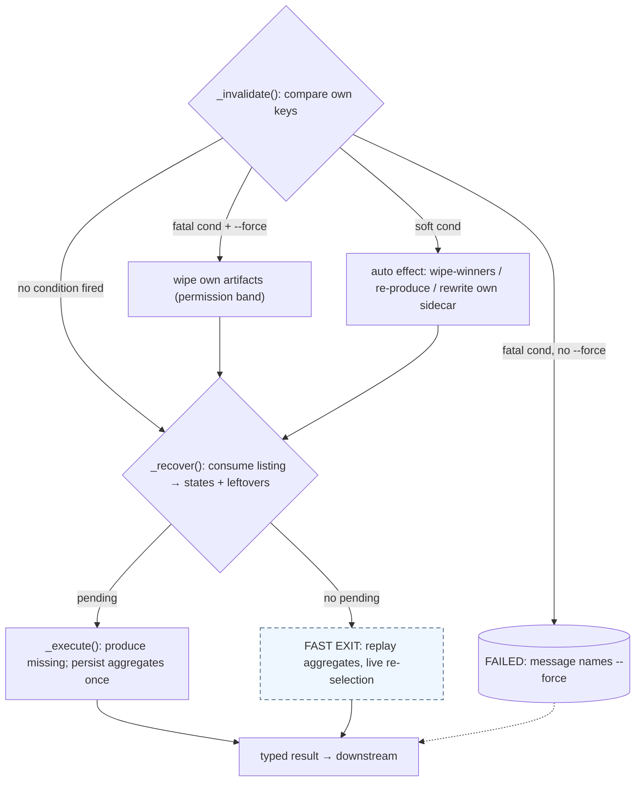
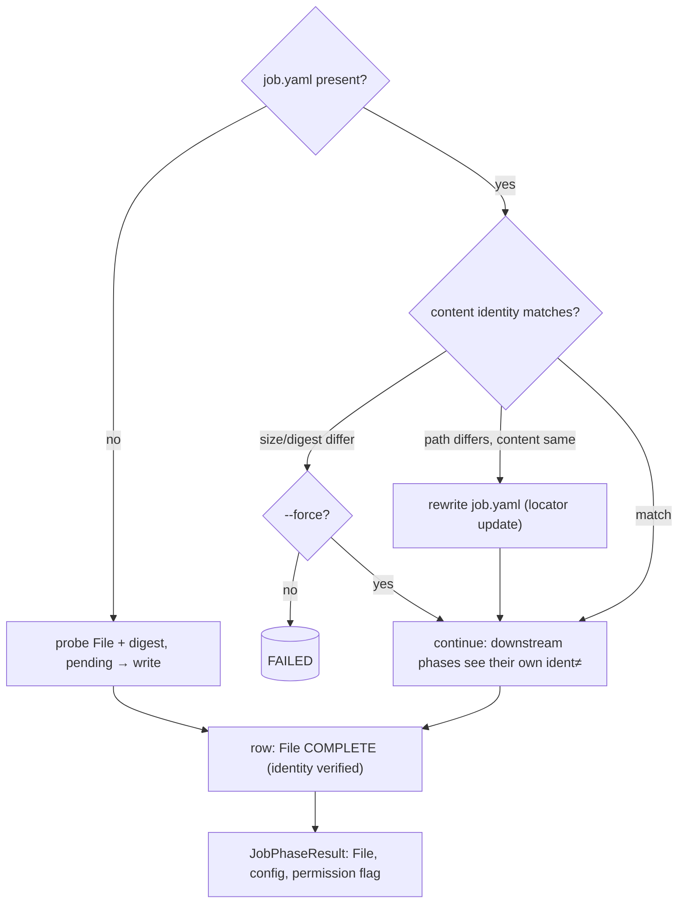
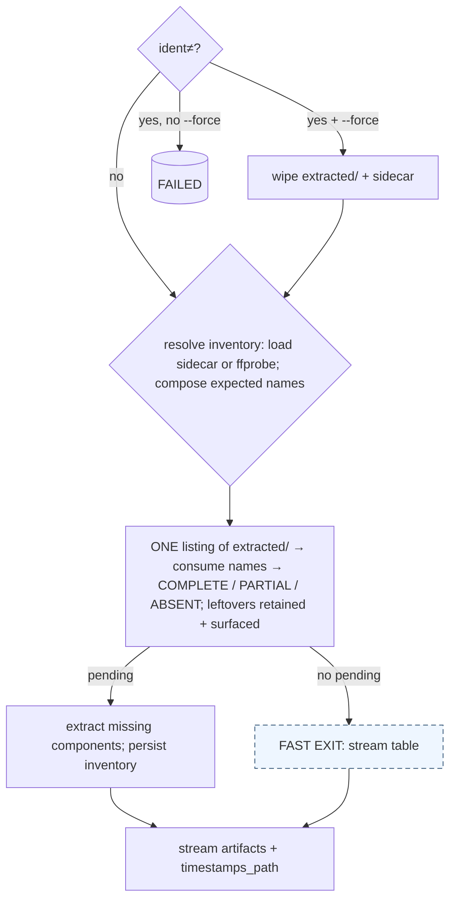
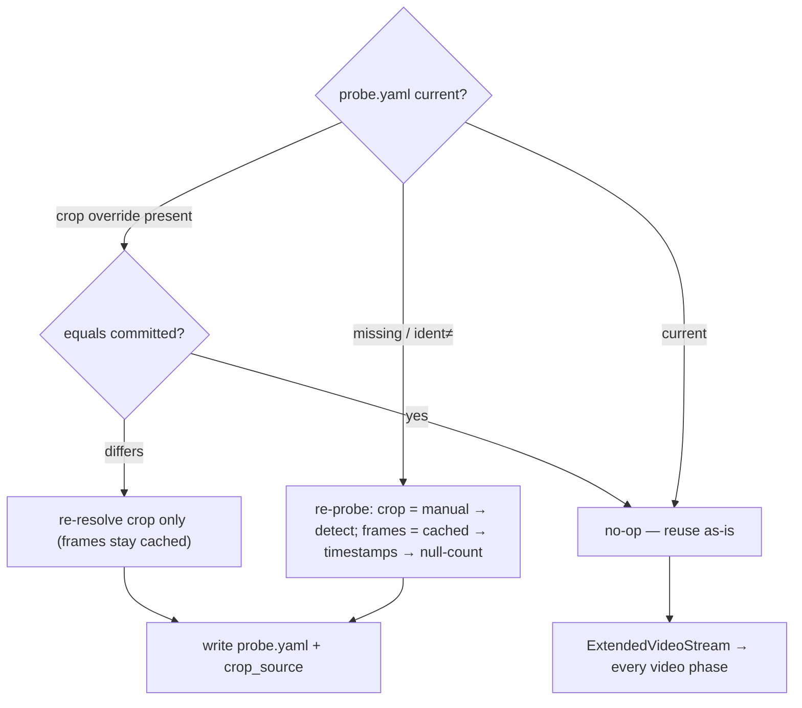
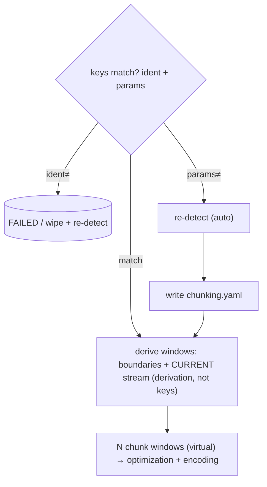
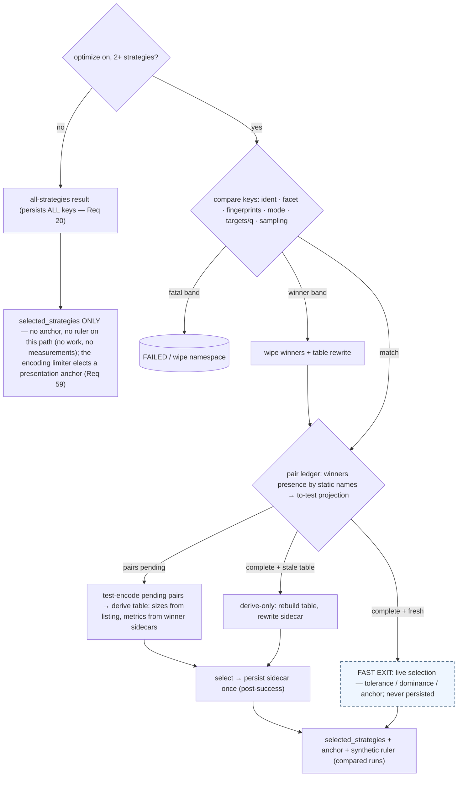
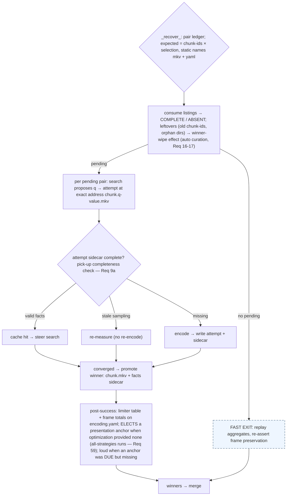
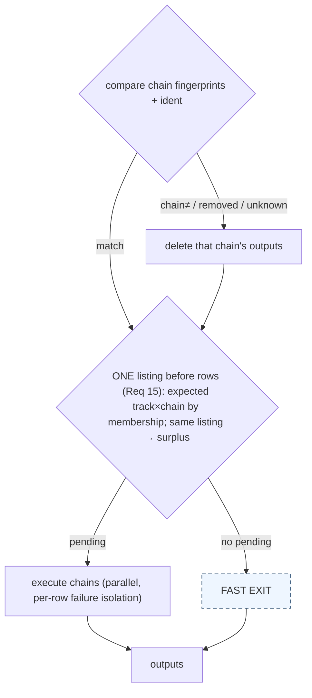
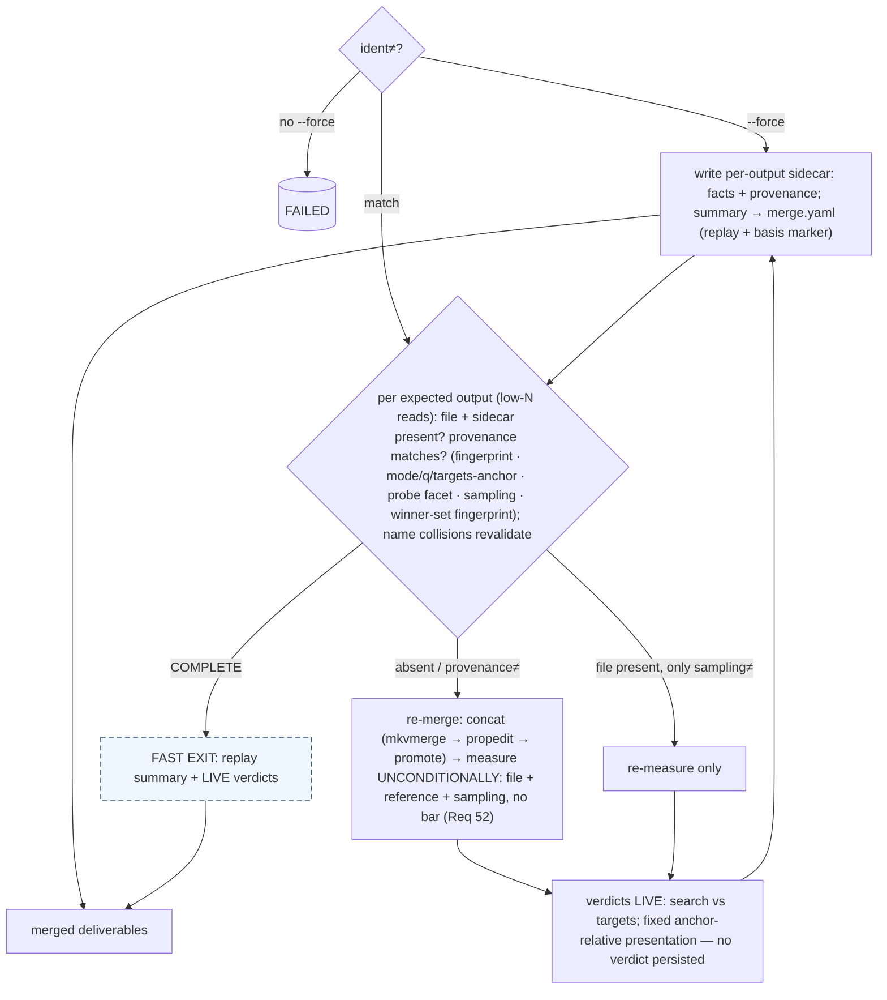

# Process flows — per-phase, condition → knob → outcome

<!-- markdownlint-disable MD024 -->

- Created: 2026-10-07
- Purpose: the connected view of the settled design (`requirements.md`, `design.md`, rulings in `spec-plan.md`). Each phase has **few knobs** — the tables below prove it by listing them all. Links: `Req N` → requirements.md; `D#` → spec-plan decisions.

**Legend (all charts):**

| Shape / style | Meaning |
| --- | --- |
| diamond | a condition check (key comparison unless noted) |
| cylinder | FATAL — stops unless `--force` (permission, Req 35a) |
| orange box | an invalidation EFFECT (one vocabulary, design §2a): wipe-own / wipe-winners / re-produce / rewrite-own-sidecar |
| blue box | recovery = completeness classification (consume listing → ABSENT/PARTIAL/COMPLETE) |
| green box | processing (`_execute`) |
| dashed blue box | fast exit (no pending): replay aggregates + live re-selection |
| `ident≠` | own persisted content identity ≠ live content identity (the one canonical source condition, Req 30–33) |

## 0. The one template (every phase is an instance)

Knob count per phase: **Job 2 · Extraction 2 · Probe 3 · Chunking 2 · Optimization 9→4 effects · Encoding 0 (!) · Audio 3 · Merge 2.**

## 1. Job — identity owner

Inputs: source path, config flags (`--force`, cleanup, no-metrics). Knobs:

| Condition | Effect |
| --- | --- |
| `ident≠` (size+digest), no permission | **fatal** |
| `ident≠` + permission | nothing at Job itself — each downstream phase wipes its own (keys re-detect every run; no flag to lose, D3) |
| path-only change | locator update: rewrite `job.yaml` (no fatal, D11) |
| `job.yaml` missing | rebuild (probe identity) |

Outputs: the run context every phase reads; **permission rides the result** (the old `force_wipe` wipe-order is deleted).

## 2. Extraction — inventory + container artifacts

Inputs: `File`, include/exclude filter, mode (`video_required`, `materialize`). Knobs:

| Condition | Effect |
| --- | --- |
| `ident≠` | fatal / wipe `extracted/` + sidecar (permission) |
| sidecar missing **with files present** | conservative: wipe + re-extract (unknown currency, Req 47) |

Filter/intent changes are **not knobs** — they only re-derive `wanted` (orthogonal).

## 3. Probe — the slow facet

Inputs: video stream, `--crop` override. Knobs:

| Condition | Effect |
| --- | --- |
| `ident≠` | re-probe (cheap; the downstream facet key handles the investment loss) |
| `--crop` **equals** committed crop | **no-op** (P-2) |
| `--crop` **differs** | re-resolve crop, keep cached frame count (permission question fires downstream via the facet key, not here) |
| sidecar missing | re-probe |

The facet (frame count + crop) is a **structured key downstream** — compared field-wise, never whole-model (Req 23).

## 4. Chunking — boundaries

Inputs: extended stream, `scene_threshold`, `min_scene_length`. Knobs:

| Condition | Effect |
| --- | --- |
| `ident≠` | fatal / wipe sidecar + re-detect (permission) |
| detection params ≠ | **auto** re-detect (user-initiated config; nothing deleted — D8/C-1) |
| sidecar missing | re-detect (deterministic) |

Re-chunk ripples need **no knob here** — new chunk ids change the *wanted set* downstream; old winners surface as consumption leftovers (Req 16).

## 5. Optimization — owns the shared namespace (`encoding/` + `encoded/`)

Inputs: plan (mode, strategies+fingerprints, targets / pinned-q map), chunks, probe facet, sampling, tolerance, `optimize` flag. **Encoding adds none of its own** (Req 38) — this is "one pipeline in two steps."

| Condition (own sidecar, per-mode variant) | Effect |
| --- | --- |
| `ident≠` · probe facet ≠ | **fatal** / wipe attempts+winners+keys (permission) |
| fingerprint ≠ (per strategy) | **fatal** / wipe that strategy only (permission) — D4 |
| mode ≠ (either direction) | wipe winners (auto) — O-1 |
| **chunk-set fingerprint ≠** (re-chunk; same derivation as merge's winner-set) | wipe winners at `_invalidate` (auto) — ahead of recovery/search, uniform with merge |
| search: targets ≠ · fixed: pinned map ≠ | wipe winners + rewrite table (auto) — fixed **equal** = no-op, gate decides (O-2) |
| sampling ≠ | wipe winners; attempts re-measure at pick-up (auto) |
| test-chunk set not fully present | fresh full pick (auto) — O-6 |
| sidecar missing with winners present | conservative wipe winners (§99) |
| pairs COMPLETE but table stale/absent | **derive-only pending**: rebuild table from winners |

## 6. Encoding — zero invalidation, classification + production

Inputs: chunks, selected strategies, presentation targets/ruler, crop, sampling. **No `_invalidate`** (the empty case study, D12).

Attempts are **never classified, never individually invalidated** — the substrate, consulted lazily (Req 9a).

## 7. Audio

Inputs: tracks (extraction), chains+select (config). Knobs:

| Condition | Effect |
| --- | --- |
| chain fingerprint ≠ | delete that chain's outputs → reproduce (auto, Req 10b) |
| chain removed from config | cleanup delete (auto) |
| sidecar missing with outputs | conservative reproduce (A-1/Req 47) |
| `ident≠` | fatal / wipe (permission) |

`select` changes are not knobs — live `wanted` only.

## 8. Merge — per-file acceptance flag

Inputs: winners, plan (mode, targets / ruler+anchor, pinned q), probe facet, sampling, stem, timestamps. Knobs:

| Condition | Effect |
| --- | --- |
| `ident≠` | fatal / **wipe `merged/`** (permission — the ONE deliverable-layer wipe) |
| per-output **provenance** ≠ (fingerprint · mode/q/targets-anchor · **probe facet** · sampling · winner-set fingerprint — Req 27/49/60) | re-merge that output in place (deliverables retained — a crash leaves old outputs present) / re-measure only (sampling-only difference); targets/anchor mismatches ⇒ re-merge — the winners were re-searched upstream (M-8) |

Stale outputs of removed strategies / old q values: **retained deliverables** (rename-for-taste is the user's); a name collision is a conflict signal → revalidate.

## The knob census

| Phase | Fatal-band knobs | Winner/auto knobs | Total conditions |
| --- | --- | --- | --- |
| Job | 1 | 1 (locator rewrite) | 2 |
| Extraction | 1 | 1 (unknown-currency wipe) | 2 |
| Probe | 0 | 3 (re-probe, crop equal/differs) | 3 |
| Chunking | 1 | 1 (params re-detect) | 2 |
| Optimization | 3 (ident, facet, fingerprint) | 6 (mode, targets/q, sampling, test-set, chunk-set, missing-sidecar) + derive-only | 9 conditions → **4 effects** |
| Encoding | **0** | 1 (consumption curation) | 0 keys |
| Audio | 1 (ident) | 3 (chain≠, removed, missing-sidecar) | 3-4 |
| Merge | 1 (ident — the only deliverable wipe) | 1 (per-file provenance → re-merge / re-measure) | 1 + per-file fields |

Every phase: **at most 3 fatal-band knobs; most work rides 1-2 auto effects.** The complexity lives in the *typed sidecars* (which fields are keys — Req 19's lists), not in the flow.
