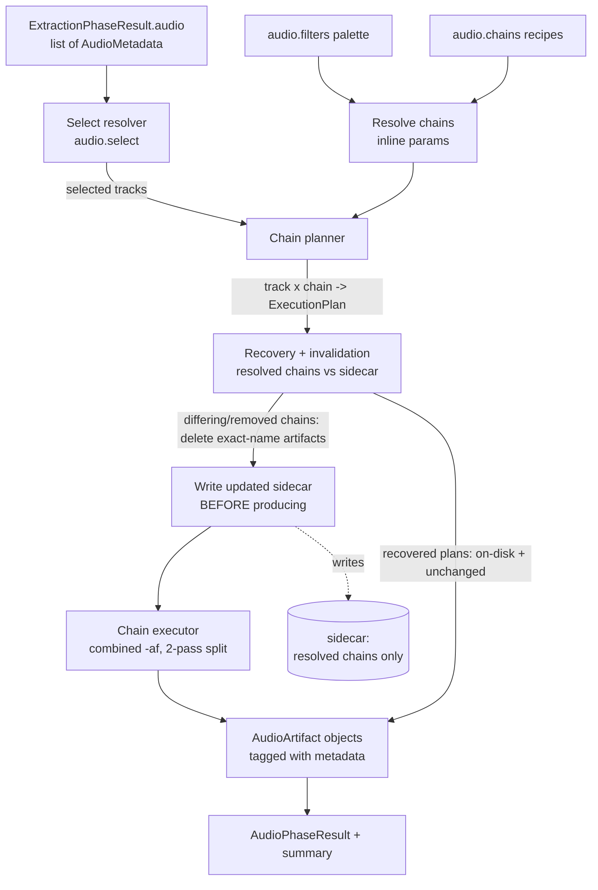
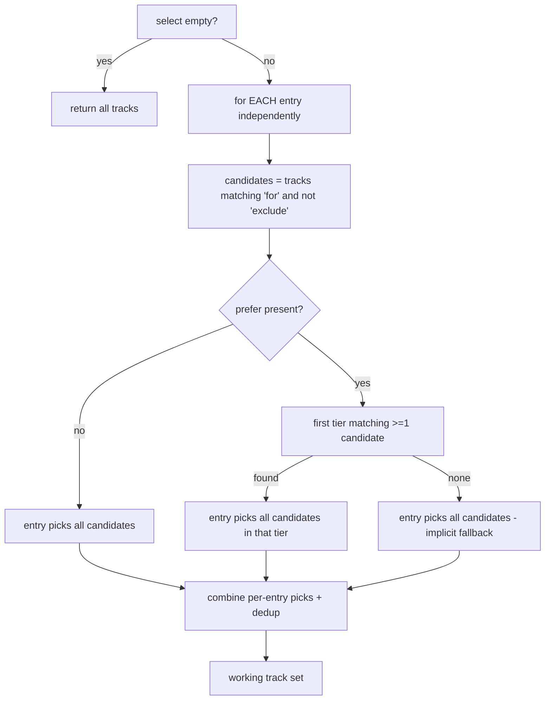
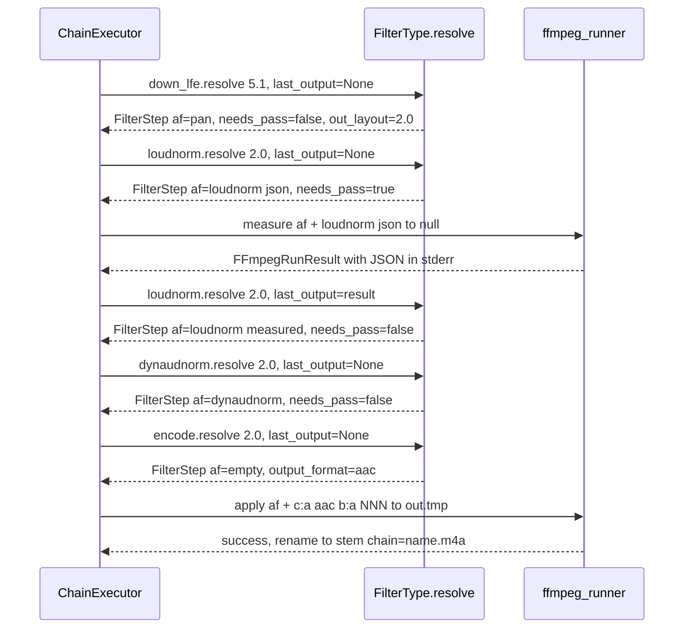
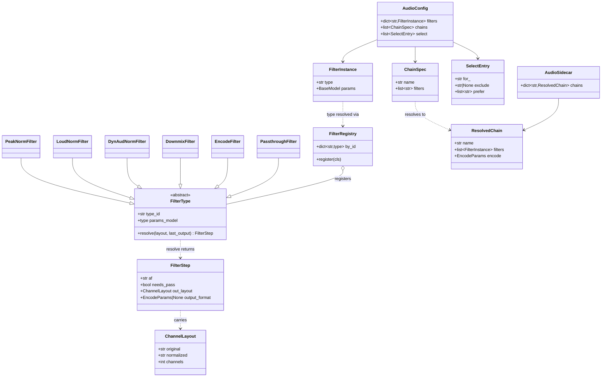

# Design Document — Audio Chains

<!-- markdownlint-disable MD024 -->

- Created: 2026-09-11
- Completed:

## Cross-Spec Summary

| Spec | Created | Relationship |
|------|---------|--------------|
| audio-phase (original merge-in) | pre-refactor | **Superseded in full for the processing model.** The combinatorial `AudioEngine`/`SynchronousRunner`/`AsyncRunner`/strategy-class graph, filename-driven `check()` targeting, FLAC-intermediate stepwise execution, and the flat `AudioConfig` are all replaced by filters + chains + select and a combined-chain executor. |
| probe-phase-refactor | 2026-09-01 | **Complements.** ProbePhase made the audio-only path viable and `AudioPhase` independent of video. This spec keeps `AudioPhase` dependent only on `JobPhase` + `ExtractionPhase`, unchanged. |
| merge-phase-revamp | 2026-03-19 | **Future coupling only.** Merge stays video-only. A later spec will let merge consume the tagged audio artifacts produced here. |
| config-refactor | 2026-06-23 | **Extends `AppConfig`.** The new `audio` sub-models plug into the existing layered-load + Pydantic-validate `AppConfig` assembled by `load_app_config()`. |

---

## Overview

This design replaces the audio subsystem's implicit combinatorial model with an explicit, config-driven one. The user defines a **palette of named filters**, a set of **chains** (ordered filter references, one output per matched track), and an optional **select** tree that decides which extracted tracks are processed. Chains execute as a **single combined ffmpeg `-af` invocation**, split only where a filter needs two passes. Recovery/invalidation is driven by a **resolved-chain sidecar**. The phase is rebuilt to the project's **standard Phase pattern**.

The design deliberately separates three concerns that were previously entangled in filename parsing:

- **What to process** — `select` (track selection with priority/fallback).
- **How to transform** — `filters` (palette) + `chains` (recipes).
- **What was produced** — tagged `AudioArtifact` objects with metadata, plus a sidecar recording resolved recipes for invalidation.

---

## Architecture

### Module layout

| File | Role |
|---|---|
| `pyqenc/app_config.py` | New `AudioConfig` with `filters`, `chains`, `select`; Pydantic models + validators. |
| `pyqenc/audio/filters.py` (new) | Filter-type **registry** + self-contained filter-type classes. Each class owns its type id, param model, and `resolve()` — including its own pass count and measurement scraping. |
| `pyqenc/audio/layout.py` (new) | `ChannelLayout` value type (original + normalized + channel count). |
| `pyqenc/audio/chain.py` (new) | Chain resolution (inline params) + the generic execution loop driving filters through their passes. |
| `pyqenc/audio/select.py` (new) | `select` resolver operating on conventional stream strings. |
| `pyqenc/audio/matrices.py` (new) | Built-in downmix pan matrices keyed by normalized `(source_layout, target_layout, matrix_name)`. |
| `pyqenc/phases/audio.py` | Rewritten `AudioPhase` (Phase pattern): recovery, invalidation, execution orchestration, logging. Old strategy/engine/runner code removed. |
| `pyqenc/state.py` | New audio sidecar model (resolved chains only) replacing `AudioParams`. |
| `pyqenc/utils/ffmpeg_runner.py` | Reused for all invocations. The old `_two_pass_*` helpers are removed; their scraping moves into the filter classes. |
| `pyqenc/models.py` / extraction | `AudioMetadata` and `AudioStream.channels_layout` carry `ChannelLayout` instead of free text. |
| `pyqenc/constants.py` | New filename constant (` chain=` suffix); old `NORMALISED_PREFIXES` / `AUDIO_STEM_SEPARATOR` removed. |
| `pyqenc/default_config.yaml` | New `audio` section: palette, sample chain, commented select examples. |
| `docs/` | Audio configuration documentation. |

### High-level flow



The sidecar is written **at invalidation time, before any output is produced** — not after processing. This is the key fix for resumability: it records the chains this work-dir is now committed to, so a mid-run crash leaves the sidecar already matching the current config and the next run simply resumes the missing outputs instead of re-invalidating what it just made. Completion is never inferred from the sidecar; it is read from the presence of output files on disk.

---

## Components and Interfaces

### 1. Config models (`app_config.py`)

`AudioConfig` replaces the flat model. Sketch (final field set decided during implementation, type-hinted per standards):

```python
class AudioConfig(BaseModel):
    filters: dict[str, FilterSpec]      # palette; dict-merge across layers
    chains:  list[ChainSpec]            # recipes; list-replace across layers
    select:  list[SelectEntry] = []     # empty = all tracks
```

- `filters` is validated through the **registry** (Component 2), not a static discriminated union: a filter def is `{type: str, ...params}`; the validator looks up `type` in the registry and validates the remaining fields against that type's param model. Unknown params rejected by each param model's `extra="forbid"`. This keeps the type set open (Requirement 2.5 — no hardcoded enumeration in the config model).
- `ChainSpec`: `name: str`, `filters: list[str]`. A model-validator checks: each name resolves in the palette, uniqueness of `name` across the list, passthrough-is-alone, chain-name filename safety, at-least-zero encode filters (last wins).
- `SelectEntry`: `for_: str` (alias `for`), `exclude: str | None`, `prefer: list[str] = []`.
- A top-level `AudioConfig` model-validator wires cross-field checks (chain→filter references) so failures surface as `ValidationError` at load (Requirement 12.1). This mirrors how `EncodingConfig.resolve()` runs in a validator today.

### 2. Filter-type registry + filter classes (`audio/filters.py`)

Filter types are an **open registry**, not a closed union (Requirement 2). Each type is a self-contained class owning three things: its type id, its Pydantic param model, and its `resolve()` behaviour (its pass count + measurement scraping included). A decorator registers it at import:

```python
_FILTER_REGISTRY: dict[str, type[FilterType]] = {}

def register_filter(cls: type[FilterType]) -> type[FilterType]:
    if cls.type_id in _FILTER_REGISTRY:                      # Req 2.3 — no duplicate ids
        raise ValueError(f"Duplicate filter type id: {cls.type_id!r}")
    _FILTER_REGISTRY[cls.type_id] = cls
    return cls

class FilterType(ABC):
    type_id: ClassVar[str]
    params_model: ClassVar[type[BaseModel]]           # extra="forbid"
    @abstractmethod
    def resolve(self, layout: ChannelLayout, last_output: FFmpegRunResult | None) -> FilterStep: ...

@register_filter
class PeakNormFilter(FilterType):
    type_id = "peaknorm"
    params_model = PeakNormParams        # target_dbfs: float
    ...
```

- Config validation (Component 1) resolves `type` → class via `_FILTER_REGISTRY`, then validates params via `cls.params_model`. Unknown `type` raises listing `sorted(_FILTER_REGISTRY)` (Requirement 1.4).
- Adding a new filter type = one new `@register_filter` class. No edits to `AudioConfig`, the executor, or existing classes (Requirement 2.2). Duplicate id → import-time failure (Requirement 2.3).
- The default six (`peaknorm`, `dynaudnorm`, `loudnorm`, `downmix`, `encode`, `passthrough`) are the initial registrations (Requirement 2.6), all defined in this module.

Each filter owns **all** of its own behaviour — including whether it is single- or multi-pass, how to run each measurement pass, how to scrape the needed value out of that pass's ffmpeg output, and how to fold it into its final `-af` fragment. There is **no `two_pass` enum and no pass-kind knowledge in the executor**. The single contract is one stateless method:

```python
@dataclass
class FilterStep:
    af:            str                   # -af contribution ("" = no-op passthrough; never None)
    needs_pass:    bool                  # True = run a measurement pass with `af`, then call resolve again
    out_layout:    ChannelLayout         # channel layout after this filter (downmix updates it)
    output_format: EncodeParams | None   # set only by encode-type filters; last non-None wins

class FilterType(ABC):
    type_id:      ClassVar[str]
    params_model: ClassVar[type[BaseModel]]

    @abstractmethod
    def resolve(
        self,
        layout:      ChannelLayout,
        last_output: FFmpegRunResult | None,   # None until this filter has run a measurement pass
    ) -> FilterStep: ...
```

Contract rules:

- **Stateless & re-entrant.** A filter instance holds no per-call state and is reused across every (track, chain). Everything it needs on a later call arrives via `last_output`.
- **`last_output` is only ever the filter's *own most recent* measurement pass** — never accumulated history. The executor hands back exactly the last pass result and clears it the moment the filter finishes (`needs_pass=False`). A filter that conceptually needs several passes must derive each step from just that single latest output.
- **Single-pass filters** (`dynaudnorm`) ignore `last_output` and return `FilterStep(af="dynaudnorm=…", needs_pass=False, out_layout=layout, output_format=None)`.
- **Two-pass filters** (`loudnorm`, `peaknorm`) return, on the first call (`last_output is None`), `FilterStep(af="loudnorm=…:print_format=json", needs_pass=True, …)`; the executor runs that as a measurement pass and calls `resolve` again with the result; the filter scrapes it (its own regex/JSON parse lives here) and returns the final `FilterStep(af="loudnorm=…:measured_I=…", needs_pass=False, …)`. Three+ passes fall out naturally by returning `needs_pass=True` until done. No cap.
- **`downmix`** consults `audio/matrices.py`. If `layout` (normalized) ≤ `to`, returns `af=""` (no-op, Requirement 3.5). Otherwise emits the `pan=`/map fragment and sets `out_layout` to `to`.
- **`encode`** returns `af="", needs_pass=False, out_layout=layout, output_format=EncodeParams(codec, bitrate_per_channel, extension)` — no `-af` contribution, only the terminal output target.
- **`passthrough`** raises `NotImplementedError` when resolved for execution (Requirement 11.2); config-time it is a valid spec.

All filter-specific knowledge (loudnorm JSON regex, volumedetect `max_volume` regex, downmix matrices) lives inside the owning filter class. The executor knows only the `resolve`/`FilterStep` contract (Requirement 6.8).

### 3. Downmix matrices (`audio/matrices.py`)

A lookup table, no logic scattered in classes:

Matrices are **index-addressed** (`pan=stereo|c0=…|c1=…`), never channel-name-addressed. Named addressing (`FL=…`) depends on ffmpeg's interpretation of the input layout, which varies across 5.1 encodings (`5.1` vs `5.1(side)`, back vs side labels) and can silently mis-map. Index addressing takes physical channels by position and is robust. All matrices assume the **canonical 5.1 channel order**: `c0=FL, c1=FR, c2=FC, c3=LFE, c4=BL, c5=BR`.

```python
DOWNMIX_MATRICES: dict[tuple[str, str, str | None], str] = {
    # (normalized source_layout, normalized target_layout, matrix_name): ffmpeg pan spec
    # Canonical 5.1 order: c0=FL c1=FR c2=FC c3=LFE c4=BL c5=BR
    #
    #  std     = ITU-R BS.775 / ATSC Lo/Ro fold, LFE (c3) dropped.
    #  lfe     = a listener-tuned "night" fold that mixes FC + LFE + surrounds in
    #            (preserved verbatim from a community formula; the historical
    #            "night" matrix).
    #  boosted = a dialog-forward fold (full FC, reduced surrounds, LFE dropped)
    #            (preserved verbatim from a community formula; the historical
    #            "nboost" matrix).
    ("5.1", "2.0", "std"):     "pan=stereo|c0=c0+0.707*c2+0.707*c4|c1=c1+0.707*c2+0.707*c5",
    ("5.1", "2.0", "lfe"):     "pan=stereo|c0=0.5*c2+0.707*c0+0.707*c4+0.5*c3|c1=0.5*c2+0.707*c1+0.707*c5+0.5*c3",
    ("5.1", "2.0", "boosted"): "pan=stereo|c0=c2+0.30*c0+0.30*c4|c1=c2+0.30*c1+0.30*c5",
    # 7.1 -> 5.1: plain index fold of the side pair into back, no matrix.
    # Canonical 7.1 order: c0=FL c1=FR c2=FC c3=LFE c4=BL c5=BR c6=SL c7=SR
    ("7.1", "5.1", None):      "pan=5.1|c0=c0|c1=c1|c2=c2|c3=c3|c4=c4+c6|c5=c5+c7",
    # 7.1 -> 2.0: derived per matrix by folding the side pair (c6/c7) into the
    # back terms of the corresponding 5.1 matrix. Exact weights finalized in code.
    ("7.1", "2.0", "std"):     "...",
    ("7.1", "2.0", "lfe"):     "...",
    ("7.1", "2.0", "boosted"): "...",
}
```

- `lfe` and `boosted` are **community-sourced formulas preserved verbatim** as named, user-selectable matrices (the historical `night` / `nboost`). They are deliberately not "the same fold with a different LFE gain" — they differ in FC weight, surround weight, and LFE handling, which is why they are distinct named matrices rather than a parameterized one.
- `std` is the canonical ITU-R BS.775 / ATSC Lo/Ro fold (LFE dropped), index-addressed.
- The matrix set is **open**: further named matrices can be added later as registered entries without touching the filter or executor.
- 7.1→2.0 may be a single derived matrix or an internal two-step (7.1→5.1 index fold, then the 5.1→2.0 matrix); either is acceptable (Requirement 3.6), matrix names identical to the 5.1 set. The exact 7.1→2.0 side-fold weights are finalized in code and verified against real samples.
- Matrix lookup and the downmix-only comparison use `ChannelLayout` (below), keyed by its normalized value.

### 3a. ChannelLayout type (`audio/layout.py` or `models.py`)

Channel layout stops being free text. `ChannelLayout` carries **both**:

- `original: str` — the exact ffmpeg token as seen (`5.1(side)`, `stereo`, `7.1`), preserved verbatim for the faithful `ch=` conventional string and for any filter that cares about the qualifier.
- `normalized: str` — canonical base layout (`5.1(side)` → `5.1`, `stereo` → `2.0`), used for channel-count, downmix `to:`/no-op comparison, matrix lookup, and bitrate scaling.
- `channels: int` — derived count (`2.0`/`stereo` = 2, `5.1` = 6, `7.1` = 8), the basis for the `≤` downmix-only comparison.

Normalization rule of note: **`stereo` normalizes to `2.0`** (both are the 2-channel layout; sources frequently tag `stereo`). Parsing accepts either and yields the same normalized value.

Scope: `ChannelLayout` replaces free-text layout wherever a layout is represented internally — `AudioMetadata`, extraction audio metadata (`AudioStream.channels_layout`), phase results, downmix params/matrices, bitrate scaling. This is a representation change only (no behaviour change to extraction). The `ch=` conventional string uses `original`; internal decisions use `normalized`/`channels`.

### 4. Select resolver (`audio/select.py`)

Operates on the conventional string of each track (Requirement 7). Pure function over the extracted audio metadata:

```python
def resolve_selection(
    tracks: list[AudioMetadata],
    select: list[SelectEntry],
) -> list[AudioMetadata]:
    ...
```



**Within one entry**, tiers are never merged: the first `prefer` tier with ≥1 match wins and contributes *all* its matches; if no tier matches (or there is no `prefer`), all `for`/`exclude` survivors are contributed. **Across entries**, each entry contributes its own picked set, and the picked sets are combined into the working track set — a track picked by more than one entry appears once (deduplicated) so a chain never produces two identical outputs for it. Entries are additive, not fallbacks (the rus + eng example wants both).

The conventional string is a `selector_string()` on `AudioMetadata` producing `lang=<> ch=<> title=<>`, where `ch=` uses `ChannelLayout.original` (so `ch=5.1(side)` matches the user's regex faithfully). It uses fields already on `AudioMetadata` (extended with a `ChannelLayout`), so no re-probe (Requirement 7.4).

### 5. Chain resolution + executor (`audio/chain.py`)

**Resolution** inlines every referenced filter's params into a `ResolvedChain` (used for both execution and the sidecar):

```python
class ResolvedChain(BaseModel):
    name:    str
    filters: list[FilterInstance]   # concrete filter instances, params inlined, in order
    encode:  EncodeParams           # effective output_format: the last encode filter, else the FLAC default
    # equality of ResolvedChain drives invalidation
```

`encode` is always populated (FLAC default when the chain has no `encode` filter), so the sidecar records the concrete output format and a change to it invalidates correctly. No synthetic filter is added to `filters` — the FLAC default lives only as the resolved `encode` value.

**Execution loop** per (track, chain). The loop is fully generic — it holds the accumulating `-af` chain (the *invariant* part) and drives each filter through its passes, but contains **zero filter-specific logic**. A filter finishes exactly when it returns `needs_pass=False`; at that instant its fragment is frozen into the invariant chain and `last_output` is cleared so it can never leak to the next filter.

```python
filters       = deque(resolved.filters)   # concrete FilterType instances, in order
af_parts      = []                         # invariant, frozen fragments of finished filters
output_format = FLAC_DEFAULT               # start at FLAC; a real encode filter overrides it
layout        = track.layout               # ChannelLayout
last_output   = None                       # only ever the CURRENT filter's most recent pass

while filters:
    step = filters[0].resolve(layout, last_output)
    output_format = step.output_format or output_format
    trial = af_parts + ([step.af] if step.af else [])   # drop empty fragments
    if step.needs_pass:
        last_output = run_measurement(",".join(trial))  # ffmpeg -af <joined> -f null (output_file=None)
    else:
        last_output = None                              # filter finished — never leak its output onward
        af_parts    = trial                             # freeze fragment (already includes any measured values)
        layout      = step.out_layout
        filters.popleft()

af = ",".join(af_parts)
# final application pass: ffmpeg [-af <af>] + output_format (-c:a/-b:a) -> '<stem> chain=<name>.<ext>.tmp' -> rename
```

`-af` fragments are joined with commas (ffmpeg's filter-chain separator). Empty fragments (`step.af == ""`, from downmix no-ops / terminal filters) are dropped from the join so there is never a leading, trailing, or doubled comma. WHEN the whole chain yields no fragments (`af == ""`), the `-af` flag is omitted entirely from the application pass.

Worked example for chain `[down_lfe, loudnorm, dynaudnorm, encode(aac)]` on a 5.1 track:



Key rules:

- **`last_output` is never accumulated** — it is only the current filter's most recent measurement pass, and is cleared to `None` the moment a filter finishes (Requirement 6.4). A filter must derive everything from that single latest output.
- With K two-pass filters the loop issues K measurement passes + 1 final application pass = K+1 invocations (Requirement 6.2, 6.3). K=0 → a single application invocation (Requirement 6.1).
- `-af` fragments are **comma-joined** (ffmpeg's filter-chain separator); empty fragments (`""` from no-op/terminal filters, never `None`) are excluded from the join so no stray/leading/trailing/doubled comma is produced. An all-empty chain omits `-af` entirely.
- `output_format` **starts at the FLAC default** (no synthetic index-0 filter is injected into the chain). Any `encode` filter's `FilterStep.output_format` overrides it (last non-`None` wins). It supplies `-c:a`/`-b:a`/extension; `bitrate_per_channel` scaled by the final `layout`'s channel count. (FLAC ignores bitrate.)
- All calls via `run_ffmpeg`/`run_ffmpeg_async`. Measurement passes pass `output_file=None` — the runner already supports this (its signature documents `None` for "commands that produce no file output (null-encode, probing)", and for a null run `success` reduces to `returncode == 0`). The filter reads its measured value from `last_output.stderr_lines`. The final application pass passes `output_file=<final path>`; the runner enforces `.tmp`-then-rename. **No runner change is required.**
- No up-front FLAC intermediate; the combined-chain approach avoids intermediates entirely (measurement passes write no file).

The two-pass measurement primitives currently in `ffmpeg_runner.py` (`_two_pass_loudnorm` / `_two_pass_peaknorm`) are removed; their measurement-scraping logic moves **into the owning filter classes** (`LoudNormFilter`, `PeakNormFilter`) as part of `resolve`. The runner keeps only its generic run + progress responsibilities.

### 6. Sidecar model (`state.py`)

Replaces `AudioParams`:

```python
class AudioSidecar(BaseModel):
    chains: dict[str, ResolvedChain]   # name -> resolved chain this work-dir is committed to
```

- **Only `chains`** — `select` is NOT persisted. Selection is a pure function of the current extracted tracks + current `select` config, recomputed for free every run; there is nothing to track across runs.
- Invalidation compares each current resolved chain to the sidecar entry of the same name by Pydantic equality (Requirement 9.2, 9.3, 9.4).
- Written via `write_yaml_atomic` (`.tmp`-then-rename) **at invalidation time — before any output is produced** — recording the chains now committed to (Requirement 9.5). It is a record of *intent*, decoupled from completion; completion is read from on-disk output files. When nothing differs, the sidecar is already correct and the rewrite is skipped.

### 7. AudioPhase (Phase pattern) (`phases/audio.py`)

```python
@dataclass
class AudioArtifact(Artifact):
    source_track: AudioMetadata | None  = None
    chain_name:   str | None            = None
    out_layout:   ChannelLayout | None  = None
    codec:        str | None            = None

@dataclass
class AudioPhaseResult(PhaseResult):
    outputs: list[AudioArtifact] = field(default_factory=list)
```

`AudioPhase.run()` sequence (mirrors other phases):

1. In-run memoization guard.
2. `_ensure_dependencies()` — `JobPhase`, `ExtractionPhase` (unchanged deps).
3. `emit_phase_banner("AUDIO", logger)`.
4. `_recover(force_wipe)` — resolve select + chains; per configured chain compare its resolved definition to the sidecar entry of the same name; for each **differing or removed** chain delete its on-disk artifacts by **exact chain-name match**; then **write the updated sidecar before producing anything**; finally classify each expected (track, chain) output vs on-disk.
5. `log_recovery_line(...)`.
6. Dry-run: return REUSED/PENDING without executing.
7. Execute pending plans with `ProgressBar`, uniform per-chain/per-filter logging.
8. Emit summary; return `AudioPhaseResult`. (The sidecar was already written in step 4.)

**Exact chain-name deletion.** Output files are `<stem> chain=<name>.<ext>`. To invalidate chain `night`, parse the ` chain=<name>` suffix of each candidate file and delete only those whose parsed `<name>` **equals** `night` — never a substring/prefix match, so `... chain=nightlong.<ext>` is untouched. Chain names are validated filesystem-safe (Requirement 8.4), so the suffix delimiter is reliable.

**Resumability.** Because the sidecar is rewritten in step 4 (before production), a crash after producing some but not all outputs leaves the sidecar already equal to the current resolved chains. The next run finds every chain "unchanged", keeps the outputs already on disk, and processes only the missing (track, chain) pairs — no re-invalidation loop.

Recovery classification per (track, chain) expected output (after step-4 invalidation + sidecar write):

| On disk? | Resolved chain vs sidecar | Result |
|---|---|---|
| present | unchanged | COMPLETE, wanted |
| absent  | unchanged (was invalidated & deleted, or never made) | ABSENT, wanted (process) |
| absent  | chain removed from config | not expected — nothing to do |
| present | not an expected output of any configured chain | COMPLETE, wanted=False (surplus) |

`finalize()` keeps delivery outputs and sidecar (survive cleanup, Requirement 10.8).

### 8. Logging + progress

Uniform lines via `log_format` helpers, e.g.:

- Per chain start: `info` — `"Chain 'night' → 3 track(s)"`.
- Per (track, chain) step: `debug` — `"[night] down_lfe → loudnorm(measure) → …"`.
- Summary: `info` — `"Audio complete: N produced, M reused, F failed"`.

**Progress is count-based.** The total is the number of pending (track, chain) jobs — known exactly up front from the resolved selection × chains, before any ffmpeg runs. The `ProgressBar` total is that count; it advances one unit per completed (track, chain) job and shows the current job (e.g. `[night] <track-stem>`). Progress does not depend on the filter contract — filters expose nothing progress-related, keeping `resolve`/`FilterStep` purely functional. Duration-weighted progress (via `ffmpeg_runner`'s `ProgressCallback`) is a possible later enhancement, out of scope here.

---

## Data Models



*`FilterInstance` is the validated config-side representation of one filter def (its `type` plus its param model, resolved through the registry). `FilterType` subclasses are the registered behaviour classes. `FilterStep` is what each `resolve` call returns; the executor loop consumes it without inspecting the filter's type.*

---

## Error Handling

- **Config errors** (unknown type, bad param, unknown filter ref, dup chain name, passthrough-with-others, unsafe chain name): raised as Pydantic `ValidationError` at load (Requirement 12.1). Messages name the offending filter/chain.
- **Measurement parse failure**: a filter's `resolve` raises `RuntimeError` when it cannot scrape its needed value from `last_output`; the executor attaches track/chain/filter context, marks that (track, chain) output failed, and continues with siblings.
- **ffmpeg failure**: non-zero exit / empty `.tmp` → runner reports failure; executor marks that output failed and logs `error`; other outputs proceed.
- **Passthrough execution**: `NotImplementedError` (Requirement 11.2) — loud, never a silent wrong file.
- **No audio tracks / none selected**: phase completes as REUSED with zero outputs and an `info` note (not an error).

---

## Testing Strategy

Per project standards, tests target observable behaviour (each test tied to a concrete bug it prevents), never internal state.

- **Config validation**: invalid configs raise `ValidationError`; valid palette+chains+select load and resolve. (Bug: silent acceptance of a chain referencing a missing filter.)
- **Filter registry**: registering a new test-only filter type makes it usable in a chain without touching `AudioConfig`/executor; a duplicate type id fails at registration. (Bug: filter set being effectively closed / a hidden hardcoded enumeration blocking extension.)
- **Select resolver**: rus-dubs case (all dubs when present), eng-tier fallback (7.1 wins over 5.1; 5.1 when no 7.1; all when neither), empty-select = all, exclude drops comment tracks. (Bug: prefer selecting only one track instead of all in the winning tier; wrong fallback.)
- **Downmix no-op**: `to:2.0` on a stereo source emits no `-af` fragment and preserves the stream. (Bug: needless re-encode / channel change on already-stereo audio.)
- **Filter-owned passes / generic loop**: a chain with two measurement-requesting filters issues exactly three ffmpeg invocations; each measurement pass's `-af` includes the already-finalized filters; the executor has no filter-type branch (a test-only two-pass filter drives the same K+1 behaviour). (Bug: measuring on the wrong signal; wrong invocation count; filter logic leaking into the loop.) Verified via a spy runner counting calls and inspecting `-af` strings.
- **Filename + extension**: `<stem> chain=<name>.<ext>`; FLAC when no encode, encode extension otherwise; last-encode-wins. (Bug: wrong extension when multiple encodes present.)
- **Recovery/invalidation**: unchanged chain → reused; changed filter param → old file deleted and reprocessed; removed chain → output cleaned; deletion is exact-name (`chain=night` does not delete `chain=nightlong`). (Bug: stale outputs surviving a config change; substring deletion nuking an unrelated chain.)
- **Resumability**: after a changed chain invalidates + writes the sidecar + produces some outputs, a simulated crash (stop before all outputs made) followed by a rerun reuses the completed outputs and only produces the missing ones — no re-invalidation loop. (Bug: sidecar written only after completion causing perpetual re-invalidation on partial runs.)
- **Property preservation**: output sample rate / bit depth match source for a norm-only chain. (Bug: aresample/downmix side-effects altering sample rate.)
- **Passthrough**: a passthrough chain raises `NotImplementedError`. (Bug: passthrough silently emitting a wrong/incomplete file.)

Integration test uses a small real sample from `D:\_encoding\source\*.mkv` where feasible, otherwise a synthetic multi-channel test tone generated with ffmpeg.

---

## Correctness Properties

Invariants the implementation must uphold (each maps to a requirement and a test):

### Property 1: Determinism

One chain applied to N matched tracks produces exactly N outputs — never a combinatorial expansion.

**Validates: Requirements 4.5**

### Property 2: Downmix-only

A `downmix` filter never increases channel count and is a pure no-op when source ≤ target; sample rate and bit depth are unchanged by normalisation-only chains.

**Validates: Requirements 3.5, 6.6**

### Property 3: Filter-owned passes, generic loop

For K filters that request a measurement pass, exactly K+1 ffmpeg invocations occur; every measurement pass has all already-finalized (invariant) filters applied; and the executor contains no filter-type-specific branch — all measurement building/scraping lives in the filter's `resolve`. `last_output` is only ever the current filter's most recent pass and is cleared when the filter finishes.

**Validates: Requirements 6.2, 6.3, 6.4, 6.5**

### Property 4: Extension correctness

Output extension is `flac` with no encode filter, else the last encode filter's extension.

**Validates: Requirements 8.3**

### Property 5: Well-formed filter chain

The `-af` argument is a comma-separated join of non-empty fragments with no leading, trailing, or doubled comma; an all-empty chain omits `-af` entirely.

**Validates: Requirements 6.1, 6.6**

### Property 6: Invalidation soundness and resumability

An output is reused iff its resolved chain equals the sidecar entry and the file exists; a changed or removed chain deletes exactly its own exact-name artifacts and rewrites the sidecar before producing, so a mid-run crash resumes the missing outputs rather than re-invalidating completed ones.

**Validates: Requirements 9.2, 9.3, 9.4, 9.5, 9.6**

### Property 7: Atomicity

No non-`.tmp` partial output or sidecar ever exists on disk.

**Validates: Requirements 8.5, 9.7**

### Property 8: Registry openness

No config-model or executor branch enumerates concrete filter types; a newly registered type is usable with no edits elsewhere.

**Validates: Requirements 2.2, 2.5**

### Property 9: Fail-loud passthrough

A passthrough chain raises `NotImplementedError` and never emits a file.

**Validates: Requirements 11.2, 11.4**

---

## Migration / Cleanup

- Remove: `BaseStrategy` and all `*Strategy` classes, `AudioEngine`, `SynchronousRunner`, `AsyncRunner`, `Task`/`PlanResult`, `_build_audio_engine`, `process_audio_streams`, `_scale_bitrate` (reimplemented in executor), `_filename_prefix`/`_is_raw_source`, `NORMALISED_PREFIXES`, `AUDIO_STEM_SEPARATOR`, `AudioParams`.
- Pre-alpha: no backward-compatibility shims. Old `audio.yaml` sidecars are ignored (schema changed); a stale file is simply overwritten on next run. Old-format `audio:` config keys will fail validation — the default config and docs document the new shape.
