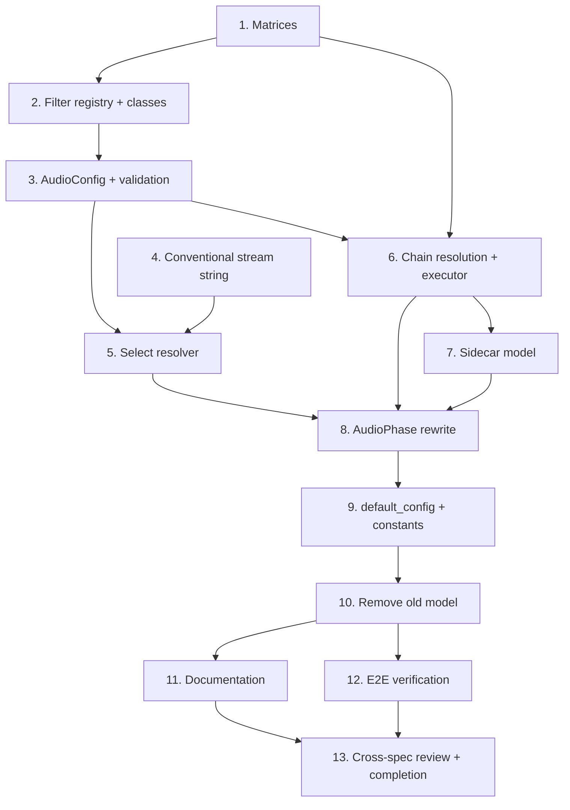

# Implementation Plan — Audio Chains

<!-- markdownlint-disable MD024 -->

- Created: 2026-09-11

## Overview

Tasks are ordered to be incremental and independently verifiable: config + resolvers land before the executor; the executor before the phase rewrite; removal of the old model last. Requirement ids reference `requirements.md`.

## Notes

- After each code task run `uv run ruff check` and the relevant `uv run python -m pytest`.
- Per coding-standards workflow, confirm the approach with the user before starting Task 1 — this plan is part of that discussion.
- Prefer the refactoring MCP (rope) for renames/moves during the old-model removal in Task 10; verify with a project-wide search afterwards.
- Tests target observable behaviour; each test states the bug it prevents.

## Tasks

- [ ] 1. Downmix matrices table (Req 3.5, 3.6, 3.7, 3.8)
  - Create `pyqenc/audio/matrices.py` with `DOWNMIX_MATRICES` keyed by `(source_layout, target_layout, matrix_name)`
  - Define channel-count map (`stereo`/`2.0`=2, `5.1`=6, `7.1`=8) and a `layout_channels()` helper
  - All matrices **index-addressed** (`c0..c5`), canonical order `c0=FL c1=FR c2=FC c3=LFE c4=BL c5=BR`
  - 5.1→2.0: `std` = `c0=c0+0.707*c2+0.707*c4 | c1=c1+0.707*c2+0.707*c5` (LFE dropped); `lfe` and `boosted` = the historical night/nboost community formulas preserved **verbatim** (`lfe`: `c0=0.5*c2+0.707*c0+0.707*c4+0.5*c3|c1=0.5*c2+0.707*c1+0.707*c5+0.5*c3`; `boosted`: `c0=c2+0.30*c0+0.30*c4|c1=c2+0.30*c1+0.30*c5`)
  - 7.1→5.1 plain index fold (`c4=c4+c6|c5=c5+c7`, no matrix); 7.1→2.0 for `std`/`lfe`/`boosted` derived by folding the side pair into the back terms, identical matrix names; exact side-fold weights verified against real samples
  - Registry-style, open matrix set — adding a matrix needs no filter/executor change
  - Unit test: matrix lookup returns expected spec; downmix-only comparison (`<=` target) is correct

- [ ] 2. Filter-type registry + filter classes (Req 2.1, 2.2, 2.3, 2.4, 2.5, 2.6, 3.1, 3.2, 3.3, 3.4, 3.5, 3.6, 3.9, 3.10, 6.1, 11.2, 11.3)
  - Create `pyqenc/audio/filters.py` with `_FILTER_REGISTRY` and `@register_filter` (duplicate id → `ValueError` at import)
  - Define `FilterStep` (`af: str`, `needs_pass: bool`, `out_layout: ChannelLayout`, `output_format: EncodeParams | None`) and abstract `FilterType` base (`type_id`, `params_model`, `resolve(layout, last_output) -> FilterStep`); filters are stateless
  - Register the initial six: `PeakNormFilter(target_dbfs)`, `LoudNormFilter(i, tp, lra)`, `DynAudNormFilter(f, g, p, m, r, b)`, `DownmixFilter(to, matrix|None)`, `EncodeFilter(codec, bitrate_per_channel, extension)`, `PassthroughFilter()`
  - Each param model sets `extra="forbid"` so invalid params raise at load
  - Implement `resolve()` per type: `dynaudnorm` single-pass `af`; `peaknorm`/`loudnorm` own their measurement — first call returns `needs_pass=True` with the analysis `-af`, second call scrapes `last_output` (volumedetect regex / loudnorm JSON regex live on the class) and returns the final `af`; `downmix` fragment or `af=""` no-op when source ≤ target; `encode` returns `af=""` + `output_format`
  - Move the loudnorm/volumedetect scraping regexes onto their filter classes (delete the standalone `_two_pass_*` helpers in a later task)
  - `PassthroughFilter.resolve()` raises `NotImplementedError` with forward-reference message + docstring note (Req 11.2, 11.3)
  - Unit tests: register a test-only type and use it without touching config/executor; duplicate id fails at registration; each type validates params; downmix no-op returns `af=""` when source ≤ target; a two-pass filter's second `resolve` produces the measured fragment from a supplied fake `last_output`

- [ ] 3. AudioConfig models + validation (Req 1.1, 1.2, 1.3, 1.4, 1.5, 2.4, 4.1, 4.2, 4.3, 4.4, 4.9, 5.1, 5.2, 8.4, 12.1, 12.4)
  - Add `ChainSpec(name, filters)` and `SelectEntry(for_, exclude, prefer)` to `pyqenc/app_config.py`
  - Replace flat `AudioConfig` with `filters` (registry-validated), `chains: list[ChainSpec]`, `select: list[SelectEntry] = []`
  - Filters validator: resolve each def's `type` via the registry, validate params against the type's `params_model` (unknown type lists registered ids; invalid param raises) — no hardcoded type enumeration in the config model
  - Model-validators: every chain filter name resolves in palette (error names chain+filter); chain `name` uniqueness; passthrough alone in its chain; chain `name` filesystem-safe (Req 8.4)
  - Confirm dict-merge for `filters`, list-replace for `chains`/`select` via the existing layered loader (add a merge test)
  - Unit test: each invalid-config case raises `ValidationError` at load

- [ ] 4. ChannelLayout type + conventional stream string (Req 7.1, 7.2, 7.3, 7.4, 7.5, 7.6)
  - Create `ChannelLayout` (`pyqenc/audio/layout.py`) carrying `original`, `normalized`, `channels`; parse accepts `stereo`→`2.0`, strips qualifiers (`5.1(side)`→`5.1`)
  - Replace free-text layout with `ChannelLayout` in `AudioMetadata`, `AudioStream.channels_layout`, phase results, downmix params/matrices, bitrate scaling (representation change only)
  - Add `selector_string()` to `AudioMetadata` producing `lang=<> ch=<> title=<>`, where `ch=` uses `ChannelLayout.original`; derives purely from extraction fields (no re-probe)
  - Unit tests: `stereo` and `2.0` normalize equal; `5.1(side)` normalized `5.1` but original preserved in `ch=`; selector string tokens for 7.1/5.1/2.0/stereo

- [ ] 5. Select resolver (Req 5.3, 5.4, 5.5, 5.6, 5.7, 5.8, 5.9)
  - Create `pyqenc/audio/select.py` with `resolve_selection(tracks, select) -> list[AudioMetadata]`
  - Empty select → all tracks; per entry candidates via `for` minus `exclude` (case-insensitive default)
  - Within an entry: `prefer` tiers in order, first tier with ≥1 candidate wins and contributes all its matches (tiers never merged); else implicit fallback = all candidates
  - Across entries: entries are additive — combine each entry's picked set, dedup a track picked by multiple entries
  - Unit tests: rus-dubs (all dubs), eng 7.1>5.1>any fallback, exclude drops comments, empty=all, two entries additive with dedup on overlap

- [ ] 6. Chain resolution + generic executor loop (Req 4.5, 4.6, 4.7, 4.8, 6.1, 6.2, 6.3, 6.4, 6.5, 6.6, 6.7, 8.1, 8.2, 8.3, 8.5)
  - Create `pyqenc/audio/chain.py` with `ResolvedChain` (inlined filter instances + a resolved `encode: EncodeParams`, always populated) and `EncodeParams`; define the `FLAC_DEFAULT` output format
  - Resolve a `ChainSpec` against the palette into a `ResolvedChain`: `encode` = last `encode` filter's format, else `FLAC_DEFAULT` (no synthetic filter added to `filters`)
  - Implement the generic loop: hold invariant `af_parts`, `layout`, `output_format` (init `FLAC_DEFAULT`), `last_output`; call `filters[0].resolve(layout, last_output)`; **comma-join** fragments dropping empty ones; on `needs_pass` run a null-output measurement pass with the joined `-af` and set `last_output`; else clear `last_output`, freeze the fragment, apply `out_layout`, pop filter; final application pass with the joined `-af` (omit `-af` if empty) + `output_format`
  - Loop contains NO filter-type branch (Req 6.5); `last_output` never accumulated, cleared on finish (Req 6.3)
  - Terminal `output_format` supplies `-c:a`/`-b:a` (bitrate scaled by final layout) + extension; FLAC default when no encode filter
  - Output name `<stem> chain=<name>.<ext>`; all via `ffmpeg_runner`; measurement passes `output_file=None` (already supported — read value from `last_output.stderr_lines`, no runner change); final `.tmp`-then-rename; no up-front FLAC intermediate
  - Unit tests (spy runner): invocation count K=0/1/2; each measurement `-af` includes finalized filters; `last_output` cleared between filters; correct extension incl. last-encode-wins; downmix no-op contributes `""` and produces no stray comma; an all-empty chain omits `-af`; a test-only two-pass filter drives K+1 with no executor change

- [ ] 7. Audio sidecar model (Req 9.1, 9.2, 9.7)
  - Add `AudioSidecar(chains: dict[str, ResolvedChain])` to `pyqenc/state.py`; remove `AudioParams`. No `select` field — selection is recomputed each run
  - `load`/`save` with `write_yaml_atomic` (`.tmp`-then-rename)
  - Unit test: round-trip; equality detects a changed filter param and a removed chain

- [ ] 8. AudioPhase rewrite to the Phase pattern (Req 9.3, 9.4, 9.5, 9.6, 9.8, 9.9, 10.1, 10.2, 10.3, 10.4, 10.5, 10.6, 10.7, 10.8, 11.1, 11.4)
  - Define `AudioArtifact` (source_track, chain_name, out_layout, codec, path, state, wanted) and `AudioPhaseResult(outputs)`
  - `run()`: memoization guard → `_ensure_dependencies` (Job, Extraction) → banner → `_recover` (invalidate + write sidecar) → recovery line → dry-run branch → execute → summary
  - `_recover(force_wipe)`: resolve select+chains; per chain compare resolved def vs sidecar; delete differing/removed chains' artifacts by **exact chain-name** parsed from the ` chain=<name>` suffix (Req 9.4); **write updated sidecar before producing** (Req 9.5); classify expected (track, chain) outputs vs on-disk (completion from disk only, Req 9.6); `force_wipe` removes all audio artifacts + sidecar (Req 9.9)
  - Execute pending plans with `ProgressBar` (count-based total = pending (track, chain) jobs, advance per completed job, show current job); uniform per-chain logging via `log_format`; end-of-phase summary; level-appropriate logging
  - `finalize()` keeps delivery outputs + sidecar under all cleanup levels
  - Passthrough chain surfaces `NotImplementedError` as a failed output with a clear message (Req 11)
  - Behaviour tests: reuse on unchanged; reprocess on changed param; cleanup on removed chain (exact-name, not substring); **resume after simulated mid-run crash without re-invalidating completed outputs**; passthrough raises

- [ ] 9. default_config.yaml + constants (Req 1.6, 8.1, 12.2, 12.3)
  - Rewrite `audio:` section: `filters` palette (peaknorm, loudnorm, dynaudnorm, down_std/down_lfe/down_boosted, aac, passthrough), `chains` (night, normal examples), empty `select` with commented rus-dub / eng-7.1-then-5.1 examples
  - Add comment: changing a chain triggers automatic reprocess next run
  - Add ` chain=` filename-suffix constant to `constants.py`; remove `NORMALISED_PREFIXES`, `AUDIO_STEM_SEPARATOR`, and unused `AUDIO_CH_*` if no longer referenced
  - Verify config loads and resolves at startup

- [ ] 10. Remove the old audio model (design Migration/Cleanup)
  - Delete `BaseStrategy` + all `*Strategy` classes, `AudioEngine`, `SynchronousRunner`, `AsyncRunner`, `Task`, `PlanResult`, `_build_audio_engine`, `process_audio_streams`, `_filename_prefix`, `_is_raw_source`, old `_scale_bitrate` (or relocate into executor)
  - Delete the standalone `_two_pass_loudnorm` / `_two_pass_peaknorm` helpers from `ffmpeg_runner.py` — their scraping now lives in `LoudNormFilter`/`PeakNormFilter` (Task 2)
  - Grep to confirm no references remain to removed symbols
  - Run full `uv run ruff check` and `uv run python -m pytest`

- [ ] 11. Documentation (Req 13.1, 13.2, 13.3, 13.4)
  - Document filter types + params; chains (determinism, implicit FLAC, last-encode-wins)
  - Document `select` (`for`/`exclude`/`prefer`, winning tier, implicit fallback) with rus-dubs and eng-7.1→5.1 worked examples
  - Document filename convention + automatic-reprocess-on-change

- [ ] 12. End-to-end verification on a real sample (design Testing Strategy)
  - Run `uv run pyqenc` (audio path) with `--work-dir D:\_encoding\pyqenc_tmp` on a `D:\_encoding\source\*.mkv` sample
  - Verify: correct outputs per chain, filenames, extensions, preserved sample rate/bit depth for a norm-only chain, reprocess-on-config-change, no `.tmp` leftovers
  - Clean up temporary artifacts

- [ ] 13. Cross-spec review and completion (agent-specs steering)
  - Review this spec against others (probe-phase-refactor, merge-phase-revamp, config-refactor, artifact-state-refactor); reconstruct timeline via Created/Completed dates or file timestamps
  - Add a short summary to the top of this spec and any superseded spec noting what changed between them
  - Bump `__version__` in `pyqenc/__init__.py` (minor — new feature)
  - Set `- Completed:` date in requirements.md and design.md

## Task Dependency Graph

Waves group tasks that can proceed once their predecessors are complete. Tasks within a wave are independent of each other.

```json
{
  "waves": [
    { "wave": 1, "tasks": [1, 4], "depends_on": [] },
    { "wave": 2, "tasks": [2], "depends_on": [1] },
    { "wave": 3, "tasks": [3], "depends_on": [2] },
    { "wave": 4, "tasks": [5, 6], "depends_on": [3, 4] },
    { "wave": 5, "tasks": [7], "depends_on": [6] },
    { "wave": 6, "tasks": [8], "depends_on": [5, 6, 7] },
    { "wave": 7, "tasks": [9], "depends_on": [8] },
    { "wave": 8, "tasks": [10], "depends_on": [9] },
    { "wave": 9, "tasks": [11, 12], "depends_on": [10] },
    { "wave": 10, "tasks": [13], "depends_on": [11, 12] }
  ]
}
```


