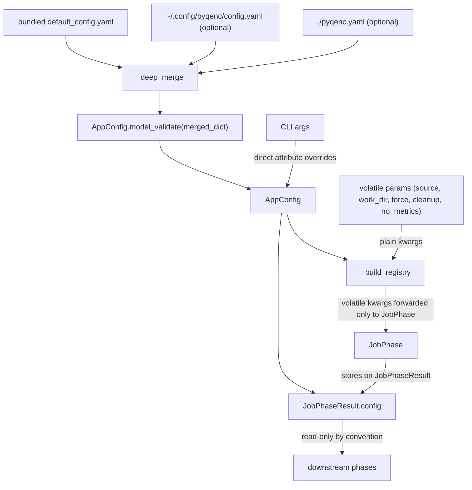
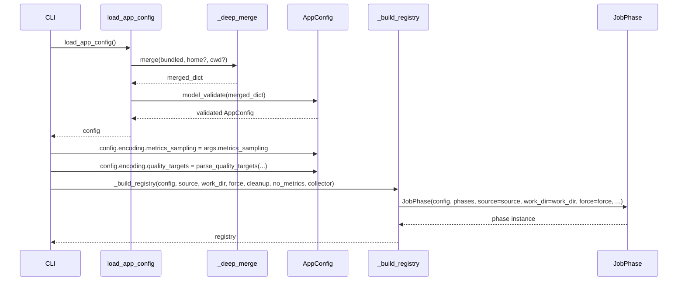

# Design Document: Config Refactor

<!-- markdownlint-disable MD024 -->

- Created: 2026-06-23
- Completed:

## Overview

The current config system has accumulated structural debt: `ConfigManager` (a plain `@dataclass`-backed loader) does single-file winner-takes-all YAML loading with no Pydantic validation, while `PipelineConfig` is a flat Pydantic model that mixes all concerns — stream filters, encoding targets, volatile runtime paths, audio settings, and per-codec definitions — as direct siblings. There is no way to layer a small local override on top of the bundled defaults without copying the entire config file.

This refactor replaces both `ConfigManager` and `PipelineConfig` with two clean concepts:

- **`AppConfig`** — a layered-loaded, Pydantic-validated, domain-structured config object. Loaded once at startup from up to three YAML files merged in priority order; CLI overrides are applied as direct attribute assignments afterwards. Represents all user-tunable settings.
- **Plain volatile parameters** — the per-run volatile values (source video path, work directory, force flag, cleanup level, etc.) are passed as plain keyword arguments directly to `_build_registry` and forwarded to `JobPhase.__init__`. No wrapper class. After `JobPhase` runs, these values are available as typed fields on `JobPhaseResult` for all downstream phases to read — no phase beyond `JobPhase` ever receives raw volatile args.

`AppConfig` is assembled in `cli.py` (or equivalent API entry point) and threaded through `_build_registry`. Volatile params also pass through `_build_registry` but only reach `JobPhase`. All other phases read both config and volatile state from `job_result.*` — a pattern that concentrates mutation to a single place and makes both config and runtime state read-only by convention during execution.

Per-phase state YAMLs (`extraction.yaml`, `chunking.yaml`, etc.) remain unchanged — they are recovery tracking files, not config.

## Architecture



## Sequence: Config Loading and Assembly



## AppConfig Structure

All sub-models are mutable Pydantic `BaseModel` instances. Validation is applied once at load time by `AppConfig.model_validate()`. The model is mutated in place by CLI overrides immediately after load, then treated as read-only by convention from that point on.

```python
class AppConfig(BaseModel):
    extraction: ExtractionConfig
    chunking:   ChunkingConfig
    encoding:   EncodingConfig
    audio:      AudioConfig
    codecs:     dict[str, CodecConfig]
    profiles:   dict[str, ProfileConfig]
```

### ExtractionConfig

```python
class ExtractionConfig(BaseModel):
    include: str | None = None   # regex for stream include filter
    exclude: str | None = None   # regex for stream exclude filter
```

Maps from `streams.include` / `streams.exclude` in the existing YAML. These were previously readable only via CLI flags — now they are first-class config values.

### ChunkingConfig

```python
class ChunkingConfig(BaseModel):
    mode:              ChunkingMode = ChunkingMode.LOSSLESS
    scene_threshold:   float        = 0.3
    min_scene_length:  int          = 24
```

### EncodingConfig

```python
class EncodingConfig(BaseModel):
    quality_targets:             list[str]        # raw strings e.g. "vmaf-min:95"
    strategies:                  list[str]        # raw pattern strings e.g. "slow+h265*"
    optimize:                    bool             = True
    max_parallel:                int              = DEFAULT_MAX_PARALLEL
    metrics_sampling:            int              = DEFAULT_METRICS_SAMPLING
    visual_hash:                 bool             = True
    strategy_selection_tolerance: float           = 5.0
    crop_params:                 CropParams | None = None  # None = auto-detect
```

`quality_targets` and `strategies` are stored as raw strings in the model and resolved to `list[QualityTarget]` / `list[Strategy]` on demand via `@computed_field` properties backed by validators that use the `codecs` and `profiles` from the parent `AppConfig`. The resolution is lazy but cached.

### AudioConfig

```python
class AudioConfig(BaseModel):
    convert_filter:    str                              # regex for audio conversion
    profiles:          dict[str, AudioConversionProfile]
    audio_codec:       str | None = None               # override codec for all profiles
    audio_base_bitrate: str | None = None              # override base bitrate
```

`AudioConversionProfile` moves from a plain `@dataclass` in `config.py` to a Pydantic model in `app_config.py`.

### ProfileConfig

```python
class ProfileConfig(BaseModel):
    codec:       str
    description: str        = ""
    extra_args:  list[str]  = []
```

Replaces the plain `@dataclass EncodingProfile` in `config.py`. Lives inside `AppConfig.profiles`.

## JobPhaseResult — Extended Fields

`JobPhaseResult` gains the following fields so downstream phases have typed access to runtime values without receiving raw volatile arguments in their constructors:

```python
@dataclass
class JobPhaseResult(PhaseResult):
    job:        JobState | None    # existing
    crop:       CropParams | None  # existing
    force_wipe: bool               # existing
    config:     AppConfig          # NEW — full validated config
    work_dir:   Path               # NEW — all phases need this for artifact paths
    source:     Path               # NEW — resolved from job.source.path
    cleanup:    CleanupLevel       # NEW — phases that manage artifacts need this
    no_metrics: bool               # NEW — phases that write metrics.yaml check this
```

`dry_run` remains a `run(dry_run: bool)` argument on each phase — it is per-call, not per-registry.

## _build_registry Signature

```python
def _build_registry(
    config:     AppConfig,
    source:     Path,
    work_dir:   Path,
    force:      bool,
    cleanup:    CleanupLevel,
    no_metrics: bool,
    collector:  MetricsCollector,
) -> dict[type[Phase], Phase]:
```

Volatile params are forwarded only to `JobPhase`. All other phase constructors receive only `(config, phases, *, collector)` — they get volatile values from `job_result.*` at runtime.

## Deep-Merge Semantics

```python
def _deep_merge(base: dict, override: dict) -> dict:
    """Recursively merge override on top of base.
    
    Rules:
    - Scalar values: override wins unconditionally.
    - Dict values: merge recursively (keys from both; override wins on conflicts).
    - List values: override wins unconditionally (full replacement, no append).
    """
```

This enables the key use case: a `./pyqenc.yaml` containing only:

```yaml
codecs:
  h265-10bit:
    quality_range: [8.0, 28.0]
```

will override just that codec's quality range while inheriting everything else from the bundled default.

## Components and Interfaces

### `app_config.py` — New module

- `_deep_merge(base: dict, override: dict) -> dict` — pure recursive merge function
- `AudioConversionProfile(BaseModel)` — codec, bitrate, extension
- `ProfileConfig(BaseModel)` — codec ref, description, extra_args
- `ExtractionConfig(BaseModel)` — include, exclude
- `ChunkingConfig(BaseModel)` — mode, scene_threshold, min_scene_length
- `EncodingConfig(BaseModel)` — quality_targets, strategies, optimize, max_parallel, metrics_sampling, visual_hash, strategy_selection_tolerance, crop_params; `resolve()` method; `resolved_targets` / `resolved_strategies` properties
- `AudioConfig(BaseModel)` — convert_filter, profiles, audio_codec, audio_base_bitrate
- `AppConfig(BaseModel)` — extraction, chunking, encoding, audio, codecs, profiles; `model_validator(mode='after')` triggers resolution
- `load_app_config() -> AppConfig` — discovers and merges YAML layers, returns validated instance

### `phase.py` — Updated

- `_build_registry(config, source, work_dir, force, cleanup, no_metrics, collector)` — constructs all phases; forwards volatile kwargs only to `JobPhase`

### `phases/job.py` — Updated

- `JobPhase.__init__(config, phases, *, source, work_dir, force, cleanup, no_metrics, collector)` — stores all volatile params
- `JobPhaseResult` — extended with `config: AppConfig`, `work_dir: Path`, `source: Path`, `cleanup: CleanupLevel`, `no_metrics: bool`

### All other phases — Updated constructors

- `__init__(config, phases, *, collector)` — no volatile params; read all runtime values from `self._job.result.*`

## Data Models

See [AppConfig Structure](#appconfig-structure) section above for the full model tree.

Key types:
- `AppConfig` — top-level config, owns all YAML-sourced settings
- `JobPhaseResult` — carries config + volatile runtime values for downstream phases
- `CodecConfig` (existing, unchanged) — per-codec quality params and encoder args template
- `Strategy` (existing, unchanged) — resolved preset + profile + codec

## Error Handling

- `AppConfig.model_validate()` raises `pydantic.ValidationError` on any invalid field — caught at startup before any phase runs
- `load_app_config()` raises `FileNotFoundError` if the bundled default is missing (should never happen in a correct install)
- Invalid strategy pattern strings (unknown profile/preset) raise `ValidationError` at load time via the `model_validator`
- Invalid quality target strings raise `ValidationError` at load time

## Testing Strategy

Property-based tests (Hypothesis) cover `_deep_merge` semantics and `AppConfig` round-trip. Unit tests cover `load_app_config()` with only bundled default. Integration verified via dry-run smoke test against the real sample video.

## Existing Files: What Changes

### `config.py`
- `ConfigManager` class is **deleted entirely**.
- `find_config_source()` is **deleted** (superseded by `load_app_config()` which handles all three paths internally).
- `AudioConversionProfile` **moved** to `app_config.py` as a Pydantic model.
- `AudioOutputConfig` **moved** to `app_config.py` merged into `AudioConfig`.
- `EncodingProfile` **moved** to `app_config.py` as `ProfileConfig`.
- File is either deleted or reduced to a thin re-export shim if anything external imports from it.

### `models.py`
- `PipelineConfig` is **deleted**.
- `CodecConfig` **stays** (referenced by `Strategy` and used widely).
- `Strategy` **stays** (referenced by encoding phases).
- `AudioConversionProfile`, `AudioOutputConfig` in `config.py` — already handled above.

### `phase.py`
- `_build_registry` signature changes:
  - **Before:** `_build_registry(config: PipelineConfig, collector: MetricsCollector)`
  - **After:** `_build_registry(config: AppConfig, source: Path, work_dir: Path, force: bool, cleanup: CleanupLevel, no_metrics: bool, collector: MetricsCollector)`
- Import of `PipelineConfig` removed; imports `AppConfig`.

### `phases/job.py`
- `JobPhase.__init__` receives plain volatile kwargs:
  ```python
  def __init__(
      self,
      config:     AppConfig,
      phases:     dict[type[Phase], Phase] | None,
      *,
      source:     Path,
      work_dir:   Path,
      force:      bool,
      cleanup:    CleanupLevel,
      no_metrics: bool,
      collector:  MetricsCollector,
  ) -> None:
  ```
- `self._config.source_video` → `self._source`
- `self._config.work_dir` → `self._work_dir`
- `self._config.force` → `self._force`
- `self._config.crop_params` → `self._config.encoding.crop_params`
- `self._config.chunking_mode` → `self._config.chunking.mode`
- `self._config.strategies` → resolved via `self._config.encoding.resolved_strategies`
- `self._config.optimize` → `self._config.encoding.optimize`
- `JobPhaseResult` gains fields: `config: AppConfig`, `work_dir: Path`, `source: Path`, `cleanup: CleanupLevel`, `no_metrics: bool` — all set from the stored volatile values when the phase completes.

### All other phases (ExtractionPhase, ChunkingPhase, OptimizationPhase, EncodingPhase, AudioPhase, MergePhase)
- Constructors remain `(config, phases, *, collector)` — **no volatile params in constructor**.
- `self._config` is now just the `AppConfig` passed at construction (used only until `job_result` is available).
- All volatile values read from `self._job.result.*` at runtime:
  - `self._config.source_video` → `self._job.result.source`
  - `self._config.work_dir` → `self._job.result.work_dir`
  - `self._config.force` → `self._job.result.force_wipe` (already exists) / force is consumed by JobPhase only
  - `self._config.cleanup` → `self._job.result.cleanup`
  - `self._config.no_metrics` → `self._job.result.no_metrics`
- All config values read from `self._job.result.config.*`:
  - `self._config.include` → `self._job.result.config.extraction.include`
  - `self._config.exclude` → `self._job.result.config.extraction.exclude`
  - `self._config.metrics_sampling` → `self._job.result.config.encoding.metrics_sampling`
  - `self._config.quality_targets` → `self._job.result.config.encoding.resolved_targets`
  - `self._config.strategies` → `self._job.result.config.encoding.resolved_strategies`
  - `self._config.optimize` → `self._job.result.config.encoding.optimize`
  - `self._config.max_parallel` → `self._job.result.config.encoding.max_parallel`
  - `self._config.visual_hash` → `self._job.result.config.encoding.visual_hash`
  - `self._config.strategy_selection_tolerance` → `self._job.result.config.encoding.strategy_selection_tolerance`
  - `self._config.audio_convert` → `self._job.result.config.audio.convert_filter`
  - `self._config.audio_codec` → `self._job.result.config.audio.audio_codec`
  - `self._config.audio_base_bitrate` → `self._job.result.config.audio.audio_base_bitrate`
  - `self._config.chunking_mode` → `self._job.result.config.chunking.mode`

### `cli.py`
- `ConfigManager()` calls removed.
- `PipelineConfig(...)` construction removed.
- New assembly block:
  ```python
  config = load_app_config()
  # CLI overrides (only when explicitly provided by user)
  if args.metrics_sampling is not None:
      config.encoding.metrics_sampling = args.metrics_sampling
  if args.quality_target is not None:
      config.encoding.quality_targets = _parse_quality_targets(args.quality_target)
  if args.strategies is not None:
      config.encoding.strategies = _parse_strategies(args.strategies) or []
  if args.all_strategies:
      config.encoding.optimize = False
  if args.max_parallel is not None:
      config.encoding.max_parallel = args.max_parallel
  if args.include is not None:
      config.extraction.include = args.include
  if args.exclude is not None:
      config.extraction.exclude = args.exclude
  if args.audio_convert is not None:
      config.audio.convert_filter = args.audio_convert
  if args.audio_codec is not None:
      config.audio.audio_codec = args.audio_codec
  if args.audio_bitrate is not None:
      config.audio.audio_base_bitrate = args.audio_bitrate
  if args.crop is not None:
      config.encoding.crop_params = _resolve_crop_params(args)
  if hasattr(args, "chunking"):
      config.chunking.mode = ChunkingMode.REMUX if args.chunking == "remux" else ChunkingMode.LOSSLESS

  registry = _build_registry(
      config     = config,
      source     = args.source,
      work_dir   = LongPath(args.work_dir),
      force      = getattr(args, "force", False),
      cleanup    = _parse_cleanup_level(args.cleanup),
      no_metrics = getattr(args, "no_metrics", False),
      collector  = collector,
  )
  ```
- Import `load_app_config` from `pyqenc.app_config`.

### `api.py`
- `_minimal_config()` helper removed; replaced by `load_app_config()` + direct overrides pattern.
- All public API functions updated to call `_build_registry` with plain volatile kwargs.
- `PipelineConfig` import removed.

### `orchestrator.py`
- `PipelineOrchestrator.__init__` receives `(registry: dict, ...)` — no config/context directly, as registry is already built.
- References to `self._config.*` replaced with reads from `job_phase.result.*`.

## Strategy Resolution

`EncodingConfig.quality_targets` and `EncodingConfig.strategies` store raw strings (same format as in YAML). Resolution to typed objects is lazy and cached:

```python
class EncodingConfig(BaseModel):
    quality_targets: list[str] = []
    strategies:      list[str] = []
    ...
    
    # These are computed at first access and cached — not persisted to YAML
    _resolved_targets:   list[QualityTarget] | None = PrivateAttr(default=None)
    _resolved_strategies: list[Strategy] | None     = PrivateAttr(default=None)
    
    def resolve(self, codecs: dict[str, CodecConfig], profiles: dict[str, ProfileConfig]) -> None:
        """Resolve raw strings to typed objects. Called once by AppConfig validator."""
        ...
```

`AppConfig` runs a `model_validator(mode='after')` that calls `self.encoding.resolve(self.codecs, self.profiles)`. This means resolution happens exactly once at load time, after the full config is assembled, so strategy resolution has access to the complete codec/profile library.

## default_config.yaml Changes

The existing `default_config.yaml` requires a structural change to match `AppConfig`'s namespace:

| Old key | New key |
|---------|---------|
| `default_targets` | `encoding.quality_targets` |
| `default_strategies` | `encoding.strategies` |
| `metrics.sampling` | `encoding.metrics_sampling` |
| `streams.include` | `extraction.include` |
| `streams.exclude` | `extraction.exclude` |
| `audio_output.convert_filter` | `audio.convert_filter` |
| `audio_output.profiles` | `audio.profiles` |
| `codecs` | `codecs` (unchanged) |
| `profiles` | `profiles` (unchanged) |

The new structure adds chunking defaults:
```yaml
chunking:
  mode: lossless
  scene_threshold: 0.3
  min_scene_length: 24
```

## Correctness Properties

*A property is a characteristic or behavior that should hold true across all valid executions of a system — essentially, a formal statement about what the system should do.*

### Property 1: Deep-merge preserves base scalar when override is absent

*For any* valid base config dict and any override dict that does not contain a given scalar key, the merged result must contain the same value for that key as the base.

**Validates: Requirements 2.2, 2.5**

### Property 2: Deep-merge override wins on scalar conflict

*For any* valid base config dict and override dict that share a scalar key with different values, the merged result must use the override's value.

**Validates: Requirements 2.1**

### Property 3: Deep-merge recursively merges nested dicts

*For any* base config dict and override dict where both contain the same dict-valued key, the merged result must contain all keys from both sub-dicts, with the override winning on any conflicting scalar leaf.

**Validates: Requirements 2.3**

### Property 4: Deep-merge fully replaces lists

*For any* base config dict containing a list-valued key and an override dict containing the same key with a different list, the merged result must contain exactly the override's list (no elements from the base list).

**Validates: Requirements 2.4**

### Property 5: AppConfig serialization round-trip

*For any* valid `AppConfig` instance, serialising it to a dict via `model_dump()` and feeding that dict back through `AppConfig.model_validate()` must produce an equivalent `AppConfig` (same field values throughout the model tree), with `encoding.quality_targets` and `encoding.strategies` preserved as their raw string forms so that re-validation triggers resolution again correctly.

**Validates: Requirements 3.1, 11.1, 11.2**

### Property 6: CLI overrides propagate correctly

*For any* valid `AppConfig` and any field-value pair that the CLI is allowed to override (metrics_sampling, quality_targets, strategies, optimize, max_parallel, include, exclude, convert_filter, audio_codec, audio_base_bitrate, crop_params, chunking mode), applying the override via direct attribute assignment and then reading back the same field must return the overridden value.

**Validates: Requirements 6.2, 6.3, 6.4, 6.5, 6.6, 6.7, 6.8, 6.9, 6.10, 6.11, 6.12, 6.13**

### Property 7: Strategy resolution is deterministic and idempotent

*For any* `AppConfig` with a given `encoding.strategies` list and a given `codecs`/`profiles` map, calling `encoding.resolved_strategies` multiple times must always return the same list of `Strategy` objects (same count, same order, same content) — resolution is performed exactly once and cached.

**Validates: Requirements 3.3, 3.4, 10.1, 10.2**

### Property 8: Layer priority ordering

*For any* three config dicts `base`, `home`, `cwd` that share a scalar key with three different values, `_deep_merge(_deep_merge(base, home), cwd)` must return the `cwd` value for that key.

**Validates: Requirements 1.4**

### Property 9: Strategy deduplication

*For any* `encoding.strategies` list that contains duplicate `(preset, profile)` combinations (whether from overlapping wildcard patterns or explicit repetition), `encoding.resolved_strategies` must return a list with no duplicate `(preset, profile)` pairs, retaining the first occurrence.

**Validates: Requirements 10.3**

### Property 10: Invalid AppConfig raises ValidationError

*For any* merged config dict that violates a field constraint — including an unknown strategy profile or preset name, or an unrecognised quality target metric or statistic — calling `AppConfig.model_validate()` must raise a `ValidationError` that identifies the offending field or value.

**Validates: Requirements 3.2, 3.5, 3.6**
