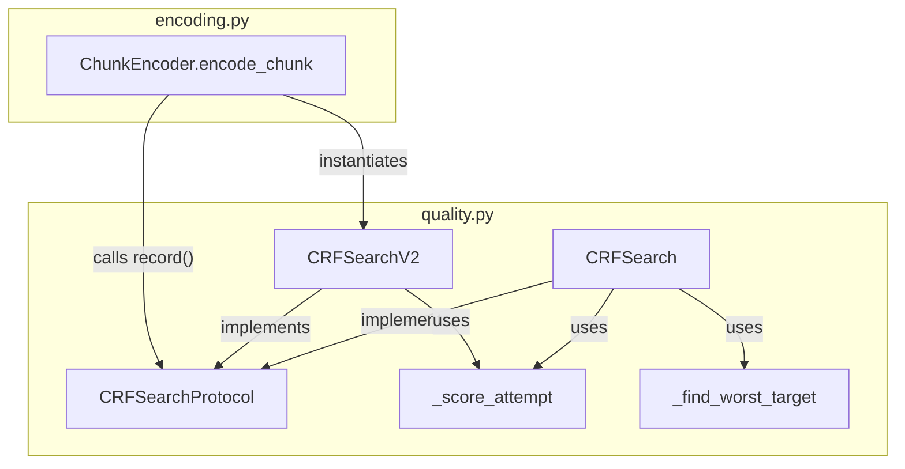

# Design: CRF Search Refactor

<!-- markdownlint-disable MD024 -->

- Created: 2026-04-06
- Completed:

> **Note (2026-04-06 - pre-implementation changes to superseded code):**
> Before this refactor was implemented, the following changes were made to `CRFHistory` / `adjust_crf` and `CodecConfig`:
> - `CodecConfig.quality_range` order is now preserved as-is from config: `quality_range[0]` is always the *better* end. Added `quality_better`, `quality_worse`, and `quality_higher_is_better` properties.
> - `CodecConfig.quality_max_step` field added: optional cap on the absolute step size per `adjust_crf` iteration.
> - `CRFHistory` fields renamed: `pass_crf` = better-quality boundary, `fail_crf` = worse-quality boundary. `add()` is now unconditional.
> - `adjust_crf` updated: exhaustion/span checks use `abs()`, direction-agnostic, `quality_max_step` parameter added.
> - `_load_history_from_sidecars` **removed**: recovery handled by artifact-check-per-step in the encoding loop.
>
> These changes are superseded by this refactor. The `quality_better`/`quality_worse`, `quality_max_step`, and artifact-check-per-step recovery concepts carry forward.

---

## Overview

The current CRF search implementation is split across two loosely coupled objects: `CRFHistory` (a passive dataclass) and `adjust_crf()` (a standalone function). The caller in `encoding.py` additionally maintains `best_failing_attempt`, `best_failing_crf`, and `best_failing_metrics` as separate local variables alongside the history object.

This refactor introduces a unified `CRFSearchProtocol` that encapsulates the full search state behind a single `record()` call. The existing algorithm is preserved as `CRFSearch`. A new `CRFSearchV2` implementing a 3-point sweet-spot search is added and becomes the default. `ChunkEncoder` is simplified to use the protocol interface exclusively.

Key design decisions:
- `CRFSearchProtocol` is a `typing.Protocol` -- structural subtyping, no inheritance required.
- `quality_targets`, `granularity`, `quality_better`, `quality_worse`, and `quality_max_step` are constructor arguments, not per-call arguments, so `record()` has a minimal signature.
- `CRFHistory` and `adjust_crf()` are **removed** -- the project is pre-alpha and code cleanliness takes priority over backward compatibility per coding standards.
- `_load_history_from_sidecars` is **removed** -- recovery is handled by artifact-check-per-step in the encoding loop.
- `CRFSearchV2` is the default in `encode_chunk()`.

---

## Architecture



The encoding loop in `encode_chunk()` now has a single, clean shape:

```
search = CRFSearchV2(quality_better, quality_worse, quality_targets, granularity, quality_max_step)
current_crf = initial_crf
any_real_work = False

while True:
    existing = check_existing_encoding(current_crf)
    if existing:
        sidecar = read_sidecar(existing)
        if sidecar is valid (keys present, sampling matches):
            metrics = sidecar.metrics          # full cache hit
        else:
            any_real_work = True
            metrics = evaluate(existing)       # re-measure only, .mkv reused
    else:
        any_real_work = True
        encode(current_crf)                    # encode + measure
        metrics = evaluate()
    next_crf = search.record(current_crf, metrics)
    if next_crf is None:
        break
    current_crf = next_crf

advance(SKIPPED if not any_real_work else NORMAL)
finalize(search.best_crf, search.best_metrics, search.best_targets_met)
```

Sidecar validity is determined by the same rules already in place: required target metric keys must be present, and `metrics_sampling` must match the current config. A stale sidecar triggers re-measurement but not re-encoding.

---

## Components and Interfaces

### CRFSearchProtocol

Defined in `pyqenc/quality.py` as a `typing.Protocol`.

```python
class CRFSearchProtocol(Protocol):
    @property
    def attempts(self) -> int: ...

    @property
    def best_crf(self) -> Decimal | None: ...

    @property
    def best_metrics(self) -> dict[str, float] | None: ...

    @property
    def best_targets_met(self) -> bool: ...

    def record(self, crf: Decimal, quality_results: dict[str, float]) -> Decimal | None: ...
```

- `record()` updates internal state and returns the next CRF to try, or `None` when the search is exhausted or the current result is accepted.
- `quality_targets`, `granularity`, `quality_better`, `quality_worse`, and `quality_max_step` are supplied at construction time.
- Before any `record()` call: `best_crf` is `None`, `best_metrics` is `None`, `best_targets_met` is `False`.

### MetricInfo.acceptance_delta

Each `MetricInfo` gains a new field `acceptance_delta: float` -- the per-metric threshold below which a passing surplus is considered "close enough" to trigger early acceptance. Replaces the global `CRF_METRIC_POSITIVE_DELTA` constant.

Values (raw metric units, before normalization):
- VMAF: `0.5` (0.5% surplus is negligible)
- SSIM: `0.05` (0.05% after scaling, i.e. 0.0005 raw)
- PSNR: `0.5` (0.5 dB surplus is negligible)
- VIF: `0.005` (small absolute value due to VIF's compressed scale)

Early acceptance is triggered inside `_score_attempt` when all targets pass and every surplus is within `acceptance_delta` -- the function returns `0.0` in this case, signalling "sweet spot found, no further search needed."

### CodecConfig.quality_log_padding

The global `PADDING_QUALITY_NUMBER = 4` constant is removed. Each `CodecConfig` gains a computed property `quality_log_padding: int` that derives the correct column width for log formatting from the codec's own range and granularity:

```python
@property
def quality_log_padding(self) -> int:
    max_val = max(abs(self.quality_better), abs(self.quality_worse))
    return len(str(Decimal(str(max_val)).quantize(self.quality_granularity)))
```

Examples:
- CRF range `[0, 51]`, gran `0.5` -> `"51.0"` -> 4 chars
- VBR range `[0, 100]`, gran `0.1` -> `"100.0"` -> 5 chars
- QP range `[0, 63]`, gran `1` -> `"63"` -> 2 chars

All log formatting uses `strategy.codec.quality_log_padding` instead of the removed constant. File naming is unaffected -- no padding in filenames (filenames sort correctly without it).

### _score_attempt

Unified scoring function replacing `_score_failing_attempt`. Returns a signed float encoding both pass/fail and distance from the sweet spot:

```python
def _score_attempt(
    metrics:         dict[str, float],
    quality_targets: list[QualityTarget],
) -> float:
```

- **Missing metrics**: raises `ValueError` if any target key is absent from `metrics`.
- **Early acceptance** (pass + all surpluses <= `acceptance_delta`): returns `0.0` -- caller treats this as "accepted, stop searching."
- **Pass** (all targets met, some surplus > `acceptance_delta`): returns `sum(surplus / comparison_range for all targets)` -> positive.
- **Fail** (any target not met): returns `sum(deficit / comparison_range for failing targets only)` -> negative.

**Sweet-spot comparison**: `abs(score)` -- closest to zero = best attempt, regardless of pass/fail side. `score == 0.0` means "accepted."

**Derived properties** (no separate `targets_met` bool needed):
- `score > 0` -> targets met
- `score < 0` -> targets not met
- `score == 0.0` -> targets met within acceptance delta -> early exit

**Debug logging**: logs per-target normalized contributions at `DEBUG` level so metric skew (e.g. PSNR dominating) is visible in logs.

### CRFSearch

Preserves the existing binary-bracket algorithm. Encapsulates the state currently held by `CRFHistory` and the logic currently in `adjust_crf()`.

Constructor: `CRFSearch(quality_better, quality_worse, quality_targets, granularity, quality_max_step=None)`

Internal state: `_better_crf`, `_worse_crf`, `_better_metrics`, `_worse_metrics`, `_attempts`. Direction-agnostic: uses `quality_better`/`quality_worse` instead of assuming lower=better. The `record()` method runs the same proportional interpolation logic as `adjust_crf()`, using `_score_attempt` for the worst-target lookup.

`CRFHistory` and `adjust_crf()` are **removed** from `quality.py`.

### CRFSearchV2

Implements the 3-point sweet-spot algorithm. Handles both the all-failing case (targets too high, searching toward `quality_better`) and the all-passing case (targets too low, searching toward `quality_worse`) symmetrically.

**All-failing case -- Phase 1** (while `_pass_metrics is None`):
- Search range: `[_pass_crf(sentinel=quality_better) ... _best_crf]`
- `_best_crf` updated to each new better-scoring attempt; `_fail_crf` lags one step behind as outer reserve
- Transition trigger: new attempt scores worse than `_best_crf` -> `_pass_crf = current` (3-point mode)

**All-passing case -- Phase 1** (while `_fail_metrics is None`):
- Search range: `[_best_crf ... _fail_crf(sentinel=quality_worse)]`
- `_best_crf` updated to each new better-scoring attempt; `_pass_crf` lags one step behind as outer reserve
- Transition trigger: new attempt scores worse than `_best_crf` -> `_fail_crf = current` (3-point mode)

**Phase 2 -- 3-point mode** (both `_pass_metrics` and `_fail_metrics` are not None):
- Two active ranges: Range A = `[_pass_crf ... _best_crf]`, Range B = `[_best_crf ... _fail_crf]`
- Next CRF: midpoint of the larger range (capped by `quality_max_step` if set)
- Sweet-spot comparison: `abs(_score_attempt(...))` -- closest to zero = best

Constructor: `CRFSearchV2(quality_better, quality_worse, quality_targets, granularity, quality_max_step=None)`

Internal state:
- `_pass_crf = quality_better` (sentinel)
- `_pass_metrics: dict[str, float] | None = None`
- `_best_crf: Decimal = quality_worse` (sentinel -- updated to first real attempt)
- `_best_metrics: dict[str, float] | None = None`
- `_best_score: float = -inf`
- `_fail_crf = quality_worse` (sentinel, lags behind `_best_crf` in all-failing phase)
- `_fail_metrics: dict[str, float] | None = None`
- `_attempts: int = 0`
- `_exhausted: bool = False`

**3-point mode is active when both `_pass_metrics is not None` and `_fail_metrics is not None`.**

### _load_history_from_sidecars (removed)

`_load_history_from_sidecars` has been **removed**. The encoding loop handles recovery by calling `_check_existing_encoding` on each quality step before encoding -- replaying the same quality sequence through cached artifacts until it reaches an un-encoded value.

**Progress bar skipping for fully-recovered chunks**: the encoding loop tracks `_any_real_work: bool` per chunk. Each attempt that hits `_check_existing_encoding` (cache hit) does not set the flag. Only actual encoding or metric measurement sets it. When the loop finishes and `_any_real_work` is `False`, the chunk advances the progress bar with `AdvanceState.SKIPPED` and `ChunkEncodingResult.reused = True`. This prevents fully-recovered chunks from skewing ETA calculations.

### Attempt Filename Rename (.crf -> .q)

The current attempt filename pattern `<chunk_id>.<resolution>.crf<value>.mkv` uses `.crf` which is misleading for codecs that use CQ, QP, or bitrate as their quality parameter.

Changes required:
- `ENCODED_ATTEMPT_GLOB_PATTERN`: `"*.crf*.mkv"` -> `"*.q*.mkv"`
- `ENCODED_ATTEMPT_NAME_PATTERN` regex: `\.crf(?P<crf>[\d.]+)\.` -> `\.q(?P<quality>[\d.]+)\.` (rename capture group from `crf` to `quality`)
- `_get_attempt_path()` in `ChunkEncoder`: filename construction uses `.q{value}` instead of `.crf{value}`
- `_check_existing_encoding()`: glob and regex match updated accordingly
- All callers of `m.group("crf")` updated to `m.group("quality")`
- `CRF_METRIC_POSITIVE_DELTA` constant removed; per-metric `acceptance_delta` on `MetricInfo` replaces it
- `PADDING_QUALITY_NUMBER` constant removed; `CodecConfig.quality_log_padding` replaces it

**Backward compatibility**: existing `*.crf*.mkv` artifacts will not be found by the new glob. Existing work directories should be wiped before upgrading. A warning at startup when old-format files are detected is optional but recommended.

---

## Data Models

### State Invariants (both algorithms)

After any sequence of `record()` calls:

| Condition | `best_crf` | `best_metrics` | `best_targets_met` |
|---|---|---|---|
| No calls yet | `None` | `None` | `False` |
| >=1 call, none pass | CRF with smallest `abs(_score_attempt())` | metrics at that CRF | `False` |
| >=1 passing call | Best-efficiency passing CRF | metrics at that CRF | `True` |

`attempts` always equals the total number of `record()` calls.

### CRFSearchV2 State Transitions

On each `record(crf, quality_results)` call, compute `score = _score_attempt(quality_results, quality_targets)`.

If `score == 0.0` (early acceptance): update `_best_crf`/`_best_metrics`/`_best_score`, set `_exhausted = True`, return `None`.

**Phase 1 -- 2-point mode** (either `_pass_metrics is None` or `_fail_metrics is None`):

All-failing sub-case (`_pass_metrics is None`):
1. If `abs(score) < abs(_best_score)` (new best):
   - `_fail_crf = _best_crf`, `_fail_metrics = _best_metrics` (lag one step)
   - `_best_crf = crf`, `_best_metrics = quality_results`, `_best_score = score`
   - Next: interpolate within `[_pass_crf ... _best_crf]`
2. If `abs(score) >= abs(_best_score)` (worse -- sweet spot passed):
   - **Transition**: `_pass_crf = crf`, `_pass_metrics = quality_results`
   - Next: midpoint of larger of Range A and Range B

All-passing sub-case (`_fail_metrics is None`):
1. If `abs(score) < abs(_best_score)` (new best):
   - `_pass_crf = _best_crf`, `_pass_metrics = _best_metrics` (lag one step)
   - `_best_crf = crf`, `_best_metrics = quality_results`, `_best_score = score`
   - Next: interpolate within `[_best_crf ... _fail_crf]`
2. If `abs(score) >= abs(_best_score)` (worse -- sweet spot passed):
   - **Transition**: `_fail_crf = crf`, `_fail_metrics = quality_results`
   - Next: midpoint of larger of Range A and Range B

**Phase 2 -- 3-point mode** (both `_pass_metrics` and `_fail_metrics` are not None):

1. Determine range: Range A if `crf` is between `_pass_crf` and `_best_crf`, Range B if between `_best_crf` and `_fail_crf`.
2. If `abs(score) < abs(_best_score)` **and drawn from Range B**: promote -- `_pass_crf = _best_crf`, `_pass_metrics = _best_metrics`, `_best_crf = crf`, `_best_metrics = quality_results`, `_best_score = score`, `_fail_crf` unchanged.
3. If `abs(score) < abs(_best_score)` **and drawn from Range A**: demote outer -- `_fail_crf = _best_crf`, `_fail_metrics = _best_metrics`, `_best_crf = crf`, `_best_metrics = quality_results`, `_best_score = score`, `_pass_crf` unchanged.
4. If `abs(score) >= abs(_best_score)` **and drawn from Range B**: tighten -- `_fail_crf = crf`, `_fail_metrics = quality_results`.
5. If `abs(score) >= abs(_best_score)` **and drawn from Range A**: tighten -- `_pass_crf = crf`, `_pass_metrics = quality_results`.
6. Next CRF: midpoint of the larger of Range A and Range B (capped by `quality_max_step`).
7. If both ranges <= granularity: `_exhausted = True`, return `None`.

### Convergence

Both algorithms converge in O(log N) attempts where N is the number of distinct quality values in the range. Each attempt halves at least one active search interval, so the total number of attempts grows logarithmically with the search space -- never linearly scanning every possible value.

---

## Correctness Properties

*A property is a characteristic or behavior that should hold true across all valid executions of a system.*

### Property 1: CRFSearch convergence

*For any* valid `(quality_better, quality_worse, granularity)` where `quality_better != quality_worse` and `granularity > 0`, and for any sequence of quality results, `CRFSearch` must return `None` from `record()` in O(log N) attempts -- each attempt must halve the active search interval.

**Validates: Requirements 4.1**

### Property 2: CRFSearchV2 convergence

*For any* valid `(quality_better, quality_worse, granularity)` where `quality_better != quality_worse` and `granularity > 0`, and for any sequence of quality results, `CRFSearchV2` must return `None` from `record()` in O(log N) attempts -- each attempt must halve at least one of the two active ranges.

**Validates: Requirements 4.2**

### Property 3: Finality after exhaustion

*For any* `CRFSearchProtocol` implementation, once `record()` returns `None`, all subsequent `record()` calls must also return `None`.

**Validates: Requirements 4.3**

### Property 4: Protocol state invariants

*For any* `CRFSearchProtocol` implementation and any sequence of `record()` calls:
- `attempts` equals the total number of `record()` calls made.
- After at least one `record()` call, `best_crf` is not `None`.
- `best_targets_met` is `True` if and only if at least one passing attempt was recorded.
- When `best_targets_met` is `True`, `best_crf` is the best-efficiency passing CRF (smallest `abs(score)` among passing attempts).
- When `best_targets_met` is `False`, `best_crf` is the CRF of the attempt with the smallest `abs(_score_attempt())` value among all attempts.

**Validates: Requirements 5.1, 5.2, 5.3, 5.4, 5.5**

### Property 5: _score_attempt sign contract

*For any* complete `(metrics, quality_targets)` pair:
- Returns `> 0` when all targets pass and at least one surplus exceeds `acceptance_delta`.
- Returns `== 0.0` when all targets pass and all surpluses are within `acceptance_delta`.
- Returns `< 0` when any target fails.
- Raises `ValueError` when any target key is missing from `metrics`.

**Validates: Requirements 1.3, 3.x**

---

## Error Handling

- `record()` called after exhaustion (`_exhausted = True`): return `None` immediately, do not mutate state.
- `quality_results` missing keys for any `quality_targets`: `_score_attempt` raises `ValueError`; caller logs and treats as fail with score `-inf` to allow search to continue.
- `quality_better == quality_worse`: raise `ValueError` at construction time.
- `granularity <= 0`: raise `ValueError` at construction time.

---

## Testing Strategy

### Dual Testing Approach

Both unit tests and property-based tests are required.

### Property-Based Testing

Library: **Hypothesis** (already used in the project).

Each property test runs a minimum of **200 iterations**.

Tag format: `# Feature: crf-search-refactor, Property N: <property_text>`

**Property test file**: `tests/test_crf_search_properties.py`

| Property | Test function | Hypothesis strategies |
|---|---|---|
| P1: CRFSearch convergence | `test_crfsearch_convergence_bound` | `st.decimals` for range/granularity, `st.lists` of pass/fail booleans |
| P2: CRFSearchV2 convergence | `test_crfsearchv2_convergence_bound` | same as P1 |
| P3: Finality after None | `test_search_finality_after_exhaustion` | parametrized over both implementations |
| P4: State invariants | `test_protocol_state_invariants` | parametrized over both implementations, `st.lists` of `(crf, quality_results)` pairs |
| P5: _score_attempt sign contract | `test_score_attempt_sign_contract` | `st.lists` of `(metric_value, target_value)` pairs |

### Unit Tests

**Unit test file**: `tests/unit/test_quality.py` (extended)

- Initial state before any `record()` call (both implementations).
- `CRFSearch` state transitions: pass narrows better bound, fail narrows worse bound, exhaustion returns `None`.
- `CRFSearchV2` all state-transition cases: one test per case with a concrete setup.
- `CRFSearchV2` initial sentinel state.
- `_score_attempt`: early acceptance returns `0.0`, pass returns positive, fail returns negative, missing key raises.
- `MetricInfo.acceptance_delta` values present for all active metrics.
- `CodecConfig.quality_log_padding` computed correctly for representative ranges.
- `encode_chunk` uses `CRFSearchV2` by default -- verified via mock.
- `CRFSearch` usable as drop-in alternative.
- Fully-recovered chunk (all cache hits) advances progress bar as SKIPPED.

### Integration Tests

`tests/integration/test_encoding_quality.py` (extended): verify that `encode_chunk` with a mocked quality evaluator converges correctly using `CRFSearchV2`, including artifact-check-per-step recovery and progress bar SKIPPED behavior.
