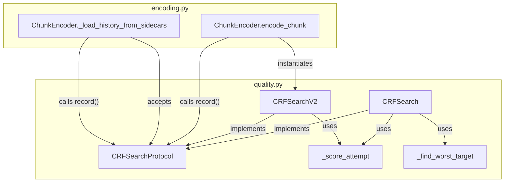

# Design: CRF Search Refactor

<!-- markdownlint-disable MD024 -->

- Created: 2025-07-17
- Completed:

---

## Overview

The current CRF search implementation is split across two loosely coupled objects: `CRFHistory` (a passive dataclass) and `adjust_crf()` (a standalone function). The caller in `encoding.py` additionally maintains `best_failing_attempt`, `best_failing_crf`, and `best_failing_metrics` as separate local variables alongside the history object.

This refactor introduces a unified `CRFSearchProtocol` that encapsulates the full search state behind a single `record()` call. The existing algorithm is preserved as `CRFSearch`. A new `CRFSearchV2` implementing a 3-point sweet-spot search is added and becomes the default. `ChunkEncoder` is simplified to use the protocol interface exclusively.

Key design decisions:
- `CRFSearchProtocol` is a `typing.Protocol` — structural subtyping, no inheritance required.
- `quality_targets` and `granularity` are constructor arguments, not per-call arguments, so `record()` has a minimal signature.
- `CRFHistory` and `adjust_crf()` are **removed** — the project is pre-alpha and code cleanliness takes priority over backward compatibility per coding standards.
- `_load_history_from_sidecars` accepts a pre-instantiated `CRFSearchProtocol` and returns only `Decimal | None`.
- `CRFSearchV2` is the default in `encode_chunk()`.

---

## Architecture



The encoding loop in `encode_chunk()` now has a single, clean shape:

```
search = CRFSearchV2(crf_min, crf_max, quality_targets, granularity)
seed_crf = _load_history_from_sidecars(chunk_id, strategy, search)
current_crf = seed_crf or initial_crf

while True:
    encode(current_crf)
    metrics = evaluate()
    next_crf = search.record(current_crf, metrics)
    if next_crf is None:
        break
    current_crf = next_crf

finalize(search.best_crf, search.best_metrics, search.best_targets_met)
```

---

## Components and Interfaces

### CRFSearchProtocol

Defined in `pyqenc/quality.py` as a `typing.Protocol`.

```python
class CRFSearchProtocol(Protocol):
    @property
    def attempts(self) -> int: ...

    @property
    def best_crf(self) -> Decimal | None: ...

    @property
    def best_metrics(self) -> dict[str, float] | None: ...

    @property
    def best_targets_met(self) -> bool: ...

    def record(self, crf: Decimal, quality_results: dict[str, float]) -> Decimal | None: ...
```

- `record()` updates internal state and returns the next CRF to try, or `None` when the search is exhausted or the current result is accepted.
- `quality_targets` and `granularity` are supplied at construction time.
- Before any `record()` call: `best_crf` is `None`, `best_metrics` is `None`, `best_targets_met` is `False`.

### _score_attempt

Unified scoring function replacing the previous `_score_failing_attempt`. Returns a signed float where the sign encodes pass/fail and the magnitude encodes distance from the sweet spot:

```python
def _score_attempt(
    metrics:         dict[str, float],
    quality_targets: list[QualityTarget],
) -> float:
```

- **Fail** (any target not met): sum of `deficit / comparison_range` for *failing targets only* → result < 0
- **Pass** (all targets met): sum of `surplus / comparison_range` for *all targeted metrics* → result > 0
- Returns `-inf` when no target has a valid result in `metrics`

**Sweet-spot comparison**: `abs(score)` — closest to zero = best attempt, regardless of pass/fail side. No phase-awareness needed in comparisons.

**Derived properties**:
- `score >= 0` → targets met (`best_targets_met = True`)
- `score < 0` → targets not met
- `best_score = score` with smallest `abs(score)` across all attempts

**Debug logging**: each `_score_attempt` call logs the per-target normalized contributions at `DEBUG` level so skew from individual metrics (e.g. PSNR) is visible.

### CRFSearch

Preserves the existing binary-bracket algorithm. Encapsulates the state currently held by `CRFHistory` and the logic currently in `adjust_crf()`.

Constructor: `CRFSearch(crf_min, crf_max, quality_targets, granularity)`

Internal state mirrors `CRFHistory`: `_fail_crf`, `_pass_crf`, `_fail_metrics`, `_pass_metrics`, `_attempts`. The `record()` method runs the same interpolation logic as `adjust_crf()`.

`CRFHistory` and `adjust_crf()` are **removed** from `quality.py`.

### CRFSearchV2

Implements the 3-point sweet-spot algorithm. Handles both the all-failing case (targets too high, searching lower CRF) and the all-passing case (targets too low, searching higher CRF) symmetrically.

**All-failing case — Phase 1** (while `_pass_metrics is None`, searching lower CRF):
- Search range: `[_pass_crf(sentinel) ... _best_crf]`
- `_best_crf` updated to each new better-scoring attempt; `_fail_crf` lags one step behind as outer reserve
- Transition trigger: new attempt scores worse than `_best_crf` → `_pass_crf = current` (3-point mode)

**All-passing case — Phase 1** (while `_fail_metrics is None`, searching higher CRF):
- Search range: `[_best_crf ... _fail_crf(sentinel)]`
- `_best_crf` updated to each new better-scoring attempt; `_pass_crf` lags one step behind as outer reserve
- Transition trigger: new attempt scores worse than `_best_crf` → `_fail_crf = current` (3-point mode)

**Phase 2 — 3-point mode** (both `_pass_metrics` and `_fail_metrics` are not None):
- Two active ranges: Range A = `[_pass_crf ... _best_crf]`, Range B = `[_best_crf ... _fail_crf]`
- Next CRF: midpoint of the larger range
- Sweet-spot comparison: `abs(_score_attempt(...))` — closest to zero = best

Constructor: `CRFSearchV2(crf_min, crf_max, quality_targets, granularity)`

Internal state:
- `_pass_crf = crf_min` (sentinel)
- `_pass_metrics: dict[str, float] | None = None`
- `_best_crf: Decimal = crf_max` (sentinel — updated to first real attempt)
- `_best_metrics: dict[str, float] | None = None`
- `_best_score: float = -inf` (using `abs` comparison: `abs(score) < abs(_best_score)` = better)
- `_fail_crf = crf_max` (sentinel, lags behind `_best_crf` in all-failing phase)
- `_fail_metrics: dict[str, float] | None = None`
- `_attempts: int = 0`
- `_exhausted: bool = False`

**3-point mode is active when both `_pass_metrics is not None` and `_fail_metrics is not None`**.

### _load_history_from_sidecars (updated)

New signature:

```python
def _load_history_from_sidecars(
    self,
    chunk_id:        str,
    strategy:        Strategy,
    search:          CRFSearchProtocol,
) -> Decimal | None:
```

- Accepts a pre-instantiated `CRFSearchProtocol` (caller controls which algorithm).
- Calls `search.record()` for each valid sidecar entry; return values are discarded.
- Returns `Decimal | None` — the highest passing CRF found in sidecars (seed CRF), or `None`.
- The caller (`encode_chunk`) instantiates the search object before calling this method.

---

## Data Models

### State Invariants (both algorithms)

After any sequence of `record()` calls:

| Condition | `best_crf` | `best_metrics` | `best_targets_met` |
|---|---|---|---|
| No calls yet | `None` | `None` | `False` |
| ≥1 call, none pass | CRF with smallest `abs(_score_attempt())` | metrics at that CRF | `False` |
| ≥1 passing call | Highest passing CRF (most efficient) | metrics at that CRF | `True` |

`attempts` always equals the total number of `record()` calls.

### CRFSearchV2 State Transitions

On each `record(crf, quality_results)` call, compute `score = _score_attempt(quality_results, quality_targets)`.

**Phase 1 — 2-point mode** (either `_pass_metrics is None` or `_fail_metrics is None`):

All-failing sub-case (`_pass_metrics is None`, searching lower CRF):
1. If `abs(score) < abs(_best_score)` (new best — closer to sweet spot):
   - `_fail_crf = _best_crf`, `_fail_metrics = _best_metrics` (lag one step)
   - `_best_crf = crf`, `_best_metrics = quality_results`, `_best_score = score`
   - Next: interpolate within `[_pass_crf ... _best_crf]`
2. If `abs(score) >= abs(_best_score)` (worse — sweet spot passed):
   - **Transition**: `_pass_crf = crf`, `_pass_metrics = quality_results`
   - Next: midpoint of larger of Range A and Range B

All-passing sub-case (`_fail_metrics is None`, searching higher CRF):
1. If `abs(score) < abs(_best_score)` (new best):
   - `_pass_crf = _best_crf`, `_pass_metrics = _best_metrics` (lag one step)
   - `_best_crf = crf`, `_best_metrics = quality_results`, `_best_score = score`
   - Next: interpolate within `[_best_crf ... _fail_crf]`
2. If `abs(score) >= abs(_best_score)` (worse — sweet spot passed):
   - **Transition**: `_fail_crf = crf`, `_fail_metrics = quality_results`
   - Next: midpoint of larger of Range A and Range B

**Phase 2 — 3-point mode** (both `_pass_metrics` and `_fail_metrics` are not None):

1. Determine range: Range A if `crf < _best_crf`, Range B if `crf > _best_crf`.
2. If `abs(score) < abs(_best_score)` (new best) **and drawn from Range B**:
   - Promote: `_pass_crf = _best_crf`, `_pass_metrics = _best_metrics`, `_best_crf = crf`, `_best_metrics = quality_results`, `_best_score = score`, `_fail_crf` unchanged.
3. If `abs(score) < abs(_best_score)` (new best) **and drawn from Range A**:
   - Demote outer: `_fail_crf = _best_crf`, `_fail_metrics = _best_metrics`, `_best_crf = crf`, `_best_metrics = quality_results`, `_best_score = score`, `_pass_crf` unchanged.
4. If `abs(score) >= abs(_best_score)` **and drawn from Range B**: tighten — `_fail_crf = crf`, `_fail_metrics = quality_results`.
5. If `abs(score) >= abs(_best_score)` **and drawn from Range A**: tighten — `_pass_crf = crf`, `_pass_metrics = quality_results`.
6. Next CRF: midpoint of the larger of Range A `[_pass_crf ... _best_crf]` and Range B `[_best_crf ... _fail_crf]`.
7. If both ranges ≤ granularity: `_exhausted = True`, return `None`.

### Convergence Bounds

- `CRFSearch`: terminates within `ceil(log2((crf_max - crf_min) / granularity)) + 2` attempts.
- `CRFSearchV2`: terminates within `2 * ceil(log2((crf_max - crf_min) / granularity)) + 4` attempts.

Both bounds follow from the fact that each attempt halves at least one of the active ranges.

---

## Correctness Properties

*A property is a characteristic or behavior that should hold true across all valid executions of a system — essentially, a formal statement about what the system should do. Properties serve as the bridge between human-readable specifications and machine-verifiable correctness guarantees.*

### Property 1: CRFSearch.record() equivalence to adjust_crf()

*For any* valid `(crf_min, crf_max, quality_targets, granularity)` and any sequence of `(crf, quality_results)` pairs, calling `CRFSearch.record(crf, quality_results)` must return the same next-CRF value that the equivalent `adjust_crf(crf, quality_results, quality_targets, history, granularity)` call would have returned for identical inputs and identical prior history state.

**Validates: Requirements 2.3**

### Property 2: CRFSearch convergence bound

*For any* valid `(crf_min, crf_max, granularity)` where `crf_max > crf_min` and `granularity > 0`, and for any sequence of quality results, `CRFSearch` must return `None` from `record()` within `ceil(log2((crf_max - crf_min) / granularity)) + 2` total calls.

**Validates: Requirements 4.1**

### Property 3: CRFSearchV2 convergence bound

*For any* valid `(crf_min, crf_max, granularity)` where `crf_max > crf_min` and `granularity > 0`, and for any sequence of quality results, `CRFSearchV2` must return `None` from `record()` within `2 * ceil(log2((crf_max - crf_min) / granularity)) + 4` total calls.

**Validates: Requirements 4.2**

### Property 4: Finality after exhaustion

*For any* `CRFSearchProtocol` implementation, once `record()` returns `None`, all subsequent `record()` calls must also return `None`. The search object must not resume after exhaustion.

**Validates: Requirements 4.3**

### Property 5: Protocol state invariants

*For any* `CRFSearchProtocol` implementation and any sequence of `record()` calls:
- `attempts` equals the total number of `record()` calls made.
- After at least one `record()` call, `best_crf` is not `None`.
- `best_targets_met` is `True` if and only if at least one passing attempt was recorded.
- When `best_targets_met` is `True`, `best_crf` is the highest CRF value among all passing attempts.
- When `best_targets_met` is `False`, `best_crf` is the CRF of the attempt with the smallest `abs(_score_attempt())` value among all attempts recorded so far.

**Validates: Requirements 5.1, 5.2, 5.3, 5.4, 5.5**

---

## Error Handling

- `record()` called after exhaustion (`_exhausted = True`): return `None` immediately, do not mutate state.
- `quality_results` missing keys for all `quality_targets`: log a warning, treat as fail with score `-inf`. The search continues (does not crash).
- `crf_min >= crf_max`: raise `ValueError` at construction time with a descriptive message.
- `granularity <= 0`: raise `ValueError` at construction time.
- Sidecar replay errors in `_load_history_from_sidecars`: continue silently (existing behavior preserved).

---

## Testing Strategy

### Dual Testing Approach

Both unit tests and property-based tests are required. They are complementary:
- Unit tests verify specific examples, state transitions, and integration points.
- Property tests verify universal correctness across all inputs.

### Property-Based Testing

Library: **Hypothesis** (already used in the project — see `tests/test_measure_properties.py`).

Each property test runs a minimum of **200 iterations** (increased from the default 100 to account for the larger input space of CRF search).

Tag format in test docstrings: `# Feature: crf-search-refactor, Property N: <property_text>`

**Property test file**: `tests/test_crf_search_properties.py`

Each correctness property is implemented by a single property-based test:

| Property | Test function | Hypothesis strategies |
|---|---|---|
| P1: CRFSearch equivalence | `test_crfsearch_record_equivalence` | `st.decimals` for CRF range/granularity, `st.lists` of `(crf, quality_results)` pairs |
| P2: CRFSearch convergence | `test_crfsearch_convergence_bound` | `st.decimals` for range/granularity, `st.lists` of pass/fail booleans |
| P3: CRFSearchV2 convergence | `test_crfsearchv2_convergence_bound` | same as P2 |
| P4: Finality after None | `test_search_finality_after_exhaustion` | parametrized over both implementations |
| P5: State invariants | `test_protocol_state_invariants` | parametrized over both implementations, `st.lists` of `(crf, quality_results)` pairs |

### Unit Tests

**Unit test file**: `tests/unit/test_quality.py` (extended)

Example-based tests to cover:
- Initial state: `best_crf is None`, `best_metrics is None`, `best_targets_met is False` before any `record()` call (both implementations).
- `CRFSearch` state transitions: pass narrows pass bound, fail narrows fail bound, exhaustion returns `None`.
- `CRFSearchV2` all 4 state-transition cases (Requirements 3.5–3.8): one test per case with a concrete setup.
- `CRFSearchV2` initial sentinel state (Requirement 3.3).
- `_load_history_from_sidecars` signature and return type (Requirement 7.1, 7.2).
- `encode_chunk` uses `CRFSearchV2` by default (Requirement 8.1) — verified via mock.
- `CRFSearch` usable as drop-in alternative (Requirement 8.2).

### Integration Tests

`tests/integration/test_encoding_quality.py` (extended): verify that `encode_chunk` with a mocked quality evaluator converges correctly using `CRFSearchV2` and that `_load_history_from_sidecars` correctly seeds the search from pre-written sidecar fixtures.
