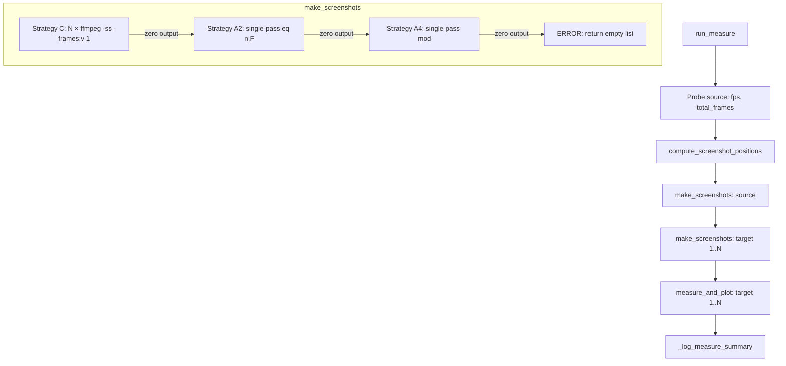

# Design: Measure Phase UX Overhaul
<!-- markdownlint-disable MD024 -->

- Created: 2026-05-01

---

## Overview

This design refactors `pyqenc/phases/measure.py` to improve UX, performance, and API clarity. The key changes are:

1. Replace floating-point timestamp-based screenshot positions with a `ScreenshotPosition` dataclass using exact integer frame arithmetic and `fractions.Fraction` FPS.
2. Add `fps_fraction: Fraction | None` property to `VideoMetadata` (single source of truth for exact rational FPS — `VideoMetadata` already probes `r_frame_rate`; this adds `avg_frame_rate` parsing as a `Fraction`). `ScreenshotPosition` takes its `fps` from `meta.fps_fraction`.
3. Replace the single-pass `select` filter strategy with Strategy C (N sequential fast-seek ffmpeg calls) as the primary capture method, with A2 and A4 as fallbacks.
4. Rename `_capture_screenshots` → `make_screenshots` (public intermediate API).
5. Restructure `run_measure` to capture all screenshots first, then run metrics.
6. Add step-by-step INFO logging and a summary table at the end of the run.
7. Remove `SCREENSHOTS_SUBDIR_SUFFIX` — screenshot folders are named `{video.stem}` directly.
8. Add `screenshot_include_edges: bool = False` to `measure_quality` in `api.py`.

The design is informed by benchmarking results in `benchmark_results.md`: Strategy C is ~110× faster than single-pass strategies on long videos (7s vs 800s for a 1.6h movie), and produces frame-identical results to explicit frame-number selection (Strategy A2).

---

## Architecture



The orchestration in `run_measure` is strictly sequential: positions → source screenshots → all target screenshots → all metrics. This ensures the user sees all screenshots quickly before the slower metric computation phase begins.

---

## Components and Interfaces

### `VideoMetadata.fps_fraction` (new property)

`VideoMetadata` already probes `r_frame_rate` and stores `_fps: float`. We add a parallel `_fps_fraction: Fraction | None` backing field populated from `avg_frame_rate` (which ffprobe always reports as an exact fraction like `"24000/1001"` or `"24/1"`). This is the single source of truth for exact rational FPS — no separate ffprobe call needed.

```python
@property
def fps_fraction(self) -> Fraction | None:
    """Exact rational FPS as a Fraction; probed on first access via avg_frame_rate."""
    if self._fps_fraction is None:
        self._probe_metadata()
    return self._fps_fraction
```

`populate_from_ffprobe` is extended to parse `avg_frame_rate` into `_fps_fraction: Fraction` using `Fraction(num, den)` — exact integer arithmetic, no float conversion.

`ScreenshotPosition` receives `fps: Fraction` from `source_meta.fps_fraction`.

### `ScreenshotPosition` → `ScreenshotPositions` container

Rather than storing `fps` on every individual position, the design uses a single container dataclass that holds the full set of positions alongside the shared `fps` and `step`. This avoids redundant per-position state while keeping the timestamp derivation methods close to the data.

```python
@dataclass(frozen=True)
class ScreenshotPositions:
    """Immutable set of screenshot positions computed from the source video.

    frame_nums are 0-based frame indices from the source. fps and step are
    shared across all positions in a run. Timestamp derivation uses exact
    rational arithmetic via fractions.Fraction to avoid float drift.
    """
    frame_nums: list[int]   # canonical 0-based frame indices
    fps:        Fraction    # from source VideoMetadata.fps_fraction
    step:       int         # frame step used for A4 fallback

    def seek_ts(self, frame_num: int) -> str:
        """Seek timestamp for Strategy C: (frame_num - 0.25) / fps, 9 decimal places."""
        ts = Fraction(frame_num * 4 - 1, 4) / self.fps
        return f"{float(ts):.9f}"

    def filename_ts(self, frame_num: int) -> str:
        """Filename timestamp prefix: frame_num / fps as HH꞉MM꞉SS․mmm."""
        ts_frac  = Fraction(frame_num, 1) / self.fps
        total_ms = int(ts_frac * 1000)
        ms       = total_ms % 1000
        total_s  = total_ms // 1000
        h, rem   = divmod(total_s, 3600)
        m, s     = divmod(rem, 60)
        return (
            f"{h:02d}{TIME_SEPARATOR_SAFE}{m:02d}{TIME_SEPARATOR_SAFE}"
            f"{s:02d}{TIME_SEPARATOR_MS}{ms:03d}"
        )
```

`make_screenshots` accepts `positions: ScreenshotPositions` — one object, no per-frame fps duplication.

### `compute_screenshot_positions`

```python
def compute_screenshot_positions(
    total_frames:  int,
    fps:           Fraction,
    count:         int,
    include_edges: bool = False,
) -> ScreenshotPositions: ...
```

- `step = total_frames // (count + 1)`
- Interior positions: `frame_nums = [step, 2*step, ..., N*step]`
- When `include_edges=True`: prepend frame 0, append `total_frames - 1`
- `fps` is taken from `source_meta.fps_fraction` — exact `Fraction` from `VideoMetadata`, no separate ffprobe call
- `total_frames` is taken from `source_meta.frame_count` (lazy-probed by `VideoMetadata`)

### `make_screenshots` (public)

```python
async def make_screenshots(
    video_path:      Path,
    positions:       ScreenshotPositions,
    screenshots_dir: Path,
    crop_params:     CropParams | None = None,
) -> list[Path]: ...
```

**Fallback chain:**

| Strategy | ffmpeg invocation | Trigger condition |
|---|---|---|
| C (primary) | N calls: `ffmpeg -ss <seek_ts> -i <video> [-vf crop] -frames:v 1 <out.png>` | Always tried first |
| A2 (fallback 1) | 1 call: `ffmpeg -i <video> -vf select='eq(n,F1)+eq(n,F2)+...'` | Strategy C → zero output |
| A4 (fallback 2) | 1 call: `ffmpeg -i <video> -vf select='not(mod(n,step))*gt(n,0)'` | Strategy A2 → zero output |
| Error | — | All strategies → zero output |

Partial results (fewer screenshots than positions, e.g. target shorter than source) are **not** a fallback trigger — only total failure (zero output) triggers fallback.

### `run_measure` orchestration

```python
async def run_measure(
    source_video:          Path,
    target_videos:         list[Path],
    work_dir:              Path,
    crop_params:           CropParams | None,
    metrics_sampling:      int,
    width:                 int | None,
    screenshot_count:      int | None,
    screenshot_interval:   float | None,
    screenshot_include_edges: bool = False,
) -> MeasureResult: ...
```

Execution order (strict):
1. `source_meta = VideoMetadata(path=source_video)` — already created for resolution check; `fps_fraction`, `frame_count`, and `duration_seconds` are lazily populated on first access (no extra probe calls)
2. `compute_screenshot_positions(source_meta.frame_count, source_meta.fps_fraction, count, include_edges)`
3. `logger.info("Taking %d screenshots of %s...", N, source.stem)`
4. `make_screenshots(source, positions, source_dir, crop_params)`
5. For each target: `logger.info("Taking %d screenshots of %s...", N, target.stem)` → `make_screenshots(target, positions, target_dir)`
6. `logger.info("Screenshots taken: %d out of %d %s", taken, expected, symbol)`
7. For each target (1-based): ProgressBar titled `Measuring target N <stem>` → `_run_metrics(...)`
8. `_log_measure_summary(targets, metrics_map)`

### `_log_measure_summary`

Emits a summary table at INFO level. One row per target:

```
Target                           Size (MB)   VMAF med   SSIM med   PSNR med
──────────────────────────────   ─────────   ────────   ────────   ────────
(1.1) slow_h265                  1 234.5     94.3       98.1       42.7
(1.1) any_vulkan_hevc-10bit      987.6       96.1       N/A        43.2
```

- Stem truncated to 30 chars
- File size via `_fmt_size_mb` from `log_format.py`
- Metric medians via `fmt_metric_value` from `log_format.py`
- `N/A` for missing metrics
- No pass/fail column when no quality targets specified

### `measure_quality` in `api.py`

Add `screenshot_include_edges: bool = False` parameter, passed through to `run_measure`.

---

## Data Models

### `ScreenshotPositions`

| Field | Type | Description |
|---|---|---|
| `frame_nums` | `list[int]` | 0-based frame indices (canonical positions) |
| `fps` | `Fraction` | Exact rational FPS from `source_meta.fps_fraction` — stored once, not per-position |
| `step` | `int` | Frame step for A4 fallback |

Methods (derived, no stored state):
- `seek_ts(frame_num) -> str` — `(frame_num - 0.25) / fps` as 9-decimal string for `-ss`
- `filename_ts(frame_num) -> str` — `frame_num / fps` formatted as `HH꞉MM꞉SS․mmm`

### `MeasureResult` (unchanged)

```python
@dataclass
class MeasureResult:
    source_screenshots_dir: Path
    targets:                list[TargetMeasureResult]
```

### `TargetMeasureResult` (unchanged except `screenshots_dir` naming)

```python
@dataclass
class TargetMeasureResult:
    target_video:    Path
    graph:           Path | None
    sidecar:         Path | None
    screenshots_dir: Path              # now {measure_dir}/{target.stem} (no suffix)
    metrics:         ChunkQualityStats
```

### Constants changes

- **Remove**: `SCREENSHOTS_SUBDIR_SUFFIX = ".screenshots"` from `constants.py`
- **Keep**: `TIME_SEPARATOR_SAFE`, `TIME_SEPARATOR_MS` (used in `ScreenshotPosition.filename_ts`)
- **Keep**: `DEFAULT_SCREENSHOT_COUNT`, `MEASURE_DIR`

---

## Correctness Properties

*A property is a characteristic or behavior that should hold true across all valid executions of a system — essentially, a formal statement about what the system should do. Properties serve as the bridge between human-readable specifications and machine-verifiable correctness guarantees.*

### Property 1: Screenshot position formula

*For any* source video with `total_frames > 0` and screenshot `count > 0`, the computed positions shall be exactly `[step, 2*step, ..., N*step]` where `step = total_frames // (count + 1)` and `N = count`, with each position's `frame_num` equal to `i * step` for `i` in `1..count`.

**Validates: Requirements 3.2, 6.6**

### Property 2: Position determinism

*For any* `(total_frames, fps, count)` triple, calling `compute_screenshot_positions` twice with the same arguments shall return an identical list of `ScreenshotPosition` objects.

**Validates: Requirements 3.6**

### Property 3: Screenshot filename format

*For any* `ScreenshotPosition` with valid `frame_num` and `fps`, the `filename_ts` property shall produce a string matching `HH꞉MM꞉SS․mmm` using `TIME_SEPARATOR_SAFE` and `TIME_SEPARATOR_MS`, and the full filename `{filename_ts}_{stem}.png` shall be a valid filesystem name.

**Validates: Requirements 6.7**

### Property 4: Screenshot folder naming

*For any* video path, `make_screenshots` shall write all output files into a directory whose name equals `video_path.stem` exactly (no suffix appended).

**Validates: Requirements 5.1, 5.4**

### Property 5: Summary table completeness

*For any* non-empty list of `TargetMeasureResult` objects, `_log_measure_summary` shall emit one data row per target, and any metric absent from a target's `ChunkQualityStats` shall appear as `N/A` in that row.

**Validates: Requirements 2.1, 2.6**

### Property 6: No individual median INFO lines

*For any* measure run with one or more targets, the INFO-level log output shall not contain lines matching the pattern `<metric> median: <value>` (i.e. per-metric median lines are suppressed in favour of the summary table).

**Validates: Requirements 1.5**

### Property 7: Screenshot logging completeness

*For any* call to `make_screenshots` with `N` positions, an INFO line `Taking N screenshots of <stem>...` shall be emitted before capture begins, and after all videos are processed an INFO line `Screenshots taken: M out of E` (where `M` is actual captured count and `E` is expected) shall be emitted.

**Validates: Requirements 1.1, 1.2**

---

## Error Handling

### Strategy C failure → fallback to A2

When Strategy C produces zero output files (ffmpeg exits non-zero, or output directory is empty after the N calls):

```
WARNING: Screenshot strategy C failed for <stem> (reason: <reason>) — falling back to A2 (single-pass frame-number select)
```

### Strategy A2 failure → fallback to A4

When Strategy A2 produces zero output files:

```
WARNING: Screenshot strategy A2 failed for <stem> (reason: <reason>) — falling back to A4 (single-pass mod select)
```

### All strategies fail

```
ERROR: All screenshot strategies failed for <stem> — no screenshots captured
```

Returns `[]`. The measure run continues — metric computation is not blocked by screenshot failure.

### Partial results (target shorter than source)

Strategy C: positions beyond target EOF produce no output frame — this is expected. The count summary line will show `M out of N ⚠` (where M < N). No fallback is triggered.

### Duration unavailable

When ffprobe cannot determine source duration, `compute_screenshot_positions` cannot be called in count mode. An ERROR is logged and screenshot capture is skipped. Interval mode falls back to a 24-hour upper bound.

### Resolution mismatch

Unchanged from current implementation — `_check_resolution_match` raises `ValueError` with an actionable suggestion before any processing begins.

---

## Testing Strategy

### Unit tests

- `test_compute_screenshot_positions`: verify formula for various `(total_frames, count)` pairs including edge cases (count=1, count=total_frames-2, include_edges=True).
- `test_screenshot_position_seek_ts`: verify `seek_ts` is always slightly before `frame_num / fps` (i.e. `float(seek_ts) < frame_num / float(fps)`).
- `test_screenshot_position_filename_ts`: verify `filename_ts` round-trips through the `HH꞉MM꞉SS․mmm` format.
- `test_screenshot_filename`: verify full filename construction for known positions.
- `test_make_screenshots_importable`: verify `from pyqenc.phases.measure import make_screenshots` works.
- `test_screenshots_subdir_suffix_removed`: verify `SCREENSHOTS_SUBDIR_SUFFIX` is not in `pyqenc.constants`.
- `test_measure_quality_include_edges_param`: verify `measure_quality` accepts `screenshot_include_edges`.
- `test_fallback_chain`: mock ffmpeg to return zero output for C, verify A2 is attempted; mock A2 to also fail, verify A4 is attempted; mock all to fail, verify ERROR logged and empty list returned.
- `test_execution_order`: mock sub-operations and verify screenshots precede metrics.
- `test_summary_table_no_quality_targets`: verify pass/fail column absent when no targets specified.
- `test_sidecar_placement`: verify sidecar written at `{measure_dir}/{target_stem}.yaml`.

### Property-based tests (Hypothesis)

Each property test runs a minimum of 100 iterations.

**Property test 1: Screenshot position formula**
```python
# Feature: measure-phase-ux-overhaul, Property 1: Screenshot position formula
@given(
    total_frames=st.integers(min_value=2, max_value=100_000),
    count=st.integers(min_value=1, max_value=100),
    fps=st.fractions(min_value=Fraction(1), max_value=Fraction(120)),
)
def test_position_formula(total_frames, count, fps):
    positions = compute_screenshot_positions(total_frames, fps, count)
    step = total_frames // (count + 1)
    assert [p.frame_num for p in positions] == [i * step for i in range(1, count + 1)]
```

**Property test 2: Position determinism**
```python
# Feature: measure-phase-ux-overhaul, Property 2: Position determinism
@given(
    total_frames=st.integers(min_value=2, max_value=100_000),
    count=st.integers(min_value=1, max_value=100),
    fps=st.fractions(min_value=Fraction(1), max_value=Fraction(120)),
)
def test_position_determinism(total_frames, count, fps):
    p1 = compute_screenshot_positions(total_frames, fps, count)
    p2 = compute_screenshot_positions(total_frames, fps, count)
    assert p1 == p2
```

**Property test 3: Screenshot filename format**
```python
# Feature: measure-phase-ux-overhaul, Property 3: Screenshot filename format
@given(
    frame_num=st.integers(min_value=0, max_value=10_000_000),
    fps=st.fractions(min_value=Fraction(1), max_value=Fraction(120)),
)
def test_filename_format(frame_num, fps):
    pos = ScreenshotPosition(frame_num=frame_num, fps=fps)
    ts = pos.filename_ts
    # Must match HH꞉MM꞉SS․mmm pattern
    assert re.match(r'^\d{2}꞉\d{2}꞉\d{2}․\d{3}$', ts)
```

**Property test 4: Screenshot folder naming**
```python
# Feature: measure-phase-ux-overhaul, Property 4: Screenshot folder naming
# Verified by inspecting the screenshots_dir argument passed to make_screenshots:
# screenshots_dir.name == video_path.stem (no suffix)
```

**Property test 5: Summary table completeness**
```python
# Feature: measure-phase-ux-overhaul, Property 5: Summary table completeness
@given(targets=st.lists(st.builds(TargetMeasureResult, ...), min_size=1, max_size=10))
def test_summary_table_rows(targets, caplog):
    _log_measure_summary(targets, ...)
    # One data row per target; N/A for missing metrics
    ...
```

**Property test 6: No individual median INFO lines**
```python
# Feature: measure-phase-ux-overhaul, Property 6: No individual median INFO lines
# Verified by running run_measure with mocked sub-operations and checking
# that no INFO log record matches r'<metric> median: \d'
```

**Property test 7: Screenshot logging completeness**
```python
# Feature: measure-phase-ux-overhaul, Property 7: Screenshot logging completeness
@given(positions=st.lists(st.builds(ScreenshotPosition, ...), min_size=1, max_size=50))
def test_screenshot_logging(positions, caplog, tmp_path):
    # make_screenshots emits "Taking N screenshots of <stem>..." before capture
    # and the caller emits "Screenshots taken: M out of E" after all videos
    ...
```
