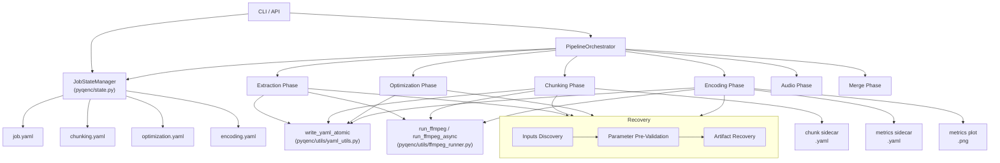

# Design Document: Phase Recovery Refactor

<!-- markdownlint-disable MD024 -->

Created: 2026-03-17

## Overview

This refactor replaces the monolithic `progress.json` / `ProgressTracker` state system with a lean, filesystem-first approach:

- **`job.yaml`** — one small file per work directory, storing only stable source video parameters (path, size, duration, fps, resolution, frame count, crop). Written once; updated only when crop detection runs.
- **Phase parameter files** (`chunking.yaml`, `optimization.yaml`, `encoding.yaml`) — per-phase YAML files storing the run-variable parameters that were active when the phase last ran. Used for parameter pre-validation on restart. Not "phase complete" flags.
- **Artifact sidecars** (`<chunk_stem>.yaml`, `<attempt_stem>.yaml`) — per-artifact YAML files storing metadata or quality metrics. Their presence (combined with the `.tmp` protocol) is proof that the artifact and its metadata are consistent.
- **`.tmp` protocol enforced in the ffmpeg runner** — `run_ffmpeg_async` / `run_ffmpeg` gain a mandatory `output_file` parameter; the runner substitutes `.tmp` paths, runs ffmpeg, and renames on success. Callers cannot bypass this.
- **`write_yaml_atomic`** — a shared utility for all YAML writes, using the same `.tmp`-then-rename protocol.
- **`ArtifactState` enum** — `ABSENT` / `ARTIFACT_ONLY` / `COMPLETE` — used throughout recovery to classify each artifact and decide what work remains.
- **`JobStateManager`** — replaces `ProgressTracker`. Typed load/save methods for each YAML file; no generic string-keyed accessor.

Each phase always executes its full work plan. Recovery (inputs discovery → parameter pre-validation → artifact recovery) runs first and pre-populates the work plan with already-completed steps.

## Architecture



## Components and Interfaces

### `ArtifactState` enum (`pyqenc/state.py`)

```python
class ArtifactState(Enum):
    ABSENT        = "absent"         # not produced yet
    ARTIFACT_ONLY = "artifact_only"  # file present, sidecar missing/incomplete
    COMPLETE      = "complete"       # file + valid sidecar present
```

Used by all recovery functions to classify each artifact and drive work-plan decisions.

### `write_yaml_atomic` (`pyqenc/utils/yaml_utils.py`)

```python
def write_yaml_atomic(path: Path, data: dict) -> None:
    """Write data as YAML to path using .tmp-then-rename protocol."""
```

Single utility for all YAML writes. Writes to `<path.stem>.tmp` in the same directory, then renames. All phase parameter files, chunk sidecars, and metrics sidecars go through this.

### `JobStateManager` (`pyqenc/state.py`)

```python
class JobStateManager:
    def __init__(self, work_dir: Path, source_video: Path, force: bool = False) -> None: ...

    # Job file
    def load_job(self) -> JobState | None: ...
    def save_job(self, state: JobState) -> None: ...
    def validate(self, dry_run: bool) -> bool: ...

    # Phase parameter files — typed, no generic accessor
    def load_chunking(self) -> ChunkingParams | None: ...
    def save_chunking(self, params: ChunkingParams) -> None: ...

    def load_optimization(self) -> OptimizationParams | None: ...
    def save_optimization(self, params: OptimizationParams) -> None: ...

    def load_encoding(self) -> EncodingParams | None: ...
    def save_encoding(self, params: EncodingParams) -> None: ...
```

`validate` implements the dry-run / execute / `--force` source-binding logic (Req 1.2).

### Data models (`pyqenc/state.py`)

New models are minimal — they reuse existing types rather than duplicating fields.

```python
class JobState(BaseModel):
    """Stable source video parameters. Wraps VideoMetadata for serialisation."""
    source: VideoMetadata  # path, size, duration, fps, resolution, frame_count, crop

class ChunkingParams(BaseModel):
    """Scene boundaries detected during chunking. Crop-independent."""
    scenes: list[SceneBoundary]

class OptimizationParams(BaseModel):
    """Crop + test chunk selection + optimal strategy."""
    crop:             CropParams | None
    test_chunks:      list[str]
    optimal_strategy: str | None = None

class EncodingParams(BaseModel):
    """Crop active when encoding ran."""
    crop: CropParams | None

class MetricsSidecar(BaseModel):
    """Per-attempt metrics sidecar. Stores ALL measured metrics — not filtered to current targets.
    targets_met is stored for human inspection; the algorithm always re-evaluates from metrics.

    Distinct from QualityEvaluation (in-memory computation result):
    - QualityEvaluation carries ChunkQualityStats, failed_targets, QualityArtifacts
    - MetricsSidecar is the lean flattened form persisted to disk
    """
    crf:         float
    targets_met: bool           # for human inspection only; algorithm re-evaluates from metrics
    metrics:     dict[str, float]   # all measured values, e.g. vmaf_min, vmaf_median, ssim_min

class EncodingResultSidecar(BaseModel):
    """Written as <chunk_id>.<res>.yaml when CRF search concludes for a (chunk_id, strategy) pair.
    Its presence means the pair is COMPLETE.
    chunk_id and strategy are derived from filename/directory — not stored here.
    """
    winning_attempt: str          # filename of the winning attempt .mkv
    crf:             float
    quality_targets: list[str]    # targets active when this result was written (for human reference)
    metrics:         dict[str, float]   # only the targeted metric values

class ChunkSidecar(BaseModel):
    """Chunk sidecar — wraps ChunkMetadata to keep sidecar model distinct.
    chunk_id is NOT stored — it is derived from the filename stem.
    """
    chunk: ChunkMetadata
```

- `ChunkSidecar` is a thin wrapper around `ChunkMetadata` — a separate class with a single `chunk` field of type `ChunkMetadata`. This keeps the sidecar model distinct from the in-memory chunk representation while avoiding field duplication.
- `SceneBoundary` and `CropParams` are imported from `pyqenc/models.py` — not redefined.
- `VideoMetadata.model_dump_full()` / `model_validate_full()` are reused for `JobState` serialisation.

### `recover_attempts` (`pyqenc/phases/recovery.py`)

Two distinct artifacts exist per `(chunk_id, strategy)` pair:

1. **Per-attempt sidecar** (`<attempt_stem>.yaml`) — written after each CRF attempt. Stores `crf`, `targets_met` (for human inspection), and ALL measured metrics (not filtered to current targets). The algorithm always re-evaluates pass/fail from `metrics` against current targets at recovery time.
2. **Encoding result sidecar** (`<chunk_id>.<res>.yaml` in the strategy dir) — written when the CRF search concludes. Stores the winning attempt filename, winning CRF, active quality targets, and targeted metric values. Its presence = `COMPLETE` for that pair (subject to validation).

`ArtifactState` for a `(chunk_id, strategy)` pair:
- `COMPLETE` — encoding result sidecar present AND the referenced attempt file exists AND re-evaluating the sidecar metrics against current quality targets passes
- `ARTIFACT_ONLY` — no encoding result sidecar (or sidecar invalid/stale), but ≥1 attempt `.mkv` file exists (search in progress)
- `ABSENT` — no attempt files at all

The recovery result for a single pair answers two questions:
1. **What work remains?** — determined by `ArtifactState` of the pair (encoding result layer)
2. **Where does the CRF search resume?** — determined by `CRFHistory` (individual attempt layer)

```python
@dataclass
class AttemptRecovery:
    """Recovery state for one encoded attempt file (one CRF value)."""
    path:    Path
    crf:     float
    state:   ArtifactState          # ARTIFACT_ONLY (no sidecar) or COMPLETE (sidecar valid)
    metrics: dict[str, float] | None  # None if ARTIFACT_ONLY

@dataclass
class EncodingRecovery:
    """Recovery state for a (chunk_id, strategy) pair — the CRF search as a whole."""
    chunk_id:  str
    strategy:  str
    state:     ArtifactState              # ABSENT / ARTIFACT_ONLY / COMPLETE
    history:   CRFHistory                 # reconstructed from per-attempt sidecars; empty if ABSENT
    attempts:  list[AttemptRecovery]      # individual attempt files found on disk

@dataclass
class PhaseRecovery:
    pairs:    dict[tuple[str, str], EncodingRecovery]
    pending:  list[tuple[str, str]]  # pairs where state != COMPLETE
    did_work: bool                   # True if any new work was done this run

def recover_attempts(
    work_dir:        Path,
    chunk_ids:       list[str],
    strategies:      list[str],
    quality_targets: list[QualityTarget],
) -> PhaseRecovery: ...
```

Flow per `(chunk_id, strategy)` pair:
1. Check for encoding result sidecar (`<chunk_id>.<res>.yaml`) → if present:
   - Verify referenced attempt file exists on disk
   - Re-evaluate sidecar metrics against current quality targets
   - If both pass → `COMPLETE`, skip
   - If attempt file missing or targets not met → downgrade to `ARTIFACT_ONLY`, delete stale sidecar
2. If no valid encoding result sidecar: scan for attempt `.mkv` files → if any exist, `ARTIFACT_ONLY`; for each attempt, check per-attempt sidecar → `SingleAttemptRecovery`; reconstruct `CRFHistory`; add pair to `pending`
3. If no attempt files: `ABSENT`; add to `pending`

### ffmpeg runner changes (`pyqenc/utils/ffmpeg_runner.py`)

`output_file: Path | list[Path] | None` added as a mandatory parameter to both `run_ffmpeg_async` and `run_ffmpeg`.

- `None` — no file output (null-encode, metadata probe, etc.)
- `Path` or `list[Path]` — the runner validates each path appears in `cmd`, substitutes with `<stem>.tmp`, runs ffmpeg, renames on success, cleans up on failure.

```python
async def run_ffmpeg_async(
    cmd:               list[str | os.PathLike],
    output_file:       Path | list[Path] | None,   # NEW — mandatory
    progress_callback: ProgressCallback | None = None,
    video_meta:        VideoMetadata | None    = None,
    cwd:               Path | None             = None,
) -> FFmpegRunResult: ...

def run_ffmpeg(
    cmd:               list[str | os.PathLike],
    output_file:       Path | list[Path] | None,   # NEW — mandatory
    progress_callback: ProgressCallback | None = None,
    video_meta:        VideoMetadata | None    = None,
    cwd:               Path | None             = None,
) -> FFmpegRunResult: ...
```

## Data Models

### Work directory layout

```
<work_dir>/
  job.yaml                          # source video params (written once)
  chunking.yaml                     # scene boundaries (written after detection)
  optimization.yaml                 # crop + test chunk IDs + optimal strategy
  encoding.yaml                     # crop for encoding run

  extracted/
    <video_stream>.mkv              # extracted video (no sidecar needed)
    <audio_stream_N>.mka            # extracted audio tracks

  chunks/
    <chunk_stem>.mkv                # chunk artifact
    <chunk_stem>.yaml               # chunk sidecar (ChunkMetadata)

  encoded/
    <strategy>/
      <chunk_id>.<res>.yaml               # encoding result sidecar (COMPLETE marker for the pair)
      <chunk_id>.<res>.crf<N>.mkv         # encoded attempt artifact
      <chunk_id>.<res>.crf<N>.yaml        # per-attempt metrics sidecar (all metrics + targets_met)
      <chunk_id>.<res>.crf<N>.png         # metrics plot

  audio/
    <audio_stem>.mka                # processed audio

  final/
    <output>.mkv                    # merged output
```

### `job.yaml` example

```yaml
source:
  path: /path/to/source.mkv
  file_size_bytes: 12345678901
  duration_seconds: 5432.1
  fps: 23.976
  resolution: 1920x1080
  frame_count: 130234
  crop:
    top: 140
    bottom: 140
    left: 0
    right: 0
```

### `chunking.yaml` example

```yaml
scenes:
  - frame: 0
    timestamp_seconds: 0.0
  - frame: 1440
    timestamp_seconds: 60.06
  - frame: 3600
    timestamp_seconds: 150.15
```

### `optimization.yaml` example

```yaml
crop:
  top: 140
  bottom: 140
  left: 0
  right: 0
test_chunks:
  - "00꞉00꞉01․000-00꞉05꞉20․000"
  - "00꞉12꞉34․000-00꞉17꞉55․000"
  - "00꞉45꞉00․000-00꞉50꞉21․000"
optimal_strategy: "slow+h265-aq"
```

### `<chunk_stem>.yaml` example

```yaml
start_timestamp: 0.0
end_timestamp: 320.0
duration_seconds: 320.0
frame_count: 7680
fps: 23.976
resolution: 1920x1080
```

### `<attempt_stem>.yaml` example (per-attempt metrics sidecar)

```yaml
crf: 22.0
targets_met: true   # for human inspection; algorithm re-evaluates from metrics
metrics:
  vmaf_min: 95.3
  vmaf_median: 97.8
  vmaf_max: 99.1
  ssim_min: 0.9921
  ssim_median: 0.9954
  psnr_min: 42.1
  psnr_median: 44.7
```

### `<chunk_id>.<res>.yaml` example (encoding result sidecar — COMPLETE marker)

```yaml
winning_attempt: "00꞉00꞉00․000-00꞉05꞉20․000.1920x800.crf22.00.mkv"
crf: 22.0
quality_targets:
  - "vmaf-min:95"
metrics:
  vmaf_min: 95.3
```

## Phase Recovery Flow

Each phase follows this sequence:

```
1. Inputs Discovery (standalone mode only)
   └─ Scan prerequisite output dir
   └─ Classify each input as ArtifactState
   └─ All must be COMPLETE → proceed; else → critical stop

2. Parameter Pre-Validation (phases with run-variable params only)
   └─ Load phase parameter file
   └─ Compare stored params vs current run params
   └─ Mismatch → critical stop (--force → delete stale artifacts, continue)

3. Artifact Recovery
   └─ Scan own output dir
   └─ Classify each artifact as ArtifactState
   └─ Build work-remaining set

4. Execute Work Plan
   └─ For each item in work plan:
       └─ COMPLETE → skip (already done)
       └─ ARTIFACT_ONLY → produce sidecar only
       └─ ABSENT → produce artifact + sidecar

5. Write/Update Phase Parameter File (if applicable)

6. Return PhaseResult
   └─ outcome = REUSED if no work done, COMPLETED if work done
```

### Per-phase recovery details

**Note:** `JobStateManager.validate()` (source-binding check via `job.yaml`) runs before any phase executes, in both auto-pipeline and standalone modes. It is not listed per-phase below.

| Phase | Pre-validation | Artifact recovery | Sidecars written |
|-------|---------------|-------------------|-----------------|
| Extraction | None | Check extracted files exist | None |
| Chunking | None | Compare expected stems vs present files; load scenes from `chunking.yaml` | `<chunk_stem>.yaml` per chunk |
| Optimization | Crop vs `optimization.yaml` | `recover_attempts` per test chunk+strategy | `<attempt_stem>.yaml` per attempt; `<chunk_id>.<res>.yaml` on convergence |
| Encoding | Crop vs `encoding.yaml` | `recover_attempts` per all chunk+strategy | `<attempt_stem>.yaml` per attempt; `<chunk_id>.<res>.yaml` on convergence |

## Error Handling

| Situation | Behaviour |
|-----------|-----------|
| `job.yaml` source mismatch, dry-run | Warning, no action |
| `job.yaml` source mismatch, execute | Critical stop |
| `job.yaml` source mismatch, `--force` | Warning, wipe artifacts, continue |
| Phase param mismatch (crop changed) | Critical stop |
| Phase param mismatch + `--force` | Delete stale artifacts, continue |
| Incomplete prerequisites (inputs not `COMPLETE`) | Critical stop; `--force` has no effect |
| Single artifact sidecar missing | `ARTIFACT_ONLY` → recalculate sidecar only |
| Single artifact file missing | `ABSENT` → re-produce artifact + sidecar |
| ffmpeg output path not in cmd | `ValueError` raised before subprocess launch |
| ffmpeg exits non-zero | Temp file deleted; `FFmpegRunResult.success = False` |
| YAML write crash | `.tmp` file left; cleaned up on next startup |

## Testing Strategy

- Unit tests for `ArtifactState` classification logic in `recover_attempts`
- Unit tests for `write_yaml_atomic` (verify `.tmp` cleanup on failure)
- Unit tests for ffmpeg runner `output_file` validation (path-not-in-cmd raises `ValueError`)
- Unit tests for `JobStateManager.validate` (all three modes: dry-run, execute, `--force`)
- Integration tests for each phase recovery scenario:
  - Fresh run (all `ABSENT`)
  - Full resume (all `COMPLETE`)
  - Partial resume (mix of states)
  - Crop changed (pre-validation triggers)
  - Source file changed (job-level validation triggers)
