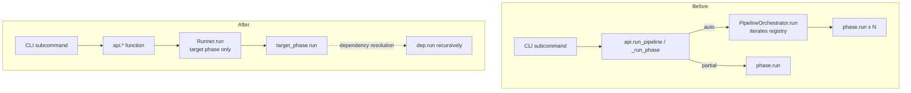
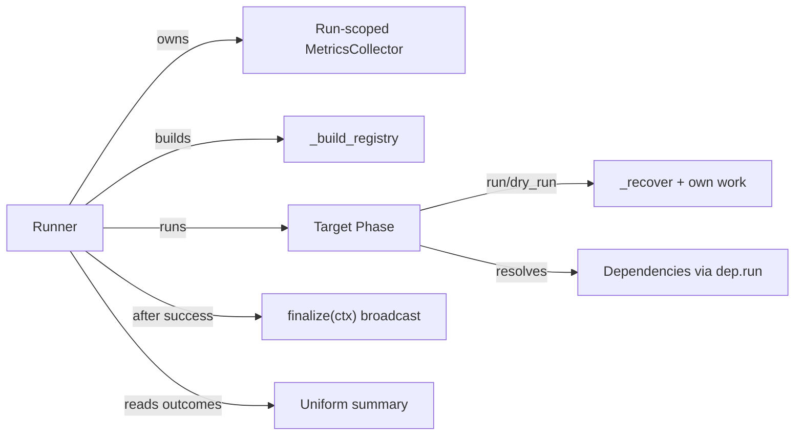

# Design Document — Phase Terminal Runner

<!-- markdownlint-disable MD024 -->

- Created: 2026-09-09
- Completed: 2026-09-11

## Cross-Spec Notes

### What this spec supersedes

| Superseded design element | Original spec | What changed |
|---|---|---|
| `Phase` protocol declares `scan()` and `run()`; `_ensure_dependencies(execute: bool)` branches between `dep.scan()` / `dep.run()` | `phase-object-model`, `phase-recovery-refactor` | `scan()` is removed from the protocol and every phase; `_ensure_dependencies` loses its `execute` parameter and always calls `dep.run(dry_run=...)`. |
| `PipelineOrchestrator` iterates the registry and drives per-phase execution + logging + cleanup + metrics flush | `phase-object-model`, `pipeline-maturity-refactor` | Replaced by `Runner` in `pyqenc/runner.py`, which runs exactly one target phase and owns run-level concerns. `orchestrator.py` is deleted. |
| `_run_post_pipeline_cleanup` / `_cleanup_extracted` in `orchestrator.py` reach into `ExtractionPhase` artifact types for `ALL` cleanup | `phase-object-model` Req 12 | Deep cleanup moves into each phase via `Phase.finalize(ctx)`; the runner only broadcasts and never names phase artifacts. |
| Module-global active-collector registry (`_active_collector`, `register_active_collector`, `flush_active_collector`) flushed by the CLI SIGINT handler | `pipeline-metrics-report` | Removed. The runner owns the run-scoped collector; the CLI SIGINT handler flushes via `flush_all_metrics()` — a set-based interrupt-flush registry each `YamlMetricsCollector` self-registers into (symmetric with the ffmpeg `kill_all_ffmpeg` registry), not a reference to the runner. |
| Each phase emits its banner as the first line of `run()` | `phase-object-model` | Banner is emitted after dependency resolution succeeds (deps neither `FAILED` nor `PENDING`), once, immediately before the phase's own work — via a shared `run()` skeleton. |
| `PhaseOutcome` includes `DRY_RUN` alongside `COMPLETED`/`REUSED`/`FAILED` | `phase-object-model` | `DRY_RUN` (a run mode) is removed; `PENDING` (a work-state) is added. `PhaseOutcome` becomes work-state only; run mode is owned by the runner via `dry_run` (mirrors the `ArtifactState`/`wanted` split in `artifact-state-refactor`). |

> This spec (2026-09-09) is the most recent and takes precedence where it conflicts with the specs above.

---

## Overview

Today two execution models coexist: the `PipelineOrchestrator` iterates the whole registry for `auto`, while partial subcommands call `phase.run()` on a single terminal phase and let `_ensure_dependencies` pull the chain. This design collapses both into one: a slim, phase-agnostic **`Runner`** that runs a single **target phase**. Dependency resolution stays inside the phases (already the case), so the runner never iterates to drive execution.

The refactor touches six seams:

1. **`Phase` protocol** — remove `scan()`, add `finalize(ctx)`; `_ensure_dependencies` loses `execute`.
2. **Runner** — new `pyqenc/runner.py`; `orchestrator.py` deleted.
3. **Uniform summary** — built by the runner from each phase's cached `PhaseResult.outcome`.
4. **Phase-owned cleanup** — rolling `INTERMEDIATE` inside `run()`; `ALL` via `finalize(ctx)`.
5. **Run-scoped metrics** — runner owns the collector; module globals deleted; SIGINT flushes via the runner.
6. **Banners** — a shared `run()` skeleton emits the banner after deps resolve, once.
7. **`PhaseOutcome` decomposition** — split work-state from run mode: remove `DRY_RUN`, add `PENDING`; run mode stays with the runner.

No ffmpeg command, filter, or artifact layout changes — this is a structural refactor (Req 9).

---

## Architecture

### Execution model (before -> after)



### Component responsibilities



The `Runner` knows only the `Phase`/`PhaseResult` protocol surface, `CleanupLevel`, `PhaseOutcome`, and the registry dict. It has no phase-specific knowledge.

---

## Components and Interfaces

### 1. `Phase` protocol changes (`pyqenc/phase.py`)

`scan()` is removed. A new `finalize()` is added. The protocol becomes:

```python
@runtime_checkable
class Phase(Protocol):
    name:         str
    dependencies: list[Phase]
    result:       PhaseResult | None

    def run(self, dry_run: bool = False) -> PhaseResult:
        """Resolve dependencies, emit banner, recover, execute pending work,
        cache and return result. Side-effect-free (REUSED) when already complete."""
        ...

    def finalize(self, ctx: FinalizeContext) -> None:
        """End-of-run housekeeping. Today: delete this phase's own artifacts
        when ctx.deep_cleanup is True. Never touches other phases' artifacts."""
        ...
```

`PhaseResult`, `Artifact`, and the derived helpers (`is_complete`, `complete`, `pending`, `did_work`) are unchanged.

#### `FinalizeContext`

A small frozen dataclass in `pyqenc/phase.py` (co-located with the protocol so phases import it without a cycle):

```python
@dataclass(frozen=True)
class FinalizeContext:
    """Pre-resolved end-of-run decisions computed once by the runner.

    Attributes:
        deep_cleanup: True only when the run succeeded AND the target was the
                      terminal-most phase AND the requested cleanup level was ALL.
                      Phases read this flag directly; they never re-derive it.
    """
    deep_cleanup: bool
```

The context is intentionally a struct of pre-resolved flags (Req 5.5, 6.1), not raw inputs, so future end-of-run concerns add fields without changing the signature and without phases re-deriving decisions.

### 2. Uniform `run()` skeleton and banner (`pyqenc/phase.py`)

To satisfy Req 8 (banner after deps, exactly once, uniform) and Req 2 (uniform dependency-failure handling) without copy-pasting across seven phases, a shared helper drives the invariant part of `run()`. Two options were considered:

- **A. Template-method base class** the phases inherit.
- **B. A free helper** the phases call at the top of `run()`.

Chosen: **B, a helper** — `resolve_dependencies(...)`. The phases are `Protocol`-typed and constructed by a factory; introducing an inheritance hierarchy would fight the existing structural-typing design and the steering rule favouring composition over patterns-for-their-own-sake. The helper keeps each phase's `run()` readable while centralising the invariant:

```python
def resolve_dependencies(phase: Phase, *, dry_run: bool) -> DependencyStatus:
    """Run every dependency lacking a cached result via dep.run(dry_run).

    Returns a DependencyStatus distinguishing FAILED deps from PENDING deps (both
    in dependency order). ``failed`` = deps whose outcome is FAILED or missing;
    ``pending`` = deps whose outcome is PENDING (only possible in dry-run, since
    an execute run never leaves a dependency PENDING). Empty on both = the phase
    may proceed. Uniform across all phases (Req 2).
    """
    failed:  list[str] = []
    pending: list[str] = []
    for dep in phase.dependencies:
        if dep.result is None:
            dep.run(dry_run=dry_run)
        if dep.result is None or dep.result.outcome is PhaseOutcome.FAILED:
            failed.append(dep.name)
        elif dep.result.outcome is PhaseOutcome.PENDING:
            pending.append(dep.name)
    return DependencyStatus(failed=failed, pending=pending)
```

> Design note: the current per-phase `_ensure_dependencies` methods are hand-written, differ slightly (Merge checks `encoding.result.encoded` completeness; Optimization loads `optimization.yaml` before touching deps), and each returns a *typed* subclass result on failure (`ExtractionPhaseResult`, `MergePhaseResult`, ...). The shared helper handles the common walk + status aggregation; each phase keeps a thin `_ensure_dependencies(dry_run)` wrapper that (a) verifies its required deps are wired, then (b) if any dependency **FAILED**, logs ONE error `"<Phase> cannot run — failed dependencies: <names>"` and returns its own typed **FAILED** result via the existing `_failed(...)` constructor (chains FAILED; Req 2.3, 2.5); (c) else if any dependency is **PENDING** (dry-run only), logs ONE **INFO** `"<Phase> dry-run is impossible — work still pending at: <names>"` and returns its own typed **PENDING** result via a parallel `_pending(...)` constructor (chains PENDING, not an error — the normal dry-run preview outcome, Req 4.6/9.3); (d) else returns `None` and proceeds. Both statuses chain the SAME outcome to the caller; the top-to-bottom ordered log stream shows the root cause first (no count-based dedup). This preserves the typed-result contract while removing the `execute` branch.

**Two levels of idempotency.** There are two distinct guarantees, and `run()` must honour both:

- **In-run memoization (within one registry instance).** Once a phase has a cached `self.result`, any further `run()` call returns it verbatim — no dependency resolution, no recovery, no work, no banner, and no outcome re-classification. This is what makes the diamond dependency graph safe: `ProbePhase` is depended on by Chunking, Optimization, Encoding, and Merge, yet resolves exactly once; the other four reuse the identical cached result object. This is the "run at most once per registry" guarantee (Property 1). Today this short-circuit lives at the top of each phase's `scan()` (`if self.result is not None: return self.result`); with `scan()` removed it **moves to the top of `run()`**.
- **Cross-run recovery (fresh process/registry).** When `self.result is None` and the phase's on-disk artifacts are all `COMPLETE`, recovery reclassifies them and the phase returns `REUSED` without redoing work — the artifact-based investment-preservation guarantee (Property 2).

**Banner placement.** Each phase's `run()` follows this uniform order — cached-result short-circuit first, then dependencies, then banner, then own work:

```python
def run(self, dry_run: bool = False) -> XPhaseResult:
    if self.result is not None:            # in-run memoization — return verbatim,
        return self.result                 # no re-resolution, no banner, no re-classify

    dep_failure = self._ensure_dependencies(dry_run=dry_run)
    if dep_failure is not None:
        self.result = dep_failure
        return self.result

    emit_phase_banner("EXTRACTION", logger)   # AFTER deps, exactly once
    # ... key-parameter logging, _recover, dry-run/reuse/work ...
```

The cached-result guard is the single most important line for banner-ordering and diamond-graph correctness: without it, a phase reached a second time as a shared dependency would re-emit its banner and re-resolve its own dependencies. Because the guard returns before `emit_phase_banner`, a memoized phase never re-banners (supports Property 7).

For phases that can currently short-circuit *before* touching live deps (Optimization's cached-reuse branches; any "skip entirely" branch), the skip decision is evaluated after the memoization guard but before the banner; then — for every non-skip branch — the banner is emitted exactly once after deps are confirmed. See the Optimization banner section below.

### 3. `Runner` (`pyqenc/runner.py`, replaces `orchestrator.py`)

```python
@dataclass
class RunResult:
    """Uniform result of a single runner invocation (replaces PipelineResult).

    Attributes:
        success:              True when the target phase completed or reused.
        outcomes:             Ordered {phase_name: PhaseOutcome} from cached results.
        phases_executed:      Names with COMPLETED outcome.
        phases_reused:        Names with REUSED outcome.
        phases_needing_work:  Names with PENDING outcome (dry-run: work would be needed).
        phases_failed:        Names with FAILED outcome.
        output_files:         Final output paths (from the target phase's result).
        error:                Failure description when success is False.
    """
    success:             bool
    outcomes:            dict[str, PhaseOutcome] = field(default_factory=dict)
    phases_executed:     list[str]  = field(default_factory=list)
    phases_reused:       list[str]  = field(default_factory=list)
    phases_needing_work: list[str]  = field(default_factory=list)
    phases_failed:       list[str]  = field(default_factory=list)
    output_files:        list[Path] = field(default_factory=list)
    error:               str | None = None


class Runner:
    """Slim, phase-agnostic driver. Runs one target phase; owns run-level concerns.

    Args:
        registry:         Ordered phase registry from _build_registry.
        target:           The terminal phase class to run.
        collector:        Run-scoped metrics collector (owned for this run).
        work_dir:         Work directory (for metrics path logging).
        cleanup:          Requested cleanup level.
        no_metrics:       When True, skip final metrics flush/write.
        is_terminal_most: True when target is the terminal-most phase (MergePhase).
    """

    def run(self, dry_run: bool = False) -> RunResult:
        target = self._registry[self._target]
        result = target.run(dry_run=dry_run)

        if not dry_run and result.outcome == PhaseOutcome.PENDING:
            result = _as_failed(result, "phase did not progress to completion")
        run_ok  = result.is_complete   # PENDING and FAILED are both not-complete
        summary = self._build_summary()          # reads cached outcomes (Req 4)

        # Final flush on an execute run, then always close the collector (final
        # flush is a no-op on dry-run / NoOp) so it unregisters from the
        # interrupt-flush registry regardless of success/failure (Req 7.4).
        if not dry_run and not self._no_metrics:
            self._collector.flush()               # final flush (Req 7.4)
        self._collector.close()                   # flush-safe unregister (all paths)

        if self._cleanup >= CleanupLevel.ALL and not self._is_terminal_most:
            logger.warning(
                "Full cleanup (--cleanup all) requested but '%s' is not the "
                "terminal command; downgraded to intermediate cleanup.",
                target.name,
            )

        deep = (run_ok and not dry_run and self._is_terminal_most
                and self._cleanup >= CleanupLevel.ALL)
        if run_ok and not dry_run:
            ctx = FinalizeContext(deep_cleanup=deep)
            for phase in self._registry.values():
                phase.finalize(ctx)               # broadcast (Req 5, 6)

        self._log_summary(summary, dry_run)
        return summary
```

Key points:

- **No registry iteration to drive execution** (Req 3.2): only `self._registry[self._target].run(...)`. The registry is iterated only afterwards, read-only, to build the summary and broadcast `finalize`.
- **`deep_cleanup` computed once** (Req 6.1) and carried in `FinalizeContext`.
- **Downgrade-and-warn** for `ALL` on a non-terminal command (Req 6.3, 6.4) — no rejection.
- **`finalize` broadcast only on success and not dry-run** (Req 5, 6.5, 6.6). On failure or dry-run, `deep` is false and, because the run did not complete, no `finalize` is called at all.

### 4. Uniform summary (`Runner._build_summary`)

```python
def _build_summary(self) -> RunResult:
    outcomes: dict[str, PhaseOutcome] = {}
    for phase in self._registry.values():
        if phase.result is not None:
            outcomes[phase.name] = phase.result.outcome
    # bucket by every PhaseOutcome value — none silently dropped (Req 4.2)
    ...
    target_result = self._registry[self._target].result
    output_files  = _collect_output_files(target_result)   # final/ paths only
    ...
```

The summary uses only `phase.name` and `phase.result.outcome` — the common `PhaseResult` surface (Req 4.3). Final output *paths* still come from the target phase's own result artifacts (Req 4.5); the runner reuses the existing `_collect_output_files` helper (moved from `orchestrator.py`), which filters artifacts under a `final/` directory.

Phases with no cached result (e.g. not reached because an earlier dep failed) are simply absent from `outcomes`; the failed dep is reported by the phase that depended on it (Req 2.3) and appears in `phases_failed`.

### 5. Run-scoped metrics (`pyqenc/metrics.py`, `pyqenc/api.py`, `pyqenc/cli.py`)

Deletions from `metrics.py`:

- `_active_collector` module global.
- `register_active_collector`.
- `flush_active_collector`.
- The two entries in `__all__`.

The `MetricsCollector` protocol, `YamlMetricsCollector` (including incremental flush via `FLUSH_INTERVAL` and `_snapshot_active_timers` partial-elapsed capture), and `NoOpMetricsCollector` are unchanged. Incremental flush stays (Req 7.4, the power-loss safeguard); the run-scoped instance is simply owned by the runner instead of a global.

**Interrupt path (CLI).** The SIGINT handler currently calls the module-global `flush_active_collector()`. That single-slot registry is removed (it can't serve concurrent runs). In its place, the collector **owns its own interrupt-safe flush** and self-registers into a small set-based registry that mirrors the existing ffmpeg live-process registry (`_live_procs` / `kill_all_ffmpeg`). This keeps flushing a collector responsibility, keeps the signal firing a CLI/process concern, and keeps the `Runner` completely out of interrupt handling.

```python
# metrics.py — set-based interrupt-flush registry, symmetric with kill_all_ffmpeg().
_live_collectors_lock = threading.Lock()
_live_collectors: set[YamlMetricsCollector] = set()   # only real (flushing) collectors register

def flush_all_metrics() -> None:
    """Flush every live collector. Called from the CLI SIGINT handler before os._exit.
    Safe to call from any thread; each flush() already snapshots in-flight timers."""
    with _live_collectors_lock:
        collectors = set(_live_collectors)
    for c in collectors:
        try:
            c.flush()
        except Exception:
            pass

# YamlMetricsCollector registers itself on construction and unregisters on close().
class YamlMetricsCollector(MetricsCollector):
    def __init__(self, ...):
        ...
        with _live_collectors_lock:
            _live_collectors.add(self)
    def close(self) -> None:
        """Idempotent: final flush + unregister from the interrupt registry."""
        with _live_collectors_lock:
            _live_collectors.discard(self)
```

```python
# cli.py main(): the handler fires process-level cleanup hooks, symmetric and slot-free.
def _sigint_handler(signum, frame):
    signal.signal(signal.SIGINT, signal.SIG_DFL)
    kill_all_ffmpeg()
    flush_all_metrics()          # flush every live collector (collector-owned)
    logger.warning("Cancelled by user.")
    os._exit(130)
```

Why this over a runner reference or a single-slot holder:

- **Collector owns flush** (not the runner): the flush lives where the data lives; the `Runner` never touches signals or interrupt flushing. `Runner.flush_metrics()` is removed as now-dead code.
- **Not the removed anti-pattern:** the deleted `_active_collector` was a single mutable slot you *query* — it raced under concurrent/in-process runs. A *set the collector pushes itself into and removes on `close()`* is exactly the accepted ffmpeg-registry model: multiple concurrent runs each register their own collector; interrupt flushes all of them. This satisfies Req 7.7's intent (flush by reference to the run's own collector, not a global single-slot lookup) and works for both CLI and a future server.
- **No CLI assumptions in core:** `metrics.py` imports no `signal`; it only exposes `flush_all_metrics()`. `signal.signal` / `os._exit` / `kill_all_ffmpeg` stay in `cli.py`.
- **Lifetime:** the collector unregisters in `close()` (called by the runner/api at end of run, success or failure). If a run aborts before `close()`, the interrupt path still flushes it; and because the run is a one-shot, a stale entry is harmless (and would be GC-dropped once the collector is unreferenced). Only `YamlMetricsCollector` registers; `NoOpMetricsCollector` does not.

This keeps the interrupt-flush behavior (Req 9.5 — partial-timer capture preserved, since `flush()` already snapshots active timers) and scopes flushing to live collectors, not a process-global slot (Req 7.7).

> Note on the stale `parallelism` docstring in `PipelineMetrics`: it references "written separately by the pipeline orchestrator", but no such write exists in the current code. That docstring line is corrected/removed while deleting orchestrator references. No behavioral change.

### 6. `api.py` wiring

`_run_phase`, `run_pipeline`, and `process_audio` all converge on one shared internal builder that constructs the collector, registry, and runner. Sketch:

```python
def _drive(config, source, work_dir, target, *, force, cleanup, no_metrics,
           dry_run, crop_params=None, video_required=True) -> RunResult:
    if not source.exists():
        raise FileNotFoundError(f"Source video not found: {source}")
    work_dir = LongPath(work_dir); work_dir.mkdir(parents=True, exist_ok=True)

    collector = (NoOpMetricsCollector() if no_metrics
                 else YamlMetricsCollector(work_dir=work_dir, force_wipe=force))
    registry = _build_registry(config, source, work_dir, force, cleanup,
                               no_metrics, collector, crop_params, video_required)
    runner = Runner(
        registry=registry, target=target, collector=collector, work_dir=work_dir,
        cleanup=cleanup, no_metrics=no_metrics,
        is_terminal_most=(target is MergePhase),
    )
    return runner.run(dry_run=dry_run)
```

The public API functions become thin wrappers selecting the target class:

| Function | Target | `video_required` |
|---|---|---|
| `run_pipeline` (auto) | `MergePhase` | `True` |
| `extract_streams` | `ExtractionPhase` | `True` |
| `chunk_video` | `ChunkingPhase` | `True` |
| `process_audio` | `AudioPhase` | `False` |
| `encode_chunks` | `EncodingPhase` | `True` |
| `merge_final` | `MergePhase` | `True` |

Each returns `RunResult`. The per-phase typed result is still reachable via `registry[target].result` for callers that need it (e.g. `merge_final`'s output paths), but the uniform surface is `RunResult`. Where existing callers/tests consumed a typed phase result directly, reading `registry[target].result` (or a thin accessor on `RunResult`) covers it — see Migration.

CLI handlers (`_cmd_extract`, etc.) currently check `result.is_complete`; they switch to `result.success` on `RunResult`. `_cmd_merge`'s per-file listing reads the target phase result's complete artifacts (unchanged logic, new source).

### 7. Phase-owned cleanup

**`INTERMEDIATE` (rolling, inside `run()`).** Each phase deletes its own transient scratch as soon as it is safe (Req 5.2, 5.3). The canonical case is `EncodingPhase`: once a chunk's winning attempt is finalized, its losing/intermediate attempts for that chunk are deleted immediately, bounding peak disk to one chunk's extra footprint. This logic lives in the encoding phase's per-chunk finalization path, gated on `cleanup >= INTERMEDIATE`. Phases that already do end-of-run intermediate cleanup are audited to move deletion to the earliest safe point (rolling), not deferred to the end.

Rolling cleanup **never** deletes a consumable a downstream phase needs (Req 5.4) — e.g. encoding keeps the winning attempt (its output artifact); chunking keeps chunk files until merge is done. Those consumables are deleted only in `finalize` under `deep_cleanup`.

**`ALL` (deep, via `finalize`).** The orchestrator's `_run_post_pipeline_cleanup` / `_cleanup_extracted` are removed and their behavior distributed:

- `EncodingPhase.finalize`: delete `encoding/` and `encoded/` workspaces.
- `ChunkingPhase.finalize`: delete `chunks/`.
- `ExtractionPhase.finalize`: delete its extracted artifacts. Because all extraction artifacts are reproducible from source (Req 5.7), none are exempt — the old "preserve subtitles/chapters/attachments" carve-out is dropped. (If a future requirement wants them retained, that is a separate wanted/unwanted decision, not a cleanup exemption.)
- Phases with no deep artifacts (`Job`, `Probe`, `Optimization`, `Audio`, `Merge`) implement `finalize` as a no-op or delete only their own scratch as appropriate.

Each `finalize` reads `ctx.deep_cleanup` and touches only its own artifact paths (Req 5.6). The runner never names a directory.

### 8. Banner rule (uniform) and `OptimizationPhase`

**The one banner rule for every phase:** a phase emits its banner ONLY immediately before it begins its actual work — i.e. after the memoization guard, after any skip decision, and after `_ensure_dependencies` confirms dependencies are complete (neither FAILED nor PENDING). A phase that short-circuits with no work emits NO banner: a FAILED/PENDING dependency short-circuit (Req 8.1), or a full skip (Req 8.4). Reuse-from-cache and dry-run are still work outcomes and DO banner (Req 8.3) — the phase engaged its recovery/decision and produced its result.

`OptimizationPhase.run` today violates this: it emits the banner in its cached-reuse/tolerance branches *before* resolving dependencies, so the banner prints even when deps are pending/failed. Restructure it to the same uniform skeleton every other phase uses — dependency resolution BEFORE the banner:

```python
def run(self, dry_run=False):
    if self.result is not None:            # memoization guard
        return self.result
    if self._is_skipped():                 # optimize disabled OR single strategy
        return self._run_all_strategies(dry_run)   # no work, no banner (Req 8.4)

    dep = self._ensure_dependencies(dry_run=dry_run)   # FAILED/PENDING short-circuit,
    if dep is not None:                                # NO banner (Req 8.1)
        self.result = dep
        return self.result

    # deps complete — about to do work (cached-reuse, tolerance-reapply, or encode)
    persisted = OptimizationParams.load(...); # + param-change detection
    emit_phase_banner("OPTIMIZATION", logger)          # exactly once, before work (Req 8.3, 8.5)
    # ... reuse / tolerance-reapply / real-encode branches, no further banner ...
```

This moves `_ensure_dependencies` ahead of the cached-reuse/tolerance branches. Those branches previously resolved from `optimization.yaml` *without* live deps purely as an optimization; under the uniform rule they resolve deps first like everyone else (cheap now — `JobPhase`'s dry-run is read-only, and a pending Probe/Chunking correctly short-circuits Optimization to PENDING with no banner). The banner still fires exactly once, across all three non-skip work branches, but only after deps are confirmed complete.

### 9. `PhaseOutcome` decomposition: work-state vs run mode

`PhaseOutcome` currently packs two orthogonal concepts into one enum: the *work-state* (`COMPLETED`, `REUSED`, `FAILED`) and the *run mode* (`DRY_RUN`). This mirrors the `ArtifactState`/`wanted` split already done in `artifact-state-refactor`: two independent axes must not share one dimension.

**The two axes:**

- **Work-state** (what state is the phase's work in?): completed with work, reused (all complete, no work), pending (wanted work remains), failed.
- **Run mode** (was this a preview or a real execution?): dry-run vs execute — already carried by the `dry_run` flag the runner threads.

**Change:** remove `DRY_RUN`; add `PENDING`. `PhaseOutcome` becomes `COMPLETED | REUSED | PENDING | FAILED` — pure work-state. `PENDING` means one or more wanted artifacts are `ABSENT`/`PARTIAL`, mode-agnostic.

**Outcome-derivation helpers become mode-free.** `_outcome_from_artifacts` (present in `merge.py` and `extraction.py`) currently returns `DRY_RUN` when any artifact is `ABSENT`. They return `PENDING` instead and no longer conflate mode:

```python
def _outcome_from_artifacts(artifacts, did_work) -> PhaseOutcome:
    if any(a.state in (ArtifactState.ABSENT, ArtifactState.PARTIAL) for a in artifacts):
        return PhaseOutcome.PENDING            # was DRY_RUN
    if artifacts and all(a.state == ArtifactState.COMPLETE for a in artifacts):
        return PhaseOutcome.COMPLETED if did_work else PhaseOutcome.REUSED
    return PhaseOutcome.REUSED                 # no artifacts → nothing to do
```

**`is_complete` loses its mode special-case.** It was `outcome in (COMPLETED, REUSED)` and had to *exclude* `DRY_RUN`; now `PENDING` and `FAILED` are simply both not-complete — a clean partition (Req 10.4).

**Who owns mode.** The runner (and each phase's `run()`) already receive `dry_run`. In dry-run, a phase with pending work returns `PENDING`; the runner, knowing `dry_run=True`, formats those as "needs work" and stops at the first pending phase (preserving today's dry-run reporting, Req 9.3). In execute mode a phase must resolve `PENDING` into `COMPLETED`/`FAILED` before returning; a `PENDING` outcome surviving an execute run is a failure-to-progress and the runner treats it as such (Req 10.6). This is the invariant that guarantees `PENDING` never appears as the final outcome of a real `run()`.

**Runner interpretation** (replaces the earlier `run_ok = result.is_complete` line):

```python
result = target.run(dry_run=dry_run)
if not dry_run and result.outcome == PhaseOutcome.PENDING:
    # PENDING must never survive an execute run — treat as failure-to-progress
    result = _as_failed(result, "phase did not progress to completion")
run_ok = result.is_complete            # PENDING and FAILED are both not-complete
```

In dry-run, `run_ok` is naturally `False` whenever any phase is `PENDING`, so `deep_cleanup` stays false and no `finalize` fires (consistent with Req 6.6).

---

## Data Models

- **`FinalizeContext`** (new, `pyqenc/phase.py`): `frozen` dataclass, one field `deep_cleanup: bool`. Extensible.
- **`RunResult`** (new, `pyqenc/runner.py`): replaces `PipelineResult`. Adds `outcomes` and `phases_failed`; keeps `output_files`, `error`, and the executed/reused/needing-work lists for continuity with existing CLI messaging.
- **`CleanupLevel`** (unchanged, `IntEnum` `NONE=0 < INTERMEDIATE=1 < ALL=2`): the `>=` comparisons already encode the cumulative semantics of Req 5.1.
- **`PhaseOutcome`** (CHANGED, `pyqenc/models.py`): `COMPLETED | REUSED | PENDING | FAILED`. `DRY_RUN` is removed and replaced by `PENDING` — a pure work-state meaning "wanted work remains (an artifact is `ABSENT`/`PARTIAL`)", independent of run mode (Req 10). The enum now describes only *what state the work is in*, never *whether the run was a preview*; run mode (`dry_run`) is owned by the runner. `PhaseOutcome`, `PhaseResult`, and the phase-facing surface stay in their current modules; only the enum member and its derivations change. The summary buckets over all four values (Req 4.2).
- **`PhaseResult`, `Artifact`** (unchanged).

---

## Error Handling

- **Dependency failure (Req 2).** `_ensure_dependencies(dry_run)` distinguishes FAILED from PENDING deps (via `resolve_dependencies` → `DependencyStatus`). Any **FAILED** dep → log one error naming all of them, return the phase's typed `FAILED` result; the failure chains because the caller also sees a FAILED dependency and fails in turn, up to the target → `RunResult.success = False`. Any **PENDING** dep (dry-run only) → log one INFO line (`"<Phase> dry-run is impossible — work still pending at: <names>"`), return the phase's typed `PENDING` result; PENDING chains the same way so every downstream phase is PENDING, and the run is a clean preview (no error, exit 0) with all pending phases reported under `RunResult.phases_needing_work` (Req 4.6/9.3). In both cases the phase does no own work and emits no banner (Req 8.1); the top-to-bottom ordered log shows the root cause first.
- **Target-phase failure.** `RunResult.success` is `False`, `error` is populated from the target's `result.error`/`message`, `deep_cleanup` is `False`, and `finalize` is not broadcast (artifacts preserved for retry).
- **Metrics write failure.** Unchanged: `YamlMetricsCollector.flush` logs a WARNING and never raises.
- **`finalize` deletion failure.** Each phase's `finalize` catches `OSError` per artifact and logs a WARNING (mirrors the current orchestrator cleanup behavior); a cleanup failure never fails the run.
- **Interrupt (SIGINT).** `kill_all_ffmpeg()` then `flush_all_metrics()` (flushes every live collector; partial timers captured) then `os._exit(130)`. No process-global single-slot lookup; the collector self-registered into a set-based registry and owns its own flush.

---

## Correctness Properties

These invariants must hold across the refactor; the Testing Strategy below exercises each. Each property is stated so it can be encoded as a property-based test.

### Property 1: In-run memoization (run at most once)

For any command, each phase does its dependency resolution, recovery, and own work at most once per registry instance. A phase reached again while it already has a cached `self.result` (e.g. as a shared dependency in the diamond graph) returns that same cached result verbatim — it does NOT re-resolve dependencies, re-run recovery, re-emit its banner, or re-classify its outcome. Exactly one phase (the target) is driven directly by the runner; all others run only as resolved dependencies.

**Validates: Requirements 3.1, 3.2, 3.3**

### Property 2: Cross-run recovery idempotency

In a fresh run (new registry, no cached result), a phase whose wanted on-disk artifacts are all `COMPLETE` recovers them and yields `REUSED`, performing no writes or deletions. Re-invoking a completed command in a new process is therefore a no-op on disk — the basis of artifact-based recovery and investment preservation. (Distinct from Property 1, which governs a single registry instance; this property governs separate invocations.)

**Validates: Requirements 1.6, 9.1**

### Property 3: Failure closure

If any phase in the resolved chain fails, the target phase's outcome is `FAILED` and `RunResult.success` is `False`; the failure names every failed dependency along the path.

**Validates: Requirements 2.2, 2.3, 2.6**

### Property 4: Deep-cleanup safety

`deep_cleanup` is `True` only when the run succeeded AND it is not a dry-run AND the target is the terminal-most phase AND the requested level is `ALL`. Under any failure or dry-run, no consumable artifact is deleted, so a failed or previewed run always leaves valid retry inputs.

**Validates: Requirements 6.1, 6.5, 6.6**

### Property 5: Rolling-cleanup bound

Under `INTERMEDIATE` or higher, for a phase producing artifacts in units, the transient footprint on disk never exceeds one in-progress unit plus the completed units' output artifacts.

**Validates: Requirements 5.2, 5.3**

### Property 6: Cleanup ownership

Every deletion in `finalize` is performed by the phase that owns the artifact; the runner names no phase-specific path.

**Validates: Requirements 5.5, 5.6**

### Property 7: Banner exactness

Each non-skipped phase emits its banner exactly once, after its dependencies are complete and before its own work; a fully-skipped phase emits none.

**Validates: Requirements 8.1, 8.2, 8.4**

### Property 8: Summary totality

Every phase with a cached result appears in exactly one summary bucket, and every `PhaseOutcome` value (`COMPLETED`, `REUSED`, `PENDING`, `FAILED`) maps to a bucket — none dropped.

**Validates: Requirements 4.1, 4.2**

### Property 9: No process-global metrics state

After the refactor, no module-global collector reference exists; the only collector for a run is the one the runner owns.

**Validates: Requirements 7.1, 7.2**

### Property 10: Fidelity invariance

The set of produced artifacts, the dependency execution order, and all source properties (frame rate, sample rate, color/HDR, timestamps, container metadata) are identical to pre-refactor behavior.

**Validates: Requirements 9.1, 9.2, 9.6**

### Property 11: Outcome is work-state only; PENDING never final on execute

`PhaseOutcome` carries no run-mode information: the outcome a phase returns depends only on its artifact work-state, not on whether the run is a dry-run. `PENDING` is returned iff wanted work remains. In an execute run (`dry_run=False`), no phase's final cached outcome is `PENDING` — it is always resolved to `COMPLETED`, `REUSED`, or `FAILED`. Consequently `is_complete` partitions cleanly: exactly `COMPLETED`/`REUSED` are complete; `PENDING`/`FAILED` are not.

**Validates: Requirements 10.1, 10.2, 10.4, 10.6**

---

## Testing Strategy

Per the coding standard, tests assert observable behavior, not internals. Each test targets a concrete regression.

- **`scan()` removal.** Given a fully-complete work dir, `phase.run(dry_run=False)` writes/deletes nothing and returns `REUSED` (bug: a second run re-doing work). Verify Merge recovers its own state through its own `_recover()` reading the already-cached `EncodingPhase.result` (resolved once by the shared dependency walk) rather than driving another phase's `run()`/`scan()`; quality-target re-evaluation is owned by `EncodingPhase._recover()` and is still reflected in the cached artifact states after changing a target.
- **In-run memoization.** Within one registry, invoking a shared dependency's `run()` twice returns the identical cached result, emits its banner only once, and does not re-resolve its dependencies (bug: diamond-graph phase re-runs / re-banners within a single run).
- **Dependency-failure propagation.** Given a phase whose dependency fails, the phase returns `FAILED`, the error names *every* failed dependency, and `RunResult.success` is `False` (bug: phase runs on incomplete inputs, or only first failed dep reported).
- **Uniform runner.** Each command (`extract`/`chunk`/`encode`/`audio`/`merge`/`auto`) produces the artifacts it did before through the runner (bug: a command silently skips a prerequisite).
- **Summary exhaustiveness.** A mixed run (some COMPLETED, some REUSED, one PENDING, one FAILED) surfaces every phase in the correct bucket (bug: an outcome silently dropped).
- **Cleanup gating.** `encode --cleanup all` on a non-terminal target emits the downgrade warning, keeps `chunks/`/`encoded/`, and never calls deep cleanup (bug: partial command destroys artifacts). `auto --cleanup all` on success removes `chunks/`, `encoding/`, `encoded/`, and extraction artifacts (bug: deep sweep skipped). Failed `auto --cleanup all` preserves artifacts (bug: retry inputs destroyed).
- **Rolling intermediate cleanup.** With `--cleanup` (intermediate), after N chunks encode, only one chunk's extra attempts exist on disk at any observed point (bug: peak disk not bounded).
- **Run-scoped metrics.** No module global remains (a test importing `metrics` asserts the removed names are gone). SIGINT-path flush writes `metrics.yaml` with partial timing (existing partial-flush test retained, retargeted at the runner-owned collector).
- **Banner ordering.** Running the terminal phase emits dependency banners before the terminal banner, each exactly once, and no banner for a skipped Optimization (`--no-optimize`).
- **Outcome decomposition.** A phase with pending work returns `PENDING` in both dry-run and execute mode BEFORE work runs; after a successful execute run no phase's cached outcome is `PENDING` (bug: mode leaks into outcome, or `PENDING` survives execute). `is_complete` is `True` only for `COMPLETED`/`REUSED` (bug: `PENDING` counted as complete).

---

## Migration / Removal Notes

- Delete `pyqenc/orchestrator.py`. Move `_collect_output_files` into `runner.py`; drop `_run_post_pipeline_cleanup` and `_cleanup_extracted` (behavior redistributed into phase `finalize`).

- Rename `PhaseOutcome.DRY_RUN` to `PhaseOutcome.PENDING` in `models.py`; make `PhaseResult.is_complete` and both `_outcome_from_artifacts` helpers (merge.py, extraction.py) mode-free; switch every phase's dry-run return path to `PENDING`; add the runner's execute-mode `PENDING` failure-to-progress guard. The enum string value changes from `dry_run` to `pending` (no persisted consumer relies on it; per pre-alpha policy no shim is kept).
- Update `api.py` to the `_drive` builder + thin wrappers; return `RunResult`.
- Update `cli.py`: `RunResult.success` checks; the SIGINT handler calls `flush_all_metrics()` (collector-owned, set-based registry) — no active-runner/single-slot holder.
- Update tests referencing `PipelineOrchestrator`, `PipelineResult`, `register_active_collector`, `flush_active_collector`, or `.scan(` to the new surfaces. Per project policy (pre-alpha, no legacy compatibility), old symbols are removed outright rather than shimmed.
- `_build_registry` is unchanged in shape; the runner consumes it as-is.
