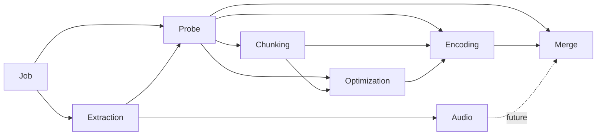

# Design Document — Probe Phase Refactor

<!-- markdownlint-disable MD024 -->

- Created: 2026-09-01
- Completed: 2026-07-11

## Cross-Spec Notes

### What this spec supersedes

| Superseded requirement | Original spec | What changed |
|---|---|---|
| `JobPhase` resolves crop parameters (manual → cached → auto-detect) | `phase-object-model` Req 2 AC 2, Glossary | Crop detection moved to **ProbePhase**; `JobPhase` no longer accepts `crop_params` or runs `_resolve_crop()` |
| Crop-params mismatch check in `OptimizationPhase` / `EncodingPhase` | `phase-object-model` Req 5 AC 6 | Mismatch now compares `ProbeState` snapshots (`persisted.probe != current_probe`); individual `CropParams` field comparison is gone |
| `VideoMetadata` holds `frame_count: int \| None` as a lazy property | `pipeline-maturity-refactor` Req 1 AC 1, Glossary | `frame_count` removed from `VideoMetadata` entirely; moved to **`ExtendedVideoMetadata`** as a required plain field; slow probe is now an explicit method call (`probe_extended()`) not a property |
| `CropParams` stored on `VideoMetadata.crop_params` and `PipelineState.source_video.crop_params` | `pipeline-correctness-refactor` Req 2 (all ACs) | Crop now lives in **`probe.yaml`** via `ProbeState`; `VideoMetadata` no longer carries crop; downstream phases read crop from `probe_result.crop` |
| Crop detection runs during extraction, applied during chunking | `pipeline-correctness-refactor` Req 2 AC 6 | Crop detection now runs in **ProbePhase** (after extraction), on the extracted video file, not on the source |

---

## Overview

This document describes the design for the probe phase refactor. The changes affect the video metadata model, the job and extraction phases, a new probe phase, three downstream phases, and the CLI crop argument.

The eight areas of change are:

1. `VideoMetadata` split — remove hidden `frame_count` lazy property
2. `ExtendedVideoMetadata` — explicit contract for slow data
3. `ChunkMetadata` rebased on `ExtendedVideoMetadata`
4. `VideoMetadata.probe_extended()` method — the only path to frame count on source files
5. New `ProbePhase` — owns crop detection and frame count, errors when no video extracted
6. `ExtractionPhase` — make video optional; `video_required` flag for audio-only runs
7. `JobPhase` — remove crop and frame count, add metadata self-heal
8. CLI — comma-separated crop, remove `--crop` from `audio` subcommand

---

## Architecture

### Updated pipeline dependency graph



Audio is currently a dead end (no merge step uses it directly). The dashed line shows the planned future path.

### Phase registry insertion order

```
JobPhase → ExtractionPhase → ProbePhase → AudioPhase → ChunkingPhase →
OptimizationPhase → EncodingPhase → MergePhase
```

ProbePhase is inserted at position 3 (after Extraction, before Audio and Chunking). Audio does not depend on ProbePhase and is unchanged.

### Files affected

| File | Changes |
|---|---|
| `pyqenc/models.py` | Remove `frame_count` lazy property from `VideoMetadata`; add `probe_extended()` method; add `ExtendedVideoMetadata`; rebase `ChunkMetadata` |
| `pyqenc/utils/probe.py` | ~~New file~~ — NOT created; `probe_extended()` is a method on `VideoMetadata` |
| `pyqenc/phases/probe.py` | New file: `ProbePhase`, `ProbePhaseResult` |
| `pyqenc/phase.py` | Insert `ProbePhase` in `_build_registry()`; add `video_required` parameter; forward to `ExtractionPhase`; forward `crop_params` to `ProbePhase` instead of `JobPhase` |
| `pyqenc/phases/job.py` | Remove `frame_count` eager probe; remove crop logic; add metadata self-heal |
| `pyqenc/phases/extraction.py` | Add `video_required` flag; gate video/timestamp extraction; remove hard error |
| `pyqenc/phases/chunking.py` | Use `frame_count=split_result.frame_count or 0` for `ChunkMetadata` |
| `pyqenc/phases/encoding.py` | Read crop from `probe_result.crop`; replace `EncodingParams.crop` with `EncodingParams.probe: ProbeState` |
| `pyqenc/phases/optimization.py` | Read crop from `probe_result.crop`; replace `OptimizationParams.crop` with `OptimizationParams.probe: ProbeState` |
| `pyqenc/phases/merge.py` | Read crop and frame count from `probe_result`; add `MergeParams.probe: ProbeState` |
| `pyqenc/state.py` | Remove `crop` field from `JobState`; add `ProbeState` sidecar model; replace `crop` fields in `OptimizationParams` and `EncodingParams` with `probe: ProbeState | None`; add `probe` to `MergeParams` |
| `pyqenc/cli.py` | Comma-separated crop; remove `--crop` from `audio` subcommand |

---

## Components and Interfaces

### 1. VideoMetadata after the split

`VideoMetadata` retains all fast-probe fields unchanged. The only removal is `frame_count` and its supporting infrastructure:

```python
class VideoMetadata(BaseModel):
    path: Path

    # Fast lazy properties — unchanged (ffprobe ~175ms)
    # duration_seconds, fps, fps_fraction, resolution, pix_fmt, file_size_bytes
    # ... all existing lazy property machinery stays ...

    # REMOVED: _frame_count PrivateAttr
    # REMOVED: frame_count @property
    # REMOVED: _probe_frame_count()
    # REMOVED: _probe_frame_count_async()
    # model_dump_full() no longer serializes frame_count
    # model_validate_full() no longer restores frame_count
```

`job.yaml` format change: the `frame_count` key is no longer written. Old `job.yaml` files with `frame_count` present are silently ignored on load (the field doesn't exist in the model).

### 2. ExtendedVideoMetadata

```python
class ExtendedVideoMetadata(VideoMetadata):
    """VideoMetadata with a guaranteed frame count.

    Only constructed when frame_count is already known — either from
    ProbePhase (source) or from ffmpeg progress output (chunks).
    Never triggers a probe on construction.
    """

    frame_count: int  # required, 0 is the sentinel for "could not determine"

    @classmethod
    def from_base(
        cls,
        base:        VideoMetadata,
        frame_count: int,
    ) -> "ExtendedVideoMetadata":
        """Construct from an existing VideoMetadata + a known frame count.

        Uses model_dump_full() / model_validate_full() so all cached private
        attrs are transferred automatically — robust to future VideoMetadata
        field additions with no changes needed here.
        """
        data = base.model_dump_full()
        data["frame_count"] = frame_count
        return cls.model_validate_full(data)

    # model_dump_full() / model_validate_full() include frame_count
```

### 3. ChunkMetadata

```python
class ChunkMetadata(ExtendedVideoMetadata):
    """ExtendedVideoMetadata for a video chunk."""

    chunk_id:        str
    start_timestamp: float
    end_timestamp:   float
```

Construction in ChunkingPhase:

```python
chunk_meta = ChunkMetadata(
    path            = chunk_file,
    chunk_id        = stem,
    start_timestamp = start_ts,
    end_timestamp   = end_ts,
    frame_count     = split_result.frame_count or 0,
)
```

The warning at line 290 of `chunking.py` stays but is now checked on the `frame_count` field being `0`.

### 4. VideoMetadata.probe_extended() method

Added to `VideoMetadata` in `pyqenc/models.py`. The deferred import of `run_ffmpeg` is required to avoid a circular import (`ffmpeg_runner` already imports `VideoMetadata` via `TYPE_CHECKING`).

```python
def probe_extended(self) -> "ExtendedVideoMetadata":
    """Run the slow null-encode probe and return an ExtendedVideoMetadata.

    Runs ``ffmpeg -i {path} -map 0:v:0 -c copy -f null -`` to count frames.
    This can take seconds to ~15 minutes on large UHD sources.
    Call only when frame count is genuinely needed and the cost is acceptable.

    Returns:
        ``ExtendedVideoMetadata`` with frame_count populated (0 on failure).
    """
    from pyqenc.utils.ffmpeg_runner import run_ffmpeg  # deferred — circular import

    logger.info("Counting source frames: %s", self.path.name)
    cmd: list[str | os.PathLike] = [
        "ffmpeg", "-i", self.path,
        "-map", "0:v:0", "-c", "copy", "-f", "null", "-",
    ]
    result = run_ffmpeg(cmd, output_file=None)
    if result.frame_count is None:
        logger.warning(
            "Could not determine frame count for %s — using 0", self.path.name
        )
        return ExtendedVideoMetadata.from_base(self, frame_count=0)
    return ExtendedVideoMetadata.from_base(self, frame_count=result.frame_count)
```

ProbePhase calls it as: `extended = job_result.job.source.probe_extended()`

No `utils/probe.py` file is created.

### 5. ProbePhase and ProbePhaseResult

New file `pyqenc/phases/probe.py`.

```python
@dataclass
class ProbePhaseResult(PhaseResult):
    source: ExtendedVideoMetadata | None  # None when no video extracted
    crop:   CropParams
```

`ProbePhase.run()` sequence:

1. Emit phase banner `"PROBE"`.
2. Ensure dependencies (`JobPhase`, `ExtractionPhase`) have results.
3. If `extraction_result.video is None` → return `FAILED` with `error="No video tracks extracted — video processing cannot continue"`, log at `error` level. `ProbePhaseResult.source=None`, `crop=CropParams()`. Downstream video phases cascade-fail via their `_ensure_dependencies()`.
4. Load `probe.yaml` if present → if both `frame_count` and `crop` are cached and no explicit `--crop` was passed → return `REUSED`.
5. Resolve crop: manual `--crop` → cached from `probe.yaml` → `detect_crop_parameters()` on extracted video.
6. Resolve frame count: cached from `probe.yaml` → `job_result.job.source.probe_extended()`.
7. Write `probe.yaml` with `{ frame_count, crop }` via `.tmp`-then-rename.
8. Return `COMPLETED` with `ProbePhaseResult(source=extended_meta, crop=crop)`.

`ProbePhase.scan()` sequence:

1. Load `probe.yaml` if present → `COMPLETE` with loaded values.
2. If missing → `ABSENT` result, `source=None`, `crop=CropParams()`.

### 6. ProbeState sidecar model

Added to `pyqenc/state.py`:

```python
class ProbeState(BaseModel):
    """Sidecar model for probe.yaml."""

    frame_count: int
    crop:        CropParams | None = None

    # to_yaml_dict() / from_yaml_dict() / load() / save() — standard pattern
```

`probe.yaml` example:

```yaml
frame_count: 172802
crop:
  top: 140
  bottom: 140
  left: 0
  right: 0
```

No source path, no fast-probe fields — those live in `job.yaml`.

### 7. JobPhase changes

`_create_or_update_job()` after this spec:

- Eagerly probes: `file_size_bytes`, `duration_seconds`, `fps`, `fps_fraction`, `resolution`, `pix_fmt`.
- Does **not** probe `frame_count`.
- After loading existing `JobState`, checks `fps is None or fps <= 0`. If true, re-runs `_probe_metadata()` and saves — the self-heal path.
- Logs `"Probing source metadata: {name}"` before probing on first run.

`JobPhaseResult` removes: `crop` field.

`JobState` (`job.yaml` model) removes: `crop` field.

The `--crop` CLI parameter forwarding path changes: previously `JobPhase.__init__` accepted `crop_params`; now it is passed to `ProbePhase.__init__` instead.

### 8. ExtractionPhase changes

`ExtractionPhase` gains a `video_required: bool = True` constructor parameter stored as `self._video_required`. `_build_registry()` gains the same parameter and forwards it to `ExtractionPhase`. The `audio` subcommand's registry call passes `video_required=False`; all other subcommands use the default `True`.

In `_execute_extraction()`:

**When `video_required=False`** (audio subcommand): skip video and timestamp extraction unconditionally, regardless of whether video tracks are present. Log at `debug` that video extraction is skipped by pipeline mode.

**When `video_required=True` and `video_tracks` is empty** (e.g. `auto` with `--exclude` filtering away video): the existing hard error block becomes:

```python
if not video_tracks:
    logger.info("No video tracks selected — skipping video extraction")
    # Continue with audio/subtitle/chapter/attachment extraction below
```

Timestamp extraction is also gated on `video_tracks` being non-empty in both cases — timestamps are per-video-frame and meaningless without video.

`ExtractionPhaseResult.video` is `None` in both cases. The error surfaces at `ProbePhase` (only present in video-capable registries), not at `ExtractionPhase`.

### 9. Downstream phase dependency changes

**ChunkingPhase** — unchanged except `ChunkMetadata` construction (Req 3).

**OptimizationPhase** — adds `ProbePhase` as dependency; reads `crop = probe_result.crop`. Replaces `OptimizationParams.crop: CropParams | None` with `OptimizationParams.probe: ProbeState | None`; mismatch check becomes `persisted.probe != current_probe`.

**EncodingPhase** — adds `ProbePhase` as dependency; reads `crop = probe_result.crop`. Replaces `EncodingParams.crop: CropParams | None` with `EncodingParams.probe: ProbeState | None`; mismatch check becomes `persisted.probe != current_probe`.

**MergePhase** — adds `ProbePhase` as dependency; reads `crop = probe_result.crop`; reads `source_frame_count = probe_result.source.frame_count if probe_result.source else 0`. Adds `MergeParams.probe: ProbeState | None` (previously missing — closes the pre-existing invalidation gap).

Using `ProbeState` as the stored snapshot means any future addition to `ProbeState` automatically participates in invalidation across all three phases with no per-phase changes required.

### 10. CropParams.parse() change

```python
@staticmethod
def parse(crop_str: str) -> "CropParams":
    parts = crop_str.split(",")
    if len(parts) == 2:
        return CropParams(top=int(parts[0]), bottom=int(parts[1]), left=0, right=0)
    elif len(parts) == 4:
        return CropParams(top=int(parts[0]), bottom=int(parts[1]),
                          left=int(parts[2]), right=int(parts[3]))
    else:
        raise ValueError(
            f"Invalid crop format: '{crop_str}'. "
            f"Expected 'top,bottom' or 'top,bottom,left,right'."
        )
```

`CropParams.__str__()` updated to match:

```python
def __str__(self) -> str:
    return f"{self.top},{self.bottom},{self.left},{self.right}"
```

### 11. _build_registry() insertion order

```python
registry[JobPhase]        = JobPhase(config, registry, ...)
registry[ExtractionPhase] = ExtractionPhase(config, registry, collector=collector)
registry[ProbePhase]      = ProbePhase(config, registry,
                                        crop_params=crop_params,
                                        collector=collector)
registry[AudioPhase]      = AudioPhase(config, registry, collector=collector)
registry[ChunkingPhase]   = ChunkingPhase(config, registry, collector=collector)
registry[OptimizationPhase] = OptimizationPhase(config, registry, collector=collector)
registry[EncodingPhase]   = EncodingPhase(config, registry, collector=collector)
registry[MergePhase]      = MergePhase(config, registry, collector=collector)
```

`crop_params` moves from `JobPhase` constructor to `ProbePhase` constructor. `_build_registry()` signature is unchanged — `crop_params: CropParams | None` stays as a parameter, just forwarded differently.

---

## Migration Notes

- Old `job.yaml` files containing a `crop` key: silently ignored on load — the field no longer exists in `JobState`. On first execute run, `ProbePhase` will re-detect or use the `--crop` override and write `probe.yaml`.
- Old `job.yaml` files containing `frame_count` in the source block: silently ignored — not in `VideoMetadata` anymore.
- No migration tooling required — the pipeline is self-healing by design (probe.yaml absent → re-probe on next run).

---

## Out of Scope

- Moving `MeasurePhase` into the main phase registry (it remains standalone).
- `MeasurePhase` reusing `probe.yaml` for frame count (multi-source use case makes this incorrect).
- Timestamps-everywhere refactor for crop detection (planned separately; current `select` filter approach retained).
- `MergePhase` adding crop to `MergeParams` for self-invalidation (pre-existing gap, separate issue).
- `MeasurePhase` reading crop from a phase object instead of `job.yaml` directly (separate issue noted in discussion).
