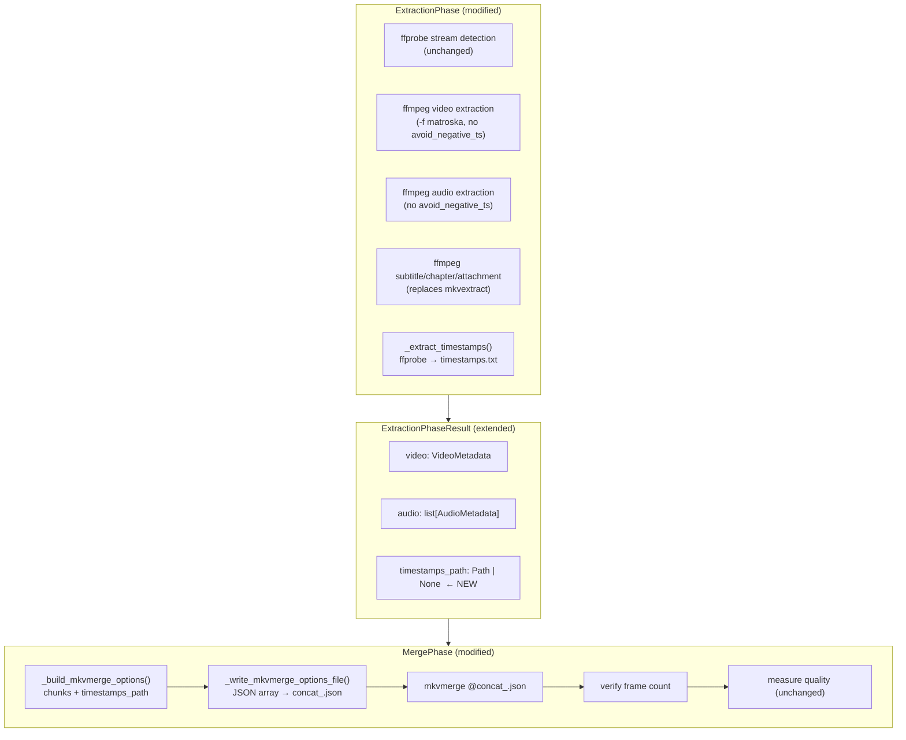

# Design Document: PTS Preservation

<!-- markdownlint-disable MD024 -->

- Created: 2026-04-29
- Completed: 2026-04-29

## Cross-Spec Summary

| Spec | Created | Relationship |
|------|---------|--------------|
| `ffmpeg-unified-runner` | 2026-03-17 (Completed) | **Prerequisite.** This spec relies on `run_ffmpeg()` / `run_ffmpeg_async()` as the mandatory runner for all ffmpeg calls. The new `_extract_timestamps()` function uses `subprocess.run` directly for `ffprobe` (not ffmpeg), which is consistent with the existing `MKVTrackExtractor._run_ffprobe()` pattern. |
| `merge-phase-revamp` | 2026-03-19 (Completed) | **Superseded in part.** `merge-phase-revamp` introduced the ffmpeg concat demuxer path with the `concat_<safe_name>.txt` file and the `_execute_merge` logic. This spec replaces that concat path entirely with `mkvmerge` + a JSON options file. The bug fixed in Requirement 7 (`"+genpts"` missing comma) was introduced by `merge-phase-revamp`. |
| `phase-recovery-refactor` | 2026-03-17 | **Extended.** This spec adds `TimestampArtifact` to the extraction phase's artifact set, following the same `COMPLETE`/`ABSENT` recovery pattern established by `phase-recovery-refactor`. The `force_wipe` propagation path is unchanged. |
| `metrics-two-tier` | 2026-06-15 | **No conflict.** Metrics collection keys (`MetricKey.EXTRACTION`, `MetricKey.MERGE`) are unchanged. The new `_extract_timestamps()` step may be timed under `MetricKey.EXTRACTION` if desired. |

---

## Overview

The pyqenc pipeline produces a final merged MKV whose PTS (Presentation Timestamps) differ from the source video. This breaks audio/subtitle sync when the output is later muxed with the original tracks.

This design addresses four root causes together:

1. **Encoder PTS reset** — each chunk starts at PTS 0 after encoding.
2. **Concat demuxer timeline reset** — ffmpeg concat reconstructs a new timeline from 0.
3. **`avoid_negative_ts make_zero`** — shifts the extracted video timeline.
4. **Python string concatenation bug** — silently merges `"+genpts"` and `"-y"` into `"+genpts-y"`, so `-fflags` receives the wrong value and `-y` is never passed as a separate flag.

The solution has two parts:

- **Extraction phase**: remove `avoid_negative_ts make_zero`; add `-f matroska` to video extraction; replace `mkvextract` for subtitles/chapters/attachments with `ffmpeg`; extract per-frame PTS timestamps from the source using `ffprobe` and save them as `extracted/timestamps.txt` in `# timestamp format v2`.

- **Merge phase**: replace the ffmpeg concat demuxer with `mkvmerge`, passing all arguments via a JSON options file (`@concat_<safe_name>.json`) to handle thousands of chunks without hitting OS command-line length limits. Apply the extracted timestamps file via `--timestamps 0:timestamps.txt` on the first chunk to restore exact source PTS. Fix the Python string concatenation bug in the existing ffmpeg concat command.

---

## Architecture

The changes are confined to two existing phases. No new phases, no new external tools, no new Python packages.



### Data flow for timestamps

```
source.mkv
  └─► ffprobe -select_streams <video_track_id> -show_packets -show_entries packet=pts
        └─► parse raw integer PTS values → sort ascending (decode order → presentation order)
              └─► extracted/timestamps.txt  (# timestamp format v2)
                    └─► ExtractionPhaseResult.timestamps_path
                          └─► mkvmerge options file: --timestamps 0:timestamps.txt
```

---

## Components and Interfaces

### 1. `constants.py` — new constant

```python
TIMESTAMPS_FILENAME = "timestamps.txt"
"""Filename for the per-frame PTS timestamp file produced by ExtractionPhase."""
```

### 2. `extraction.py` — new artifact class

```python
@dataclass
class TimestampArtifact(Artifact):
    """Extraction artifact for the per-frame PTS timestamp file.

    Path: extracted/timestamps.txt
    States: COMPLETE (file exists and non-empty) or ABSENT only.
    Not subject to include/exclude stream filtering.
    """
```

### 3. `extraction.py` — extended result

```python
@dataclass
class ExtractionPhaseResult(PhaseResult):
    video:           VideoMetadata | None = None
    audio:           list[AudioMetadata]  = field(default_factory=list)
    timestamps_path: Path | None          = None   # ← NEW
```

### 4. `extraction.py` — new private function

```python
def _extract_timestamps(source: Path, video_track_id: int, output: Path) -> None:
    """Extract per-frame PTS values from source and write timestamps.txt.

    Uses ffprobe to obtain raw integer ``pts`` for every packet in the specified
    video track, sorts ascending (ffprobe returns packets in decode/DTS order,
    which is non-monotonic for B-frame content), and writes in
    # timestamp format v2 using the .tmp-then-rename protocol.

    The video_track_id must be the same track_id used for video extraction
    (from VideoStream.track_id) to guarantee PTS values correspond to the
    correct stream.

    Args:
        source:         Path to the source video file.
        video_track_id: The ffprobe stream index of the video track to extract
                        timestamps from (same value as VideoStream.track_id).
        output:         Destination path (extracted/timestamps.txt).

    Raises:
        subprocess.CalledProcessError: If ffprobe fails.
        OSError: If the output file cannot be written.
    """
```

**Implementation sketch:**

```python
def _extract_timestamps(source: Path, video_track_id: int, output: Path) -> None:
    cmd: list[str | os.PathLike] = [
        "ffprobe", "-v", "error",
        "-select_streams", str(video_track_id),
        "-show_packets",
        "-show_entries", "packet=pts",
        "-of", "csv=print_section=0",
        source,
    ]
    result = subprocess.run(cmd, capture_output=True, text=True, check=True)

    pts_ms: list[int] = sorted(
        int(line.strip())
        for line in result.stdout.splitlines()
        if line.strip()
    )

    tmp = output.parent / f"{output.stem}{TEMP_SUFFIX}"
    output.parent.mkdir(parents=True, exist_ok=True)
    with tmp.open("w", encoding="utf-8") as fh:
        fh.write("# timestamp format v2\n")
        for ms in pts_ms:
            fh.write(f"{ms}\n")
    tmp.replace(output)
```

Note: `ffprobe` is not an ffmpeg process — it does not go through `run_ffmpeg()`. Direct `subprocess.run` is correct here, consistent with the existing `MKVTrackExtractor._run_ffprobe()` pattern.

### 5. `extraction.py` — modified video/audio extraction commands

**Video (before):**
```python
cmd = ["ffmpeg", "-i", source, "-map", f"0:{track.track_id}", "-c", "copy",
       "-fflags", "+genpts", "-avoid_negative_ts", "make_zero", "-y", output_file]
```

**Video (after):**
```python
cmd = ["ffmpeg", "-i", source, "-map", f"0:{track.track_id}", "-c", "copy",
       "-f", "matroska", output_file]
```

**Audio (before):**
```python
cmd = ["ffmpeg", "-i", source, "-map", f"0:{track.track_id}", "-c", "copy",
       "-fflags", "+genpts", "-avoid_negative_ts", "make_zero", "-y", output_file]
```

**Audio (after):**
```python
cmd = ["ffmpeg", "-i", source, "-map", f"0:{track.track_id}", "-c", "copy",
       output_file]
```

Rationale for `-f matroska` on video only: ffmpeg cannot infer the output container from a `.tmp` extension. The unified runner substitutes the output path with a `.tmp` sibling before launching ffmpeg, so the format must be explicit. Audio uses `.mka` as the final extension, but the `.tmp` substitution also applies — however, audio codecs (AC3, DTS, AAC, FLAC) are self-describing and ffmpeg can infer the container from the codec. Video requires explicit `-f matroska`.

### 6. `extraction.py` — subtitle/chapter/attachment extraction via ffmpeg

Replace `extractor.extract_tracks(other_absent, extracted_dir)` with individual `run_ffmpeg()` calls:

**Subtitles:**

Text subtitle codecs (SRT/SubRip, ASS/SSA) require an explicit `-f` flag because ffmpeg cannot infer the output format from the `.tmp` extension used by the unified runner. Bitmap subtitle codecs (PGS/HDMV, VobSub/DVD) are self-describing raw streams and do not need `-f`.

```python
# Text subtitles (srt, ass/ssa) — explicit format required for .tmp protocol
_SUBTITLE_FFMPEG_FORMAT: dict[str, str] = {
    "srt":  "srt",
    "ssa":  "ass",
    "ass":  "ass",
}

fmt = _SUBTITLE_FFMPEG_FORMAT.get(track.file_extension)
cmd = ["ffmpeg", "-i", source, "-map", f"0:{track.track_id}", "-c", "copy"]
if fmt:
    cmd += ["-f", fmt]
cmd.append(output_file)
run_ffmpeg(cmd, output_file=output_file)
```

Bitmap subtitles (`.sub`, `.pgs`) use `-c copy` without `-f` — the codec is self-describing.

**Chapters** (ffprobe XML format):
```python
chapters_cmd = ["ffprobe", "-v", "error", "-show_chapters", "-print_format", "xml", source]
result = subprocess.run(chapters_cmd, capture_output=True, text=True, check=True)
tmp.write_text(result.stdout, encoding="utf-8")
tmp.replace(output_file)
```

The chapter output file extension is `.xml`. ffprobe writes to stdout — we capture it and write atomically using the `.tmp`-then-rename protocol ourselves. This is consistent with the `_extract_timestamps()` pattern (direct `subprocess.run` for non-ffmpeg tools).

**Attachments:**

Attachments (fonts, images) are raw binary blobs stored in the container. ffmpeg extracts them via `-dump_attachment:<track_id>` which writes the raw bytes directly to a file, bypassing the muxer entirely — no format inference, no `-f` flag needed or applicable. The `-t 0 -f null -` part terminates ffmpeg immediately after the attachment is dumped without processing any video/audio frames.

```python
cmd = ["ffmpeg", "-i", source,
       f"-dump_attachment:{track.track_id}", str(output_file),
       "-t", "0", "-f", "null", "-"]
# Note: output_file is written as a side effect of -dump_attachment,
# not as the ffmpeg output argument. Pass output_file=None to the runner
# since the .tmp protocol does not apply here — ffmpeg writes directly.
run_ffmpeg(cmd, output_file=None)
```

Because `-dump_attachment` writes the file directly (not through the muxer), the `.tmp`-then-rename protocol cannot be applied. The file is written atomically by ffmpeg itself. If the extraction is interrupted, the partial file will be cleaned up by the standard recovery scan (file present but no sidecar → `ARTIFACT_ONLY` → re-extracted on next run).

### 7. `extraction.py` — `_recover()` changes

In `_recover()`, always check for `extracted/timestamps.txt` regardless of include/exclude filters:

```python
timestamps_file = extracted_dir / TIMESTAMPS_FILENAME
if timestamps_file.exists():
    timestamp_artifact = TimestampArtifact(
        path=timestamps_file, state=ArtifactState.COMPLETE
    )
else:
    timestamp_artifact = TimestampArtifact(
        path=timestamps_file, state=ArtifactState.ABSENT
    )
```

Include `timestamp_artifact` in the artifacts list and in `force_wipe` deletion.

### 8. `merge.py` — new private functions

```python
def _build_mkvmerge_options(
    chunks:          list[Path],
    output:          Path,
    timestamps_path: Path,
) -> list[str]:
    """Build the mkvmerge argument list for chunk concatenation with PTS restoration.

    The first chunk is listed without a prefix; each subsequent chunk is
    preceded by "+" as a separate element (mkvmerge append syntax).
    --timestamps is applied to track 0 of the first chunk only.

    Args:
        chunks:          Ordered list of encoded chunk paths.
        output:          Destination output MKV path.
        timestamps_path: Path to the timestamps.txt file.

    Returns:
        List of strings suitable for writing to a JSON options file.
    """
    args: list[str] = [
        "-o", str(output),
        "--timestamps", f"0:{timestamps_path}",
        str(chunks[0]),
    ]
    for chunk in chunks[1:]:
        args.append(f"+{chunk}")
    return args


def _write_mkvmerge_options_file(path: Path, args: list[str]) -> None:
    """Write mkvmerge arguments to a JSON options file atomically.

    Uses the .tmp-then-rename protocol for consistency.

    Args:
        path: Destination path for the options file.
        args: List of mkvmerge argument strings.
    """
    tmp = path.parent / f"{path.stem}{TEMP_SUFFIX}"
    tmp.write_text(json.dumps(args, ensure_ascii=False, indent=2), encoding="utf-8")
    tmp.replace(path)
```

### 9. `merge.py` — `_execute_merge()` changes

Replace the ffmpeg concat block with:

```python
# Resolve timestamps path from ExtractionPhaseResult
extraction_result = getattr(self._extraction, "result", None) if hasattr(self, "_extraction") else None
timestamps_path: Path | None = getattr(extraction_result, "timestamps_path", None)

if timestamps_path is None or not timestamps_path.exists():
    logger.critical(
        "timestamps.txt not found — cannot restore PTS. "
        "Re-run the extraction phase to generate it."
    )
    return _failed("timestamps.txt missing — merge phase cannot produce PTS-correct output")

# Write options file
options_file = final_dir / f"concat_{safe_name}.json"
args = _build_mkvmerge_options(strategy_chunks, output_file, timestamps_path)
_write_mkvmerge_options_file(options_file, args)

# Run mkvmerge
cmd_mkvmerge: list[str | os.PathLike] = ["mkvmerge", f"@{options_file}"]
logger.debug("mkvmerge command: %s", " ".join(str(a) for a in cmd_mkvmerge))
mkvmerge_result = subprocess.run(
    cmd_mkvmerge, capture_output=True, text=True
)

if mkvmerge_result.returncode != 0:
    logger.error("mkvmerge failed for strategy %s (exit %d)", strategy_name, mkvmerge_result.returncode)
    for line in mkvmerge_result.stderr.splitlines()[-20:]:
        logger.error("mkvmerge stderr: %s", line)
    # Leave options file on disk for debugging
    failed_strategies.append(strategy_name)
    continue

# Delete options file on success
options_file.unlink(missing_ok=True)
```

Note: `mkvmerge` is not run through `run_ffmpeg()` — it is a different tool. Direct `subprocess.run` is correct here, consistent with how `mkvextract` is currently called.

### 10. `merge.py` — fix Python string concatenation bug

```python
# BEFORE (buggy — "+genpts" and "-y" silently concatenated):
concat_cmd = [
    "ffmpeg",
    "-f",      "concat",
    "-safe",   "0",
    "-i",      concat_file,
    "-c",      "copy",
    "-fflags", "+genpts"
    "-y",
    output_file,
]

# AFTER (fixed — comma added):
concat_cmd = [
    "ffmpeg",
    "-f",      "concat",
    "-safe",   "0",
    "-i",      concat_file,
    "-c",      "copy",
    "-fflags", "+genpts",
    "-y",
    output_file,
]
```

### 11. `MergePhase` — dependency on `ExtractionPhase`

`MergePhase` currently depends on `JobPhase`, `EncodingPhase`, and `AudioPhase`. To access `timestamps_path`, it needs a reference to `ExtractionPhase.result`. Two options:

**Option A** — Add `ExtractionPhase` as a direct dependency of `MergePhase`. This is the cleanest approach and matches the data flow.

**Option B** — Pass `timestamps_path` through `JobPhaseResult` or another shared structure.

**Decision: Option A.** Add `self._extraction: ExtractionPhase | None` to `MergePhase.__init__`, wire it from the registry in `_build_registry`, and add it to `self.dependencies`. The `_build_registry` execution order already has `ExtractionPhase` before `MergePhase`.

---

## Data Models

### `TimestampArtifact`

```python
@dataclass
class TimestampArtifact(Artifact):
    """Extraction artifact for the per-frame PTS timestamp file.

    Attributes:
        path:  Always extracted/timestamps.txt.
        state: COMPLETE if file exists and non-empty; ABSENT otherwise.
               Never STALE — no parameters affect this artifact's validity.
    """
```

### `ExtractionPhaseResult` (extended)

```python
@dataclass
class ExtractionPhaseResult(PhaseResult):
    video:           VideoMetadata | None = None
    audio:           list[AudioMetadata]  = field(default_factory=list)
    timestamps_path: Path | None          = None
```

`timestamps_path` is set to the `TimestampArtifact.path` when its state is `COMPLETE`, or `None` when `ABSENT`.

### Timestamps file format (`# timestamp format v2`)

```
# timestamp format v2
0
42
83
125
...
```

- Line 1: literal `# timestamp format v2`
- Lines 2…N+1: one integer PTS value per frame in the container's native timebase units, sorted ascending
- Values are sorted (ffprobe returns packets in decode/DTS order, non-monotonic for B-frame content)

### mkvmerge options file format

```json
[
  "-o", "/path/to/output.mkv",
  "--timestamps", "0:/path/to/timestamps.txt",
  "/path/to/chunk1.mkv",
  "+/path/to/chunk2.mkv",
  "+/path/to/chunk3.mkv"
]
```

- Written to `final/concat_<safe_name>.json`
- Deleted on successful merge; retained on failure

---

## Correctness Properties

*A property is a characteristic or behavior that should hold true across all valid executions of a system — essentially, a formal statement about what the system should do. Properties serve as the bridge between human-readable specifications and machine-verifiable correctness guarantees.*

### Property 1: PTS conversion correctness

*For any* integer PTS value (as produced by ffprobe `packet=pts`), the value must be written as-is to the output file, and the output file must start with exactly `# timestamp format v2` followed by the values sorted ascending.

This property tests only the format translation — raw integer PTS values with the v2 header, sorted. No unit conversion is applied; ffprobe `packet=pts` already returns values in the container's native timebase units.

**Validates: Requirements 3.1, 3.2**

### Property 2: Timestamp filter independence

*For any* combination of include/exclude stream filter patterns, the `TimestampArtifact` must always be present in the artifact list after extraction (never filtered out), and its state must be either `COMPLETE` or `ABSENT` — never `STALE`.

**Validates: Requirements 3.4, 3.5**

### Property 3: Timestamp artifact classification

*For any* state of `extracted/timestamps.txt` on disk — present or absent — the recovery logic must classify the `TimestampArtifact` as `COMPLETE` if and only if the file exists, and `ABSENT` otherwise. File existence is the sole criterion; contents are not inspected (the `.tmp`-then-rename protocol guarantees a present file is complete).

**Validates: Requirements 3.6, 3.7**

### Property 4: Frame count preservation

*For any* source video, the frame count of the merged output must equal the frame count of the source video.

**Validates: Requirement 6.1**

### Property 5: PTS monotonicity

*For any* merged output video, the PTS values of all frames must be strictly monotonically increasing (each frame's PTS is greater than the previous frame's PTS).

**Validates: Requirement 6.2**

### Property 6: PTS accuracy

*For any* source video, the absolute difference between each merged output frame's PTS and the corresponding source frame's PTS must be at most 1 millisecond (the precision of `# timestamp format v2`).

**Validates: Requirement 6.3**

---

## Error Handling

### Extraction phase

| Condition | Handling |
|-----------|----------|
| `ffprobe` fails for timestamp extraction | Log `critical`, phase returns `FAILED` — merge cannot restore PTS without timestamps |
| `ffprobe` output is empty or unparseable | Log `critical`, phase returns `FAILED` — proceeding would silently produce wrong PTS |
| `ffprobe` output contains `N/A` or non-float lines | Log `critical`, phase returns `FAILED` — input data is corrupt, do not write partial timestamps |
| `ffmpeg` fails for subtitle/chapter/attachment | Log `error`, mark artifact `ABSENT`, continue with remaining streams |
| `ffmpeg` fails for video extraction | Log `error`, mark `VideoArtifact` `ABSENT`, phase returns `FAILED` |
| Chapter extraction produces empty file | Log `warning`, mark `OtherArtifact` `ABSENT` |

### Merge phase

| Condition | Handling |
|-----------|----------|
| `timestamps_path` is `None` or file absent | Log `critical` with clear message, phase returns `FAILED` — timestamps are required for all strategies |
| `mkvmerge` exits non-zero | Log `error` with stderr tail, leave options file on disk, skip strategy |
| Options file write fails | Log `error`, skip strategy |
| Output file absent or empty after `mkvmerge` | Log `error`, skip strategy |
| Frame count mismatch | Log `warning`, continue (non-fatal) |
| All strategies fail | Return `FAILED` outcome |

---

## Testing Strategy

### Unit tests

Unit tests verify specific behaviors with concrete examples:

- `test_extract_timestamps_format`: Given a mock `ffprobe` output with known integer PTS values in decode order, verify the written `timestamps.txt` has the correct header and values sorted ascending.
- `test_timestamp_artifact_recovery_complete`: Given `timestamps.txt` present on disk, verify `_recover()` classifies it as `COMPLETE`.
- `test_timestamp_artifact_recovery_absent`: Given no `timestamps.txt` on disk, verify `_recover()` classifies it as `ABSENT`.
- `test_timestamp_artifact_force_wipe`: Given `force_wipe=True`, verify `timestamps.txt` is deleted.
- `test_mkvmerge_options_single_chunk`: Given one chunk, verify options file has no `+` prefix.
- `test_mkvmerge_options_multiple_chunks`: Given N chunks, verify first has no prefix, rest have `+` prefix.
- `test_mkvmerge_options_timestamps_placement`: Verify `--timestamps 0:<path>` appears before the first chunk.
- `test_mkvmerge_options_file_deleted_on_success`: Verify options file is deleted after successful merge.
- `test_mkvmerge_options_file_retained_on_failure`: Verify options file is retained after failed merge.
- `test_concat_bug_fix`: Verify the ffmpeg concat command list has `"+genpts"` and `"-y"` as separate elements.
- `test_merge_fails_without_timestamps`: Verify merge phase returns `FAILED` with a clear message when `timestamps_path` is `None`.

### Property-based tests (Hypothesis)

Property tests use [Hypothesis](https://hypothesis.readthedocs.io/) with a minimum of 100 iterations per property.

Each test is tagged with a comment referencing the design property:
```python
# Feature: pts-preservation, Property N: <property_text>
```

- **Property 1** — `test_pts_conversion_correctness`: Generate random integer PTS values in decode order (unsorted); call the conversion function directly; verify the output file starts with `# timestamp format v2` and values are sorted ascending with no modification.

- **Property 2** — `test_timestamp_filter_independence`: Generate random include/exclude filter strings, run `_recover()` with a pre-existing `timestamps.txt`, verify `TimestampArtifact` is always in the artifact list and its state is only `COMPLETE` or `ABSENT`.

- **Property 3** — `test_timestamp_artifact_classification`: Generate random file states (present, absent), run `_recover()`, verify `COMPLETE` when file exists and `ABSENT` when it does not. Contents are not checked.

- **Property 4** — `test_frame_count_preservation`: Integration property. For any source video (using the test fixture), verify `get_frame_count(merged_output) == get_frame_count(source)`. Run with mocked mkvmerge for unit-level testing; run against real files for integration testing.

- **Property 5** — `test_pts_monotonicity`: For any merged output (using the test fixture), extract PTS values via ffprobe and verify they are strictly increasing.

- **Property 6** — `test_pts_accuracy`: For any source video (using the test fixture), verify `abs(merged_pts[i] - source_pts[i]) <= 1` for all frames.

### Integration tests

Integration tests run against the sample video (`D:\_current\О чём говорят мужчины Blu-Ray (1080p) (1).mkv`) in the configured work directory:

- Full pipeline run verifying `timestamps.txt` is produced.
- Full pipeline run verifying the merged output has matching frame count.
- Full pipeline run verifying PTS accuracy within 1 ms tolerance.
- Verify `mkvextract` is not called during extraction.
