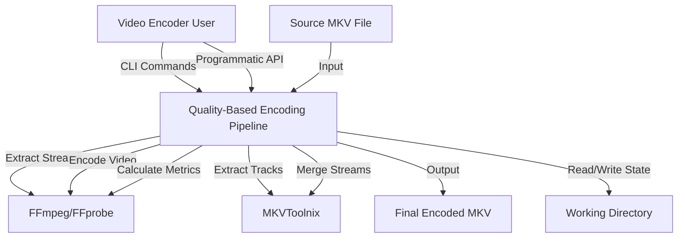
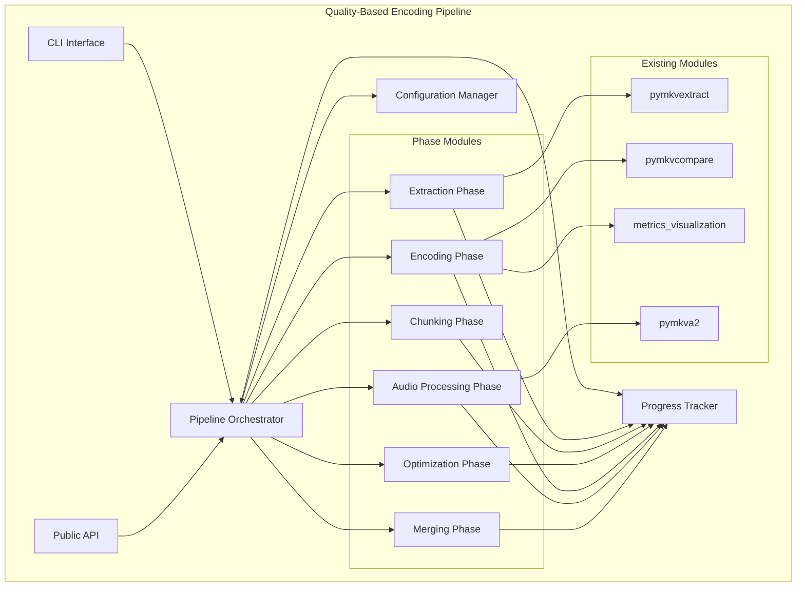
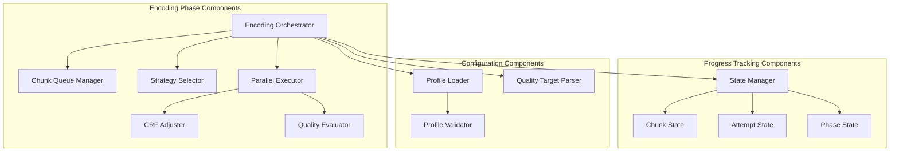
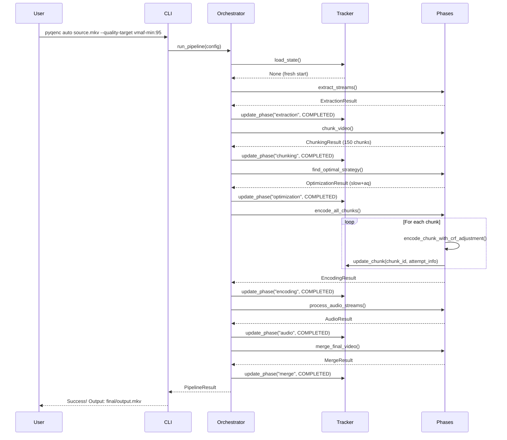
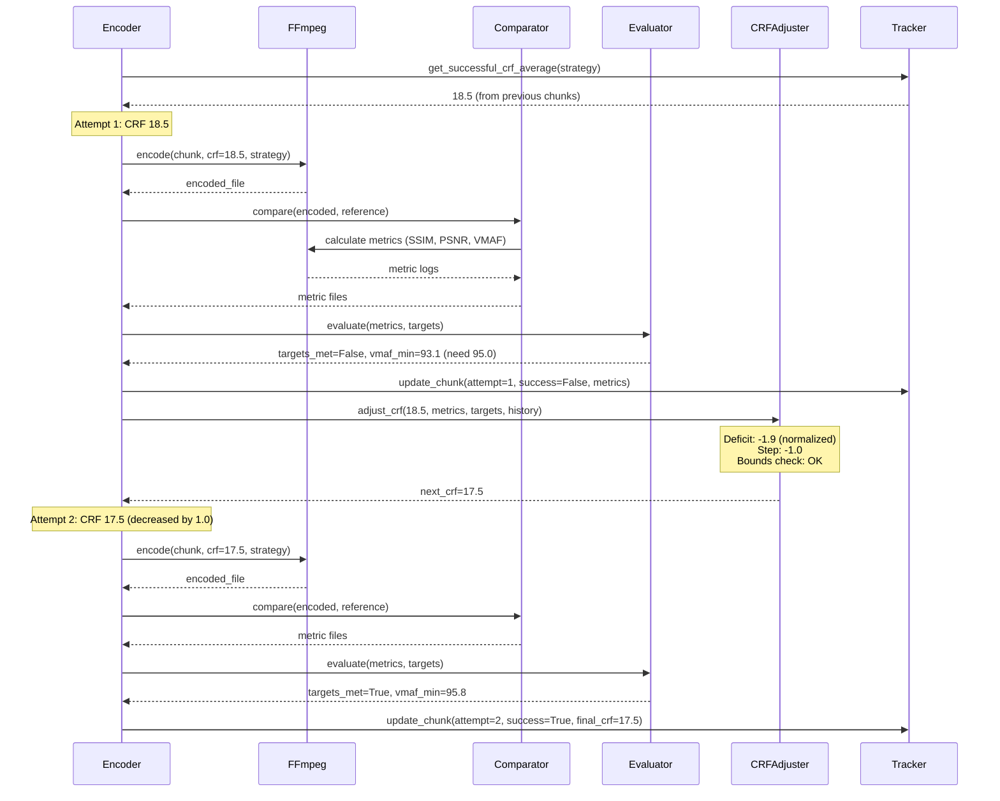
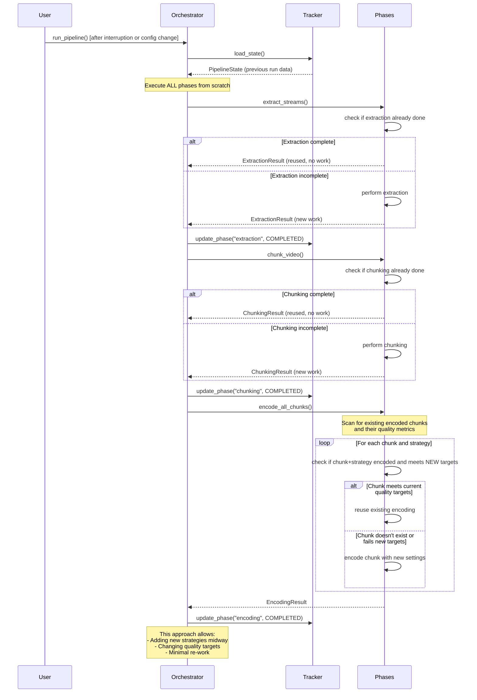

# Design Document

- Created: 2026-03-15
- Completed: 2026-03-15

## Overview

The quality-based encoding pipeline is a comprehensive video processing system that orchestrates extraction, scene-based chunking, quality-targeted encoding, audio processing, and final merging of video files. The system supports multiple codecs (h.264 8-bit, h.265 10-bit) and is designed to achieve user-specified quality targets while optimizing file size through iterative CRF adjustment.

### Key Design Principles

1. **Resumability**: All operations are tracked persistently, allowing the pipeline to resume after interruptions
2. **Modularity**: Each phase is independent with clear public APIs for both CLI and programmatic use
3. **Reusability**: Leverage existing tested modules (pymkvextract, pymkvcompare, metrics_visualization, pymkva2)
4. **CPU-First**: Default to CPU-based processing for consistency and compatibility
5. **Quality-First**: Never compromise on user-specified quality targets
6. **Transparency**: Preserve all intermediate artifacts until user confirmation
7. **Content-Aware**: Automatically detect and remove black borders to optimize encoding efficiency

### Architecture Style

The pipeline follows a **phased pipeline architecture** where each phase:

- Has clear inputs and outputs
- Can be executed independently via CLI subcommands
- Maintains its state in the progress tracker
- Produces artifacts in the working directory

## Architecture

> TODO: Diagrams below include legacy modules. They were inlined since then.

### C1: System Context



### C2: Container Diagram



### C3: Component Diagram



## Components and Interfaces

### 1. CLI Interface (`pyqenc.cli`)

**Responsibility**: Provide command-line interface with subcommands for each phase and automatic pipeline execution.

**Public Interface**:

```python
def main() -> int:
    """Main CLI entry point. Returns exit code."""

# Subcommands:
# - pyqenc auto <source> [options]
# - pyqenc extract <source> [options]
# - pyqenc chunk <video> [options]
# - pyqenc encode <chunks_dir> [options]
# - pyqenc compare <encoded> <reference> [options]
# - pyqenc audio <audio_dir> [options]
# - pyqenc merge <video> <audio> [options]
```

**Key Arguments**:

- `--work-dir`: Working directory for intermediate files and state
- `--quality-target`: Quality targets (e.g., "vmaf-min:95,vmaf-med:98"). Default: "vmaf-med:98"
- `--strategies`: Encoding strategies to use. Supports flexible specifications:
  - Not specified: Uses default "veryslow+h264*,slow+h265*"
  - Empty string "": Tests all preset+profile combinations
  - Specific: "slow+h265-aq,veryslow+h264"
  - Preset with profile wildcard: "slow+h265*" (all h265 profiles with slow preset)
  - Preset only: "slow" (all profiles with slow preset)
  - Profile wildcard only: "+h265*" (all presets with h265 profiles)
  - Comma-separated: "slow+h265*,medium+h264" (combines multiple patterns)
- `--all-strategies`: Disable optimization and produce output for all specified strategies. Default: False (optimization enabled, only optimal strategy output)
- `--log-level`: Logging level (debug, info, warning, critical)
- `--video-filter`: Regex pattern to filter video streams (e.g., ".*eng.*" for English)
- `--audio-filter`: Regex pattern to filter audio streams (e.g., ".*eng.*" for English)
- `--no-crop`: Disable automatic black border detection and cropping
- `--crop`: Manually specify crop parameters (format: "top bottom left right" or "top bottom")
- `-y, --execute [N]`: Execute phases (default: dry-run mode)
  - No flag: Dry-run mode (print what would be done, stop at first incomplete phase)
  - `-y` or `-y all`: Execute all phases
  - `-y 3`: Execute up to 3 phases then stop

**Process Priority**:

- Main process starts with lowered priority (below normal) to prevent system interference
- All subprocess inherit the lowered priority automatically
- Ensures encoding doesn't impact user's other activities

**Dry-Run Mode** (default):

- Scans all phases and prints what work would be performed
- Shows which artifacts exist and would be reused
- Shows which artifacts are missing and would be created
- Stops after printing the first phase that needs work
- Allows users to review the plan before execution
- Example output:

  ```log
  [DRY-RUN] Phase: Extraction
  [DRY-RUN]   ✓ Video already extracted: work/extracted/video.mkv
  [DRY-RUN]   ✓ Audio already extracted: work/extracted/audio_001.mka
  [DRY-RUN]   Status: Complete (reusing existing files)

  [DRY-RUN] Phase: Chunking
  [DRY-RUN]   ✗ Chunks not found
  [DRY-RUN]   Would create: 150 chunks (~45m duration)
  [DRY-RUN]   Status: Needs work

  [DRY-RUN] Stopping at first incomplete phase.
  [DRY-RUN] Run with -y to execute.
  ```

### 2. Public API (`pyqenc.api`)

**Responsibility**: Provide programmatic interface for pipeline integration.

**Public Interface**:

```python
from pathlib import Path
from typing import List
from .models import PipelineConfig, PipelineResult, QualityTarget

def run_pipeline(
    source_video: Path,
    work_dir: Path,
    quality_targets: List[QualityTarget] | None = None,  # Default: [QualityTarget("vmaf", "median", 98.0)]
    strategies: List[str] | None = None,  # Default: None (all combinations)
    all_strategies: bool = False  # Default: False (only optimal)
) -> PipelineResult:
    """Execute complete end-to-end pipeline.

    Args:
        quality_targets: Quality targets to meet. If None, defaults to vmaf-med:98
        strategies: Strategy specifications. If None, tests all preset+profile combinations
        all_strategies: If False, only optimal strategy output is produced
    """

def extract_streams(source_video: Path, output_dir: Path) -> ExtractionResult:
    """Extract video and audio streams from source MKV."""

def chunk_video(video_file: Path, output_dir: Path) -> ChunkingResult:
    """Split video into scene-based chunks."""

def encode_chunks(
    chunks_dir: Path,
    reference_dir: Path,
    strategies: List[str],
    quality_targets: List[QualityTarget],
    work_dir: Path
) -> EncodingResult:
    """Encode all chunks to meet quality targets."""

def process_audio(audio_dir: Path, output_dir: Path) -> AudioResult:
    """Process audio streams with normalization strategies."""

def merge_final(
    video_file: Path,
    audio_files: List[Path],
    output_file: Path
) -> MergeResult:
    """Merge encoded video and processed audio into final MKV."""
```

### 3. Pipeline Orchestrator (`pyqenc.orchestrator`)

**Responsibility**: Coordinate phase execution, manage state transitions, handle resumption through artifact-based detection, support dry-run mode.

**Internal Interface**:

```python
class PipelineOrchestrator:
    def __init__(self, config: PipelineConfig, tracker: ProgressTracker):
        """Initialize orchestrator with configuration and progress tracker."""

    def run(self, dry_run: bool = True, max_phases: int | None = None) -> PipelineResult:
        """Execute complete pipeline.

        Args:
            dry_run: If True, only print what would be done (default)
            max_phases: Maximum number of phases to execute (None = all)

        Always attempts all phases from scratch. Each phase checks for
        existing artifacts and reuses them if valid, or performs work if needed.

        In dry-run mode:
        - Prints status of each phase (complete/needs work)
        - Shows what artifacts exist and what would be created
        - Stops after first phase that needs work
        - Returns without performing any modifications
        """

    def _execute_phase(
        self,
        phase: Phase,
        dry_run: bool = False
    ) -> PhaseResult:
        """Execute a single phase and update progress.

        Phase determines internally if work is needed based on artifacts.
        In dry-run mode, phase only reports status without performing work.
        """
```

**Resumption Strategy**:

- Pipeline always executes all phases in order
- Each phase scans for existing artifacts (extracted files, chunks, encoded videos, metrics)
- Phase reuses artifacts if they meet current requirements
- Phase performs work only for missing or invalid artifacts
- **Configuration Change Handling**:
  - Adding new encoding strategies: only encodes chunks for new strategies
  - Changing quality targets: re-evaluates existing encodings against new targets, re-encodes only chunks that don't meet new targets
  - Modifying other parameters: phases detect changes and perform necessary re-work
- **Phase Completion Check**:
  - Each phase checks if it's fully complete based on current configuration
  - If configuration changes (e.g., new strategy added), phase detects incomplete work
  - Progress tracker stores configuration snapshot to detect changes
- This approach supports:
  - Adding new encoding strategies midway
  - Changing quality targets (re-encodes only chunks that don't meet new targets)
  - Recovering from interruptions without explicit resume logic
  - Manual artifact cleanup (delete specific chunks to re-encode them)
  - Iterative refinement (user can modify parameters after completion)

**Dry-Run Mode**:

- Default behavior when `-y` flag not provided
- Each phase reports its status without performing work
- Pipeline stops after first phase that reports "needs work"
- Allows users to review the execution plan before committing

### 4. Progress Tracker (`pyqenc.progress`)

**Responsibility**: Persist and manage pipeline execution state for resumability.

**Public Interface**:

```python
class ProgressTracker:
    def __init__(self, work_dir: Path):
        """Initialize tracker with working directory."""

    def load_state(self) -> PipelineState | None:
        """Load existing state from disk, or None if fresh start."""

    def save_state(self, state: PipelineState) -> None:
        """Persist current state to disk."""

    def update_phase(self, phase: str, status: PhaseStatus) -> None:
        """Update phase status."""

    def update_chunk(self, chunk_id: str, strategy: str, attempt: AttemptInfo) -> None:
        """Update chunk attempt information."""

    def get_chunk_state(self, chunk_id: str, strategy: str) -> ChunkState | None:
        """Retrieve state for specific chunk and strategy."""

    def get_successful_crf_average(self, strategy: str) -> float | None:
        """Calculate average CRF from successful chunks for given strategy."""
```

**State File Format** (JSON):

```json
{
  "version": "1.0",
  "source_video": "movie.mkv",
  "current_phase": "encoding",
  "crop_params": "140 140 0 0",
  "phases": {
    "extraction": {
      "status": "completed",
      "timestamp": "2026-02-15T10:00:00",
      "metadata": {
        "crop_detected": true,
        "original_resolution": "1920x1080",
        "cropped_resolution": "1920x800"
      }
    },
    "chunking": {"status": "completed", "chunks_count": 150},
    "optimization": {"status": "completed", "optimal_strategy": "slow+aq"},
    "encoding": {"status": "in_progress", "completed": 45, "total": 150},
    "audio": {"status": "not_started"},
    "merge": {"status": "not_started"}
  },
  "chunks": {
    "chunk_001": {
      "strategies": {
        "slow+aq": {
          "status": "completed",
          "attempts": [
            {"crf": 20, "vmaf_min": 93.2, "vmaf_med": 96.1, "success": false},
            {"crf": 18, "vmaf_min": 95.3, "vmaf_med": 97.8, "success": true}
          ],
          "final_crf": 18
        }
      }
    }
  }
}
```

### 5. Configuration Manager (`pyqenc.config`)

**Responsibility**: Load, validate, and provide access to encoding profiles and configuration.

**Public Interface**:

```python
class ConfigManager:
    def __init__(self, config_path: Path | None = None):
        """Initialize with optional custom config path."""

    def get_default_strategies(self) -> List[str]:
        """Get default strategy patterns from configuration."""

    def get_codec(self, name: str) -> CodecConfig:
        """Retrieve codec configuration by name."""

    def get_profile(self, name: str) -> EncodingProfile:
        """Retrieve profile by name."""

    def list_codecs(self) -> List[str]:
        """List all available codec names."""

    def list_profiles(self, codec: str | None = None) -> List[str]:
        """List all available profile names, optionally filtered by codec."""

    def list_presets(self, codec: str) -> List[str]:
        """List presets supported by specific codec."""

    def validate_strategy(self, strategy: str) -> bool:
        """Validate strategy string format."""

    def parse_strategy(self, strategy: str) -> List[StrategyConfig]:
        """Parse strategy string into list of encoder configurations.

        Supports flexible specifications:
        - "slow+h265-aq": specific preset+profile
        - "slow+h265*": preset with profile wildcard (all h265 profiles)
        - "slow": all profiles with slow preset (validated per codec)
        - "+h265*": all presets with h265 profiles (wildcard, from h265-10bit codec)
        - "+h265-aq": all presets with specific profile (from h265-10bit codec)
        - "": all preset+profile combinations (all codecs, all presets per codec)

        Validation:
        - Preset must be supported by profile's codec
        - Profile must reference valid codec
        """

    def expand_strategies(self, strategies: List[str] | None) -> List[StrategyConfig]:
        """Expand strategy specifications into full list of configurations.

        Args:
            strategies: List of strategy patterns, or None for default from config

        Returns:
            List of fully resolved StrategyConfig objects
        """

class CodecConfig:
    name: str
    encoder: str  # FFmpeg encoder name (e.g., "libx264", "libx265")
    pixel_format: str  # e.g., "yuv420p", "yuv420p10le"
    default_crf: float
    crf_range: Tuple[float, float]
    presets: List[str]  # Presets supported by this encoder

class EncodingProfile:
    name: str
    codec: str  # References codec name (e.g., "h265-10bit")
    description: str
    extra_args: List[str]  # Additional ffmpeg arguments
```

**Configuration File Format** (YAML):

```yaml
# Default strategies to use when --strategies not specified
default_strategies:
  - "veryslow+h264*"
  - "slow+h265*"

# Codec definitions with their base settings
codecs:
  h264-8bit:
    encoder: libx264  # FFmpeg encoder name
    pixel_format: yuv420p
    default_crf: 23
    crf_range: [0, 51]
    presets:  # Presets supported by this encoder
      - ultrafast
      - superfast
      - veryfast
      - faster
      - fast
      - medium
      - slow
      - slower
      - veryslow
      - placebo

  h265-10bit:
    encoder: libx265  # FFmpeg encoder name
    pixel_format: yuv420p10le
    default_crf: 20
    crf_range: [0, 51]
    presets:  # Presets supported by this encoder
      - ultrafast
      - superfast
      - veryfast
      - faster
      - fast
      - medium
      - slow
      - slower
      - veryslow
      - placebo

# Encoding profiles organized by codec
profiles:
  # h.264 8-bit profiles
  h264:
    codec: h264-8bit
    description: "Default h.264 8-bit encoding with no extra arguments"
    extra_args: []

  # h.265 10-bit profiles
  h265:
    codec: h265-10bit
    description: "Default h.265 10-bit encoding with no extra arguments"
    extra_args: []

  h265-aq:
    codec: h265-10bit
    description: "h.265 10-bit with adaptive quantization tuning"
    extra_args:
      - "-x265-params"
      - "aq-mode=3:aq-strength=0.8"

  h265-anime:
    codec: h265-10bit
    description: "h.265 10-bit optimized for anime content"
    extra_args:
      - "-x265-params"
      - "aq-mode=2:psy-rd=1.0:deblock=-1,-1"
```

**Strategy Expansion Logic**:

1. Parse strategy pattern (e.g., "slow+h265*")
2. Extract preset and profile pattern
3. Resolve profile pattern to list of matching profiles
4. For each matching profile, get its codec
5. Validate preset is supported by that codec
6. Generate StrategyConfig for each valid preset+profile combination

**Example Expansions**:

- "slow+h265*" → slow+h265, slow+h265-aq, slow+h265-anime (all use h265-10bit codec with slow preset)
- "veryslow+h264*" → veryslow+h264 (only h264 profile exists)
- "+h265-aq" → ultrafast+h265-aq, superfast+h265-aq, ..., placebo+h265-aq (all h265-10bit presets)
- "slow" → slow+h264, slow+h265, slow+h265-aq, slow+h265-anime (slow with all profiles, validated per codec)

### 6. Extraction Phase (`pyqenc.phases.extraction`)

**Responsibility**: Extract video and audio streams from source MKV using pymkvextract, and detect black borders for cropping.

**Public Interface**:

```python
def extract_streams(
    source_video: Path,
    output_dir: Path,
    video_filter: str | None = None,
    audio_filter: str | None = None,
    detect_crop: bool = True,
    manual_crop: str | None = None,
    force: bool = False,
    dry_run: bool = False
) -> ExtractionResult:
    """Extract streams from source video.

    Args:
        source_video: Path to source MKV file
        output_dir: Directory for extracted streams
        video_filter: Regex pattern to include video streams (e.g., ".*eng.*")
        audio_filter: Regex pattern to include audio streams (e.g., ".*eng.*")
        detect_crop: If True, automatically detect black borders
        manual_crop: Manual crop parameters (format: "top bottom left right" or "top bottom")
        force: If False, reuse existing extracted files
        dry_run: If True, only report status without performing extraction

    Returns:
        ExtractionResult with paths to extracted video and audio files.

    Note:
        Filters are applied to stream metadata (language, title, codec).
        Use pymkvextract's filtering approach for consistency.
        Crop format matches pymkvcompare: top bottom left right (left/right optional).
    """

@dataclass
class CropParams:
    """Black border crop parameters (reuses pymkvcompare.CropParams)."""
    top: int = 0
    bottom: int = 0
    left: int = 0
    right: int = 0

    def is_empty(self) -> bool:
        """Check if CropParams are empty."""
        return not (self.top or self.bottom or self.left or self.right)

    def to_ffmpeg_filter(self) -> str:
        """Convert to ffmpeg crop filter string."""
        return f"crop=iw-{self.left+self.right}:ih-{self.top+self.bottom}:{self.left}:{self.top}"

    def __str__(self) -> str:
        """String representation for storage and display."""
        return f"{self.top} {self.bottom} {self.left} {self.right}"

    @staticmethod
    def parse(crop_str: str) -> 'CropParams':
        """Parse from string format 'top bottom left right'.

        Accepts 2 or 4 values:
        - 2 values: top bottom (left and right default to 0)
        - 4 values: top bottom left right

        Examples:
            "140 140" -> CropParams(140, 140, 0, 0)
            "140 140 0 0" -> CropParams(140, 140, 0, 0)
        """
        parts = crop_str.split()
        if len(parts) == 2:
            return CropParams(top=int(parts[0]), bottom=int(parts[1]), left=0, right=0)
        elif len(parts) == 4:
            return CropParams(top=int(parts[0]), bottom=int(parts[1]),
                            left=int(parts[2]), right=int(parts[3]))
        else:
            raise ValueError(f"Invalid crop format: {crop_str}. Expected 2 or 4 values.")

@dataclass
class ExtractionResult:
    video_files: List[Path]
    audio_files: List[Path]
    crop_params: CropParams | None  # None if no cropping needed
    reused: bool  # True if existing files were reused
    needs_work: bool  # True if extraction would be performed (dry-run)
    success: bool
    error: str | None = None
```

**Implementation Notes**:

- Reuses `MKVTrackExtractor` from pymkvextract
- Checks for existing extracted files in output_dir
- If files exist and force=False, returns existing files without re-extraction
- Applies regex filters to stream metadata (language, title, codec name)
- Filters for video streams (typically one primary video)
- Filters for audio streams (all matching audio tracks)
- **Black Border Detection**:
  - Uses ffmpeg's `cropdetect` filter on multiple sample frames
  - Samples frames from beginning (skip first 60s), middle, and end of video
  - Takes most conservative crop (largest area that removes all black borders)
  - Stores crop parameters in progress tracker for use in later phases
  - Skips detection if manual crop provided or `--no-crop` specified
- Stores extracted files in `{work_dir}/extracted/` with descriptive names from pymkvextract
- Filter examples:
  - `".*eng.*"` - Match English language streams
  - `".*commentary.*"` - Match commentary tracks
  - `"^(?!.*commentary).*$"` - Exclude commentary tracks

**Crop Detection Algorithm**:

```python
def detect_crop_parameters(video_file: Path, sample_count: int = 10) -> CropParameters | None:
    """Detect black borders using ffmpeg cropdetect.

    Args:
        video_file: Path to video file
        sample_count: Number of frames to sample across video

    Returns:
        CropParameters if borders detected, None if no cropping needed
    """
    # Sample frames: skip first 60s, then evenly distribute samples
    # Use cropdetect filter with conservative threshold (0.1)
    # Parse cropdetect output for each frame
    # Return most conservative crop (largest w*h that appears in all samples)
```

### 7. Chunking Phase (`pyqenc.phases.chunking`)

**Responsibility**: Split video into scene-based chunks with frame-perfect accuracy, applying crop if detected.

**Public Interface**:

```python
def chunk_video(
    video_file: Path,
    output_dir: Path,
    crop_params: CropParams | None = None,
    scene_threshold: float = 0.3,
    min_scene_length: int = 24,
    force: bool = False
) -> ChunkingResult:
    """Split video into scene-based chunks.

    Args:
        video_file: Path to video file to chunk
        output_dir: Directory for chunk output
        crop_params: Crop parameters to apply during chunking
        scene_threshold: Scene detection sensitivity (0.0-1.0)
        min_scene_length: Minimum frames per chunk
        force: If False, reuse existing chunks if valid

    Returns:
        ChunkingResult with chunk information.
    """

@dataclass
class ChunkInfo:
    chunk_id: str
    file_path: Path
    start_frame: int
    end_frame: int
    frame_count: int
    duration: float

@dataclass
class ChunkingResult:
    chunks: List[ChunkInfo]
    total_frames: int
    reused: bool  # True if existing chunks were reused
    success: bool
    error: str | None = None
```

**Implementation Strategy**:

- Check for existing chunks in output_dir
- If chunks exist, validate total frame count matches source
- If valid and force=False, return existing chunks
- Otherwise, perform chunking:
  - Use ffmpeg's `scenedetect` filter for scene boundary detection
  - **Apply crop filter during chunking if crop_params provided**
  - Use ffmpeg's `segment` muxer with frame-accurate splitting
  - Verify total frame count matches source video (after cropping)
- Store chunks as `{work_dir}/chunks/chunk_{id:04d}.mkv`
- Generate chunk manifest JSON for tracking

**Note**: Chunks are stored in cropped form to save disk space and processing time in later phases.

### 8. Optimization Phase (`pyqenc.phases.optimization`)

**Responsibility**: Select optimal encoding strategy by testing on representative chunks. Enabled by default unless --all-strategies flag is used.

**Public Interface**:

```python
def find_optimal_strategy(
    chunks: List[ChunkInfo],
    strategies: List[StrategyConfig],
    quality_targets: List[QualityTarget],
    work_dir: Path
) -> OptimizationResult:
    """Find optimal strategy by testing on representative chunks.

    Selects ~1% of chunks (min 3) from middle 80% of video.
    Tests all strategies and returns the one with smallest average file size.

    This phase is enabled by default. It is skipped when --all-strategies flag is used,
    in which case all specified strategies are encoded for all chunks without optimization.
    """

@dataclass
class OptimizationResult:
    optimal_strategy: StrategyConfig
    test_results: Dict[str, StrategyTestResult]
    success: bool
    error: str | None = None

@dataclass
class StrategyTestResult:
    strategy: str
    avg_file_size: float
    avg_crf: float
    test_chunks: List[str]
    all_passed: bool
```

**Implementation Strategy**:

- Select test chunks: `count = max(3, int(total_chunks * 0.01))`
- Exclude first 10% and last 10% of chunks
- Distribute test chunks evenly across remaining range
- For each strategy, encode test chunks with CRF adjustment
- Track average CRF and file size for each strategy
- Select strategy with smallest average file size where all chunks pass quality targets
- **Optimization Control**:
  - Default behavior: Optimization enabled, only optimal strategy output produced
  - With `--all-strategies`: Optimization skipped, all strategies encoded for all chunks

### 9. Encoding Phase (`pyqenc.phases.encoding`)

**Responsibility**: Encode all chunks to meet quality targets with parallel processing and CRF optimization. Chunks are already cropped from chunking phase.

**Public Interface**:

```python
def encode_all_chunks(
    chunks: List[ChunkInfo],
    reference_chunks: List[Path],
    strategies: List[str],
    quality_targets: List[QualityTarget],
    work_dir: Path,
    max_parallel: int = 2,
    force: bool = False
) -> EncodingResult:
    """Encode all chunks with quality-targeted CRF adjustment.

    Args:
        chunks: List of chunk information
        reference_chunks: Original chunk files for comparison (already cropped)
        strategies: Encoding strategies to use
        quality_targets: Quality requirements to meet
        work_dir: Working directory for artifacts
        max_parallel: Maximum concurrent encoding processes
        force: If False, reuse existing encodings that meet current targets

    Returns:
        EncodingResult with paths to encoded chunks.

    Note:
        Reference chunks are already cropped during chunking phase.
        No additional cropping needed during encoding or comparison.
    """

@dataclass
class EncodingResult:
    encoded_chunks: Dict[str, Dict[str, Path]]  # {chunk_id: {strategy: path}}
    reused_count: int  # Number of chunks reused from previous runs
    encoded_count: int  # Number of chunks newly encoded
    success: bool
    failed_chunks: List[str]
    error: str | None = None

class ChunkEncoder:
    """Handles encoding of individual chunks with CRF adjustment."""

    def encode_chunk(
        self,
        chunk: ChunkInfo,
        reference: Path,
        strategy: str,
        quality_targets: List[QualityTarget],
        initial_crf: float = 20.0,
        force: bool = False
    ) -> ChunkEncodingResult:
        """Encode single chunk, adjusting CRF until quality targets met.

        If force=False, checks for existing encoding that meets targets.
        """
```

**Artifact-Based Resumption**:

- For each chunk+strategy combination:
  1. Check if encoded file exists in `{work_dir}/encoded/{strategy}/chunk_{id}_attempt_{n}.mkv`
  2. Check if metrics exist in same directory with matching attempt number
  3. If both exist, parse metrics and evaluate against current quality targets
  4. If targets met, reuse existing encoding (skip to next chunk)
  5. If targets not met or files missing, encode chunk
- **Smart CRF Selection**:
  - Never re-attempt previously used CRF values for same chunk+strategy
  - Track all attempted CRFs in history
  - Use history bounds to guide next CRF selection
  - Prefer binary search between known bounds over linear steps
  - If no history exists, use average of successful CRFs from other chunks
- This allows:
  - Changing quality targets: only re-encodes chunks that don't meet new targets
  - Adding strategies: only encodes chunks for new strategies
  - Recovering from interruptions: resumes where left off
  - Avoiding redundant encoding attempts with same CRF

**CRF Adjustment Algorithm**:

```python
@dataclass
class CRFHistory:
    """Track CRF attempts to prevent cycles and enable smart adjustment."""
    attempts: List[Tuple[float, Dict[str, float]]]  # [(crf, metrics)]

    def add_attempt(self, crf: float, metrics: Dict[str, float]):
        """Record an encoding attempt."""
        self.attempts.append((crf, metrics))

    def has_attempted(self, crf: float, tolerance: float = 0.1) -> bool:
        """Check if CRF has been attempted (within tolerance)."""
        return any(abs(attempted_crf - crf) < tolerance for attempted_crf, _ in self.attempts)

    def get_bounds(self) -> Tuple[float | None, float | None]:
        """Get CRF bounds where quality was too low/high."""
        too_low_crf = None  # CRF where quality was below target
        too_high_crf = None  # CRF where quality was above target

        for crf, metrics in self.attempts:
            if self._quality_below_target(metrics):
                if too_low_crf is None or crf < too_low_crf:
                    too_low_crf = crf
            else:
                if too_high_crf is None or crf > too_high_crf:
                    too_high_crf = crf

        return (too_low_crf, too_high_crf)

def normalize_metric_deficit(
    metric_type: str,
    actual: float,
    target: float
) -> float:
    """Normalize quality deficit to 0-100 scale for consistent adjustment.

    Returns:
        Positive if quality exceeds target, negative if below.
        Magnitude indicates how far from target (0-100 scale).
    """
    if metric_type == "ssim":
        # SSIM: 0.0-1.0 scale, convert to percentage
        return (actual - target) * 100
    elif metric_type == "psnr":
        # PSNR: dB scale, already meaningful
        # Cap at 100 for inf values
        if actual == float('inf'):
            actual = 100
        return actual - target
    elif metric_type == "vmaf":
        # VMAF: 0-100 scale, already percentage
        return actual - target
    else:
        raise ValueError(f"Unknown metric type: {metric_type}")

def adjust_crf(
    current_crf: float,
    quality_results: Dict[str, float],
    quality_targets: List[QualityTarget],
    history: CRFHistory
) -> float | None:
    """Calculate next CRF value based on quality results and history.

    Handles bidirectional adjustment with cycle prevention.
    Minimum granularity: 0.25

    Returns:
        Next CRF to try, or None if targets are met.
    """
    # Check if all targets met
    if all_targets_met(quality_results, quality_targets):
        return None  # Success

    # Calculate normalized deficits for all targets
    deficits = []
    for target in quality_targets:
        metric_key = f"{target.metric}_{target.statistic}"
        actual = quality_results.get(metric_key)
        if actual is None:
            continue

        deficit = normalize_metric_deficit(target.metric, actual, target.value)
        deficits.append(deficit)

    # Find worst deficit (most negative = furthest below target)
    worst_deficit = min(deficits) if deficits else 0

    # Get CRF bounds from history to prevent cycles
    too_low_crf, too_high_crf = history.get_bounds()

    # Determine adjustment direction and magnitude
    if worst_deficit < 0:
        # Quality below target - decrease CRF (increase quality)
        if abs(worst_deficit) > 10:
            step = -3.0  # Large deficit
        elif abs(worst_deficit) > 5:
            step = -2.0  # Medium deficit
        elif abs(worst_deficit) > 2:
            step = -1.0  # Small deficit
        else:
            step = -0.5  # Very small deficit
    else:
        # Quality above target - increase CRF (decrease quality, save size)
        # Only adjust if significantly above to avoid oscillation
        if worst_deficit > 10:
            step = 2.0  # Significantly over target
        elif worst_deficit > 5:
            step = 1.0  # Moderately over target
        else:
            step = 0.5  # Slightly over target

    # Calculate next CRF
    next_crf = current_crf + step

    # Apply bounds from history to prevent cycles
    if too_low_crf is not None and next_crf >= too_low_crf:
        # Would exceed known failing CRF, use midpoint
        if too_high_crf is not None:
            next_crf = (too_low_crf + too_high_crf) / 2
        else:
            next_crf = too_low_crf - 0.5

    if too_high_crf is not None and next_crf <= too_high_crf:
        # Would go below known passing CRF, use midpoint
        if too_low_crf is not None:
            next_crf = (too_low_crf + too_high_crf) / 2
        else:
            next_crf = too_high_crf + 0.5

    # Round to minimum granularity (0.25)
    next_crf = round(next_crf * 4) / 4

    # Sanity bounds (CRF typically 0-51 for x265)
    next_crf = max(0.0, min(51.0, next_crf))

    return next_crf
```

**Parallel Execution Strategy**:

- Maintain queue of pending chunks
- Process up to `max_parallel` chunks concurrently
- Prioritize completing started chunks (finish attempts before starting new chunks)
- Share successful CRF values across chunks with same strategy
- Use average of successful CRFs as starting point for new chunks

### 10. Quality Evaluation (`pyqenc.quality`)

**Responsibility**: Evaluate encoded chunks against quality targets using metrics. Both encoded and reference chunks are already cropped.

**Public Interface**:

```python
@dataclass
class QualityTarget:
    metric: str  # "vmaf", "ssim", "psnr"
    statistic: str  # "min", "median", "max"
    value: float

    @staticmethod
    def parse(target_str: str) -> QualityTarget:
        """Parse target string like 'vmaf-min:95' or 'ssim-med:0.98'"""

class QualityEvaluator:
    def evaluate_chunk(
        self,
        encoded: Path,
        reference: Path,
        targets: List[QualityTarget],
        subsample_factor: int = 10
    ) -> QualityEvaluation:
        """Evaluate encoded chunk against reference.

        Uses pymkvcompare and metrics_visualization modules.

        Note:
            Both encoded and reference are already cropped to same dimensions.
            No additional cropping needed during comparison.
        """

@dataclass
class QualityEvaluation:
    metrics: Dict[str, MetricStats]  # {metric_name: stats}
    targets_met: bool
    failed_targets: List[QualityTarget]
    artifacts: QualityArtifacts

@dataclass
class QualityArtifacts:
    psnr_log: Path | None
    ssim_log: Path | None
    vmaf_json: Path | None
    plot: Path | None
    stats_files: List[Path]
```

**Integration with Existing Modules**:

- Use `pymkvcompare` to generate metric log files
- Use `metrics_visualization.api.analyze_chunk_quality()` to parse metrics and generate plots
- Store all artifacts in `{work_dir}/metrics/{chunk_id}/{strategy}/attempt_{n}/`

### 11. Audio Processing Phase (`pyqenc.phases.audio`)

**Responsibility**: Process extracted audio streams using pymkva2 strategies.

**Public Interface**:

```python
def process_audio_streams(
    audio_files: List[Path],
    output_dir: Path
) -> AudioResult:
    """Process audio files to generate normalized stereo variants.

    Produces:
    - Day mode: normalized stereo AAC
    - Night mode: normalized stereo AAC with dynamic range compression
    """

@dataclass
class AudioResult:
    day_mode_files: List[Path]
    night_mode_files: List[Path]
    success: bool
    error: str | None = None
```

**Implementation Strategy**:

- Reuse `AudioEngine` from pymkva2
- Configure strategies for day/night mode processing
- Output AAC format for broad compatibility
- Store processed audio in `{work_dir}/audio/`

### 12. Merging Phase (`pyqenc.phases.merge`)

**Responsibility**: Concatenate encoded chunks and merge with processed audio into final MKV, then measure final quality.

**Public Interface**:

```python
def merge_final_video(
    encoded_chunks: Dict[str, Path],  # {chunk_id: path} for single strategy
    audio_files: List[Path],
    output_file: Path,
    source_video: Path,  # For final quality measurement
    quality_targets: List[QualityTarget],
    verify_frames: bool = True,
    measure_quality: bool = True
) -> MergeResult:
    """Merge encoded chunks and audio into final MKV, then measure quality.

    Args:
        encoded_chunks: Ordered dict of chunk paths
        audio_files: Processed audio files to include
        output_file: Path for final output
        source_video: Original source for quality comparison
        quality_targets: Quality targets to verify against
        verify_frames: Verify frame count matches source
        measure_quality: Measure final video quality metrics
    """

@dataclass
class MergeResult:
    output_file: Path
    frame_count: int
    final_metrics: Dict[str, float] | None  # {metric_stat: value} e.g., {"vmaf_min": 95.8}
    targets_met: bool | None  # None if not measured
    metrics_plot: Path | None  # Path to final quality metrics plot
    success: bool
    error: str | None = None
```

**Implementation Strategy**:

- Use ffmpeg concat demuxer for frame-perfect concatenation
- Create concat file listing all chunks in order
- Use mkvmerge to combine video and audio streams
- Verify final frame count matches source video
- **Measure final quality**: Compare complete merged video against original source
- Generate quality metrics (SSIM, PSNR, VMAF) for final output
- **Generate final quality plot**: Create visual plot showing metrics over time for the complete video
- Report metrics and plot path to user for verification
- If multiple strategies requested, produce separate output for each with quality measurement and plot

**Concat File Format**:

```log
file 'chunk_0001.mkv'
file 'chunk_0002.mkv'
file 'chunk_0003.mkv'
...
```

## Data Models

### Core Models (`pyqenc.models`)

```python
from dataclasses import dataclass
from pathlib import Path
from typing import List, Dict
from enum import Enum

class PhaseStatus(Enum):
    NOT_STARTED = "not_started"
    IN_PROGRESS = "in_progress"
    COMPLETED = "completed"
    FAILED = "failed"

@dataclass
class PipelineConfig:
    """Configuration for complete pipeline execution."""
    source_video: Path
    work_dir: Path
    quality_targets: List[QualityTarget]  # Default: [QualityTarget("vmaf", "median", 98.0)]
    strategies: List[StrategyConfig]  # Expanded from strategy specifications
    all_strategies: bool = False  # If False, only optimal strategy output produced
    max_parallel: int = 2
    subsample_factor: int = 10
    log_level: str = "info"
    crop_params: CropParams | None = None  # Detected or manual crop
    video_filter: str | None = None
    audio_filter: str | None = None

@dataclass
class PipelineState:
    """Complete state of pipeline execution."""
    version: str
    source_video: str
    current_phase: str
    crop_params: str | None  # Stored as "w:h:x:y" string
    phases: Dict[str, PhaseState]
    chunks: Dict[str, ChunkState]

@dataclass
class PhaseState:
    """State of a single phase."""
    status: PhaseStatus
    timestamp: str | None = None
    metadata: Dict[str, any] = None

@dataclass
class ChunkState:
    """State of a single chunk across strategies."""
    chunk_id: str
    strategies: Dict[str, StrategyState]

@dataclass
class StrategyState:
    """State of chunk encoding with specific strategy."""
    status: PhaseStatus
    attempts: List[AttemptInfo]
    final_crf: float | None = None

@dataclass
class AttemptInfo:
    """Information about a single encoding attempt."""
    attempt_number: int
    crf: float
    metrics: Dict[str, float]  # {metric_stat: value} e.g., {"vmaf_min": 95.3}
    success: bool
    file_path: Path | None = None
    file_size: int | None = None

@dataclass
class StrategyConfig:
    """Parsed encoding strategy configuration."""
    preset: str  # e.g., "slow", "veryslow"
    profile: str  # e.g., "h265-aq", "h264-anime", "h265-default"
    codec: CodecConfig  # Resolved codec configuration
    profile_args: List[str]  # Resolved profile extra arguments

    def to_ffmpeg_args(self, crf: float) -> List[str]:
        """Generate ffmpeg arguments for this strategy."""
        return [
            "-c:v", self.codec.encoder,
            "-preset", self.preset,
            "-crf", str(crf),
            "-pix_fmt", self.codec.pixel_format,
            *self.profile_args
        ]
```

## Error Handling

### Error Categories

1. **Critical Errors** (halt execution):
   - Source video not found
   - External tool (ffmpeg, mkvtoolnix) not available
   - Working directory not writable
   - Invalid configuration file

2. **Recoverable Errors** (retry or skip):
   - Single chunk encoding failure (retry with different CRF)
   - Metric calculation failure (log warning, continue)
   - Audio processing failure for non-critical stream

3. **Validation Errors** (early detection):
   - Invalid quality target format
   - Unknown profile name
   - Invalid strategy syntax

### Error Handling Strategy

```python
class PipelineError(Exception):
    """Base exception for pipeline errors."""

class CriticalError(PipelineError):
    """Error that prevents pipeline execution."""

class RecoverableError(PipelineError):
    """Error that allows continued execution."""

class ValidationError(PipelineError):
    """Error in configuration or input validation."""

# Usage in phases
try:
    result = encode_chunk(chunk, strategy, targets)
except RecoverableError as e:
    logger.warning(f"Chunk {chunk.id} failed: {e}, retrying...")
    # Retry logic or skip
except CriticalError as e:
    logger.critical(f"Critical error: {e}")
    raise
```

## Testing Strategy

### Unit Tests

1. **Configuration Module**:
   - Profile loading and validation
   - Strategy parsing
   - Quality target parsing

2. **Progress Tracker**:
   - State serialization/deserialization
   - State updates
   - CRF averaging calculation

3. **Quality Evaluator**:
   - Target evaluation logic
   - Metric parsing integration
   - Target comparison

4. **CRF Adjuster**:
   - CRF adjustment algorithm
   - Edge cases (very high/low quality)

### Integration Tests

1. **Phase Integration**:
   - Extraction → Chunking pipeline
   - Encoding → Quality evaluation pipeline
   - Audio processing → Merge pipeline

2. **Resumption**:
   - Resume from each phase
   - Resume with partial chunk completion

### End-to-End Tests

1. **Small Video Test**:
   - Complete pipeline with 10-second test video
   - Single strategy
   - Verify output quality and frame count

2. **Multi-Strategy Test**:
   - Test with 2-3 strategies
   - Verify optimization phase selection
   - Verify multiple outputs when requested

### Test Fixtures

- Small test videos (10-30 seconds)
- Pre-generated chunks
- Mock metric results
- Sample configuration files

## Logging and Monitoring

### Logging Levels

**DEBUG**:

- FFmpeg command lines
- Detailed CRF adjustment decisions
- File I/O operations
- State updates

**INFO**:

- Phase transitions
- Chunk encoding start/completion
- Progress updates
- Strategy selection results

**WARNING**:

- Recoverable errors
- Skipped operations
- Quality target near-misses

**CRITICAL**:

- Pipeline halting errors
- Missing dependencies
- Corrupted state files

### Progress Reporting

```python
class ProgressReporter:
    """Unified progress reporting across phases."""

    def report_phase(self, phase: str, current: int, total: int):
        """Report phase progress with visual bar."""

    def report_chunk(self, chunk_id: str, attempt: int, crf: float):
        """Report chunk encoding attempt."""
```

**Progress Display Example**:

```log
[INFO] Phase: Extraction
[INFO] ━━━━━━━━━━━━━━━━━━━━━━━━━━━━━━━━━━━━━━━━ 100% Extracting streams...
[INFO] Detected black borders: 140 top, 140 bottom, 0 left, 0 right (removed 280px vertical)

[INFO] Phase: Chunking
[INFO] ━━━━━━━━━━━━━━━━━━━━━━━━━━━━━━━━━━━━━━━━ 100% Detecting scenes...
[INFO] Created 150 chunks (45m 30s total) - cropped to 1920x800

[INFO] Phase: Optimization
[INFO] Testing 3 strategies on 3 chunks...
[INFO] ━━━━━━━━━━━━━━━━━━━━━━━━━━━━━━━━━━━━━━━━ 100%
[INFO] Optimal strategy: slow+aq (avg CRF: 18.5, avg size: 45.2 MB)

[INFO] Phase: Encoding
[INFO] Encoding 150 chunks with strategy: slow+aq
[INFO] ━━━━━━━━━━━━━━━━━━━━━━━━━━━━━━━━━━━━━━━━  30% (45/150)
[DEBUG] Chunk 046: attempt 1, CRF 18.5 → VMAF min: 95.3 ✓
[DEBUG] Chunk 047: attempt 1, CRF 18.5 → VMAF min: 93.1 ✗
[DEBUG] Chunk 047: attempt 2, CRF 17.0 → VMAF min: 95.8 ✓
```

## Performance Considerations

### Parallel Processing

- **Encoding Phase**: 2 concurrent chunks (CPU-intensive)
- **Metrics Calculation**: Can overlap with encoding (I/O-bound)
- **Audio Processing**: up to 4 concurrent streams if execution plan allows

### Resource Management

- Monitor CPU usage to avoid oversubscription
- Use `psutil` to set main process priority (lower than normal)
- Implement backpressure in chunk queue

### Disk Space

- Estimate required space: `source_size * strategies * 3` (rough estimate)
- Check available space before starting
- Warn user if space is limited

## Working Directory Structure

```log
{work_dir}/
├── progress.json                    # Progress tracker state
├── pyqenc.yaml                      # [optional] local pyqenc configuration
├── extracted/                       # Extracted streams
│   ├── video_001.mkv
│   ├── audio_001.mka
│   └── audio_002.mka
├── chunks/                          # Source chunks
│   ├── chunk_0001.mkv
│   ├── chunk_0002.mkv
│   └── ...
├── encoded/                         # Encoded chunks by strategy (including from optimization phase)
│   ├── slow_h265/                       # strategy subfolder with filename-safe name
│   │   ├── chunk.000000-000195.1920x1080.attempt_1.crf25.67.mkv  # chunk attempt encoding
│   │   ├── chunk.000000-000195_attempt_001_metrics/              # chunk attempt metrics
│   │   |   ├── *.ssim.log                            # SSIM raw metrics
│   │   |   ├── *.psnr.log                            # PSNR raw metrics
│   │   |   ├── *.vmaf.json                           # VMAF raw metrics
│   │   |   ├── *.ssim.stats                          # SSIM metrics stats
│   │   |   ├── *.psnr.stats                          # PSNR metrics stats
│   │   |   ├── *.vmaf.stats                          # VMAF metrics stats
│   │   |   ├── *.png                                 # Summary graph with all metrics over time and percentiles
│   │   ├── ...                              # more chunks and their attempts with the same structure as above
│   └── .../                             # more strategies
├── audio/                           # Processed audio - flac for intermediate results, aac 192 stereo fixed bitrate for final results
│   ├── *.flac                           # intermediate results of strategies - channels downmixing, flat & dynamic normalization
│   ├── *.aac                            # terminal results, ready to be directly included into final result
│   └── ...
└── final/                           # Final output
    ├── output_slow+aq.mkv
    └── output_veryslow+anime.mkv
```

## Sequence Diagrams

### Complete Pipeline Flow



### Chunk Encoding with CRF Adjustment



### Resumption Flow



## Dependencies

### External Tools

- **ffmpeg** (>=5.0): Video encoding, scene detection, metrics calculation
- **ffprobe** (part of ffmpeg): Stream information extraction
- **mkvtoolnix** (>=70.0): MKV stream extraction and merging

### Python Packages

**Required**:

- `alive-progress` (>=3.3.0): Progress bars and visual feedback
- `psutil` (>=7.2.2): Process management and priority control
- `pydantic` (>=2.0): Configuration validation and data models
- `pyyaml` (>=6.0): YAML configuration file parsing

**Development**:

- `pytest`: Testing framework
- `pytest-asyncio`: Async test support
- `ruff`: Linting and formatting

### Module Integration

**pymkvextract**:

- Use: `MKVTrackExtractor` class for stream extraction
- Integration point: Extraction phase
- No modifications needed

**pymkvcompare**:

- Use: Metric calculation functionality
- Integration point: Quality evaluation
- May need to expose internal functions as public API

**metrics_visualization**:

- Use: `analyze_chunk_quality()` function
- Integration point: Quality evaluation
- Already has suitable public API

**pymkva2**:

- Use: `AudioEngine` and strategy system
- Integration point: Audio processing phase
- May need configuration for AAC output format

### Version Management

**Single Source of Truth**:

- Version defined in `pyqenc/__init__.py` as `__version__` constant
- Example: `__version__ = "1.0.0"`

**Usage Across Codebase**:

- `pyproject.toml`: References version dynamically from package
- CLI help: Imports and displays `__version__`
- Progress tracker: Stores version in state for compatibility tracking
- API: Exposes version via `pyqenc.__version__`

**Benefits**:

- No version duplication
- Single point of update for releases
- Automatic consistency across build, CLI, and runtime

## Migration and Compatibility

### Project Restructuring

Current structure:

```log
pymkvextract/
pymkvcompare/
metrics_visualization/
pymkva2/
```

New unified structure:

```log
pyqenc/
├── __init__.py
├── cli.py                    # CLI entry point
├── api.py                    # Public API
├── orchestrator.py           # Pipeline orchestration
├── models.py                 # Data models
├── config.py                 # Configuration management
├── progress.py               # Progress tracking
├── quality.py                # Quality evaluation
├── phases/
│   ├── __init__.py
│   ├── extraction.py
│   ├── chunking.py
│   ├── optimization.py
│   ├── encoding.py
│   ├── audio.py
│   └── merge.py
├── legacy/                   # Existing modules (minimal changes)
│   ├── pymkvextract/
│   ├── pymkvcompare/
│   ├── metrics_visualization/
│   └── pymkva2/
└── utils/
    ├── ffmpeg.py            # FFmpeg wrapper utilities
    ├── logging.py           # Logging configuration
    └── validation.py        # Input validation
```

### Configuration File Location

Default locations (searched in order):

1. `./pyqenc.yaml` (current directory)
2. `~/.config/pyqenc/config.yaml` (user config)
3. Built-in defaults (embedded in code)

### CLI Command Changes

**Unified command with subparsers**:

```sh
# Dry-run mode (default) - see what would be done
# Uses default quality target (vmaf-med:98) and default strategies (veryslow+h264*,slow+h265*)
pyqenc auto source.mkv

# Execute with defaults
pyqenc auto source.mkv -y

# Specify quality target explicitly
pyqenc auto source.mkv --quality-target vmaf-min:95 -y

# Test specific strategies
pyqenc auto source.mkv --strategies slow+h265-aq,veryslow+h264 -y

# Test all h265 profiles with slow preset (wildcard)
pyqenc auto source.mkv --strategies slow+h265* -y

# Test all presets with h265 profiles (wildcard)
pyqenc auto source.mkv --strategies +h265* -y

# Test all profiles with a single preset
pyqenc auto source.mkv --strategies slow -y

# Test all combinations (empty string)
pyqenc auto source.mkv --strategies "" -y

# Combine multiple strategy patterns
pyqenc auto source.mkv --strategies "slow+h265*,medium+h264" -y

# Disable optimization and produce output for all specified strategies
pyqenc auto source.mkv --strategies slow+h265-aq,veryslow+h265-aq --all-strategies -y

# Disable automatic cropping
pyqenc auto source.mkv --no-crop -y

# Manual crop specification (top bottom)
pyqenc auto source.mkv --crop "140 140" -y

# Manual crop with all four values (top bottom left right)
pyqenc auto source.mkv --crop "140 140 0 0" -y

# Execute up to 3 phases then stop
pyqenc auto source.mkv -y 3

# Manual phase execution (also supports dry-run)
pyqenc extract source.mkv --work-dir ./work
pyqenc chunk ./work/extracted/video.mkv --work-dir ./work -y
pyqenc encode ./work/chunks --work-dir ./work --strategies slow+h265* -y
pyqenc audio ./work/extracted --work-dir ./work -y
pyqenc merge ./work/encoded ./work/audio --work-dir ./work -y

# Show version
pyqenc --version
```

**Note**: Previous standalone commands (`pymkvextract`, `pymkvcompare`) are superseded by the unified `pyqenc` command with subparsers.

## Security Considerations

### Input Validation

- Validate all file paths to prevent directory traversal
- Sanitize filenames before creating output files
- Validate configuration file structure before parsing
- Limit maximum file sizes for configuration files

### External Command Execution

- Use subprocess with explicit argument lists (no shell=True)
- Validate all arguments passed to ffmpeg/mkvtoolnix
- Set resource limits for spawned processes
- Implement timeouts for long-running operations

### Working Directory

- Verify write permissions before starting
- Use secure temporary file creation
- Clean up sensitive data on error
- Implement file locking for progress tracker

## Future Extensibility

### Codec Support

Current design supports h.264 8-bit and h.265 10-bit, with architecture allowing for:

- Additional codecs (AV1, VP9, h.266) via configuration
- Codec-specific default CRF values and ranges
- Codec-specific pixel formats (8-bit, 10-bit, 12-bit)
- Codec-specific quality metrics and adjustment strategies
- Profile naming convention: `{codec}-{variant}` (e.g., h265-aq, h264-anime)

### Quality Metrics

Current metrics (SSIM, PSNR, VMAF) can be extended:

- Custom metric plugins
- Perceptual quality metrics
- Scene-specific metric weighting

### Distributed Processing

Architecture supports future distributed encoding:

- Chunk-based processing is naturally parallelizable
- Progress tracker can be extended to distributed state store
- API-based design allows for remote worker nodes

### Web Interface

CLI and API separation enables future web UI:

- REST API wrapper around public API
- WebSocket for real-time progress updates
- Web-based configuration editor
- Visual quality comparison viewer

## Design Decisions and Rationale

### 1. Why JSON for Progress Tracking?

**Decision**: Use JSON for progress tracker state file.

**Rationale**:

- Human-readable for debugging
- Standard library support (no dependencies)
- Easy to parse and validate
- Sufficient for state complexity

**Alternatives Considered**:

- SQLite: Overkill for single-process access pattern
- Pickle: Not human-readable, version compatibility issues
- YAML: Slower parsing, unnecessary features

### 2. Why Separate Phases Instead of Monolithic Pipeline?

**Decision**: Implement each phase as independent module with public API.

**Rationale**:

- Testability: Each phase can be tested in isolation
- Flexibility: Users can run individual phases manually
- Resumability: Easier to resume from specific phase
- Debugging: Clearer error isolation
- Transparency: Cleaner API

**Trade-offs**:

- More complex orchestration logic
- More state management overhead

### 3. Why CRF-Based Encoding Instead of Target Bitrate?

**Decision**: Use CRF (Constant Rate Factor) with iterative bidirectional adjustment.

**Rationale**:

- Quality-first approach: CRF maintains consistent quality
- Predictable results: Same CRF produces similar quality across chunks
- Bidirectional optimization: Can both increase quality (lower CRF) and reduce size (higher CRF)
- Cycle prevention: History tracking prevents oscillation between CRF values
- Metric-aware: Adjustment magnitude considers different metric scales (SSIM 0-1, PSNR dB, VMAF 0-100)
- Fine granularity: 0.25 CRF steps allow precise quality targeting
- Industry standard: Widely understood and documented

**Key Algorithm Features**:

- Normalizes all metrics to 0-100 scale for consistent deficit calculation
- Adjusts CRF in both directions: decrease for insufficient quality, increase for excessive quality
- Uses history bounds to prevent testing same CRF ranges repeatedly
- Employs binary search when bounds are established
- Variable step sizes based on quality deficit magnitude

**Alternatives Considered**:

- Target bitrate: Less predictable quality, harder to hit targets
- Two-pass encoding: Slower, unnecessary for quality-targeted encoding
- Fixed-step adjustment: Slower convergence, more encoding attempts

### 4. Why Store All Intermediate Artifacts?

**Decision**: Preserve all encoding attempts, metrics, and plots until user confirmation.

**Rationale**:

- Debugging: Users can inspect failed attempts
- Verification: Users can validate quality claims
- Resumability: Can resume from any point without re-encoding
- Transparency: Users see complete encoding history

**Trade-offs**:

- Disk space: Requires 2-3x source video size

### 5. Why Prioritize Completing Started Chunks?

**Decision**: In parallel encoding, finish in-progress chunks before starting new ones.

**Rationale**:

- CRF learning: Successful chunks provide CRF estimates for new chunks
- Resource efficiency: Reduces total encoding attempts
- Progress clarity: Users see chunks fully complete rather than many partial

**Trade-offs**:

- More complex queue management

### 6. Why YAML for Configuration Instead of TOML?

**Decision**: Use YAML for profile configuration file.

**Rationale**:

- More human-friendly for nested structures
- Better support for lists and complex data
- Widely used in similar tools (av1an uses YAML-like config)
- Good Python library support (PyYAML)

**Alternatives Considered**:

- TOML: More verbose for nested structures, less intuitive
- JSON: Less human-friendly (no comments, strict syntax)

### 7. Why CPU-Only Encoding by Default?

**Decision**: Use CPU-based software encoder by default.

**Rationale**:

- Quality: Software encoders produce better quality than hardware
- Consistency: Same results across different hardware
- Compatibility: Works on all systems without GPU requirements
- Control: More encoding parameters available
- Simplicity: To enable GPU encoding often manual building of packages is required

**Trade-offs**:

- Speed: Significantly slower than GPU encoding
- Resource usage: High CPU utilization

**Note**: GPU acceleration may be used for non-encoding tasks (scene detection, metrics) where quality impact is minimal.

### 8. Why Automatic Black Border Detection and Cropping?

**Decision**: Automatically detect and remove black borders during extraction phase, apply crop during chunking.

**Rationale**:

- Encoding efficiency: Don't waste bits encoding black pixels
- File size reduction: Smaller output files for same quality
- Quality metrics accuracy: Compare actual content, not black borders
- Storage savings: Cropped chunks use less disk space
- Processing speed: Smaller frames encode faster

**Implementation Approach**:

- Detect once during extraction using ffmpeg's `cropdetect` filter
- Sample multiple frames (beginning, middle, end) for accuracy
- Use conservative crop (largest area that removes all borders)
- Store crop parameters in progress tracker
- Apply crop during chunking (chunks stored cropped)
- No additional cropping needed in encoding or comparison phases

**User Control**:

- `--no-crop`: Disable automatic detection
- `--crop "top bottom"`: Manually specify vertical crop only (most common)
- `--crop "top bottom left right"`: Manually specify all four crop values
- Default: Automatic detection enabled

**Trade-offs**:

- Detection time: Adds ~10-30 seconds to extraction phase
- Complexity: Need to track and apply crop parameters across phases
- Edge cases: Variable aspect ratio content (rare in modern videos)

**Alternatives Considered**:

- Crop during encoding only: Would waste disk space on chunks, slower comparison
- No cropping: Wastes encoding bits and disk space on black pixels
- Crop during comparison only: Metrics would include black borders, inaccurate

## Open Questions and Future Research

### 1. Optimal Subsample Factor for Metrics

**Question**: What subsample factor provides best balance between speed and accuracy?

**Current Approach**: Default to 10 (every 10th frame)

**Research Needed**:

- Compare metric accuracy at different subsample factors
- Measure time savings vs. accuracy loss
- Consider adaptive subsampling based on scene complexity

### 2. Scene Detection Threshold Tuning

**Question**: What scene detection threshold works best for different content types?

**Current Approach**: Default threshold of 0.3

**Research Needed**:

- Test on various content types (action, dialogue, animation)
- Measure impact on chunk count and encoding efficiency
- Consider content-adaptive thresholds
- I-frames usage

### 3. CRF Adjustment Step Size

**Question**: What CRF step sizes provide fastest convergence?

**Current Approach**: Variable steps based on quality deficit (1-3)

**Research Needed**:

- Analyze convergence patterns across different content
- Consider binary search vs. linear adjustment
- Evaluate impact of overshooting quality targets

### 4. Parallel Encoding Optimal Concurrency

**Question**: What is the optimal number of concurrent encoding processes?

**Current Approach**: Default to 2 concurrent chunks

**Research Needed**:

- Measure encoding throughput at different concurrency levels
- Consider CPU core count and hyperthreading
- Evaluate impact on system responsiveness

### 5. Chunk Size Optimization

**Question**: What is the optimal chunk size for encoding efficiency?

**Current Approach**: Scene-based chunking (variable size)

**Research Needed**:

- Compare scene-based vs. fixed-duration chunks, in particular - artifacts on chunks joining
- Measure impact of chunk size on CRF consistency
- Evaluate encoding overhead for very small chunks

## References

- [av1an](https://github.com/master-of-zen/Av1an) - Reference & inspiration for quality-targeted encoding
- [FFmpeg Documentation](https://ffmpeg.org/documentation.html) - Video processing and encoding
- [x265 Documentation](https://x265.readthedocs.io/) - h.265 encoder parameters
- [VMAF](https://github.com/Netflix/vmaf) - Video quality metric
- [MKVToolNix](https://mkvtoolnix.download/doc/) - Matroska tools documentation
