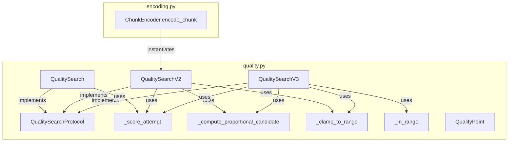
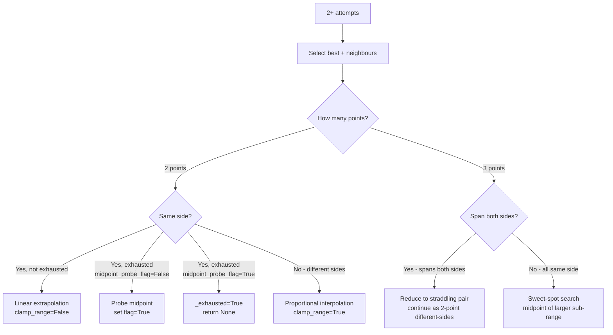

# Design: QualitySearchV3

<!-- markdownlint-disable MD024 -->

- Created: 2026-07-14
- Completed:

> **Relationship to `crf-search-refactor` spec:**
> This spec builds directly on the `crf-search-refactor` spec (which introduced `QualitySearchV2`, `QualitySearchProtocol`, `_score_attempt`, `_compute_proportional_candidate`, `_clamp_to_range`, `QualityPoint`, and the 3-point sweet-spot algorithm). All of those remain unchanged. `QualitySearchV3` is added alongside them as a drop-in replacement that replaces V2's binary half-steps with linear extrapolation and adds a midpoint-probe safety net.

---

## Overview

`QualitySearchV2` uses binary half-steps toward the codec boundary when both known points are on the same side of the target. This is safe but slow on monotonic curves — it takes O(log N) steps just to find the first crossing before the 3-point sweet-spot phase can begin.

`QualitySearchV3` replaces that outward-search phase with **linear extrapolation**: given two same-side points, it projects where the quality curve would cross zero and jumps directly there. On a monotonic linear curve this finds the crossing in one step instead of many. A **midpoint-probe safety net** is added for the edge case where the outward direction is exhausted — one midpoint probe is inserted before declaring full exhaustion, catching non-monotonic curves that V2 would miss.

V3 is a drop-in replacement for V2 (same `QualitySearchProtocol` interface, same constructor signature). It lives alongside V1 and V2 in `pyqenc/quality.py`. The encoding pipeline is **not** switched to V3 until tests prove it works.

Key design decisions:
- V3 has its own clean `_compute_next` implementation — it does **not** delegate to `QualitySearch._compute_next` (the V2 hack).
- `clamp_range=False` is used for the extrapolation case, allowing `t` outside `[0, 1]`. V2 never does this.
- The `_midpoint_probe_flag` resets whenever the best-scoring point changes, because a new best may allow further extrapolation.
- Direction-exhaustion is defined by actual tested points, not by reaching the sentinel value. The sentinel is only the hard clamp boundary.

---

## Architecture



V3 reuses all existing helpers without modification. The encoding pipeline continues to use V2 until V3 is proven correct by tests.

---

## Components and Interfaces

### QualitySearchV3

Defined in `pyqenc/quality.py`. Implements `QualitySearchProtocol` with the same constructor signature as `QualitySearchV2`.

```python
class QualitySearchV3:
    def __init__(
        self,
        quality_better:   Decimal,
        quality_worse:    Decimal,
        quality_targets:  list[QualityTarget],
        granularity:      Decimal,
        quality_max_step: Decimal | None = None,
    ) -> None: ...

    # Protocol properties
    @property
    def attempts(self) -> int: ...
    @property
    def best_quality(self) -> Decimal | None: ...
    @property
    def best_metrics(self) -> dict[str, float] | None: ...
    @property
    def best_targets_met(self) -> bool: ...

    def record(self, quality: Decimal, quality_results: dict[str, float]) -> Decimal | None: ...
```

### Reused Helpers (no modification)

All of the following are used by V3 without any changes:

| Helper | Purpose |
|---|---|
| `_score_attempt(metrics, targets)` | Returns signed composite score; 0=winner, >0=pass, <0=fail |
| `_compute_proportional_candidate(target, pass_point, fail_point, clamp_range)` | Returns interpolation/extrapolation fraction `t`; `clamp_range=False` allows `t` outside `[0,1]` |
| `_clamp_to_range(q, granularity, worse_point, better_point)` | Clamps `q` to valid interior of range, respecting sentinels; returns `None` when no interior point exists |
| `_in_range(value, start, end)` | Checks range membership, handles inverted ranges |
| `QualityPoint` | Dataclass `(q, score, metrics)`; `is_sentinel` when `metrics is None` |
| `QualitySearchProtocol` | Structural protocol all implementations satisfy |

---

## Data Models

### Internal State

```python
_quality_targets:     list[QualityTarget]
_granularity:         Decimal
_quality_max_step:    Decimal | None
_quality_better:      Decimal           # hard better boundary (sentinel value)
_quality_worse:       Decimal           # hard worse boundary (sentinel value)
_attempted_points:    dict[Decimal, QualityPoint]   # all recorded attempts (real encodings only)
_best_score_point:    QualityPoint | None            # best so far (pass precedence over fail)
_exhausted:           bool
_midpoint_probe_flag: bool              # True after midpoint probe in direction-exhausted case
```

Sentinel `QualityPoint` objects (with `metrics=None`) are constructed for `quality_better` and `quality_worse` at init time and used as hard clamp boundaries. They are **never** added to `_attempted_points`.

### State Invariants

After any sequence of `record()` calls:

| Condition | `best_quality` | `best_metrics` | `best_targets_met` |
|---|---|---|---|
| No calls yet | `None` | `None` | `False` |
| ≥1 call, none pass | quality value with smallest `abs(score)` among all fails | metrics at that value | `False` |
| ≥1 passing call | best-efficiency passing quality value (smallest `abs(score)` among passes) | metrics at that value | `True` |

`attempts` always equals `len(_attempted_points)` — the total number of `record()` calls made.

### Best-Scoring Point Selection

The best-scoring point is the `QualityPoint` with the smallest `abs(score)` among all recorded attempts, with passing attempts taking precedence over failing ones:

- A failing attempt with smaller `abs(score)` than the current best **cannot** displace a passing best.
- Only a passing attempt can displace a passing best (if it has a smaller `abs(score)`).
- Among failing attempts, the one with the highest score (closest to zero, i.e. least negative) is best.

This is equivalent to: sort all attempts by `(is_fail, abs(score))` ascending and take the first.

---

## Algorithm State Machine

### Phase 0: First Attempt (exactly 1 recorded point)

After the first `record()` call:

- `score == 0` (winner): set `_best_score_point`, set `_exhausted = True`, return `None`.
- `score > 0` (pass): next = `current_q + half_range_toward_quality_worse`, clamped by `quality_max_step`, snapped to granularity.
  - `half_range = abs(quality_worse - current_q) / 2`
- `score < 0` (fail): next = `current_q + half_range_toward_quality_better`, clamped by `quality_max_step`, snapped to granularity.
  - `half_range = abs(quality_better - current_q) / 2`

The half-range step is direction-agnostic: it uses `quality_worse` or `quality_better` as the relevant boundary, and the sign of the step is determined by which direction is "toward" that boundary.

### Point Selection (2+ recorded attempts)

1. Sort all `_attempted_points` by quality value.
2. Find `_best_score_point` (smallest `abs(score)`, pass precedence).
3. Take its immediate lower neighbour (next lower quality value in sorted list) and immediate upper neighbour (next higher quality value), if they exist.
4. Result: 2 points (best + one neighbour) or 3 points (best + both neighbours).

### Decision Fork



#### 2 Points, Same Side, NOT Direction-Exhausted

Linear extrapolation outside the two points:

1. Call `_compute_proportional_candidate(target, pass_point, fail_point, clamp_range=False)` where the two same-side points are treated as `pass_point` and `fail_point` for the purpose of the call (the function computes `t` from the metric values; `t` outside `[0,1]` is the extrapolation).
2. Compute `raw_q = p1.q + t * (p2.q - p1.q)` where `p1` and `p2` are the two same-side points ordered by quality.
3. Clamp outward to the hard boundary:
   - If no opposite-side tested point exists: clamp to the sentinel (`quality_better` or `quality_worse`).
   - If an opposite-side tested point exists: clamp to the best-scoring opposite-side tested point.
4. Apply `quality_max_step` from the last tested point (if set).
5. Snap to granularity using `ROUND_HALF_EVEN`.
6. If the snapped result collides with an already-tested value: move 1 granularity step outward if possible, else treat as direction-exhausted (go to midpoint-probe path).
7. If `_compute_proportional_candidate` returns `None` (flat curve, missing metrics): fall back to midpoint of the two points.

#### 2 Points, Same Side, Direction-Exhausted, `_midpoint_probe_flag=False`

- Probe midpoint between the 2 points: `mid = (p1.q + p2.q) / 2`, snapped to granularity.
- Set `_midpoint_probe_flag = True`.
- Return the midpoint.

#### 2 Points, Same Side, Direction-Exhausted, `_midpoint_probe_flag=True`

- Set `_exhausted = True`, return `None`.

#### 2 Points, Different Sides (one pass, one fail)

Proportional interpolation between the two points:

1. Call `_compute_proportional_candidate(target, pass_point, fail_point, clamp_range=True)`.
2. Compute `raw_q = pass_point.q + t * (fail_point.q - pass_point.q)`.
3. Clamp to interior of `[pass_point, fail_point]` using `_clamp_to_range`.
4. Apply `quality_max_step` from the last tested point (if set).
5. Snap to granularity using `ROUND_HALF_EVEN`.
6. If `_clamp_to_range` returns `None`, or the result equals an already-tested value: set `_exhausted = True`, return `None`.
7. If `_compute_proportional_candidate` returns `None`: fall back to midpoint of the two points.

#### 3 Points, Spanning Both Sides

1. Identify the two adjacent pairs: `(lower_neighbour, best)` and `(best, upper_neighbour)`.
2. Find the pair where one point is pass and the other is fail (the straddling pair).
3. If both pairs straddle (both contain a crossing): prefer the pair that includes the **worse-quality** neighbour (higher CRF / lower VBR), to bias toward more efficient encodings.
4. Continue as 2-point different-sides with the selected pair.

#### 3 Points, All Same Side

Sweet-spot search:

1. Compute `left_range = abs(best.q - lower_neighbour.q)` and `right_range = abs(upper_neighbour.q - best.q)`.
2. Select the larger sub-range.
3. Probe its midpoint: `mid = (endpoint1.q + endpoint2.q) / 2`, snapped to granularity, clamped by `quality_max_step`.
4. If the selected sub-range ≤ 1 granularity (no untested point can be placed inside it): set `_exhausted = True`, return `None`.

### Direction-Exhaustion Definition

The direction toward `quality_better` is exhausted when `quality_better` has been actually tested (exists as a key in `_attempted_points`). The direction toward `quality_worse` is exhausted when `quality_worse` has been actually tested.

The sentinel value alone does **not** constitute exhaustion — it is only the hard clamp boundary for output values.

### `_midpoint_probe_flag` Reset

The flag resets to `False` whenever `_best_score_point` changes (a new best is found). This is because a new best point creates a new 2-point configuration that may allow further extrapolation.

### Output Constraints (All Returned Quality Values)

Every quality value returned by `record()` must satisfy all of the following before being returned:

1. Snapped to granularity using `ROUND_HALF_EVEN`.
2. Clamped by `quality_max_step` from the most recently tested quality value (if set).
3. Within `[min(quality_better, quality_worse), max(quality_better, quality_worse)]`.
4. Not already in `_attempted_points` (no repeat). If a collision occurs after snapping and clamping, move 1 granularity step in the direction away from the boundary if possible; otherwise set `_exhausted = True` and return `None`.

### Exhaustion and Finality

`_exhausted` is set to `True` in any of these cases:
- Score == 0 (winner found).
- Range-exhausted: active search window collapsed to ≤ 1 granularity.
- Direction-exhausted after midpoint probe: `_midpoint_probe_flag` was already `True`.
- `_clamp_to_range` returns `None` in the different-sides case.
- Collision with already-tested value and no room to move outward.

Once `_exhausted` is `True`, all subsequent `record()` calls return `None` immediately without mutating any state.

---

## Key Difference from V2

| Aspect | V2 | V3 |
|---|---|---|
| Outward search (same-side 2 points) | Binary half-steps toward boundary | Linear extrapolation outside the two points |
| `clamp_range` for outward search | Always `True` (interpolation only) | `False` (extrapolation allowed) |
| Safety net for direction-exhaustion | None — declares exhausted immediately | One midpoint probe before declaring exhausted |
| `_compute_next` | Delegates to `QualitySearch._compute_next` (hack) | Own clean implementation |
| Convergence on monotonic linear curve | O(log N) half-steps to find crossing | O(1) steps to find crossing (one extrapolation jump) |

---

## Error Handling

- `record()` called after exhaustion (`_exhausted = True`): return `None` immediately, do not mutate state.
- `quality_results` missing keys for any `quality_targets`: `_score_attempt` raises `ValueError`; propagated to caller.
- `quality_better == quality_worse`: raise `ValueError` at construction time.
- `granularity <= 0`: raise `ValueError` at construction time.
- `_compute_proportional_candidate` returns `None` (flat curve, missing metrics): fall back to midpoint of the two points.
- `_clamp_to_range` returns `None` (range collapsed): set `_exhausted = True`, return `None`.

---

## Correctness Properties

*A property is a characteristic or behavior that should hold true across all valid executions of a system — essentially, a formal statement about what the system should do. Properties serve as the bridge between human-readable specifications and machine-verifiable correctness guarantees.*

### Property 1: Convergence

*For any* valid `(quality_better, quality_worse, granularity)` where `quality_better != quality_worse` and `granularity > 0`, and for any sequence of quality results, `QualitySearchV3.record()` SHALL return `None` within a finite number of attempts.

**Validates: Requirements 11.1**

### Property 2: Finality

*For any* `QualitySearchV3` instance, once `record()` returns `None`, all subsequent `record()` calls SHALL also return `None` without mutating any state (in particular, `attempts` SHALL NOT increment after exhaustion).

**Validates: Requirements 9.2, 9.3**

### Property 3: Protocol State Invariants

*For any* `QualitySearchV3` instance and any sequence of `record()` calls:
- `attempts` equals the total number of `record()` calls made.
- After at least one `record()` call, `best_quality` is not `None`.
- `best_targets_met` is `True` if and only if at least one passing attempt was recorded.
- When `best_targets_met` is `True`, `best_quality` is the quality value of the passing attempt with the smallest `abs(score)` among all passing attempts.
- When `best_targets_met` is `False`, `best_quality` is the quality value of the attempt with the smallest `abs(score)` among all failing attempts.

**Validates: Requirements 10.1, 10.2, 10.3, 10.4, 10.5**

### Property 4: Output Validity

*For any* `QualitySearchV3` instance and any sequence of `record()` calls, every non-`None` value returned by `record()` SHALL:
- Be snapped to granularity (i.e. `q % granularity == 0`).
- Be within `[min(quality_better, quality_worse), max(quality_better, quality_worse)]`.
- Not equal any quality value previously passed to `record()`.

**Validates: Requirements 8.1, 8.2, 8.3, 8.4, 8.5**

### Property 5: Linear Curve Convergence

*For any* linear score curve `score(q) = slope * q + intercept` that crosses zero within the quality range, `QualitySearchV3` SHALL find a sweet spot within 2 granularity units of the true crossing point, and SHALL terminate within `O(log N)` attempts where N is the number of distinct quality values in the range.

**Validates: Requirements 11.2**

### Property 6: Quadratic Curve Convergence

*For any* quadratic score curve `score(q) = a * (q - q_root)^2 + c` with a root within the quality range, `QualitySearchV3` SHALL find a sweet spot within 2 granularity units of the nearest root, and SHALL terminate within `O(log N)` attempts.

**Validates: Requirements 11.3**

---

## Testing Strategy

### Dual Testing Approach

Both unit tests and property-based tests are required. Unit tests verify specific fork cases with precalculated expected results. Property tests verify universal properties across a wide range of generated inputs.

### Property-Based Testing

Library: **Hypothesis** (already used in the project).

Each property test runs a minimum of **200 iterations**.

Tag format: `# Feature: quality-search-v3, Property N: <property_text>`

**Property test file**: `tests/test_crf_search_properties.py` (extended to include V3 alongside V1/V2)

| Property | Test class/function | Hypothesis strategies |
|---|---|---|
| P1: Convergence | `TestQualitySearchV3Convergence.test_v3_converges_finite_attempts` | `st.decimals` for range/granularity, `st.lists` of pass/fail booleans |
| P2: Finality | `TestFinalityAfterExhaustion` (extend `impl_idx` to include V3) | Same as existing P3 test |
| P3: State invariants | `TestProtocolStateInvariants` (extend `impl_idx` to include V3) | Same as existing P4 test |
| P4: Output validity | `TestQualitySearchV3OutputValidity.test_output_validity` | `st.decimals` for range/granularity, `st.lists` of pass/fail booleans |
| P5: Linear curve convergence | `TestQualitySearchV3LinearConvergence.test_linear_curve_convergence` | `st.floats` for slope and crossing point |
| P6: Quadratic curve convergence | `TestQualitySearchV3QuadraticConvergence.test_quadratic_curve_convergence` | `st.floats` for `a`, `q_root`, `c` |

### Unit Tests

**Unit test file**: `tests/unit/test_quality.py` (extended with `TestQualitySearchV3` class)

One test per fork case, plus curve tests with precalculated expected results. All assertions use only the public protocol API (`record()`, `best_quality`, `best_metrics`, `best_targets_met`, `attempts`) — no internal state inspection.

| Test | Validates |
|---|---|
| `test_initial_state` | Req 1.5: all protocol properties before any `record()` call |
| `test_first_winner_returns_none` | Req 2.1: winner on first attempt |
| `test_first_pass_steps_toward_worse` | Req 2.2: first pass → step toward `quality_worse` |
| `test_first_fail_steps_toward_better` | Req 2.3: first fail → step toward `quality_better` |
| `test_two_point_same_side_extrapolation` | Req 4.1: returned value is outside the two input points |
| `test_two_point_same_side_direction_exhausted_midpoint_probe` | Req 5.3: midpoint probe returned on first exhaustion |
| `test_two_point_same_side_direction_exhausted_after_probe` | Req 5.4: `None` returned after midpoint probe |
| `test_midpoint_probe_flag_resets_on_new_best` | Req 5.5: flag resets when best changes |
| `test_two_point_different_sides_interpolation` | Req 6.1: returned value is between the two input points |
| `test_three_point_spanning_both_sides` | Req 7.1: returned value is within the straddling sub-range |
| `test_three_point_all_same_side_sweet_spot` | Req 7.2: returned value is midpoint of larger sub-range |
| `test_three_point_both_pairs_straddle_prefers_worse_quality` | Req 7.4: worse-quality pair preferred |
| `test_exhaustion_returns_none` | Req 9.1: `None` after window collapses |
| `test_subsequent_calls_after_exhaustion_return_none` | Req 9.3: all subsequent calls return `None` |
| `test_raises_if_better_equals_worse` | Req 1.3: `ValueError` on equal boundaries |
| `test_raises_if_granularity_zero` | Req 1.4: `ValueError` on zero granularity |
| `test_protocol_compliance` | Req 1.1: `isinstance(s, QualitySearchProtocol)` |
| `test_linear_curve_all_failing` | Req 13.9: all-failing linear curve |
| `test_linear_curve_all_passing` | Req 13.9: all-passing linear curve |
| `test_linear_curve_crossing_zero` | Req 13.9: crossing-zero linear curve |
| `test_quadratic_curve_all_failing` | Req 13.10: all-failing quadratic curve |
| `test_quadratic_curve_all_passing` | Req 13.10: all-passing quadratic curve |
| `test_quadratic_curve_crossing_zero_min_inside` | Req 13.10: crossing-zero, min inside range |
| `test_quadratic_curve_crossing_zero_min_outside` | Req 13.10: crossing-zero, min outside range |

**Curve test methodology**: For each curve test, the expected sweet spot is computed analytically (e.g. for a linear curve `score(q) = slope * q + intercept`, the true crossing is `q_cross = -intercept / slope`). The test drives the search to completion and asserts `abs(float(search.best_quality) - q_cross) <= float(granularity)`.

### Integration Tests

No new integration tests are required for V3 itself. The existing `tests/integration/test_encoding_quality.py` continues to test V2. V3 integration tests will be added when V3 is wired into the encoding pipeline (a separate spec).
