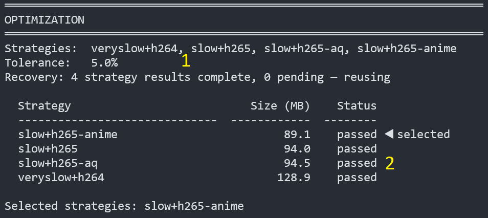
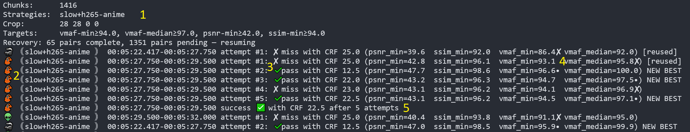
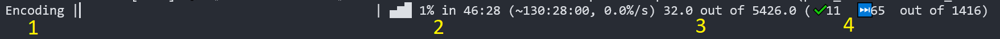

# pyqenc

<!-- markdownlint-disable MD024 MD026 MD028 -->

Encoding a movie to archive it sounds simple — until you spend hours tweaking quality settings, only to get inconsistent results across scenes, or lose everything to a power cut mid-encode.

**pyqenc** automates this. You tell it the quality you want. It figures out the rest — per scene, automatically, and picks up right where it left off if interrupted.

> This project was inspired by [Av1an](https://github.com/rust-av/Av1an) and [Handbrake](https://handbrake.fr/).

---

## ⚡ Quick Start

**Step 1 — install dependencies** ([FFmpeg](https://www.ffmpeg.org/), [MKVToolNix](https://mkvtoolnix.download/), and [uv](https://docs.astral.sh/uv/)):

```sh
# Windows (Scoop)
scoop install uv ffmpeg mkvtoolnix

# macOS (Homebrew)
brew install uv ffmpeg mkvtoolnix

# Linux (Ubuntu/Debian)
sudo apt install ffmpeg mkvtoolnix
# install uv separately: https://docs.astral.sh/uv/getting-started/installation/
```

**Step 2 — get pyqenc:**

```sh
git clone https://github.com/CHerSun/pyqenc.git
cd pyqenc
```

**Step 3 — install pyqenc** (uv handles the Python environment automatically):

```sh
uv tool install .
```

**Step 4 — run it:**

Run actual encoding with defaults:

```sh
pyqenc auto movie.mkv -y
```

> `.mkv` input is recommended. Other containers may work; if not, remux into `.mkv` via MKVmerge GUI first.

That's it. Default settings should work well. Later you can customize settings.

> Use a separate folder per encode job — either `cd` into a dedicated folder first, or pass `--work-dir <path>`. Don't run two encodes in parallel onto the same work dir.

For all options: `pyqenc auto --help` or [CLI Reference](docs/cli-reference.md).

---

## 🔍 How it works

### Scene-based encoding

The video is split into scenes first. Each scene is short and visually uniform — a dark scene, a fast-action sequence, a title card — they all have very different encoding characteristics. pyqenc assigns an independent quality parameter to each scene, so every scene gets exactly what it needs. Dark scenes get their own value, fast-moving scenes get theirs. No wasted bits, no scenes that look worse than others.

### Quality targeting

You specify quality targets as metric thresholds (e.g. `vmaf-p05:95`). pyqenc encodes each scene repeatedly, adjusting the quality parameter until all targets are met. It stops as soon as they are — no over-encoding.

Supported metrics: `vmaf`, `vif`, `ssim`, `psnr`. Supported statistics: `min`, `p05`, `p25`, `med`, `p75`, `p95`, `max`.

Default targets: `vif-med:92.0, vmaf-p05:95.0, psnr-med:45.0, ssim-med:98.0`

See [Quality Targeting Guide](docs/quality-targeting.md) for guidance on choosing good targets.

### 🔁 Resumption

pyqenc can be stopped at any point — power loss, `Ctrl+C`, whatever. Re-run the exact same command and it picks up where it left off. Existing work is detected and reused automatically.

This also means you can change your mind mid-way: adjust quality targets, add a strategy — only the minimum necessary work is redone.

### Best strategy search

An encoding *strategy* is a combination of codec preset and profile (e.g. `slow+h265-aq`). Different strategies produce different size/quality tradeoffs.

By default, pyqenc tests all specified strategies on ~1% of chunks first, then encodes the full video using only the ones with the smallest output that still meets your quality targets. You get the best result without encoding the whole movie multiple times.

Use `--all-strategies` to skip optimization and produce one output per strategy — useful when you want to compare results side by side.

---

## 📁 Output

Results are written under the working directory:

```log
<work-dir>/
├── 📁 final/      ← ✅ your encoded video(s), one per selected strategy
├── 📁 audio/      ← ✅ processed audio (normalized, downmixed, converted)
├── 📁 measure/    ← quality measurement outputs, if measure was run
├── 📂 extracted/  ← extracted source streams (intermediate)
├── 📂 chunks/     ← scene-based video chunks (intermediate)
├── 📂 encoding/   ← per-chunk encoding attempts with metrics (intermediate)
├── 📂 encoded/    ← winning chunk attempts (intermediate)
├── 📄 job.yaml    ← job parameters and source fingerprint
└── 📄 *.yaml      ← phase parameters
```

`final/` and `audio/` folders hold the results you should care about. Pick the video and audio streams you want, then mux them together with MKVmerge GUI (drag&drop streams, export). Everything else is intermediate — preserved for inspection and resumption unless you use `--cleanup`.

---

## 📊 Measuring quality

You can measure quality metrics between any source and encoded video(s), including results from other encoders:

```sh
pyqenc measure source.mkv encoded.mkv [other.mkv ...]
```

Outputs go under `<work-dir>/measure/`: per-target metrics YAML, quality plot over duration, and screenshots.

---

## ⚙️ Configuration

pyqenc works out of the box. When you want to customize — codecs, presets, profiles, default targets — copy the active config and edit it:

```sh
pyqenc config .     # preview: would show which config is active and where it will be copied to
pyqenc config . -y  # execute the copy
```

Config search order (first found wins): `./pyqenc.yaml` → `~/.config/pyqenc/config.yaml` → built-in defaults.

---

## 📺 Progress display

### Optimization phase summary



1. Input summary — strategies, tolerance, recovery status
2. Results — strategies tested, sizes, selected strategy(ies) for full encoding

### Encoding attempts log



1. Summary — strategies, chunks, cropping, quality targets, recovery
2. Visual hash emoji + strategy name + chunk id
3. Attempt number and status (`pass` / `miss`)
4. Quality metrics snapshot — least-performing metric marked `✘` (miss) or `•` (pass)
5. Chunk success — winning attempt found

### Encoding progress bar



1. Action in progress
2. %-based progress and ETA
3. Duration-based progress (seconds of video remaining after recovery)
4. Chunk-count progress: `✔` completed, `⏭` reused, `✘` failed

---

## 🔧 Troubleshooting

**FFmpeg / MKVToolNix not found** — install them and ensure they're in your PATH (`ffmpeg -version`, `mkvmerge --version`).

**Insufficient disk space** — with lossless chunking mode whole process needs ~7–10× source size (5× for FFV1 chunks + extraction + encoding + audio + merging). Use `--work-dir` to point to a larger disk, or `--remux-chunking` to reduce chunk size at the cost of frame-perfect splits (not recommended).

**Slow encoding** — try a faster codec or faster codec preset (`fast`, `medium`). If CPU is not fully utilized - add `--max-parallel 2` or higher. OR switch to GPU-encoding. All options reduce resulting quality or increase output size, effective encoding is slow.

**Strategy wildcard not expanding** — some shells require quoting: `"slow+h265*"`. Use dry-run to verify expansion. Verify that the config does have wanted profiles.

**Debug logging** — add `--log-level debug` to any command for detailed output.

---

## 📚 Further reading

- [CLI Reference](docs/cli-reference.md) — all options, quality target format, strategy format
- [Quality Targeting Guide](docs/quality-targeting.md) — metric pitfalls, recommended targets, VIF vs VMAF
- [Sample Comparison](docs/sample-comparison.md) — pyqenc vs BSEncode side-by-side
- [Architecture](docs/architecture.md) — pipeline internals

---

## License & contributing

Open-source. See [LICENSE](LICENSE) for details. Contributions welcome — see [CONTRIBUTING.md](CONTRIBUTING.md).

> This is a pet project built to solve a personal need. Not intended for production use, at least yet. Currently in β — working and giving proper results, but not widely tested.
