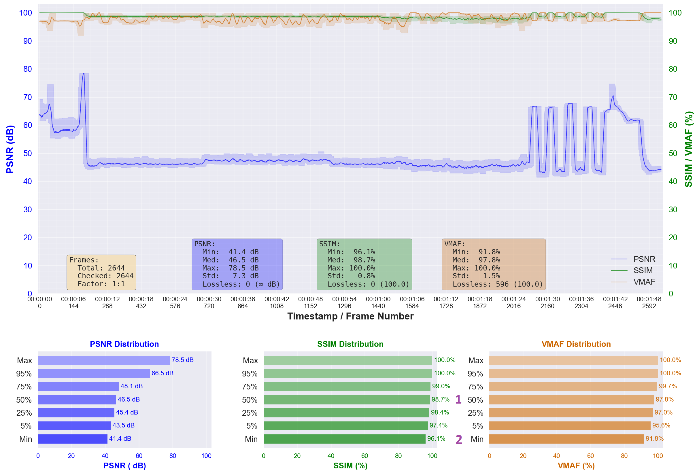
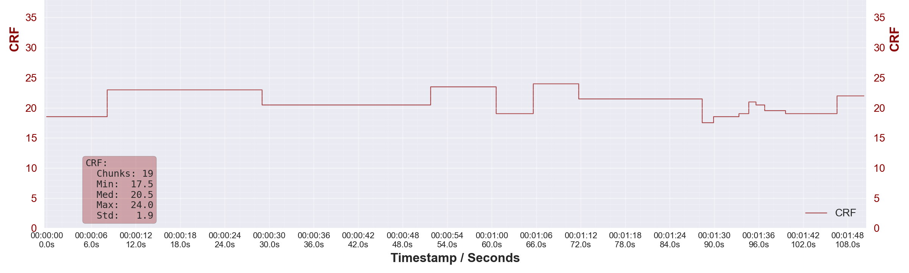

# pyqenc

<!-- markdownlint-disable MD024 MD026 MD028 -->

pyqenc (**PY**thon **Q**uality-based **ENC**oder) - an encoding pipeline that achieves user-specified quality targets while optimizing file size through intelligent CRF adjustment, automatic crop detection, and scene-based chunking.

Current state: β (beta) — already working & giving proper results, but not widely tested and not bug-free.

> This project was inspired by [Av1an](https://github.com/rust-av/Av1an) and [Handbrake](https://handbrake.fr/).

> AWS and Kiro IDE team - thank you for the agentic IDE and welcome credits. This allowed me to prototype this project incredibly fast. Truly a new approach to development.

> NOTE: This is a pet project to solve my personal needs. It is not meant to be used in production, at least yet. Contributions are welcomed.

## Problem & Solution

### Purpose

To give automatic encoding pipeline to prepare video for archiving (storage) - i.e. to achieve the required quality while keeping the resulting size as low as possible.

### The Problem

Traditional video encoding approaches face several challenges:

- **Fixed CRF encoding** produces unpredictable quality across different scenes
- **Target bitrate encoding** also doesn't guarantee consistent quality
- **Manual quality verification** is time-consuming and subjective
- **Interrupted encoding** requires starting over from scratch

### The Solution

pyqenc provides a quality-first encoding pipeline that:

- **Adjusts CRF iteratively** until quality targets are met for each scene
- **Guarantees quality targets** using objective metrics (VMAF, SSIM, PSNR)
- **Automatically detects cropping** to remove black borders and optimize encoding efficiency
- **Supports multiple codecs** (h.264 8-bit, h.265 10-bit) with custom profiles
- **Resumes seamlessly** from interruptions using artifact-based detection
- **Processes in parallel** to maximize CPU utilization
- **Provides detailed progress** with visual feedback and logging
- **Supports multiple strategies** search for the best suited combination via optimization phase
- **Provides simple CLI** usable without ethoteric knowledge
- **Applies multiple audio strategies** to give consistent normalized and downmixed streams to pick from

> NOTE: pyqenc currently targets only `.mkv` containers. You can try using other containers directly. In case of any problems - remux into `.mkv` via MKVmerge GUI.

### Sample comparison

I've given the same sample to BSEncode and pyqenc.

Here's the BSEncode measured metrics plot:



Here's the pyqenc plot:


They don't really look different at first glance, but pyqenc plot is more uniform in terms of lower quality.

If we look at stats distribution:

| Metric | Stat    | pyqenc      | BSEncode |
| ------ | ------- | ----------- | -------- |
| CRF    | range   | 17.5...24.0 | 19.2     |
| VMAF   | median  | 97.4        | 97.8     |
| VMAF   | min     | 94.0        | 91.8     |
| SSIM   | median  | 98.5        | 98.7     |
| SSIM   | min     | 95.6        | 96.1     |
| PSNR   | median  | 45.8        | 46.5     |
| PSNR   | min     | 42.0        | 41.4     |
| Size   | total   | 56 MB       | 80 MB    |

> NOTE: I tried my best to reach as similar as possible median values - what BSEncode targets, but it uses not too precise measuring by default.

As you can see most of the metrics are very close, for min values pyqenc usually outperforms full encode with BSEncode - as per given targets for min values too - this could be easily controlled separately and made higher.

And the main result is the total size of the result (measured for video stream alone) - 56 MB vs 80 MB

This is achieved thanks to variable CRF selection per scene with scene frames being rather uniform inside the scene, so a single CRF value there provides consistent quality.



## Installation

### Prerequisites

### `scoop` & `uv` on Windows

`scoop` & `uv` are my personal preferences. You can use different tooling, if you wish, but instructions below use those 2. To install them:

- See [scoop.sh](https://scoop.sh) for scoop installation. It is a Windows package manager that doesn't need admin permissions and makes installation of a lot of tools really simple.
- [uv](https://docs.astral.sh/uv/) is a new fast Python package manager. It can be installed in multiple ways. Using `scoop`:

  ```sh
  scoop install uv
  ```

#### External Dependencies:

- **FFmpeg** - for video encoding, scene detection, metrics calculation.
- **MKVToolNix** - MKV stream extraction and merging.

```sh
# Windows (using Scoop)
scoop install ffmpeg mkvtoolnix

# macOS (using Homebrew)
brew install ffmpeg mkvtoolnix

# Linux (Ubuntu/Debian)
sudo apt install ffmpeg mkvtoolnix
```

### Run pyqenc directly using `uv`

 Using `uv` is the recommended way to run pyqenc directly from source code. `uv` will create a local `.venv` with everything required. No Python head-aches, no dependencies problems. Straight-forward and simple.

```sh
git clone https://github.com/CHerSun/pyqenc.git
cd pyqenc

uv run pyqenc <your_arguments>
```

To update the pyqenc later:

```sh
git pull
```

### Install pyqenc using `uv`

Either using `uv` (local, self-contained):

```sh
uv tool install .
```

> NOTE: you might need to update your PATH manually or using uv, see the `uv` output for details.

> NOTE: sometimes `uv` needs `--reinstall` flag to cleanly update from previously installed version.

### Install pyqenc globally using Python `pip`

You need to have Python installed with >=3.13 version and pip for this. This will also install all pyqenc requirements globally too. Not recommended.

```sh
git clone https://github.com/CHerSun/pyqenc.git
cd pyqenc

pip install .
```

### Running installed `pyqenc`

After the installation, the `pyqenc` command will be available in your terminal. To run you can directly:

```sh
pyqenc <your_arguments>
```

To update later - repeat the installation steps above after `git pull`'ing fresh version.

## Quick Start

### Basic Usage

See installation section on how to run `pyqenc` depending on the way you've installed it. See `--help` for full help.

Here's the base of the base - to preview & run using all default settings (work dir = `pyqenc` in the current folder):

```sh
# Dry-run mode - preview what's to be done (1 phase ahead) with default settings
pyqenc auto movie.mkv

# Execute (`-y`) the automatic pipeline using the specified work dir with default settings.
pyqenc auto movie.mkv -y
```

> NOTE: It is recommended to use a separate working directory per encode job — either `cd` into a dedicated folder before running, or pass `--work-dir <path>`. Don't run multiple encodings in parallel onto the same `--work-dir` - this will cause conflicts.

Let's be a bit more specific on our target quality and strategy:

```sh
# Execute with custom quality targets and strategies selection
pyqenc auto movie.mkv --quality-target vmaf-min:95 --strategies slow+h265-aq -y
```

pyqenc pipeline gives final results in form of individual processed audio files (per strategy) and video files (per strategy). It is up to you to choose what you like and package that into a single container afterwards. The simplest way is the MKVmerge GUI - just drag wanted video stream and wanted audio streams there, add metadata (cover, descriptions, chapters, etc) and mux that.

For audios - `audio` subfolder - it takes all filtered streams (see `include`/`exclude` arguments) and applies all strategies - downmixing (different modes, including night and dialogs boosting), normalization, dynamic normalization and converts to your wanted format (default = AAC CBR 96kbps per channel).

For videos - `final` subfolder - the number of results depends on selected strategies and optimization phase results. You will get 1 video stream per selected processing strategy.

### Get CLI help

For top-level help use:

```sh
pyqenc --help
```

To get command-specific help use `--help` after the command, like:

```sh
pyqenc auto --help
```

### CLI progress display

#### Optimization phase summary


1. Summary of input parameters - strategies, tolerance for optimal strategy selection, recovery summary
2. Results of the optimization phase - all strategies, size of their tested chunks, selected strategies (1 or more) for full encoding.

#### Encoding attempts log


1. Summary of actions to be taken - strategies, number of chunks, cropping, quality targets, recovery summary
2. Visual hashing - a single emoji to help distinguishing between chunks, followed by strategy name and chunk id
3. Last attempt number and its status. `pass` for satisfying quality or `miss`.
4. Targeted quality metrics snapshot with the least performing metric marked with either `✘` for a miss or `•` for a pass. This metric is used for next CRF search attempt.
5. Chunk success - winning attempt found for the strategy+chunk pair.

#### Encoding progress bar


1. Action in progress
2. %-based progress reporting & ETA of completion
3. duration-based (seconds of video) progress display out of remaining work after recovery
4. chunk-count based progress display, denoted with `✔` for completed chunks, `⏭` for reused chunks (recovered), `✘` for failed chunks (shouldn't happen normally) out of full total of chunks across all strategies.

### Manual inspection

At any point you can go into the work dir and inspect created artifacts. Unless you use `--cleanup` - all the artifacts are preserved.

### Resume the process

pyqenc is made so that it can be stopped and resumed at any point with as minimal progress loss possible. If your encoding stopped for whatever reason - just repeat the same command to continue.

### Change parameters when you want

Unless you use `--cleanup` pyqenc can dynamically adjust the flow to most of the changes with as minimal re-work overhead as possible.

For example, if you did a full encode with default settings, but the resulting quality didn't suit you. Just rerun with the same source and work dir, and new quality targets - pyqenc will recover using all of the available intermediate steps and will do only the minimum possible work to reach new targets.

### Measure against other variants

One of the purpose of the pyqenc is to provide ability to compare results. You might want to do different encodes using different tools. As long as they stay synced - you can consistently measure those using pyqenc built-in mechanics (same as used for pipeline):

```sh
pyqenc measure <source_video> <target_video> [<target_video> ...]
```

This will give under the `measure` subfolder:

- supported metrics measured stats (mind the `--metrics-subsampling` tradeoff between speed and accuracy)
- metrics plot over the video duration
- screenshots of each supplied video (by default - 20 screenshot, distributed over the duration; controllable by arguments)

You should be able to measure even incomplete encodings.

### Command line basic examples

Slow h265 strategy tuned to better encode dark scenes and for crisper look with higher quality targets:

```sh
pyqenc auto movie.mkv --quality-target vmaf-min:95,vmaf-med:98 --strategies slow+h265-aq -y
```

Fast basic h.264 encoding strategy targeting only the VMAF min score:

```sh
pyqenc auto movie.mkv --quality-target vmaf-min:93 --strategies fast+h264 -y
```

Search through multiple strategies for the best one (or a few) and encode to it:

```sh
pyqenc auto movie.mkv --strategies slow+h265-aq,veryslow+h265-anime -y
```

Encode using all specified strategies chosen with NO optimization phase:

```sh
pyqenc auto movie.mkv --strategies slow+h265-aq,veryslow+h265-anime --all-strategies -y
```

Wildcard strategy selection (slow preset + all h265 profiles):

```sh
pyqenc auto movie.mkv --strategies slow+h265* -y
```

Encode using all presets of specified profile (ultrafast...placebo of h265 basic profile):

```sh
pyqenc auto movie.mkv --strategies +h265 -y
```

> NOTE: Some shells might need to escape the `*` character. The easiest is to just enclose full `slow+h265*` in quotes `"slow+h265*"` - this normally helps.

Disable automatic cropping:

```sh
pyqenc auto movie.mkv --crop "0 0" -y
```

Manual crop specification:

```sh
# Vertical crop only (most common)
pyqenc auto movie.mkv --crop "140 140" -y

# Full crop specification (top bottom left right)
pyqenc auto movie.mkv --crop "140 140 0 0" -y
```

## CLI Reference

### Main Command

```sh
pyqenc auto <source_video> [options]
```

### Global Options

| Option              | Description                                        | Default  |
| ------------------- | -------------------------------------------------- | -------- |
| `--work-dir PATH`   | Working directory for intermediate files           | `.`      |
| `--log-level LEVEL` | Logging level (debug, info, warning, critical)     | `info`   |
| `-y, --execute`     | Execute phases (no flag = dry-run, `-y` = execute) | dry-run  |

### Quality & Strategy Options

| Option                     | Description                                             | Default                                           |
| -------------------------- | ------------------------------------------------------- | ------------------------------------------------- |
| `--quality-target TARGETS` | Quality targets (see format below)                      | `vif-med:92.5,vmaf-p05:95.0,psnr-med:45.0,ssim-med:98.0` |
| `--strategies STRATEGIES`  | Encoding strategies (see format below)                  | `veryslow+h264*,slow+h265*`                       |
| `--all-strategies`         | Disable optimization, produce output for all strategies | `False` (optimization enabled)                    |
| `--max-parallel N`         | Maximum concurrent encoding processes                   | `2`                                               |

### Chunking Options

| Option             | Description                                                                 | Default       |
| ------------------ | --------------------------------------------------------------------------- | ------------- |
| `--remux-chunking` | Use stream-copy (`-c copy`) instead of FFV1 lossless re-encode for chunking | Lossless FFV1 |

> NOTE: Remuxing is in ALPHA stage of development. It is NOT recommended. Remuxing has to rely on source video I-frames in the current process. This could produce inaccurate scenes splitting, if source video I-frames do not match detected scenes. Current algorithm could produce wrong final video duration (normally the difference should be very small, if any). Main goal of remuxing is to reduce processing overhead in both CPU and space, but currently it is INCONSISTENT.

### Cropping Options

| Option            | Description                                                   | Default     |
| ----------------- | ------------------------------------------------------------- | ----------- |
| `--crop "VALUES"` | Manual crop (format: "top bottom" or "top bottom left right"). Use `"0 0"` to disable auto-detection. | Auto-detect |

### Stream Filtering Options

| Option                  | Description                                                          | Example            | Default                            |
| ----------------------- | -------------------------------------------------------------------- | ------------------ | ---------------------------------- |
| `--include REGEX`       | Regex pattern to filter streams                                      | `"\b(RUS\|ENG)\b"` | Include all                        |
| `--exclude REGEX`       | Regex pattern to filter streams away                                 | `"comment"`        | Exclude none                       |
| `--audio-convert REGEX` | Regex pattern to tell which audio streams to convert to final format | `"5\.1"`           | All normalized and all 2.0 results |

### Quality Target Format

Quality targets specify minimum acceptable quality using metrics and statistics:

**Format:** `metric-statistic:value[,metric-statistic:value,...]`

#### Metrics:

- `vmaf` - Video Multimethod Assessment Fusion (0-100.0 scale)
- `ssim` - Structural Similarity Index (0.0-1.0 scale normalized to 0.0-100.0 scale)
- `psnr` - Peak Signal-to-Noise Ratio (dB scale, clipped to 0.0-100.0 scale; good quality is normally around 40-60)
- `vif`  - Visual Information Fidelity (0-100.0 scale; embedded in the VMAF pass). Useful for controlling film grain retention — VMAF tends to reward smoothed-out content, VIF is less biased.

#### Statistics:

- `min` - Minimum score across all frames
- `p05` - 5th percentile (recommended over `min` — avoids outlier sensitivity)
- `p25` - 25th percentile
- `med` or `median` - Median (50th percentile)
- `p75` - 75th percentile
- `p95` - 95th percentile
- `max` - Maximum score across all frames

> NOTE: Avoid `min` and `max` unless you know what you're doing. `vmaf-min` in particular is unreliable due to a first-frame bias — use `vmaf-p05` instead.

**Default:** If not specified, defaults to `vif-med:92.5,vmaf-p05:95.0,psnr-med:45.0,ssim-med:98.0`

#### Examples:

```sh
# Recommended baseline: multiple metrics, stable statistics
--quality-target vif-med:92,vmaf-p05:95,psnr-med:45,ssim-med:98

# VMAF p05 (preferred over min)
--quality-target vmaf-p05:95

# VMAF median with VIF for grain retention
--quality-target vmaf-med:97,vif-med:92

# SSIM target (note the normalized 0-100 scale)
--quality-target ssim-med:98

# PSNR target (dB scale clipped to 0-100, but normally in range ~40-60 for good quality)
--quality-target psnr-med:45

# Mixed metrics
--quality-target vmaf-p05:95,vif-med:92,psnr-med:45,ssim-med:98
```

### Strategy Format

Strategies combine encoder presets with custom profiles. The pipeline supports flexible strategy specifications including wildcards.

**Format:** `preset+profile[,preset+profile,...]`

**Presets:** (encoder presets)

- `ultrafast`, `superfast`, `veryfast`, `faster`, `fast`
- `medium`, `slow`, `slower`, `veryslow`, `placebo`

**Profiles:** (defined in configuration file)

- `h264` - Default h.264 8-bit encoding
- `h265` - Default h.265 10-bit encoding
- `h265-aq` - h.265 with adaptive quantization tuning (crisper, better dark areas details)
- `h265-anime` - h.265 optimized for anime content

**Default Strategies:** If not specified, uses `veryslow+h264*,slow+h265*` from configuration file

#### Wildcard Support:

The strategy specification supports wildcards for flexible testing:

```sh
# Specific preset+profile combination
--strategies slow+h265-aq

# Preset with profile wildcard (all h265 profiles with slow preset)
--strategies slow+h265*
# Expands to: slow+h265, slow+h265-aq, slow+h265-anime

# Preset only (all profiles with slow preset)
--strategies slow
# Expands to: slow+h264, slow+h265, slow+h265-aq, slow+h265-anime

# Profile wildcard only (all presets with h265 profiles)
--strategies +h265*
# Expands to: ultrafast+h265, ultrafast+h265-aq, ..., placebo+h265-anime

# Specific profile only (all presets with h265-aq profile)
--strategies +h265-aq
# Expands to: ultrafast+h265-aq, superfast+h265-aq, ..., placebo+h265-aq

# Empty string (all preset+profile combinations)
--strategies ""
# Expands to all combinations across all codecs

# Multiple patterns (comma-separated)
--strategies slow+h265*,veryslow+h264
# Expands to: slow+h265, slow+h265-aq, slow+h265-anime, veryslow+h264
```

#### Examples:

```sh
# Single strategy
--strategies slow+h265-aq

# Multiple strategies with optimization (finds best one)
--strategies slow+h265-aq,veryslow+h265-anime

# Test all h265 profiles with slow preset
--strategies slow+h265*

# Test all presets with h265-aq profile
--strategies +h265-aq

# h.264 encoding
--strategies fast+h264

# Mixed codecs
--strategies slow+h265-aq,medium+h264
```

## Phase-Specific Subcommands

It is possible to run individual phases. See `--help` for subcommands (`extract`, `chunk` ...; see the `--help` for the list).

> NOTE: It is not recommended to use manual mode unless you really know what you are doing.

## Configuration File

Configuration files are searched in this order:

1. `./pyqenc.yaml` (current directory)
2. `~/.config/pyqenc/config.yaml` (user config)
3. Built-in defaults (embedded in code `<project_folder>\pyqenc\default_config.yaml`)

It is NOT recommended to adjust built-in profile. Make a copy and edit it.

Refer to comments in the config for formatting details.

Through config you can adjust codecs, their presets and profiles, and many other settings.

## Chunking Modes

pyqenc supports two modes for splitting the source video into chunks.

### Lossless FFV1 (Default)

By default, each chunk is re-encoded to lossless FFV1 for frame-perfect scene splitting. No extra settings are required for this.

#### Trade-offs:

- Frame-perfect chunk boundaries
- Chunks are ~5x larger than the source video stream (FFV1 all-intra expansion) - 100 GB per movie for chunking is to be expected.
- Slightly slower chunking phase due to re-encode

### Remux / Stream-Copy (`--remux-chunking`)

Remux mode is NOT recommended currently.

Pass `--remux-chunking` to use remuxing mode. It is impossible to do precise chunking in this mode, scene boundaries are aligned to original video I-frames.

```sh
pyqenc auto movie.mkv <...> --remux-chunking -y
```

#### Trade-offs:

- Scenes are not perfectly aligned
  - This could reduce encoding effectiveness
  - This could introduce discrepancies in length between original video and resulting one, causing audio desync
- Remuxing is much faster and needs less space (1x original video size).

## Crop Detection

### Automatic Detection (Default)

pyqenc automatically detects black borders using ffmpeg's `cropdetect` filter:

- Samples multiple frames
- Uses conservative crop
- The same crop parameters are used through all phases
- Applies crop during encoding only (chunks stay not cropped for compatibility with remux chunking)

### Manual Crop

Specify crop values manually if automatic detection fails:

```sh
# Vertical crop only (most common for letterboxing)
--crop "140 140"

# Full crop specification (top bottom left right)
--crop "140 140 0 0"
```

### Disable Cropping

To disable cropping entirely:

```sh
--crop "0 0"
```

## Strategy Optimization

### Default Behavior (Optimization Enabled)

By default, pyqenc optimizes encoding by finding the best strategy:

1. **Test Chunk Selection**: Randomly selects ~1% of chunks (minimum 3) from the middle 80% of the video
2. **Strategy Testing**: Encodes test chunks with all specified strategies
3. **Quality Verification**: Ensures all test chunks meet quality targets
4. **Optimal Selection**: Chooses strategy with the smallest resulting size (or a few, within tolerance threshold of 5% by default)
5. **Full Encoding**: Encodes all chunks using only the optimal strategy(ies)

#### Benefits:

- Saves encoding time by testing multiple strategies on a small subset of chunks
- Produces only outputs with the best size/quality ratio
- Automatically adapts to content characteristics

#### Example:

```sh
# Tests slow+h265-aq and veryslow+h265-anime on test chunks
# Selects the one with smaller file size
# Produces single output with optimal strategy
pyqenc auto movie.mkv --quality-target vmaf-min:95 --strategies slow+h265-aq,veryslow+h265-anime -y
```

### Disable Optimization (All Strategies)

Use `--all-strategies` to disable optimization and produce outputs for all strategies:

```sh
# Encodes ALL chunks with BOTH strategies
# Produces TWO output files (one per strategy)
pyqenc auto movie.mkv --quality-target vmaf-min:95 --strategies slow+h265-aq,veryslow+h265-anime --all-strategies -y
```

#### When to use:

- You want to compare multiple encodings side-by-side
- You need outputs for different use cases (e.g., archival vs streaming)
- You want to manually select the best result

**Note:** This significantly increases encoding time as all chunks are encoded with all strategies.

## Working Directory Structure

All intermediate files are stored in the working directory:

```log
work/
├── job.yaml               # Job parameters
├── chunking.yaml          # Detected scenes for chunking
├── optimization.yaml      # Optimization phase parameters
├── encoding.yaml          # Encoding phase parameters
├──
├── extracted/                 # Extracted streams and attachments
│   ├── "#0 ID=0 (video) res=1920x1080.mkv"
│   ├── "#1 ID=1 (audio-dts) lang=rus ch=5.1(side).mka"
│   ├── "#2 ID=2 (audio-ac3) lang=eng ch=5.1(side).mka"
│   └── "chapters.xml"
├── chunks/                    # Scene-based chunks
│   ├── "00꞉00꞉00․000-00꞉01꞉18․667.mkv"
│   ├── "00꞉01꞉18․667-00꞉01꞉39․542.mkv"
│   └── ...
├── encoding/                  # Chunks encoding attempts
│   └── slow+h265-aq/              # Strategy subfolder with its chunk attempts
│       ├── "00꞉00꞉00․000-00꞉01꞉18․667.1920x1024.crf20.0/"          # raw metrics subfolder
│       ├── "00꞉00꞉00․000-00꞉01꞉18․667.1920x1024.crf20.0.mkv"       # encoded attempt
│       ├── "00꞉00꞉00․000-00꞉01꞉18․667.1920x1024.crf20.0.png"       # metrics graph for the attempt
│       ├── "00꞉00꞉00․000-00꞉01꞉18․667.1920x1024.crf20.0.yaml"      # sidecar with calculated metrics snapshot
│       └── ...
├── encoded/                   # Winning chunks encoding attempts (hard-links or copies) - to be merged into final video
│   └── slow+h265-aq/              # Strategy subfolder with its chunk attempts
│       ├── "00꞉00꞉00․000-00꞉01꞉18․667.1920x1024.crf20.0.mkv"       # winning chunk attempt
│       ├── "00꞉00꞉00․000-00꞉01꞉18․667.1920x1024.crf20.0.png"       # metrics graph for the winning attempt
│       ├── "00꞉00꞉00․000-00꞉01꞉18․667.1920x1024.crf20.0.yaml"      # sidecar with calculated metrics snapshot
│       └── ...
├── audio/                     # Processed audio
│   ├── audio_001_day.aac
│   ├── audio_001_night.aac
│   └── ...
└── final/                     # Final output
    └── movie_slow+h265-aq.mkv     # 1 variant per strategy used
```

## Resumption & Artifact Reuse

pyqenc automatically resumes from interruptions without explicit resume commands:

### How It Works

1. **Artifact-Based Detection**: Each phase checks for existing artifacts
2. **Automatic Reuse**: Valid artifacts are reused without re-processing
3. **Configuration Changes**: Detects changes and only processes what's needed

### Examples

#### After Interruption:

```sh
# Run the same command again - it will resume automatically
pyqenc auto movie.mkv --quality-target vmaf-min:95 --strategies slow+h265-aq -y
```

#### Adding a New Strategy:

```sh
# Only encodes chunks for the new strategy
pyqenc auto movie.mkv --quality-target vmaf-min:95 --strategies slow+h265-aq,veryslow+h265-anime -y
```

#### Changing Quality Targets:

```sh
# Re-evaluates existing encodings, only re-encodes chunks that don't meet new targets
pyqenc auto movie.mkv --quality-target vmaf-min:97 --strategies slow+h265-aq -y
```

## Troubleshooting

### FFmpeg Not Found

**Error:** `ffmpeg: command not found`

**Solution:** Install FFmpeg and ensure it's in your PATH:

```sh
# Verify installation
ffmpeg -version
ffprobe -version
```

### MKVToolNix Not Found

**Error:** `mkvmerge: command not found`

**Solution:** Install MKVToolNix and ensure it's in your PATH:

```sh
# Verify installation
mkvmerge --version
mkvextract --version
```

### Insufficient Disk Space

**Error:** `No space left on device`

**Solution:** Encoding requires significant intermediate disk space. The amount depends greatly on chunking mode and number of strategies:

- **Lossless mode (default):** ~6-7x source size (5x for FFV1 chunks + extraction + audio)
- **Remux mode (`--remux-chunking`):** ~2-3x source size (stream-copy chunks + extraction + audio)

Options:

- Check available space: `df -h` (Linux/macOS) or `dir` (Windows)
- Use a different working directory: `--work-dir /path/to/large/disk`
- Use `--remux-chunking` to reduce chunk storage at the cost of frame-perfect splits
- Use `--cleanup` flag for intermediate results cleanups (care: in case of changing arguments this could require re-encoding of all chunks).
- Clean up previous working directories

### Slow Encoding

**Issue:** Encoding is taking too long

#### Solutions:

1. **Use faster preset**: Try `fast` or `medium` instead of `slow`
2. **Increase parallelism**: `--max-parallel 4` (if you have idle CPU cores; normally `ffmpeg` should use all already)
3. **Use different codec**: h.264 is significantly faster than h.265. AV1 is very slow.

### Invalid Strategy or Profile

**Error:** `Unknown profile: xyz`

**Solution:** Check available profiles:

1. Review configuration file (`./pyqenc.yaml`, `~/.config/pyqenc/config.yaml` or built-in config)
2. Use built-in profiles: `h264`, `h265`, `h265-aq`, `h265-anime`
3. Verify profile name matches configuration exactly (case-sensitive)
4. Check strategy format: `preset+profile` (e.g., `slow+h265-aq`)

### Strategy Wildcard Not Expanding

**Issue:** Wildcard strategies not working as expected

#### Solutions:

1. **Check profile names**: Ensure profiles exist in configuration
2. **Verify wildcard syntax**: Use `*` for wildcards (e.g., `h265*` matches `h265`, `h265-aq`, `h265-anime`)
3. **Test expansion**: Use dry-run mode to see expanded strategies

   ```sh
   pyqenc auto movie.mkv --quality-target vmaf-min:95 --strategies slow+h265*
   ```

4. **Check logs**: Review info-level logs for strategy expansion details

## Advanced Usage

### Dry-Run Mode

Preview operations before execution:

```sh
# See what would be done
pyqenc auto movie.mkv --quality-target vmaf-min:95 --strategies slow+h265-aq

# Output shows:
# - Which artifacts exist and would be reused
# - Which artifacts are missing and would be created
# - Stops at first incomplete phase
```

### Debug Logging

Enable detailed logging for troubleshooting:

```sh
pyqenc auto movie.mkv \
  --quality-target vmaf-min:95 \
  --strategies slow+h265-aq \
  --log-level debug \
  -y
```

### Stream Filtering

Filter specific streams by language or properties:

```sh
# Keep only English streams
pyqenc auto movie.mkv \
  --quality-target vmaf-min:95 \
  --strategies slow+h265-aq \
  --include "\beng\b" \
  -y

# Exclude commentary tracks
pyqenc auto movie.mkv \
  --quality-target vmaf-min:95 \
  --strategies slow+h265-aq \
  --exclude "commentary" \
  -y
```

## Performance notes

1. **Use Strategy Optimization** (Default): Let the pipeline find the best strategy automatically
   - Tests all strategies on ~1% of chunks
   - Selects strategy with the smallest file size meeting quality targets
   - Uses extra time for optimization phase, but can save encoding time significantly

2. **Parallel Encoding**: We use concurrency of 2 to avoid orchestrator-caused time wasting. Normally ffmpeg already scales onto all available CPUs. You can control this via `--max-parallel` flag

3. **Process Priority**: Main process automatically runs at lower priority to avoid system interference
   - All subprocesses inherit the lowered priority
   - Ensures encoding doesn't impact other activities

## License

This project is open-source software. See [LICENSE](LICENSE) file for details.

## Contributing

Contributions are welcome! Please see [CONTRIBUTING.md](CONTRIBUTING.md) for guidelines.

## Support

For issues, questions, or feature requests, please open an issue on the project repository.
