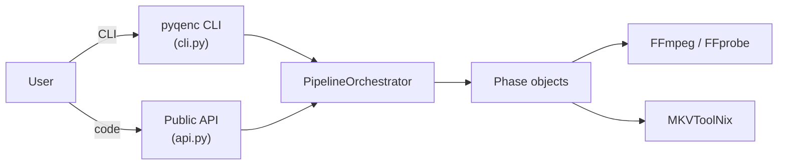
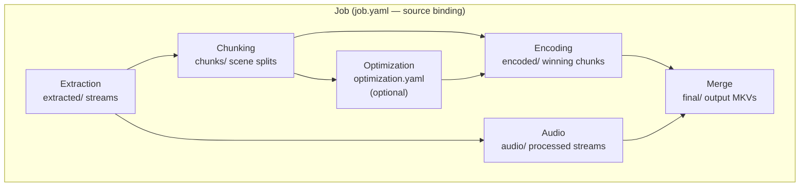
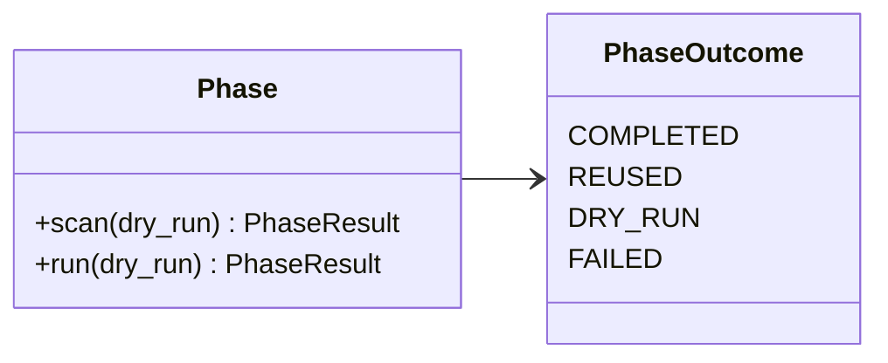
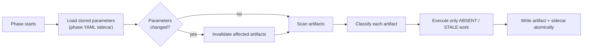
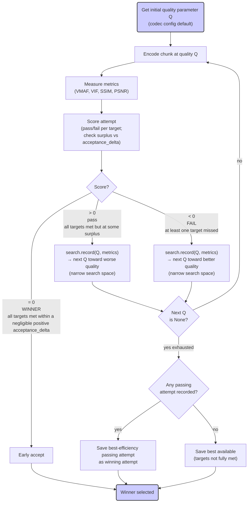
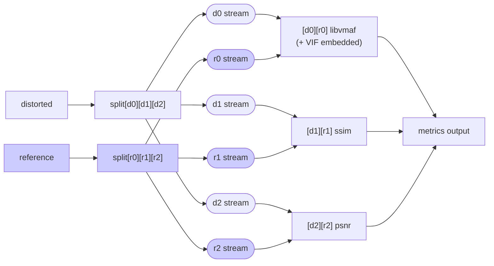
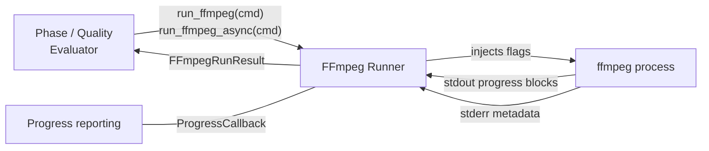

# Architecture

<!-- markdownlint-disable MD024 -->

This document describes the current architecture, key design decisions, and main flows of pyqenc.

## Table of Contents

- [System Overview](#system-overview)
- [Phase Pipeline](#phase-pipeline)
- [Artifact-Based Recovery](#artifact-based-recovery)
- [Quality Search Algorithm](#quality-search-algorithm)
- [Metrics](#metrics)
- [Audio Processing](#audio-processing)
- [FFmpeg Runner](#ffmpeg-runner)
- [Key Data Models](#key-data-models)
- [Public API](#public-api)
- [Design Decisions](#design-decisions)

---

## System Overview

pyqenc is a quality-first video encoding pipeline. The user specifies quality targets; the pipeline figures out the right encoding parameters per scene to meet them, automatically, with full resumption support.

### Entry points



### External dependencies

| Tool         | Used for                                                      |
| ------------ | ------------------------------------------------------------- |
| `ffmpeg`     | Encoding, chunking, metrics, audio processing, crop detection |
| `ffprobe`    | Video metadata probing                                        |
| `mkvextract` | Stream extraction from source MKV                             |
| `mkvmerge`   | Final MKV assembly                                            |

---

## Phase Pipeline

### Phase dependency graph



### Phase descriptions

| Phase            | Inputs                  | Outputs                                      | Key sidecar                                                           |
| ---------------- | ----------------------- | -------------------------------------------- | --------------------------------------------------------------------- |
| **Job**          | `PipelineConfig`        | `job.yaml`                                   | `job.yaml`                                                            |
| **Extraction**   | Source video            | `extracted/` streams                         | `extraction.yaml`                                                     |
| **Audio**        | Extracted audio streams | `audio/` normalized/converted files          | `audio.yaml`                                                          |
| **Chunking**     | Extracted video stream  | `chunks/` FFV1 or remux chunks               | `chunking.yaml`                                                       |
| **Optimization** | Chunks + strategies     | `optimization.yaml` with optimal strategy    | `optimization.yaml`                                                   |
| **Encoding**     | Chunks + strategies     | `encoding/` attempts,<br> `encoded/` winners | • `encoding.yaml`, <br> • per-attempt `.yaml`, <br> • per-win `.yaml` |
| **Merge**        | Encoded chunks + audio  | `final/` MKV file(s)                         | `merge.yaml`                                                          |

> NOTE: Originally the intention was to merge both audio and video during Merge phase, but audio selection is an opinionated process, so I've decided to only merge the videos, leaving the final step for the end user and MKVmerge GUI.

### Phase object model

Every phase implements a common protocol:



- `scan()` — read-only artifact enumeration; classifies each artifact without doing any work
- `run()` — executes work for artifacts not already `COMPLETE`; calls `scan()` internally

The orchestrator is a thin driver: it builds the phase registry in execution order and calls `phase.run(dry_run)` on each, stopping on the first `FAILED` or `DRY_RUN` outcome. Results are passed forward directly — no filesystem re-scanning between phases.

### Chunking modes

| Mode | How | Trade-off |
|------|-----|-----------|
| **Lossless FFV1** (default) | Re-encode each chunk to lossless FFV1 | Frame-perfect splits; ~5× source size on disk |
| **Remux / stream-copy** | Copy stream segments aligned to source I-frames | Faster, ~1× source size; imprecise boundaries, potential audio desync |

---

## Artifact-Based Recovery

There is no central progress tracker or state file. Recovery is fully filesystem-driven.

### How it works

Each phase follows the same pattern:



### Artifact states

| State           | Meaning                                                 |
| --------------- | ------------------------------------------------------- |
| `ABSENT`        | File missing — must produce                             |
| `ARTIFACT_ONLY` | File present, sidecar missing — repair sidecar only     |
| `STALE`         | File + sidecar present, parameters changed — re-produce |
| `COMPLETE`      | File + sidecar present, parameters match — skip         |

### YAML sidecars

| File                 | Contents                                                                |
| -------------------- | ----------------------------------------------------------------------- |
| `job.yaml`           | Source path, size, duration, fps, resolution                            |
| `probe.yaml`         | Frame count, crop params                                                |
| `chunking.yaml`      | Scene boundaries (frame index + timestamp per chunk)                    |
| `optimization.yaml`  | Test chunk IDs, per-strategy results, selected optimal strategy         |
| `encoding.yaml`      | Probe state (crop params + frame count) active during encoding          |
| `audio.yaml`         | Audio codec and base bitrate                                            |
| `<chunk>.yaml`       | Chunk duration, frame count, fps, resolution                            |
| `<attempt>.yaml`     | Quality value, targets met, all measured metrics                        |
| `<chunk>.<res>.yaml` | Winning attempt path, quality value, targeted metrics                   |
| `metrics.yaml`       | Pipeline execution metrics (time/space distribution, convergence stats) |

### What this enables

- **Interruption recovery** — re-run the same command; completed artifacts are reused
- **Parameter changes** — change quality targets or add a strategy; only affected work is redone
- **Manual inspection** — all intermediate files are preserved and human-readable
- **No corruption risk** — all writes use `.tmp`-then-rename; a partial write leaves no stale artifact

---

## Quality Search Algorithm

The quality search is fully generic — it works with any codec's quality parameter (CRF for x264/x265, CQ for NVENC, QP for Vulkan, bitrate for VBR).

### Codec quality configuration

```yaml
# In config.yaml — example for h265-10bit
h265-10bit:
  default_quality: 25
  quality_range: [0, 51]      # [better_end, worse_end]
  quality_granularity: 0.5    # minimum step
  quality_label: "CRF"        # display label (default)
```

The search algorithm always moves toward `quality_range[0]` to improve quality and toward `quality_range[1]` to reduce it (find efficiency). This works for both CRF-style (lower=better) and bitrate-style (higher=better) codecs.

### Search implementations

Both implement `QualitySearchProtocol`:

| Implementation    | Algorithm          | Notes                                                                        |
| ----------------- | ------------------ | ---------------------------------------------------------------------------- |
| `QualitySearch`   | Binary bracket     | Legacy; preserved for compatibility                                          |
| `QualitySearchV2` | 3-point sweet-spot | Default; faster convergence. Supports non-monotonic curve sweet-spot search. |

The protocol:

```python
def record(quality: Decimal, quality_results: dict[str, float]) -> Decimal | None:
    # Returns next quality value to try, or None when done
```

`None` means the search is exhausted (either early acceptance or search space collapsed).

### Per-chunk encoding loop



Attempt files are named `<chunk>.<resolution>.q<value>.mkv` — codec-agnostic naming.

---

## Metrics

### Quality metrics

All quality metrics are computed in a **single ffmpeg pass** via a dynamic filter graph:



- VIF is always embedded in the VMAF pass via `feature=name=vif` — no separate branch
- PSNR and SSIM use `select='not(mod(n,factor))'` for subsampling; VMAF uses `n_subsample`
- All metrics normalized to 0–100 scale for consistent targeting

**Metrics pipeline:**

```
run_metrics(...)         → FFmpegRunResult (raw log files)
parse_metrics(artifacts) → pd.DataFrame   (raw per-frame values)
normalize_metrics(df)    → pd.DataFrame   (0–100 scale)
compute_metric_stats(df) → ChunkQualityStats (min, p05, p25, med, p75, p95, max, std)
create_unified_plot(df)  → PNG visualization
```

### Pipeline execution metrics

`MetricsCollector` is injected into every phase. It tracks:

- Wall-clock time per operation type (`TimeKey` enum)
- Disk space distribution across work-dir subdirectories
- Quality search convergence statistics

Metrics are written to `metrics.yaml` and flushed periodically — they survive interruptions via signal handlers and `atexit`. Use `--no-metrics` to suppress.

---

## Audio Processing

Audio processing applies a strategy DAG to each extracted audio stream. Each strategy produces one output file named `{strategy_short} ← {source_stem}.{ext}`.

### Strategy types

| Strategy | What it does |
|----------|-------------|
| `DownmixStrategy` | Reduce channel count (7.1→5.1, 5.1→2.0 std/night/nboost variants) |
| `NormStrategy` | 2-pass EBU R128 static loudness normalization |
| `DynaudnormStrategy` | Dynamic normalization applied on top of static norm |
| `ConversionStrategy` | Convert to delivery format (AAC, bitrate scaled by channel count) |

Each strategy implements `check(source_path) -> bool` to determine applicability. The DAG terminates naturally — no explicit terminal flag needed.

### Audio strategy graph

Graph below shows full path of currently implemented audio strategies for 3 cases - stereo, 5.1 and 7.1 audios:


### Parallelism

Audio processing is parallelized independently from the main pipeline — audio tasks are I/O-bound and benefit from concurrency. Pipeline encoding parallelism defaults to 1 because ffmpeg/codecs already saturate available CPUs; extra pipeline-level parallelism adds memory pressure and disrupts progress display without meaningful throughput gain.

---

## FFmpeg Runner

All ffmpeg subprocess calls go through `pyqenc/utils/ffmpeg_runner.py`. Direct subprocess calls are not allowed.



The runner:

- Injects `-hide_banner -nostats -progress pipe:1` automatically
- Reads stdout (structured progress blocks) and stderr (metadata/errors) concurrently
- Enforces `.tmp`-then-rename on all output files
- Optionally populates `VideoMetadata` in-place from ffmpeg stderr
- Optionally invokes `ProgressCallback(frame, out_time_s)` for live progress updates
- `run_ffmpeg()` is sync; `run_ffmpeg_async()` is async — both return `FFmpegRunResult`

---

## Key Data Models

All models are Pydantic.

| Model | Purpose |
|-------|---------|
| `PipelineConfig` | Full pipeline configuration — source, work_dir, strategies, quality targets, audio settings, cleanup level |
| `VideoMetadata` | Lazy-loading video properties (path, duration, fps, resolution, frame_count); probe on first access, cached |
| `ChunkMetadata` | Extends `VideoMetadata` with chunk_id, start/end timestamps |
| `AudioMetadata` | Audio stream properties (path, codec, channels, language, duration, delay) |
| `AttemptMetadata` | Encoded attempt artifact (path, chunk_id, strategy, quality value, resolution, file size) |
| `CropParams` | Crop geometry (top, bottom, left, right pixel offsets) |
| `Strategy` | Encoding strategy (name, safe_name, codec config, resolved ffmpeg args) |
| `QualityTarget` | Quality constraint (metric, statistic, threshold value) |
| `CodecConfig` | Encoder configuration (quality range, granularity, max_step, label, profiles) |
| `PhaseOutcome` | `COMPLETED` / `REUSED` / `DRY_RUN` / `FAILED` |

---

## Public API

`pyqenc/api.py` exposes standalone functions for each phase, usable without the CLI:

```python
run_pipeline(config, dry_run)          # full pipeline
extract_streams(source, work_dir, ...) # extraction only
chunk_video(source, work_dir, ...)     # chunking only
encode_chunks(source, work_dir, ...)   # encoding only
process_audio(source, work_dir, ...)   # audio only
merge_final(source, work_dir, ...)     # merge only
measure_quality(source, work_dir, ...) # standalone quality measurement
```

All functions accept `work_dir: Path` as a required parameter (no default). The CLI is the only place where `work_dir` defaults to `.`.

---

## Design Decisions

### Artifact-based recovery over a central state file

A central JSON/YAML tracker is fragile — it can go out of sync with the filesystem, and a corrupted tracker breaks resumption entirely. Artifact-based recovery uses the filesystem itself as the source of truth: the presence of a final artifact file (without `.tmp`) is proof of consistency. This also handles configuration changes automatically — phases re-validate their parameters on every run.

### Generic quality parameter abstraction

The quality search algorithm knows nothing about CRF, CQ, or QP specifically. It operates on a `[quality_better, quality_worse]` range with a configurable granularity and optional max step. This makes the same search logic work for x264/x265 (CRF), NVENC (CQ/QP), and VBR bitrate codecs without any code changes.

### Single-pass all-in-one metrics

Running VMAF, SSIM, PSNR, and VIF in separate ffmpeg passes is ~4× slower and requires 4× the I/O. A single pass with a `split[]` filter graph computes all metrics simultaneously. VIF is embedded in the VMAF pass via `feature=name=vif` — no extra branch needed.

### Automatic crop detection

Crop is detected once during the Probe phase using ffmpeg's `cropdetect` filter across multiple sampled frames. The same crop parameters are stored in `probe.yaml` and applied consistently across all subsequent phases. Crop is applied during encoding only — chunks remain uncropped for remux compatibility.

### Pipeline parallelism default of 1

ffmpeg and modern codecs (x264, x265, SVT-AV1) already scale across all available CPU cores internally. Adding pipeline-level parallelism (encoding multiple chunks simultaneously) creates memory pressure, disrupts the progress display ordering, and provides no meaningful throughput improvement for CPU-bound codecs. Audio processing is different — audio tasks are lightweight and I/O-bound, so audio parallelism is configured separately and defaults higher.

### Atomic writes everywhere

All artifact and sidecar writes use `.tmp`-then-rename. A partial write (from a crash or kill signal) leaves a `.tmp` file that is ignored by artifact scanning — the artifact is treated as `ABSENT` and re-produced on the next run. No corruption, no manual cleanup needed.

### QualitySearchV3 and mid-probe

A newer version of search algorithm, unifies many decisions, utilizes extrapolation instead of binary outwards search - this allows a bit faster convergence, but at the price of possible miss of curve sweet spot, so for all-fail attempts when direction search is exhausted - we do an extra check of the curve via stepping a half-range back.
