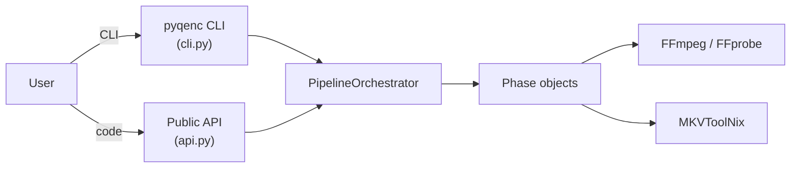
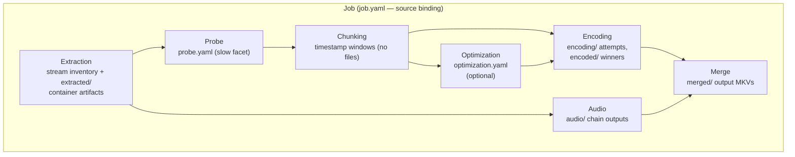
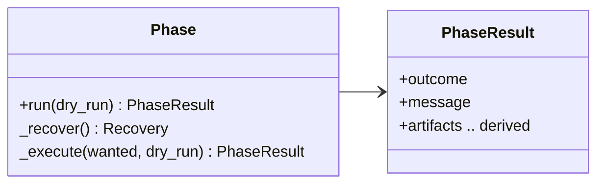
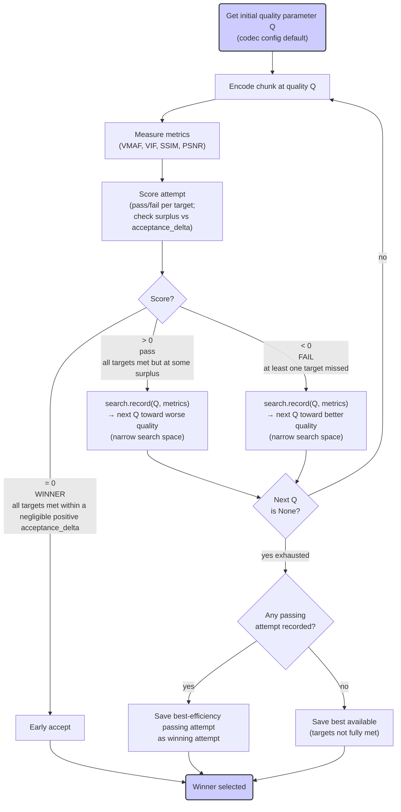
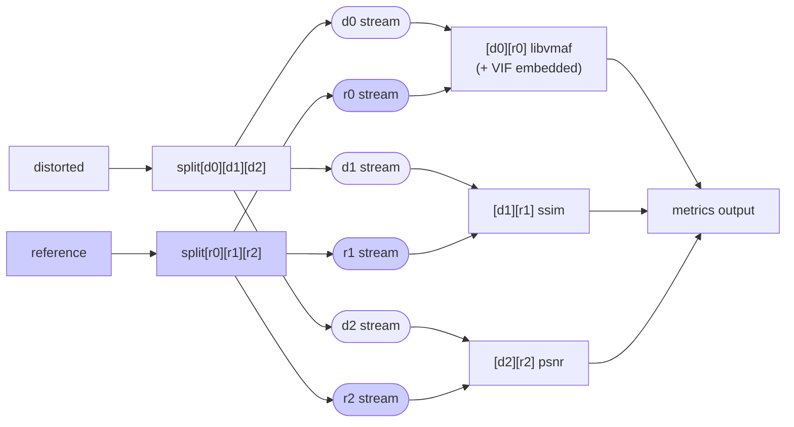
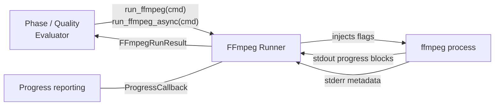

# Architecture

<!-- markdownlint-disable MD024 -->

This document describes the current architecture, key design decisions, and main flows of pyqenc.

## Table of Contents

- [System Overview](#system-overview)
- [Phase Pipeline](#phase-pipeline)
- [Artifact-Based Recovery](#artifact-based-recovery)
- [Quality Search Algorithm](#quality-search-algorithm)
- [Metrics](#metrics)
- [Audio Processing](#audio-processing)
- [FFmpeg Runner](#ffmpeg-runner)
- [Key Data Models](#key-data-models)
- [Public API](#public-api)
- [Design Decisions](#design-decisions)

---

## System Overview

pyqenc is a quality-first video encoding pipeline. The user specifies quality targets; the pipeline figures out the right encoding parameters per scene to meet them, automatically, with full resumption support.

### Entry points


```mermaid
flowchart LR
    User -->|CLI| cli["pyqenc CLI\n(cli.py)"]
    User -->|code| api["Public API\n(api.py)"]
    cli --> orch["PipelineOrchestrator"]
    api --> orch
    orch --> phases["Phase objects"]
    phases --> ffmpeg["FFmpeg / FFprobe"]
    phases --> mkv["MKVToolNix"]
```

### External dependencies

| Package    | Tools                                   | Used for                                                                                                                                                                           |
| ---------- | --------------------------------------- | ---------------------------------------------------------------------------------------------------------------------------------------------------------------------------------- |
| FFmpeg     | `ffmpeg`, `ffprobe`                     | Encoding, metrics, audio processing, crop detection, stream materialization (`ffmpeg`); video metadata probing, timestamps fallback (`ffprobe`)                                    |
| MKVToolNix | `mkvmerge`, `mkvextract`, `mkvpropedit` | Chunk concatenation and final MKV assembly (`mkvmerge`); per-frame timestamps extraction in timecodes_v2 format (`mkvextract`); post-merge frame-rate header patch (`mkvpropedit`) |

Python-side dependencies are managed by `pyproject.toml` — notably `scenedetect-headless` for scene detection (which invokes `ffmpeg` internally to decode).

---

## Phase Pipeline

### Phase dependency graph


```mermaid
flowchart TD
    subgraph Job["Job (job.yaml — source binding)"]
        EX["Extraction\nstream inventory + extracted/\ncontainer artifacts"]
        PR["Probe\nprobe.yaml (slow facet)"]
        CH["Chunking\ntimestamp windows (no files)"]
        OP["Optimization\noptimization.yaml\n(optional)"]
        EN["Encoding\nencoding/ attempts,\nencoded/ winners"]
        AU["Audio\naudio/ chain outputs"]
        ME["Merge\nmerged/ output MKVs"]

        EX --> PR
        PR --> CH
        CH --> OP
        CH --> EN
        OP --> EN
        EX --> AU
        EN --> ME
        AU --> ME
    end
```

### Phase descriptions

| Phase            | Ledger rows (internal, complete)                                     | External contract (result fields)                                                       | Key sidecar(s)                                                         |
| ---------------- | --------------------------------------------------------------------- | ----------------------------------------------------------------------------------------- | ------------------------------------------------------------------------ |
| **Job**          | `Artifact[File]` × 1                                                   | `file`; run parameters                                                                       | `job.yaml`                                                              |
| **Extraction**   | video (index-gated), audio/subs/attachments, chapters rows            | `video_stream`, `audio_streams`, `subtitle_streams`, `attachment_streams`, `chapters`; derived `timestamps_path` / `chapters_path` | `extraction.yaml`                                  |
| **Probe**        | `Artifact[ExtendedVideoStream]` × 1                                    | `stream`; derived `crop`                                                                     | `probe.yaml`                                                             |
| **Chunking**     | `Artifact[VideoStreamChunk]` × N (set-flip)                            | `chunks`                                                                                      | `chunking.yaml`                                                          |
| **Optimization** | `Artifact[EncodedChunk]` per (test chunk × strategy) + orphaned rows   | `winners` (unconsumed — sanctioned exception), `selected_strategies` (settings subset)      | `optimization.yaml`                                                      |
| **Encoding**     | `Artifact[EncodedChunk]` per (chunk × strategy) + orphaned rows        | `winners` (consumed by Merge), `quality_labels` (settings)                                   | • `encoding.yaml`, <br> • per-attempt `.yaml`, <br> • per-win `.yaml`   |
| **Audio**        | `Artifact[AudioOutput]` per (track × chain) + surplus rows             | `outputs`; derived `audio_files`                                                             | `audio.yaml`                                                             |
| **Merge**        | `Artifact[MergedVideo]` per expected output + surplus rows             | `merged` (consumed by the runner as deliverables)                                            | `merge.yaml` + per-output `.yaml`                                        |

> NOTE: Merge produces video outputs only — the final mux with the chosen audio tracks is left to the end user (e.g. MKVmerge GUI).

### Phase object model

Every phase inherits `Phase`, whose single concrete `run()` owns the uniform
footprint — memoization guard, skip check, dependency walk, banner, timed
`_recover()`, the recovery summary line, dry-run / no-pending branches, and
timed `_execute()`:


```mermaid
classDiagram
    direction LR
    class Phase {
        +run(dry_run) PhaseResult
        _recover() Recovery
        _execute(wanted, dry_run) PhaseResult
    }
    class PhaseResult {
        +outcome
        +message
        +artifacts .. derived
    }
    Phase --> PhaseResult
```

- `_recover()` — scans disk and builds the phase's complete internal ledger
  (one `Artifact[PayloadT]` row per owned artifact, wanted or not); derives
  whether work is pending
- `_execute(wanted)` — produces every wanted row not already `COMPLETE`

The runner is a thin, phase-agnostic driver: it runs one *target* phase
(dependencies resolve inside the phases via the registry), builds the uniform
summary from cached results, and broadcasts `finalize`. Results are passed
forward directly — no filesystem re-scanning between phases.

### Chunking

Chunks are timestamp windows over the source's extended video stream
(`VideoStreamChunk`) — no files are produced. `chunking.yaml` persists the
detector's scene boundaries; windows derive from them at load time, and each
chunk's frame count derives from consecutive boundary frames (the counts
telescope to the source total by construction).

---

## Artifact-Based Recovery

Recovery is fully filesystem-driven, and every phase speaks the same artifact
vocabulary.

### The generic artifact

One wrapper — `Artifact[PayloadT]` — wraps every artifact: a typed payload
(the stream-model entity: `File`, `VideoStream`, `AudioStream`,
`SubtitleStream`, `AttachmentStream`, `Chapters`, `ExtendedVideoStream`,
`VideoStreamChunk`, `EncodedChunk`, `AudioOutput`, `MergedVideo`) plus its two
recovery axes. No subclasses exist; identity lives on the payload, and
file-backed locations derive from it — the wrapper has no `path` field.

- **state** — presence-based completeness (see below)
- **wanted** — whether the current run selects it; a value derived from
  external input (the stream filter + pipeline mode, the configured
  strategies/chains), never chosen by the phase

Virtual entities (streams, chunk windows) are artifacts too — they carry no
file, and their completeness is gated by their material components (the
video artifact's per-frame PTS index; the persisted scene boundaries).

### The recovery ledger

Each phase's `_recover()` builds the **complete internal ledger**: one row per
owned artifact — wanted and unwanted, external and internal. The ledger is the
single source of truth for pending derivation, resumption, and the recovery
line. Internal rows (`wanted=False` — orphaned strategy directories, surplus
chain outputs) never reach a result: a result's derived `artifacts` is the
read-only concatenation of its **declared typed fields**, the phase's external
contract.

### Artifact states

| State      | Meaning                                                                        |
| ---------- | ------------------------------------------------------------------------------ |
| `ABSENT`   | Components missing — must produce (trivially-reproducible leftovers included)  |
| `PARTIAL`  | Protected investment incomplete — e.g. output present without its sidecar, or attempts exist without a finalized winner |
| `COMPLETE` | All expected components present — ready to be worked on by later stages        |

Selection is orthogonal to completeness: an unwanted-but-present product is
`COMPLETE` with `wanted=False` — retained in place, visible in the ledger for
honest reporting, never pending, deleted only via explicit cleanup.

### Uniform recovery reporting

Every phase emits the standard line over its internal ledger:

```text
Recovery: 9 total, 8 wanted (3 complete, 0 partial, 5 absent) — resuming
```

`total` counts every internal row; the state counts group under `wanted`
(`wanted == complete + partial + absent` always holds). Previously-silent
phases (job, probe, chunking) report it too — their ledgers are non-empty.

### YAML sidecars

Sidecars persist payload info slices and phase parameters — never artifact
wrappers. Each phase owns exactly one parameter sidecar (one phase, one
sidecar); per-attempt and per-output sidecars mark pair/output completeness.

| File                 | Contents                                                                |
| -------------------- | ----------------------------------------------------------------------- |
| `job.yaml`           | Source identity (path + size)                                           |
| `extraction.yaml`    | Stream inventory (info slices) + chapters presence                      |
| `probe.yaml`         | Frame count, crop params                                                |
| `chunking.yaml`      | Scene boundaries (frame index + timestamp)                              |
| `optimization.yaml`  | Test chunk IDs, per-strategy results, tolerance, selection, targets     |
| `encoding.yaml`      | Probe state (crop params + frame count) active during encoding + winning-limiter summary |
| `audio.yaml`         | Per-chain signatures (resolved definitions)                             |
| `merge.yaml`         | Targets/sampling/probe + per-strategy summary rows                      |
| `<attempt>.yaml`     | Quality value, targets met, all measured metrics                        |
| `<chunk>.<res>.yaml` | Winning attempt name, quality value, targeted metrics                   |
| `metrics.yaml`       | Pipeline execution metrics (time/space distribution, convergence stats) |

### What this enables

- **Interruption recovery** — re-run the same command; complete artifacts are reused
- **Parameter changes** — change quality targets or add a strategy; only affected work is redone
- **Manual inspection** — all intermediate files are preserved and human-readable
- **No corruption risk** — all writes use `.tmp`-then-rename; a partial write leaves no stale artifact

---

## Quality Search Algorithm

The quality search is fully generic — it works with any codec's quality parameter (CRF for x264/x265, CQ for NVENC, QP for Vulkan, bitrate for VBR).

### Codec quality configuration

```yaml
# In config.yaml — example for h265-10bit
h265-10bit:
  default_quality: 25
  quality_range: [0, 51]      # [better_end, worse_end]
  quality_granularity: 0.5    # minimum step
  quality_label: "CRF"        # display label (default)
```

The search algorithm always moves toward `quality_range[0]` to improve quality and toward `quality_range[1]` to reduce it (find efficiency). This works for both CRF-style (lower=better) and bitrate-style (higher=better) codecs.

### Search implementations

All implement the `QualitySearchBase` ABC:

| Implementation    | Algorithm          | Notes                                                                        |
| ----------------- | ------------------ | ---------------------------------------------------------------------------- |
| `QualitySearch`   | Binary bracket     | Legacy V1; retained for the planned V4 rework, not wired into the pipeline   |
| `QualitySearchV2` | 3-point sweet-spot | Non-monotonic curve sweet-spot search                                        |
| `QualitySearchV3` | Linear extrapolation + mid-probe safety net | **Default** (what the encoding phase instantiates); fastest convergence so far |

V3 extrapolates outward from the best measured point instead of binary-stepping, and when a direction is exhausted without a pass it steps a half-range back (mid-probe) to check for a missed sweet spot. See [Design Decisions](#design-decisions) below.

The protocol:

```python
def record(quality: Decimal, quality_results: dict[str, float]) -> Decimal | None:
    # Returns next quality value to try, or None when done
```

`None` means the search is exhausted (either early acceptance or search space collapsed).

### Per-chunk encoding loop


```mermaid
flowchart TD
    A("Get initial quality parameter Q\n(codec config default)") --> B["Encode chunk at quality Q"]
    B --> C["Measure metrics\n(VMAF, VIF, SSIM, PSNR)"]
    C --> D["Score attempt\n(pass/fail per target;\ncheck surplus vs acceptance_delta)"]
    D --> E{"Score?"}
    E -->|"= 0\nWINNER\nall targets met within a negligible positive acceptance_delta"| F["Early accept"]
    E -->|"&gt; 0\npass\nall targets met but at some surplus"| G["search.record(Q, metrics)\n→ next Q toward worse quality\n(narrow search space)"]
    E -->|"&lt; 0\nFAIL\nat least one target missed"| H["search.record(Q, metrics)\n→ next Q toward better quality\n(narrow search space)"]
    G --> I{"Next Q\nis None?"}
    H --> I
    I -->|no| B
    I -->|"yes  exhausted"| J{"Any passing\nattempt recorded?"}
    J -->|yes| K["Save best-efficiency passing attempt\nas winning attempt"]
    J -->|no| L["Save best available\n(targets not fully met)"]
    K --> Z
    L --> Z
    F --> Z
    Z("Winner selected")

    classDef terminal fill:#ccf,stroke:#333,stroke-width:2px
    class A,Z terminal
```

Attempt files are named `<chunk>.<resolution>.q<value>.mkv` — codec-agnostic naming.

---

## Metrics

### Quality metrics

All quality metrics are computed in a **single ffmpeg pass** via a dynamic filter graph:


```mermaid
flowchart LR
    D["distorted"] --> dsplit["split[d0][d1][d2]"]
    R["reference"] --> rsplit["split[r0][r1][r2]"]
    dsplit --> d0(["d0 stream"])
    dsplit --> d1(["d1 stream"])
    dsplit --> d2(["d2 stream"])
    rsplit --> r0(["r0 stream"])
    rsplit --> r1(["r1 stream"])
    rsplit --> r2(["r2 stream"])
    d0 --> vmaf["[d0][r0] libvmaf\n(+ VIF embedded)"]
    d1 --> ssim["[d1][r1] ssim"]
    d2 --> psnr["[d2][r2] psnr"]
    r0 --> vmaf
    r1 --> ssim
    r2 --> psnr
    vmaf --> out["metrics output"]
    ssim --> out
    psnr --> out

    classDef ref fill:#ccf
    class R,rsplit,r0,r1,r2 ref
```

- VIF is always embedded in the VMAF pass via `feature=name=vif` — no separate branch
- PSNR and SSIM use `select='not(mod(n,factor))'` for subsampling; VMAF uses `n_subsample`
- All metrics normalized to 0–100 scale for consistent targeting

**Metrics pipeline:**

```
run_metrics(...)         → FFmpegRunResult (raw log files)
parse_metrics(artifacts) → pd.DataFrame   (raw per-frame values)
normalize_metrics(df)    → pd.DataFrame   (0–100 scale)
compute_metric_stats(df) → ChunkQualityStats (min, p05, p25, med, p75, p95, max, std)
create_unified_plot(df)  → PNG visualization
```

### Pipeline execution metrics

`MetricsCollector` is injected into every phase. It tracks:

- Wall-clock time per operation type (`TimeKey` enum)
- Disk space distribution across work-dir subdirectories
- Quality search convergence statistics

Metrics are written to `metrics.yaml` and flushed periodically — they survive interruptions via signal handlers and `atexit`. Use `--no-metrics` to suppress.

---

## Audio Processing

Audio processing is explicit and config-driven, defined by three pieces under `audio:` in config — a **filter** palette, **chains**, and an optional **select** tree. Each **chain** applied to each **selected** track produces exactly one output file named `<stream name> chain=<name>.<ext>`. See the [Audio Processing Guide](./audio-processing.md) for the full user-facing reference.

### The three pieces

| Piece     | Role                                                                                                                                                                                                                            |
| --------- | ------------------------------------------------------------------------------------------------------------------------------------------------------------------------------------------------------------------------------- |
| `filters` | A palette of named, reusable transformations. Each has a `type` (`peaknorm`, `loudnorm`, `dynaudnorm`, `downmix`, `encode`, `passthrough`) and its own parameters. Dict-merged across config layers.                            |
| `chains`  | Ordered lists of filter names. One chain applied to N selected tracks produces exactly N outputs. No `encode` filter → lossless FLAC; otherwise the last `encode` filter sets the codec/extension. List-replaced across layers. |
| `select`  | An ordered tree (`for`/`exclude`/`prefer`) deciding which extracted tracks are processed; empty (default) = all tracks. Matched against each track's conventional string `lang=<> ch=<> title=<>`.                              |

Filter types are an **open registry** — a new type is one registered class with no edits to the config model or executor. A chain runs as a single combined ffmpeg `-af` invocation, split into extra passes only where a filter needs measurement first (`peaknorm`, `loudnorm`).

### Recovery and invalidation

Each chain's fully-resolved definition (inlined filter params + effective output format) is recorded in a per-run sidecar. On rerun, a changed chain is reprocessed, an unchanged chain with its output on disk is reused, and a removed chain's outputs are cleaned up (matched by exact chain name). Selection is recomputed every run and never persisted.

### Audio processing graph

The graph below shows the model: `select` chooses the working track set, and each (track × chain) pair yields one output.


### Parallelism

Audio processing is parallelized independently from the main pipeline — audio tasks are I/O-bound and benefit from concurrency. Pipeline encoding parallelism defaults to 1 because ffmpeg/codecs already saturate available CPUs; extra pipeline-level parallelism adds memory pressure and disrupts progress display without meaningful throughput gain.

---

## FFmpeg Runner

All ffmpeg subprocess calls go through `pyqenc/utils/ffmpeg_runner.py`. Direct subprocess calls are not allowed.


```mermaid
flowchart LR
    caller["Phase / Quality\nEvaluator"] -->|"run_ffmpeg(cmd)\nrun_ffmpeg_async(cmd)"| runner["FFmpeg Runner"]
    runner -->|injects flags| ffmpeg["ffmpeg process"]
    ffmpeg -->|stdout progress blocks| runner
    ffmpeg -->|stderr metadata| runner
    runner -->|FFmpegRunResult| caller
    progress["Progress reporting"] ---|"ProgressCallback"| runner
```

The runner:

- Injects `-hide_banner -nostats -progress pipe:1` automatically
- Reads stdout (structured progress blocks) and stderr (metadata/errors) concurrently
- Enforces `.tmp`-then-rename on all output files
- Optionally populates `VideoMetadata` in-place from ffmpeg stderr
- Optionally invokes `ProgressCallback(frame, out_time_s)` for live progress updates
- `run_ffmpeg()` is sync; `run_ffmpeg_async()` is async — both return `FFmpegRunResult`

---

## Key Data Models

All models are Pydantic.

| Model | Purpose |
|-------|---------|
| `AppConfig` | Full validated application configuration (layers: defaults → user → CLI) |
| `Artifact[PayloadT]` | The generic artifact wrapper: typed payload + `state` + `wanted` |
| `File` | A file on disk plus its identity metadata (path + size) |
| `Stream` family | `VideoStream` / `AudioStream` / `SubtitleStream` / `AttachmentStream` — a `File` composed with its typed info slice |
| `ExtendedVideoStream` | The slow facet (frame count + crop) over the base video stream |
| `VideoStreamChunk` | An extended stream bounded by a `[start, end)` timestamp window; owns the chunk-id name family |
| `EncodedChunk` | A winning attempt as a stream, composed with its chunk, strategy and quality value; owns the attempt-file name family |
| `Chapters` / `AudioOutput` / `MergedVideo` | Artifact payloads: the chapter edition, one (track, chain) audio output, one merged output with measured facts |
| `Strategy` | Encoding strategy (`display_name()`/`safe_name()` pair, codec config, resolved ffmpeg args) |
| `QualityTarget` | Quality constraint (metric, statistic, threshold value) |
| `CodecConfig` | Encoder configuration (quality range, granularity, max_step, label, profiles) |
| `CropParams` | Crop geometry (top, bottom, left, right pixel offsets) |
| `PhaseOutcome` | `COMPLETED` / `REUSED` / `PENDING` / `FAILED` |

---

## Public API

`pyqenc/api.py` exposes standalone functions for each phase, usable without the CLI:

```python
run_pipeline(config, dry_run)          # full pipeline
extract_streams(source, work_dir, ...) # extraction only
chunk_video(source, work_dir, ...)     # chunking only
encode_chunks(source, work_dir, ...)   # encoding only
process_audio(source, work_dir, ...)   # audio only
merge_final(source, work_dir, ...)     # merge only
measure_quality(source, work_dir, ...) # standalone quality measurement
```

All functions accept `work_dir: Path` as a required parameter (no default). The CLI is the only place where `work_dir` defaults to `.`.

---

## Design Decisions

### Artifact-based recovery over a central state file

A central JSON/YAML tracker is fragile — it can go out of sync with the filesystem, and a corrupted tracker breaks resumption entirely. Artifact-based recovery uses the filesystem itself as the source of truth: the presence of a final artifact file (without `.tmp`) is proof of consistency. This also handles configuration changes automatically — phases re-validate their parameters on every run.

### Generic quality parameter abstraction

The quality search algorithm knows nothing about CRF, CQ, or QP specifically. It operates on a `[quality_better, quality_worse]` range with a configurable granularity and optional max step. This makes the same search logic work for x264/x265 (CRF), NVENC (CQ/QP), and VBR bitrate codecs without any code changes.

### Single-pass all-in-one metrics

Running VMAF, SSIM, PSNR, and VIF in separate ffmpeg passes is ~4× slower and requires 4× the I/O. A single pass with a `split[]` filter graph computes all metrics simultaneously. VIF is embedded in the VMAF pass via `feature=name=vif` — no extra branch needed.

### Automatic crop detection

Crop is detected once during the Probe phase using ffmpeg's `cropdetect` filter across multiple sampled frames. The same crop parameters are stored in `probe.yaml` and applied consistently across all subsequent phases. Crop is applied as an encode-time filter when reading source segments — the source itself is never modified, and quality measurement crops the reference branch identically so the comparison is like-for-like.

### Pipeline parallelism default of 1

ffmpeg and modern codecs (x264, x265, SVT-AV1) already scale across all available CPU cores internally. Adding pipeline-level parallelism (encoding multiple chunks simultaneously) creates memory pressure, disrupts the progress display ordering, and provides no meaningful throughput improvement for CPU-bound codecs. Audio processing is different — audio tasks are lightweight and I/O-bound, so audio parallelism is configured separately and defaults higher.

### Atomic writes everywhere

All artifact and sidecar writes use `.tmp`-then-rename. A partial write (from a crash or kill signal) leaves a `.tmp` file that is ignored by artifact scanning — the artifact is treated as `ABSENT` and re-produced on the next run. No corruption, no manual cleanup needed.

### Two-name doctrine (display_name / safe_name)

Every named element (stream, chunk, strategy, chain output, merged output) owns exactly one name pair: `display_name()` — the single verbatim generator — and `safe_name()` — the sanitized filesystem form derived from it. No third accessors, no independent on-disk name assemblies. The usage convention is fixed:

- **Filesystem work always uses `safe_name()`** — building paths, comparing against on-disk names, anything that lands on or is read from disk.
- **Everything else uses `display_name()`** — logging, yaml payloads, dict keys, user-facing tables.

The name's owner is also its only composer: nothing outside the owning class may join name parts manually (e.g. `f"{preset}+{profile}"`); consumers take the composed name from the accessor.
