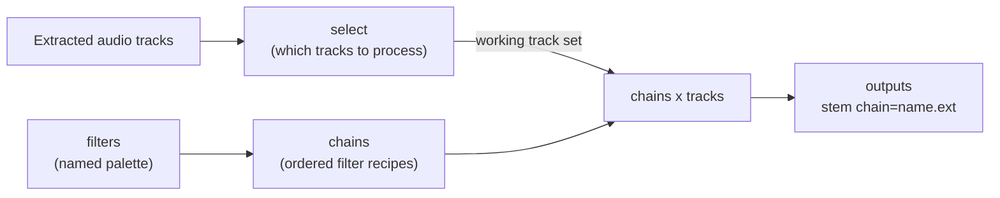
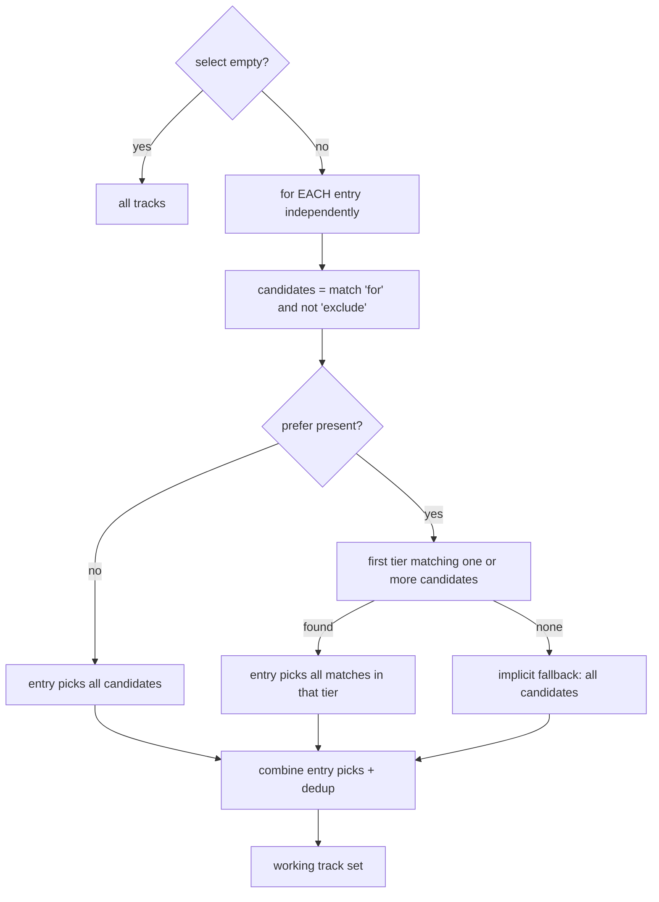

# Audio Processing Guide

<!-- markdownlint-disable MD024 -->

`pyqenc` processes each extracted audio track through explicit, user-defined recipes. You describe what you want with three pieces of config under `audio:` — a **filter** palette, a set of **chains**, and an optional **select** tree — and pyqenc produces exactly the outputs you asked for. There is no combinatorial fan-out: one chain applied to one track produces one file.

The guiding principle is source fidelity: unless a filter explicitly changes something (channel count, loudness), everything else — sample rate, bit depth, timing — is preserved.

---

## The three pieces



- **filters** — a palette of named, reusable transformations. Each filter has a `type` and its own parameters. Defined as a mapping, so you can add or tune one filter in a later config layer without redefining the whole palette (dict-merge).
- **chains** — ordered lists of filter names. A chain is a recipe; applied to N selected tracks it produces exactly N outputs. Defined as a list that a later config layer replaces wholesale (list-replace).
- **select** — decides which extracted tracks get processed at all. Empty (the default) means every extracted audio track. Also list-replace across layers.

All three live under the top-level `audio:` key in your config. See `pyqenc/default_config.yaml` for the shipped starter palette.

---

## Filters

A filter definition is `{type: <type-id>, ...params}`. The `type` selects the behaviour; the remaining keys are that type's parameters. Unknown parameters are rejected at config load (each type forbids extras), so a typo fails fast with a clear message instead of being silently ignored.

The built-in filter types are below.

### `peaknorm` — two-pass peak normalisation

Measures the true peak of the track (via `volumedetect`), then applies a single `volume` gain so the peak lands at your target. Preserves sample rate and bit depth — it only shifts level.

#### Parameters

| Param | Type | Meaning |
|-------|------|---------|
| `target_dbfs` | float | Target peak level in dBFS. `0` is full scale; `-1.0` leaves 1 dB of headroom. Negative values are the norm. |

```yaml
peaknorm:
  type: peaknorm
  target_dbfs: -1.0
```

### `loudnorm` — two-pass EBU R128 loudness normalisation

Measures integrated loudness, true peak, and loudness range in a first pass, then linear-normalises to your targets in a second pass. This is perceptual loudness normalisation (LUFS), not peak.

#### Parameters

| Param | Type | Meaning |
|-------|------|---------|
| `i`   | float | Integrated loudness target, in LUFS. `-16` is a common streaming target; broadcast often uses `-23`. |
| `tp`  | float | Maximum true peak, in dBTP. Typically `-1.0` to `-2.0`. |
| `lra` | float | Target loudness range, in LU. `11` is a typical value. |

```yaml
loudnorm:
  type: loudnorm
  i: -16.0
  tp: -1.5
  lra: 11.0
```

### `dynaudnorm` — single-pass dynamic normalisation

Applies ffmpeg's `dynaudnorm` filter in one pass. Dynamic normalisation smooths level over time with a moving analysis window, rather than applying one fixed gain. Good for content with a wide dynamic range where you want a more consistent listening level.

#### Parameters

| Param | Type | Meaning |
|-------|------|---------|
| `f` | int   | Frame length in milliseconds — the size of each analysis window. |
| `g` | int   | Gaussian window size in frames. Larger values give smoother, slower gain changes. |
| `p` | float | Target peak magnitude, `0`–`1`. |
| `m` | float | Maximum gain factor. |
| `r` | float | Target RMS. `0` disables RMS targeting (pure peak-based). |
| `b` | int   | Channel-coupling / boundary mode. |

```yaml
dynaudnorm:
  type: dynaudnorm
  f: 150
  g: 15
  p: 0.95
  m: 10.0
  r: 0.0
  b: 3
```

### `downmix` — downmix-only channel fold

Reduces channel count from a surround layout to a smaller one (for example 5.1 → 2.0). It is **downmix-only**: if the source already has the same number of channels as the target or fewer, the filter is a no-op — it emits nothing and the channels pass through untouched. It never upmixes.

#### Parameters

| Param | Type | Meaning |
|-------|------|---------|
| `to`     | string | Target layout: `"2.0"`, `"5.1"`, or `"7.1"`. Quote it in YAML so it is read as a string. |
| `matrix` | string \| omitted | Fold coefficients for a 5.1→2.0 (and derived 7.1→2.0) fold: `std`, `lfe`, or `boosted`. Omit for a 7.1→5.1 reduction, which uses a plain channel map with no matrix. |

The matrices are **index-addressed** — they take channels by physical position (`c0=FL c1=FR c2=FC c3=LFE c4=BL c5=BR`, and for 7.1 `c6=SL c7=SR`) rather than by channel name. Named addressing depends on how ffmpeg interprets a particular source's layout (`5.1` vs `5.1(side)`, back vs side labels) and can silently mis-map; addressing by position is robust across encodings.

The three fold matrices differ in more than just LFE handling:

- `std` — the canonical ITU-R BS.775 / ATSC Lo/Ro fold; LFE is dropped.
- `lfe` — the historical "night" fold; mixes centre, surrounds, and a share of the LFE into both channels.
- `boosted` — the historical "nboost" dialog-forward fold; full centre, reduced surrounds, LFE dropped.

`lfe` and `boosted` are community-sourced formulas preserved verbatim, which is why they are distinct named matrices rather than one fold with a tunable LFE gain.

```yaml
down_std:
  type: downmix
  to: "2.0"
  matrix: std
down_lfe:
  type: downmix
  to: "2.0"
  matrix: lfe
down_boosted:
  type: downmix
  to: "2.0"
  matrix: boosted
```

### `encode` — terminal output target

Sets the output codec, bitrate, and file extension for a chain. It contributes no audio filter; it only decides how the chain's output is written. See [Chains](#chains) for how `encode` interacts with the implicit-FLAC default.

#### Parameters

| Param | Type | Meaning |
|-------|------|---------|
| `codec`               | string | ffmpeg audio codec (`-c:a` value), e.g. `aac`. |
| `bitrate_per_channel` | string | Per-channel bitrate, e.g. `64k`. Scaled by the **output** channel count at run time — `64k` becomes `128k` for a 2.0 output, `384k` for a 5.1 output. |
| `extension`           | string | Output file extension without the dot, e.g. `m4a`. |

```yaml
aac:
  type: encode
  codec: aac
  bitrate_per_channel: 64k
  extension: m4a
```

### `passthrough` — reserved, not yet implemented

Declares a stream-copy (no filtering) filter. The config accepts it today so recipes can be written future-ready, but running a passthrough chain currently **fails loudly** with a clear error — it is reserved for a future in-memory-stream feature. It never silently produces an incorrect file. A `passthrough` filter must be the only filter in its chain (enforced at config load); it takes no parameters.

```yaml
passthrough:
  type: passthrough
```

---

## Chains

A chain is a named, ordered list of filter names:

```yaml
chains:
  - name: normal
    filters: [peaknorm]
  - name: night
    filters: [down_lfe, dynaudnorm]
  - name: aac
    filters: [down_std, peaknorm, aac]
```

Key rules:

- **One output per track (deterministic).** A chain applied to N selected tracks produces exactly N outputs — one per track. There is never a combinatorial expansion. Multiple chains can independently target the same or different tracks; each produces its own output.
- **Combined execution.** The filters in a chain run as a single combined ffmpeg `-af` invocation, split into extra passes only where a filter genuinely needs measurement first (`peaknorm`, `loudnorm`). A chain with K measuring filters uses K measurement passes plus one final pass. Sources are never converted to a FLAC intermediate as a separate step.
- **Implicit-FLAC default.** A chain with no `encode` filter is written as lossless FLAC. FLAC is the default output format, not a filter you add — you never need to list it.
- **Last-encode-wins.** If a chain contains one or more `encode` filters, the **last** one decides the output codec and extension; earlier `encode` filters are ignored.
- **Referential integrity.** Every filter name in a chain must exist in the palette, chain names must be unique, chain names must be filesystem-safe, and a `passthrough` filter must be alone in its chain. All of these are checked at config load and raise a clear error before any processing runs.

So in the example above: `normal` produces a peak-normalised FLAC; `night` downmixes to stereo with the night fold, dynamic-normalises, and writes FLAC; `aac` downmixes to stereo with the std fold, peak-normalises, and encodes to AAC in an `.m4a`.

---

## Select

`select` decides which extracted audio tracks are processed. When it is empty or absent, **all** extracted audio tracks are selected.

Selection matches your regexes against each track's **conventional string** — a stable description of the track, not its filename:

```text
lang=<code> ch=<layout> title=<text>
```

For example `lang=eng ch=5.1(side) title=Surround`. The `ch=` token uses the faithful source layout token (so `ch=5.1(side)`, qualifier and all), `title=` is omitted when the track has no title, and matching is **case-insensitive**.

`select` is an ordered list of entries. Each entry has:

| Field | Meaning |
|-------|---------|
| `for`     | Regex gate. Tracks whose conventional string matches become candidates for this entry. |
| `exclude` | Optional regex. Candidate tracks whose conventional string matches are dropped. |
| `prefer`  | Optional ordered list of regex tiers (priority preferences). |

### How an entry picks tracks

1. **Candidates** = tracks matching `for` and (if present) not matching `exclude`.
2. **If `prefer` is present:** tiers are evaluated in order. The **first tier that matches at least one candidate wins**, and that entry contributes **all** candidates matching that winning tier. Tiers are never merged — a lower tier is only consulted when higher tiers matched nothing.
3. **If `prefer` is present but no tier matches any candidate:** the implicit fallback contributes all candidates that passed `for`/`exclude`.
4. **If `prefer` is absent:** all candidates that passed `for`/`exclude` are contributed.

### How entries combine

Entries are **additive, not fallbacks**. Each entry independently contributes its picked tracks, and all the contributed sets are combined into the working track set. A track picked by more than one entry appears once (deduplicated), so a chain never produces two identical outputs for it.



### Worked example (a): all Russian dubs

Select every Russian track, but drop commentary tracks by title:

```yaml
select:
  - for: "lang=rus"
    exclude: "title=.*comment"
```

Given a track set:

| Track | Conventional string | Selected? |
|-------|----------------------|-----------|
| A | `lang=rus ch=5.1 title=Dub` | yes |
| B | `lang=rus ch=2.0 title=Director comment` | no (excluded by title) |
| C | `lang=eng ch=5.1 title=Original` | no (fails `for`) |
| D | `lang=rus ch=2.0` | yes |

This entry has no `prefer`, so it contributes all surviving candidates — both Russian dubs (A and D). The English track and the Russian commentary are left out.

### Worked example (b): English 7.1, then 5.1, else any

Prefer a 7.1 English track; if none, take 5.1 English; if neither, take any English track:

```yaml
select:
  - for: "lang=eng"
    prefer:
      - "ch=7\\.1"
      - "ch=5\\.1"
      # no third tier -> implicit fallback: any English track
```

Note the escaped dots (`7\.1`) — `.` is a regex wildcard, so escape it to match a literal dot.

What this selects for different track sets:

| English tracks present | Winning tier | Selected |
|------------------------|--------------|----------|
| `ch=7.1`, `ch=5.1`, `ch=2.0` | tier 1 (`ch=7\.1`) | the 7.1 track only |
| `ch=5.1`, `ch=2.0`           | tier 2 (`ch=5\.1`) | the 5.1 track only |
| `ch=2.0` only                | no tier matches → fallback | the 2.0 track (all English candidates) |
| two `ch=7.1` tracks          | tier 1 | **both** 7.1 tracks (a winning tier contributes all its matches) |

To also process all Russian dubs alongside the English preference, add the Russian entry from example (a) as a second list item — the two entries are additive.

---

## Output filenames and automatic reprocessing

### Filename convention

Each chain output is named:

```text
<source-stem> chain=<chain-name>.<ext>
```

The source stem is preserved unchanged, `<chain-name>` is the chain's configured `name`, and `<ext>` is `flac` when the chain has no `encode` filter, otherwise the effective (last) `encode` filter's extension. For example a source track `Show S01E01 track2` processed by the `aac` chain becomes `Show S01E01 track2 chain=aac.m4a`.

All outputs are written atomically (a temporary file is renamed into place only on success), so a partial output never appears under its final name.

### Automatic reprocessing on change

pyqenc records each chain's fully-resolved definition — all referenced filter parameters inlined plus its effective output format — in a per-run sidecar. On the next run it compares each configured chain against that record:

- **Changed chain** — if you reorder its filters, tune a referenced filter's parameters, or change its encode target, that chain's resolved definition no longer matches. pyqenc invalidates and reprocesses that chain's outputs.
- **Unchanged chain** — if the resolved definition matches and the output file is already on disk, the output is reused as-is; no reprocessing.
- **Removed chain** — if you delete a chain from config, its outputs are cleaned up. Deletion matches the exact chain name parsed from the ` chain=<name>` filename suffix, so a chain named `night` never affects one named `nightlong`.

Editing the `audio:` section is therefore all it takes to re-run only what changed. **Selection is never persisted** — the working track set is recomputed from the current tracks and `select` config on every run, so it is always current for free.

---

## Where to configure

Everything above lives under `audio:` in your config file. Start from the shipped `pyqenc/default_config.yaml`, which ships a working palette (`peaknorm`, `loudnorm`, `dynaudnorm`, `down_std`/`down_lfe`/`down_boosted`, `aac`, `passthrough`), example chains, and an empty `select` with commented rus-dub and eng-7.1-then-5.1 examples. Config is layered — a user or project config can add filters, replace the chain list, or set a select tree without editing the bundled defaults.
